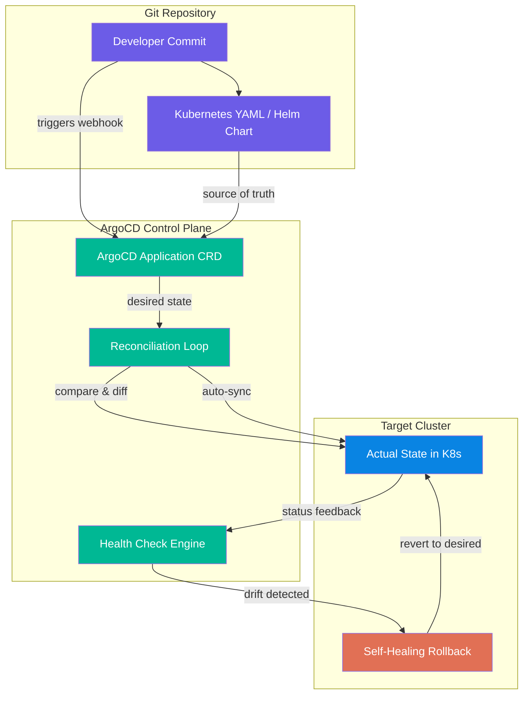

| Difficulty | Channel | Tags |
|---|---|---|
| beginner | devops | argocd, flux, declarative |

Adobe was running one of the largest Kubernetes deployments in the world. Thousands of developers, tens of thousands of environments, and a single ArgoCD instance that was about to fall over [1]. Their story of hitting a hard scalability wall at roughly 2,500 ArgoCD applications is the kind of engineering war story that reveals everything that can go wrong — and right — with GitOps at scale. This is how you build GitOps the right way, before your own infrastructure starts sending those 3 AM pages.

---

> ### Real-World Case — Adobe
>
> Adobe's legacy internal platform (Moonbeam) couldn't scale or operate reliably as they grew to support thousands of developers across Creative Cloud, Document Cloud, and Experience Cloud. They built 'Flex' — a GitOps-based delivery platform using ArgoCD — only to hit a hard scalability wall at ~2,500 ArgoCD applications where their single Hub cluster started crashing.
>
> | | |
> |---|---|
> | **Challenge** | Migrate 10,400 pipelines and hundreds of teams from a legacy CaaS platform to GitOps at massive scale, then solve the unexpected scalability collapse when the single-cluster ArgoCD architecture broke down at 2,500+ apps — causing outages and forcing a complete re-architecture for horizontal scaling. |
> | **Solution** | Built Flex on the Argo ecosystem (CD, Workflows, Events, Rollouts) with Git as single source of truth. When the single Hub cluster hit its limit, they re-architected to a 'Flex-in-a-Box' (FiaB) cell-based architecture with isolated control planes and vClusters. Partnered with AWS and Akuity to form the ArgoCD Scalability SIG. Even automated infrastructure deletion via GitOps — a rare psychological hurdle most enterprises avoid. |
> | **Outcome** | 6,000+ services across 50,000 environments (19,000 production); 3,000+ developers on GitOps; 3x faster deployments; 25% reduction in provisioning time; 2x faster cluster upgrades; 10,400 pipelines migrated; significant infrastructure cost savings. |
> | **Lesson** | GitOps at enterprise scale requires deliberately planning for horizontal scalability from day one. A single ArgoCD instance will hit a wall (Adobe found theirs at ~2,500 apps). Cell-based architectures with isolated control planes and virtual clusters are essential for scaling beyond 10,000+ ArgoCD applications. Also, automating deletion via GitOps is as strategically important as provisioning. |

---

## Hook — The Hub That Couldn't Handle It

Imagine managing 50,000 Kubernetes environments. Now imagine a single control plane struggling to keep up with 19,000 of those running in production. That is exactly where Adobe found itself after building 'Flex,' their internal GitOps delivery platform [1]. The Hub cluster — their single ArgoCD control plane — started crashing when they crossed roughly 2,500 applications. The very tool designed to bring order was becoming the bottleneck. If this sounds like a story about someone else's problem, think again. Every team that adopts GitOps eventually faces these scaling questions — the only difference is whether you encounter them at 50 apps or 2,500.

## Problem — The Silent Drift and the Imperative Trap

Before GitOps, most teams manage Kubernetes the same way: `kubectl apply -f manifest.yaml` and hope for the best. This is the imperative approach — you tell the cluster what to do, right now, with no record of what the state should actually be. Sound familiar? It works brilliantly for a single developer poking around a dev cluster. It fails catastrophically when you have 50 engineers deploying to production at the same time. The real problem isn't the commands themselves — it is configuration drift. Someone runs a hotfix with `kubectl scale` and forgets to update the YAML. A month later, nobody knows what the 'correct' state is supposed to be. The cluster becomes a snowflake, and every deployment becomes a gamble. This is the problem that declarative GitOps solves — but as Adobe discovered, solving one problem creates another.

## Real-World Case — Adobe's GitOps Pivot

Adobe's legacy platform, Moonbeam, could not keep pace with the demands of Creative Cloud, Document Cloud, and Experience Cloud engineering teams [1]. The solution was 'Flex' — a GitOps-based delivery platform built on ArgoCD that promised to unify deployments across the entire company. It worked, perhaps too well. As more teams migrated, Flex hit a scalability ceiling. The single Hub cluster running ArgoCD began to buckle under the weight of roughly 2,500 applications. The control plane's etcd store was overwhelmed, API server latency spiked, and reconciliation cycles took longer than the intervals between them. Adobe's engineering team had to fundamentally rethink their architecture. The fix? A distributed Hub-and-Spoke model where regional ArgoCD instances handled local workloads while the central Hub maintained a global view. The results speak for themselves: 3x faster deployments, 25% reduction in provisioning time, 2x faster cluster upgrades, and 10,400 pipelines migrated [1]. Today, Flex powers 6,000+ services across 50,000 environments serving 3,000+ developers.

## Deep Dive — Declarative vs Imperative: The Real Tradeoffs

Here is the fundamental distinction that every developer needs to internalize. The imperative approach is like giving someone turn-by-turn directions: 'Turn left here. Now stop. Now go forward.' It works until the road changes. The declarative approach is like giving them a destination address: 'Get to this location.' How they get there is their problem. Kubernetes with declarative manifests means you define the end state — '3 replicas of nginx, port 80, rolling update strategy' — and the platform figures out how to achieve it. This is not just philosophical; it has concrete consequences. With declarative GitOps, every change is a Git commit. You get a full audit trail, automatic rollbacks via `git revert`, and a single source of truth that developers and operators can both read [2]. With imperative `kubectl` commands, changes happen in real-time with zero traceability. The tradeoff? Declarative systems are harder to debug because you cannot 'step through' the reconciliation logic. When your manifest says '3 replicas' but the cluster has 5, you need to understand the controller's reconciliation loop — which is a black box. ArgoCD addresses this with its self-healing mechanism, which continuously reconciles actual state with desired state [3]. But here is the plot twist: self-healing can mask problems. If your manifest has a bug that causes pods to crash, ArgoCD will happily keep 'fixing' it by recreating those crashing pods indefinitely. You need health checks and proper rollback policies, not blind reconciliation.

## Workflow — Setting Up ArgoCD for (Almost) Infinite Scale

Building on Adobe's lessons, here is how to configure ArgoCD to handle growth without collapsing. The diagram below shows the architecture: your Git repository acts as the single source of truth, ArgoCD watches for changes, and the Application CRD defines what should be deployed where. The key workflow is: Commit → Sync → Health Check → Self-Heal. But at scale, you need to think about sharding. Adobe's solution was to deploy multiple ArgoCD instances, each responsible for a subset of clusters and applications, with a lightweight coordination layer above them [1]. This avoids the single-point-of-failure problem that nearly took down Flex. Here is how the flow works at an architectural level.

## Code Example — Production-Grade ArgoCD Application CRD

The Application CRD is the heart of ArgoCD. This YAML defines everything ArgoCD needs to manage a deployment declaratively — from the Git source to sync policy to health checks. The `autoSync` policy tells ArgoCD to automatically apply changes from Git, while `selfHeal` ensures any manual changes are reverted. The `syncOptions` like `PruneLast` prevent the 'dangling resource' problem where old Deployments linger after a rename. Critically, the `retry` block with a backoff strategy prevents a bad manifest from hammering your cluster with failed sync attempts — a mistake many teams learn the hard way.

## Lessons Learned — What Adobe's Near-Failure Teaches Us

Three lessons stand out from Adobe's journey. First, plan for scale from day one. If you assume your ArgoCD instance will stay small, you will design a single Hub that becomes your bottleneck. Instead, design for sharding and regional instances early [1]. Second, auto-sync without health checks is dangerous. Always configure custom health checks for your applications, especially for custom resources that ArgoCD does not natively understand [3]. Third, declarative is not a magic wand. GitOps eliminates configuration drift, but it introduces new failure modes: reconciliation loops, sync conflicts, and the 'drift alert fatigue' that comes from having too many out-of-sync applications. The pragmatic takeaway? Start declarative, monitor aggressively, and when your app count crosses 500, start thinking about how you will scale your GitOps control plane — before it forces you to.

---

## GitOps Reconciliation Flow

<strong>Original Interview Question</strong>

**Q:** You're setting up GitOps for a microservices deployment. How would you configure ArgoCD to automatically sync changes from your Git repository to Kubernetes, and what's the difference between declarative and imperative approaches in this context?

**A:** I'd configure ArgoCD by setting up a Git repository containing Kubernetes manifests or Helm charts, creating an Application CRD that points to the Git repository, enabling auto-sync with a health check interval of 3 minutes, and implementing self-healing to automatically revert any manual changes. The declarative approach involves defining the desired state in Git through YAML manifests, Helm charts, or Kustomize configurations, where ArgoCD continuously reconciles the actual state with the desired state. In contrast, the imperative approach uses kubectl commands to make direct changes to the cluster, bypassing the Git repository as the single source of truth.

## Conclusion

GitOps is not just about adopting ArgoCD or Flux — it is about committing to a philosophy where Git is the source of truth and the cluster is just a reflection of that truth. Adobe's story shows that the declarative approach pays dividends at scale, but only if you plan for that scale from the beginning. Start with a single Application CRD, add health checks before auto-sync, and when you hit your first scaling wall, remember: shard early, shard often. The cluster is the reflection, not the source. Keep your mirrors clean.

---

## References

1. [Adobe — How Adobe built Flex, a GitOps-based delivery platform to manage 6,000+ services using ArgoCD](https://www.cncf.io/case-studies/adobe/) — article
2. [ArgoCD Documentation — Declarative GitOps CD for Kubernetes](https://argo-cd.readthedocs.io/en/stable/) — documentation
3. [ArgoCD — Sync and Health Management](https://argo-cd.readthedocs.io/en/stable/operator-manual/health/) — documentation
4. [Kubernetes Documentation — Declarative Management of Kubernetes Objects](https://kubernetes.io/docs/tasks/manage-kubernetes-objects/declarative-config/) — documentation
5. [GitOps Principles — Open GitOps](https://opengitops.dev/) — documentation
6. [Flux Documentation — GitOps Toolkit](https://fluxcd.io/flux/) — documentation
7. [Kustomize — Declarative Configuration Customization](https://kustomize.io/) — documentation
8. [DigitalOcean — What is GitOps?](https://www.digitalocean.com/community/tutorials/what-is-gitops) — article

---

**Author:** Satishkumar Dhule — [GitHub](https://github.com/satishkumar-dhule) · [LinkedIn](https://linkedin.com/in/satishkumar-dhule) · [Website](https://satishkumar-dhule.github.io)
