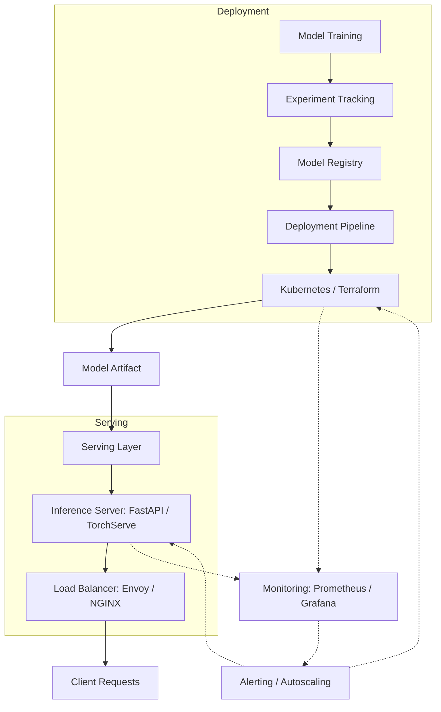

| Difficulty | Channel | Tags |
|---|---|---|
| beginner | devops | mlops, deployment |

In 2015, Uber's ML infrastructure was a mess. Every team built their own deployment pipelines. The fraud team used a completely different stack from the pricing team. Deploying a single model took six weeks. Then Uber built Michelangelo, and everything changed [1]. This is the story of why you need to understand the difference between model deployment and model serving — before your own infrastructure becomes the bottleneck.

---

> ### Real-World Case — Uber
>
> By 2015, Uber's ML was chaotic - every team built custom deployment pipelines and serving infrastructure independently. The fraud team used a completely different stack from the pricing team. Deploying a model required custom Docker containers, manual load balancer config, and took a median of 6 weeks from 'model trained' to 'model serving traffic'. ML engineers spent 60-70% of their time on infrastructure plumbing rather than model development.
>
> | | |
> |---|---|
> | **Challenge** | Uber needed to separate deployment concerns (CI/CD pipelines, infrastructure provisioning, monitoring) from serving concerns (low-latency inference, request routing, model versioning) across hundreds of models handling everything from fare prediction to ETA estimation to fraud detection - all at global scale with sub-10ms latency requirements. |
> | **Solution** | Uber built Michelangelo, an end-to-end ML platform that formalized the deployment-vs-serving boundary. Deployment was standardized with automated CI/CD pipelines, feature stores (batch via Hive/Spark, online via Cassandra), and staged rollouts (shadow → canary → production). Serving was handled by a dedicated low-latency inference layer with P95 <10ms, supporting both real-time (REST/gRPC) and batch prediction, with automatic model versioning, A/B testing, and traffic splitting. The platform later evolved to add PYML - a lighter experimentation layer - after realizing the monolithic deployment pipeline slowed data scientists down when they just needed fast iteration. |
> | **Outcome** | Peak prediction throughput of 1 million queries per second, P95 latency of 5ms (without feature store) / 10ms (with feature store), model deployment time collapsed from weeks to days/hours, 700+ ML projects running, 20,000+ monthly model trainings, and ML engineer productivity shifted from 60-70% infrastructure work to predominantly model development. |
> | **Lesson** | The sharpest insight from Uber's journey: deployment infrastructure and serving infrastructure solve fundamentally different problems and should be architected separately. Michelangelo's initial monolithic design optimized for deployment reliability but created friction for rapid serving experimentation. The PYML evolution proved that supporting both a heavyweight deployment pipeline (for production models) and a lightweight serving path (for experimentation) was critical - you need opinionated deployment but flexible serving. |

---

## Hook — The Six-Week Nightmare

Imagine training a breakthrough model that could save your company millions. Now imagine waiting six weeks to get it into production. That was life at Uber in 2015. Engineers spent 60-70% of their time on infrastructure plumbing — custom Docker containers, manual load balancer configs, bespoke serving stacks that every team reinvented from scratch [1]. The fraud team spoke Kubernetes, the pricing team spoke AWS Lambda, and nobody spoke the same language. Sound familiar? If you have ever watched a perfectly good model rot on the vine because deployment took too long, you already know why this matters.

## Problem — The Great Confusion: Deployment vs Serving

Many developers use "deployment" and "serving" interchangeably. This is a mistake that costs teams weeks. Here is the truth: deployment is about getting your model onto infrastructure. Serving is about what happens when a request arrives. Deployment answers "how does this model get to production?" Serving answers "how does this model answer a question in under 50 milliseconds?" Treating them as the same problem leads to brittle systems where a deployment pipeline cannot handle rollbacks and a serving layer cannot scale under load. The tension between these two concerns is where ML operations either thrive or die.

## Real-World Case — Uber's Michelangelo Platform

When Uber's ML teams were stuck in 6-week deployment cycles, they made a bet: build a unified platform that separates deployment from serving. The result was Michelangelo [1]. On the deployment side, they standardized on CI/CD pipelines using Kubernetes, Docker, and MLflow-like orchestration — a single path from training to production. On the serving side, they built a scalable inference layer that could handle peak throughput of 1 million queries per second with P95 latency of 5ms (without feature store) or 10ms (with feature store). The impact was staggering: deployment time collapsed from weeks to days or hours, 700+ ML projects launched, and over 20,000 monthly model trainings ran on the platform. Most importantly, ML engineers shifted from 60-70% infrastructure work to predominantly model development. The secret? They stopped conflating "how models get there" with "how models work."

## Deep Dive — Deployment vs Serving: The Technical Split

Here is where the rubber meets the road. Deployment is your infrastructure backbone — CI/CD pipelines via GitHub Actions or Jenkins, infrastructure-as-code with Terraform, container orchestration on Kubernetes [2], and experiment tracking with MLflow or SageMaker. This layer cares about reproducibility, rollback strategies, and environment parity. Serving, by contrast, lives in the hot path. It handles real-time inference requests through frameworks like TensorFlow Serving, TorchServe, or BentoML, routes traffic through load balancers like NGINX or Envoy [3], and optimizes for latency, throughput, and memory. The serving layer picks up the artifact that deployment dropped off. You can have the most beautiful deployment pipeline in the world, but if your serving layer cannot handle a traffic spike at 2 AM, nobody cares. The trade-offs are real: batch inference gives higher throughput but higher latency; real-time inference gives sub-100ms responses but requires more infrastructure. Cold starts punish serverless serving paths while GPU memory allocation punishes naive horizontal scaling [4]. Many developers reach for Kubernetes and call it a day, but Kubernetes handles deployment orchestration — not inference optimization. Those are two different jobs.

## Workflow — From Training to Production: The Serving Pipeline

The journey from a trained model to a live endpoint follows a predictable path. The diagram below shows how deployment and serving interact as separate but connected systems — each with their own concerns, technologies, and failure modes. The key insight: deployment delivers the artifact, serving makes it useful.

Start with model training and experiment tracking, which produces an artifact stored in a model registry. The deployment pipeline (Kubernetes, Terraform, CI/CD) picks up that artifact, provisions infrastructure, and handles rollouts. The serving layer (FastAPI, TorchServe, Envoy) then loads the model, starts an inference server, and routes traffic through load balancers with autoscaling policies. Monitoring and observability tools like Prometheus and Grafana watch both layers.

## Code Example — A Production-Ready Serving Endpoint

Here is a practical example showing how to build a model serving endpoint that separates concerns properly. This uses FastAPI for the serving layer and asynchronous patterns for handling concurrent requests.

## Lessons Learned — What to Do Differently Tomorrow

Uber's story proves a single point: when you separate deployment from serving, everything gets faster. Here is what you should take back to your team. First, invest in a model registry — MLflow or similar — as the contract between deployment and serving [5]. If your model artifact has no version, tag, and manifest, your serving layer cannot safely load it. Second, benchmark your serving layer independently of your deployment pipeline. Test what happens at 10X your expected traffic. You might discover that your deployment is perfect and your serving layer collapses under load [6]. Third, plan for cold starts from day one. If you use serverless inference, pre-warm containers or use always-on replicas for latency-sensitive paths. Finally, measure the right things. Track deployment frequency and rollback speed (deployment health) separately from P50/P99 latency and error rates (serving health) [7]. If you mix them, you cannot tell which part is broken. The teams that ship models fastest are not the ones with the best algorithms. They are the ones who stopped confusing deployment with serving.

---

## ML Deployment and Serving Pipeline Architecture

<strong>Original Interview Question</strong>

**Q:** Explain the key differences between model serving and model deployment in ML systems, including specific technologies, scaling considerations, and real-world implementation patterns?

**A:** Deployment encompasses CI/CD pipelines, infrastructure setup, and monitoring using tools like Kubernetes, MLflow, and SageMaker. Serving focuses on runtime inference APIs with frameworks like TensorFlow Serving, TorchServe, or BentoML, handling request routing, model versioning, and autoscaling. Key trade-offs include latency vs throughput, batch vs real-time inference, and cold start optimization.

## Conclusion

The difference between deployment and serving is not academic — it is the difference between a 6-week deployment cycle and shipping models in hours. Uber learned this the hard way, and so have teams at every scale. Your goal should be to make deployment boring (automated, repeatable, safe) so you can focus on making serving fast (low latency, high throughput, resilient). Start by drawing a clear line between the two in your architecture today. Your future self, woken by a 3 AM pager alert, will thank you.

---

## References

1. [Uber incident report — Michelangelo ML Platform](https://www.uber.com/blog/michelangelo-machine-learning-platform/) — blog
2. [Kubernetes Deployments](https://kubernetes.io/docs/concepts/workloads/controllers/deployment/) — documentation
3. [Envoy Proxy Architecture](https://www.envoyproxy.io/docs/envoy/latest/intro/arch_overview/intro) — documentation
4. [MLOps on Wikipedia](https://en.wikipedia.org/wiki/MLOps) — documentation
5. [MLflow Model Registry Documentation](https://mlflow.org/docs/latest/model-registry.html) — documentation
6. [FastAPI Production Deployment](https://fastapi.tiangolo.com/deployment/) — documentation
7. [Prometheus Monitoring Overview](https://prometheus.io/docs/introduction/overview/) — documentation
8. [gRPC Documentation — Performance Benchmarks](https://grpc.io/docs/guides/benchmarking/) — documentation
9. [Docker Overview](https://docs.docker.com/get-started/overview/) — documentation

---

**Author:** Satishkumar Dhule — [GitHub](https://github.com/satishkumar-dhule) · [LinkedIn](https://linkedin.com/in/satishkumar-dhule) · [Website](https://satishkumar-dhule.github.io)
