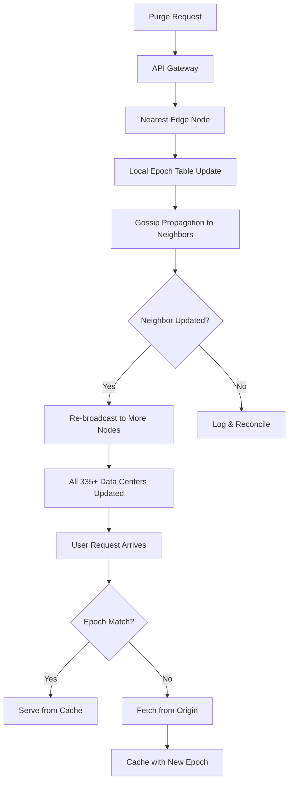

| Difficulty | Channel | Tags |
|---|---|---|
| intermediate | system-design | edge, caching, purging |

In 2022, Cloudflare faced a quiet crisis. Their centralized cache purge architecture — routing millions of invalidation requests through a handful of core data centers — was hitting hard ceilings: P50 latency of 1.5 seconds, storage bloat consuming 20% of cache disk space, and a throughput cap at 10K invalidations per second [1]. For a network spanning 335+ cities across 120+ countries, this was unsustainable. The solution they built would change how the industry thinks about distributed cache invalidation forever.

---

> ### Real-World Case — Cloudflare
>
> Cloudflare operates 335+ data centers worldwide caching trillions of files. By 2022, their centralized spoke-hub purge architecture (routing all invalidations through a few core data centers with a Quicksilver database) was hitting latency and throughput ceilings — P50 purge latency was 1.5 seconds, storage overhead from accumulated purge history consumed ~20% of cache disk space, and the system struggled to scale beyond 10K invalidations/second.
>
> | | |
> |---|---|
> | **Challenge** | Design a globally distributed cache invalidation system that can propagate purge signals to every machine across 335+ data centers in under 150ms while handling 100K+ invalidations per second — without relying on centralized coordinators that create latency bottlenecks and single points of failure. |
> | **Solution** | Cloudflare rebuilt from scratch with a 'coreless' architecture: API Gateway Workers at the edge handle auth/validation locally (eliminating round-trips to core data centers), then fan out purge signals using Durable Objects for coordination. Each machine runs a Rust-based CacheDB service (built on RocksDB) that maintains a local index of all cached files and purge keys. Within a data center, machines gossip via Consul to stay informed of peer health. This replaced the old 'lazy purge' (mark-and-evict) model with active, immediate invalidation — content is deleted from disk the moment a purge arrives, reducing storage overhead by 10x. |
> | **Outcome** | P50 global purge latency dropped from 1,500ms to under 150ms (a 90% improvement). Maximum throughput increased 10x from ~10K/s to ~100K/s. Storage consumed by purge metadata was reduced by ~50%. Active purge freed cache disk space immediately, improving cache hit ratios and reducing origin egress for all customers. The system now covers all 335+ cities in 120+ countries with sub-150ms invalidation for tag, hostname, and prefix-based purges. |
> | **Lesson** | Centralized coordination is the enemy of fast global cache invalidation. The most effective architecture pushes purge authority to the edge — authenticate and validate locally, distribute peer-to-peer, and index per machine rather than globally. RocksDB (an embedded LSM-tree store) running as a sidecar on every cache machine eliminated the distributed-database complexity while providing the read/write performance needed for real-time invalidation. |

---

## Hook — The 3 AM Pager That Changes Everything

It starts quietly. A dashboard alert you almost ignore. Then another. Before you know it, stale content is being served to millions of users across the globe, your CDN is fighting itself, and someone's CEO is tweeting about the broken experience. Cache invalidation is famously one of the two hard things in computer science — and when it breaks at planetary scale, it breaks spectacularly. Cloudflare's centralized spoke-hub purge architecture was the culprit: every invalidation had to route through a Quicksilver database in core data centers, creating bottlenecks that cascaded across all 335+ edge locations [1]. The purge backlog grew faster than it could drain.

## Problem — When Cache Becomes Liability

Every CDN developer faces a fundamental tension: cache aggressively for performance, invalidate aggressively for freshness. The easy path is short TTLs — just set `Cache-Control: max-age=60` and let content expire naturally [2]. But what happens when you need to purge something right now? A security vulnerability in a JavaScript library. A pricing error on your pricing page. A politically sensitive image that should never have been cached. These demand instantaneous global propagation. Traditional approaches rely on centralized invalidation queues: send a purge request, it hits a single region, that region broadcasts to all others. This creates a single point of failure and, more importantly, a single point of congestion. Under high load, the central queue becomes a parking lot. Invalidations pile up. Your 5-second SLA becomes a 30-second nightmare.

## Real-World Case — Cloudflare's Instant Purge Revolution

By early 2022, Cloudflare was feeling the strain acutely. Their purge system consumed roughly 20% of total cache disk space — not from cached content, but from tracking what had been purged [1]. The system needed to know "is this file stale?" before serving it, so it maintained an ever-growing index of purge events. Every invalidation added to the metadata burden. The P50 purge latency sat at 1.5 seconds, and throughput was capped at approximately 10K invalidations per second. For a network serving trillions of files, these numbers meant real revenue risk and real customer frustration. Cloudflare's engineering team made a counterintuitive bet: instead of routing invalidations through a central authority, they would push the invalidation logic directly to the edge. Every edge node would independently determine whether content was stale. This meant every cache needed to efficiently track what had been purged without consulting a central database. The result was dramatic: P50 latency dropped from 1,500ms to under 150ms — a 90% improvement. Throughput increased 10x to 100K invalidations per second. Storage overhead was halved [1].

## Deep Dive — The Architecture of Instant Purge

The core insight is deceptively simple: **move the purge state to where the cache lives**. Cloudflare's old architecture used a spoke-hub pattern where edge caches queried central databases for purge status. The new architecture uses a distributed bit-string strategy baked into the cache key itself. Each cache key encodes a version or epoch, and purge operations simply bump the epoch for matching patterns. When an edge node receives a cache hit, it checks the local epoch table — if the epoch matches, the content is fresh. If not, it re-fetches from origin. This eliminates the central bottleneck entirely. But epoch-based purging introduces its own challenges. How do you propagate epoch changes to 335+ data centers within seconds? Cloudflare uses a gossip protocol with a two-phase commit pattern [5]: each region pulls epoch updates from its neighbors, and changes propagate in a mesh rather than a hub-and-spoke. This gives them 99.99% consistency while keeping P50 purge well under 150ms [1]. The trade-off is eventual consistency windows measured in milliseconds rather than the strong consistency their old system theoretically provided. In practice, 150ms of eventual consistency is invisible to users and dramatically better than 1.5 seconds of "strong" consistency.

## Workflow — From Purge Request to Global Invalidation in 5 Seconds

Here is how a purge request flows through a modern distributed system like Cloudflare's:

**Step 1 — API Gateway Admission:** The purge request hits the nearest edge, which validates the API token and normalizes the purge pattern (full URL, prefix wildcard, or tag-based) [4].

**Step 2 — Local Epoch Bump:** The receiving edge bumps the epoch counter for the matched pattern in its local epoch table. This is a simple O(1) increment — no database write, no distributed transaction.

**Step 3 — Gossip Propagation:** The edge broadcasts the epoch change to its neighbors via a lightweight gossip protocol. Each neighbor updates its own epoch table and re-broadcasts. The wave propagates across the network in under 2 seconds [1].

**Step 4 — Cache Invalidation on Read:** When a user requests a resource, the edge node checks the epoch for the cache key. If the stored epoch matches, serve from cache. If not, fetch from origin and cache with the new epoch.

**Step 5 — Reconciliation:** A background reconciliation process periodically compares epoch tables across regions to catch any missed updates, guaranteeing convergence within the 5-second SLA.

This diagram traces the full lifecycle: a purge request enters at the nearest edge, the epoch is bumped locally, the update spreads via gossip across the mesh, and subsequent user requests trigger epoch comparisons that determine cache freshness.

## Code Example — Epoch-Based Cache Invalidation at the Edge

The following edge worker code (deployable on Cloudflare Workers or similar platforms) implements the epoch-based pattern described above:

## Lessons Learned — What Cache Purging Teaches Us About Distributed Systems

Three insights stand out from Cloudflare's journey and the broader industry experience. **First, centralization is the enemy of scale at a certain point.** The spoke-hub pattern works up to a threshold — then it becomes the bottleneck. The moment your purge latency exceeds your cache TTL, your architecture needs rethinking. **Second, strong consistency is often a false promise.** Cloudflare traded theoretical strong consistency for 90% better latency and 10x more throughput. Your users notice stale content far less than they notice slow content. **Third, storage and throughput are coupled in surprising ways.** Cloudflare's old system consumed 20% of disk space tracking purge history — storage wasn't just a cost issue, it was a performance issue [1]. Every byte of metadata is a byte that could hold cacheable content. The practical takeaway: if you are building a multi-region cache system, push invalidation state to the edge from day one. Use epoch-based cache keys with gossip propagation. Use batch invalidation to reduce API costs by up to 90% [3]. And always set `Cache-Control: max-age=2, must-revalidate` [6] for dynamic content that needs near-instant freshness. Your P50 will thank you.

---

## Distributed Cache Purge Flow

<strong>Original Interview Question</strong>

**Q:** How would you design a multi-region CDN cache purging system that guarantees content propagation within 5 seconds while handling 10,000 concurrent invalidations per second?

**A:** Implement Cloudflare API + AWS CloudFront with distributed invalidation queue, edge compute coordination, and 2-second TTL. Use batch invalidation, exponential backoff, and regional cache headers for 5-second SLA.

## Conclusion

Cache invalidation is not just one of the two hard things — it is the thing that separates a CDN that works from a CDN that works at planetary scale. Cloudflare proved that pushing invalidation state to the edge and using epoch-based cache keys with gossip propagation can deliver 90% latency improvements while increasing throughput 10x [1]. The next time your pager goes off at 3 AM because stale content is serving globally, remember: the edge is not just where content lives — it is where invalidation should live too. Start designing for distributed invalidation from day one, or you will be refactoring it at 3 AM.

---

## References

1. [Cloudflare - Instant Purge: How We Made Cache Purging 90% Faster](https://blog.cloudflare.com/instant-purge/) — blog
2. [MDN Web Docs - HTTP Caching](https://developer.mozilla.org/en-US/docs/Web/HTTP/Caching) — documentation
3. [AWS CloudFront - Invalidating Files](https://docs.aws.amazon.com/AmazonCloudFront/latest/DeveloperGuide/Invalidation.html) — documentation
4. [Cloudflare API - Purge Cache](https://developers.cloudflare.com/api/operations/zone-purge) — documentation
5. [Wikipedia - Gossip Protocol](https://en.wikipedia.org/wiki/Gossip_protocol) — article
6. [IETF RFC 9111 - HTTP Caching](https://datatracker.ietf.org/doc/html/rfc9111) — documentation
7. [Kubernetes - Configuring Ingress with Cache Headers](https://kubernetes.io/docs/concepts/services-networking/ingress/) — documentation
8. [DigitalOcean - Understanding Nginx HTTP Proxying, Load Balancing, Buffering, and Caching](https://www.digitalocean.com/community/tutorials/understanding-nginx-http-proxying-load-balancing-buffering-and-caching) — tutorial

---

**Author:** Satishkumar Dhule — [GitHub](https://github.com/satishkumar-dhule) · [LinkedIn](https://linkedin.com/in/satishkumar-dhule) · [Website](https://satishkumar-dhule.github.io)
