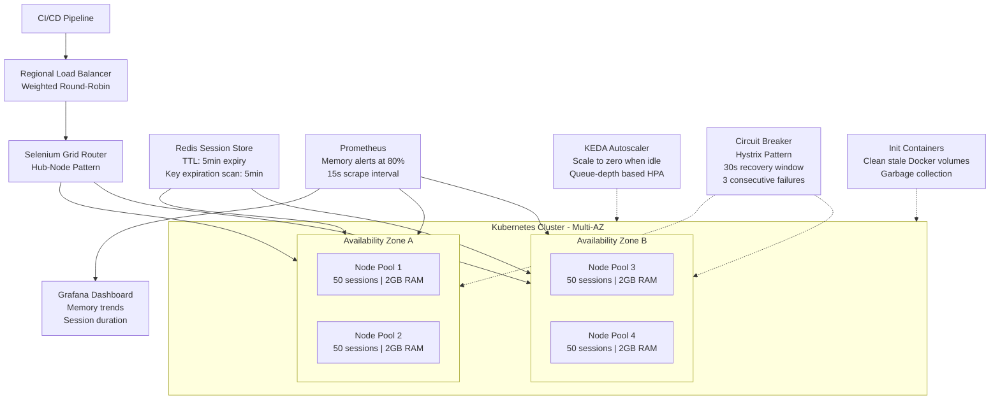

| Difficulty | Channel | Tags |
|---|---|---|
| advanced | system-design | selenium, webdriver, grid |

Blibli.com was burning $371 per month per VM for static Selenoid infrastructure that ran 24/7 — even when no tests were executing. When the iPhone 16 launch demanded hundreds of concurrent browser sessions, they couldn't scale without days of advance provisioning [1]. Here is how they (and you) can flip that model on its head.

---

> ### Real-World Case — Blibli.com (PT Global Digital Niaga)
>
> Blibli.com, one of Indonesia's largest e-commerce platforms (part of the Djarum Group), ran their UI test automation on a static Selenoid setup using Google Compute Engine VMs. Each N2 Standard VM (32GB RAM, 8 CPUs) cost ~$371/month and ran 24/7 — even when no tests were executing. The team couldn't scale up for peak events (like the iPhone 16 launch where they needed hundreds of concurrent browsers) without provisioning new VMs days in advance.
>
> | | |
> |---|---|
> | **Challenge** | Static VMs meant paying for idle capacity during off-peak hours while being unable to burst during critical sales events. Manual VM provisioning was slow, browser upgrades required touching every server individually, and scaling decisions had to be made days ahead rather than dynamically responding to test queue demand. |
> | **Solution** | Migrated from Selenoid on static VMs to Selenium Grid on GKE (Google Kubernetes Engine) with KEDA (Kubernetes Event-Driven Autoscaling). KEDA monitors the Selenium Grid's GraphQL endpoint for session queue depth and scales browser pods up/down accordingly — from zero when idle to hundreds during peak loads. PreStop lifecycle hooks with Selenium's native drain endpoint ensure in-flight tests complete gracefully before scale-down. Separate node pools and scaled objects for Chrome, Firefox, and Edge with node selectors allow per-browser autoscaling. |
> | **Outcome** | 40-50% cost savings per node compared to equivalent Compute Engine VMs, with even greater savings in practice since pods scale to zero when idle. The team can now spawn hundreds of concurrent browser sessions on-demand for major sales events (iPhone 16 launch load testing) without advance provisioning. Browser version upgrades reduced to a single Docker image tag change instead of per-server updates. |
> | **Lesson** | Using event-driven autoscaling (KEDA) for test infrastructure — not just production workloads — transforms CI/CD testing from a fixed-cost liability into an elastic, cost-efficient capability. The same KEDA pattern used for Kafka consumers and message queues maps naturally to Selenium Grid's session queue, enabling test infrastructure that costs nothing when idle and scales instantly under load. |

---

## Hook — The $371-per-VM Tax Nobody Talks About

Imagine burning $371 per month on a server that sits idle most of the time. Now multiply that by 50. That was the reality for Blibli.com, one of Indonesia's largest e-commerce platforms, before they reimagined their test infrastructure [1]. Each N2 Standard VM on Google Compute Engine (32 GB RAM, 8 CPUs) ran a static Selenoid setup 24/7. When the team needed to scale up for the iPhone 16 launch — a peak event demanding hundreds of concurrent browser sessions — they had to provision new VMs *days in advance*. Sound familiar? If you have ever managed a Selenium Grid at scale, you have felt this pain: the tension between paying for idle capacity and scrambling to provision under pressure. But here is the twist: Blibli.com found a way out, and it saved them 40–50% per node in the process.

## Problem — Why Selenium Grid Scaling Breaks at 10,000 Sessions

The classic Selenium Grid architecture is elegant for small teams and fragile at scale. Think about what happens when you push it to 10,000 concurrent sessions. First, memory leaks from zombie browser processes accumulate like unclosed file handles — each orphaned session consuming RAM until the node collapses. Second, static infrastructure means you pay for peak capacity even when nobody is running tests. Third, node failures cascade: one flaky machine can poison the entire session queue. Most teams respond by throwing more VMs at the problem, but that approach has a hard ceiling. You cannot autoscale physical VMs in seconds; you need at least 10–15 minutes for provisioning, and that is if your cloud provider is feeling generous. Meanwhile, your test queue backs up, CI pipelines stall, and developers start blaming "flaky tests" when the real culprit is infrastructure. The math does not lie: for 10,000 concurrent sessions at 50 sessions per node, you need at least 200 nodes. That is 200 × 2 GB = 400 GB baseline memory, plus a 30% buffer — 520 GB cluster memory minimum. And that is before you account for failover capacity.

## Real-World Case — Blibli.com's Journey from Static VMs to KEDA-Powered Elasticity

Blibli.com's engineering team ran their UI test automation on a static Selenoid cluster using Google Compute Engine VMs. Each N2 Standard VM (32 GB RAM, 8 CPUs) cost approximately $371 per month [1]. The machines hummed along 24/7, consuming budget even when the testing pipeline was silent. The breaking point came during the iPhone 16 launch preparation. The team needed hundreds of concurrent browser sessions for load testing, but provisioning that capacity required days of lead time — unacceptable for a launch window measured in hours. The solution? A Kubernetes-native approach using KEDA (Kubernetes Event-Driven Autoscaling). By containerizing their Selenium nodes and running them on GKE with KEDA, they achieved something remarkable: pods scale to zero when idle and spring to life in seconds when test demand spikes. The impact was dramatic: 40–50% cost savings per node compared to equivalent Compute Engine VMs, with even greater effective savings since idle pods cost nothing. Browser version upgrades became a single Docker image tag change instead of per-server SSH marathons. And when the next iPhone launch comes, Blibli.com can spawn hundreds of concurrent browser sessions on-demand without any advance provisioning.

## Deep Dive — Architecting for 99.9% Uptime and Zero Memory Leaks

Now let us talk about what it actually takes to hit 99.9% uptime with 10,000 concurrent sessions. The foundation is a Kubernetes cluster spread across multiple availability zones. The hub follows a StatefulSet pattern — you need stable network identities for node registration — while worker nodes are managed by a Deployment with Horizontal Pod Autoscaling (HPA) tuned on queue depth. For session management, a Redis cluster acts as the source of truth. Each session gets a TTL — typically 5 minutes of inactivity triggers automatic cleanup. This prevents the single biggest cause of memory leaks in Selenium Grid: orphaned sessions that never call `driver.quit()`. Prometheus scrapes every node every 15 seconds, tracking memory usage per pod. Alert Manager fires at 80% memory utilization, triggering forced cleanup on the affected node. The circuit breaker pattern (popularized by Netflix's Hystrix) wraps each node registration call. Three consecutive health check failures? The node is isolated for a 30-second recovery window before being allowed back into the pool [6]. Here is where the numbers get concrete. With 200 nodes minimum, each capped at 2 GB RAM and 1 CPU, and a 30% memory buffer, you need 520 GB of cluster memory. Health checks hit the `/status` endpoint every 10 seconds. After 3 consecutive failures, the node is immediately removed from the routing pool. Pod Disruption Budgets guarantee at least 85% capacity during rolling updates — so you can upgrade browser versions without a test pipeline shutdown. And here is the counterintuitive insight: weekly rolling restarts *prevent* memory leaks better than any monitoring tool can *detect* them. Treat your nodes as ephemeral. If a node has been running for more than 7 days, drain it and recycle it. Your memory graph will thank you.

## Workflow — From Test Trigger to Session Completion

Here is how a single test flows through the system from trigger to result. The architecture follows a clear path that mirrors the diagram below.

**Step 1: Session Request** — A CI pipeline triggers a test suite. The Selenium client sends a session request to the regional load balancer, which uses weighted round-robin to route based on node capacity and response time.

**Step 2: Node Selection** — The hub checks Redis for available node capacity. If all nodes are saturated, the request queues. KEDA monitors queue depth and triggers HPA to spin up additional pods.

**Step 3: Session Binding** — A healthy node is selected. A Redis entry is created with a 5-minute TTL. The session begins executing.

**Step 4: Health Monitoring** — Prometheus scrapes the node every 10 seconds. If memory exceeds 80%, a warning fires. If three consecutive health checks fail, the circuit breaker opens and the node is isolated for 30 seconds.

**Step 5: Session Completion or Cleanup** — On success, the node calls `driver.quit()`, the Redis entry is deleted. On failure or timeout, the TTL expires and Redis auto-cleans the session. A sidecar container runs periodic garbage collection to sweep stale Docker volumes.

**Step 6: Scale Down** — With no more session requests, KEDA scales the node pool back to zero. You stop paying for idle capacity.

This flow ensures that every session has a defined lifecycle, every node is monitored, and failed nodes are isolated before they can poison the entire grid.

## Code Example — Building a Self-Healing Selenium Grid Node with Health Checks and Circuit Breaker

The following Python script demonstrates how to implement a smart Selenium Grid node with health monitoring, circuit breaker isolation, and automatic session cleanup. This is the kind of logic that runs as a sidecar or entrypoint in each containerized node.

## Lessons Learned — What 10,000 Sessions Taught Developers About Grid Reliability

After walking through the architecture, the numbers, and the real-world case, a few hard-won lessons stand out.

**Treat nodes as cattle, not pets.** The biggest mindset shift is accepting that nodes will fail and planning for it. Weekly rolling restarts are not a sign of weakness — they are a proactive defense against memory leak accumulation. Blibli.com's switch from static VMs to ephemeral pods is the single highest-leverage change you can make.

**Circuit breakers are not optional.** Without them, a single flaky node can cascade into a grid-wide failure. Three consecutive health check failures should trigger immediate isolation, not a "let us try one more time" prayer. Hystrix patterns are proven at Netflix scale [6].

**Monitor memory trends, not just thresholds.** A Prometheus dashboard showing memory utilization over time reveals leaks that a static alert would miss. If memory creeps up 2% per day across the cluster, you have a slow leak that will bite you on day 50.

**Pod Disruption Budgets are your safety net.** During rolling updates, PDBs guarantee minimum capacity. Set yours to 85% — you can upgrade browser versions without grinding the test pipeline to a halt.

**Scale to zero is the killer feature.** This is what saved Blibli.com 40–50% per node. If your grid runs 24/7 but tests only run for 8 hours a day, you are burning 66% of your infrastructure budget on idle capacity. KEDA makes scale-to-zero practical [9].

**Browser version management should be a one-line config change.** Containerization means you never SSH into a server to update Chrome again. Change the Docker image tag, deploy, and let the rolling update handle the rest.

---

## Selenium Grid Architecture on Kubernetes with KEDA Autoscaling

<strong>Original Interview Question</strong>

**Q:** Design a scalable Selenium Grid architecture to handle 10,000 concurrent test sessions with 99.9% uptime, ensuring zero memory leaks through automatic session lifecycle management, real-time monitoring, and graceful node failure recovery across multiple data centers?

**A:** Deploy Kubernetes cluster with auto-scaling node pools, Redis session store with TTL policies, Prometheus metrics for memory monitoring, circuit breakers for node isolation, and sidecar containers for session cleanup. Implement health checks, resource quotas, and rolling updates.

## Conclusion

Blibli.com's story is not unique, but their solution is replicable. The days of provisioning static VMs and praying they survive the next load test are over. Kubernetes, KEDA, Prometheus, and a well-designed circuit breaker pattern give you the tools to build a Selenium Grid that scales to 10,000 sessions, costs 40–50% less, and recovers from failures automatically. Start small: containerize one node, add health checks, wire up Prometheus, and watch what happens to your memory graph. Once you see the difference, you will never go back to static infrastructure. The future of test automation is elastic, self-healing, and always-on — but only when you need it.

---

## References

1. [Blibli.com (PT Global Digital Niaga) — Scaling Selenium Grid on GCP Using KEDA](https://medium.com/bliblidotcom-techblog/scaling-selenium-grid-on-gcp-using-keda-which-saves-us-on-the-cost-too-b479c00c5526) — blog
2. [Kubernetes Documentation — Concepts: Architecture](https://kubernetes.io/docs/concepts/architecture/) — documentation
3. [Prometheus Documentation — Overview](https://prometheus.io/docs/introduction/overview/) — documentation
4. [Redis Documentation — About Redis](https://redis.io/docs/about/) — documentation
5. [Selenium Grid Documentation](https://www.selenium.dev/documentation/grid/) — documentation
6. [Martin Fowler — Circuit Breaker Pattern](https://martinfowler.com/bliki/CircuitBreaker.html) — paper
7. [Grafana Documentation](https://grafana.com/docs/grafana/latest/) — documentation
8. [Docker Documentation](https://docs.docker.com/) — documentation
9. [KEDA Documentation — Concepts](https://keda.sh/docs/2.12/concepts/) — documentation

---

**Author:** Satishkumar Dhule — [GitHub](https://github.com/satishkumar-dhule) · [LinkedIn](https://linkedin.com/in/satishkumar-dhule) · [Website](https://satishkumar-dhule.github.io)
