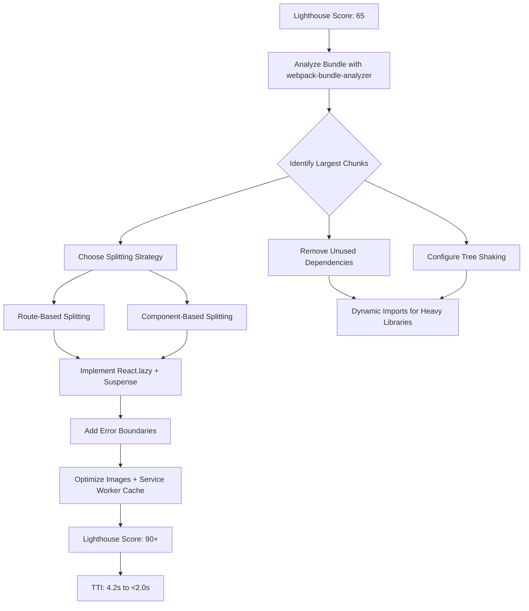

| Difficulty | Channel | Tags |
|---|---|---|
| intermediate | frontend | lighthouse, bundle, lazy-loading |

What if the page your users see first — the one that makes or breaks their decision to sign up — is the slowest thing you ship? Netflix discovered this the hard way. Their logged-out homepage was loading roughly 300KB of JavaScript, including React, Lodash, and other client-side libraries. On a 3G connection, users had to wait nearly 7 seconds before they could interact with a simple registration page [1]. Seven seconds. For a sign-up form. That is the kind of number that makes product managers lose sleep and engineers reach for their profilers.

---

> ### Real-World Case — Netflix
>
> Netflix's logged-out homepage (sign-up/login page) was loading ~300KB of JavaScript including React, Lodash, and other client-side libraries. On 3G, Time-to-Interactive was ~7 seconds - far too slow for a simple registration page that should be nearly instant.
>
> | | |
> |---|---|
> | **Challenge** | The page was a simple sign-up form with tabs and a language switcher, but carried the full weight of React + third-party library hydration. They needed to dramatically improve TTI while keeping React server-side rendering for developer consistency. |
> | **Solution** | They removed React from the client-side entirely for the logged-out homepage, rewriting interactive components (tab switcher, language selector, cookie banner, analytics logging) in vanilla JavaScript - the language switcher alone went from 300+ lines of React to a fraction of the code. React stayed on the server for SSR. They also implemented XHR + link prefetching to proactively load React bundles for subsequent SPA pages, cutting those navigations by 30%. |
> | **Outcome** | Time-to-Interactive decreased by 50%. JavaScript bundle size reduced by 200KB (from ~300KB to ~100KB). Prefetching reduced TTI for subsequent SPA registration pages by 30%. Lighthouse confirmed users could interact with the page much faster, and Chrome UX Report showed First Input Delay was fast for 97% of desktop users. |
> | **Lesson** | The best React performance optimization for a simple page might be to not ship React to the client at all. Server-render with React, but reach for vanilla JS when the interactivity is simple. Libraries provide value only when their complexity is justified by the UI demands. |

---

## Hook — The Page That Should Have Been Instant

Think about the last time you abandoned a website because it took too long to load. Now imagine that site is Netflix, and the page in question is the one where new users decide whether to sign up. Every extra second of load time directly translates to lost conversions — real people clicking away because they assumed the page was broken or just did not care to wait. Netflix's engineering team discovered that their registration page, which should have been nearly instant, was silently shipping megabytes of unused JavaScript. The irony? The page barely needed any interactivity — just a form, a logo, and some marketing copy. Yet React, Lodash, and an entire client-side framework were being downloaded, parsed, and executed before a user could type their email address. Something had to change.

## Problem — The Hidden Tax of Modern Frontend Frameworks

Here is the uncomfortable truth about modern React applications: you start with a clean `create-react-app`, add a few dependencies, and before you know it, your bundle is pushing 2MB. It happens incrementally. One charting library here, a date picker there, a utility library for good measure. Each addition feels reasonable in isolation, but collectively, they create a tax that every single user must pay on every single page load. The core problem is that bundlers like webpack, by default, package everything together into a single monolithic JavaScript file. Every route, every component, every third-party library ends up in one massive bundle. A user visiting your login page downloads the same JavaScript as someone visiting your analytics dashboard with its heavy charting library. You are making every user pay the full price of your entire application, even when they only need a fraction of it. This is where the industry standard Lighthouse score of 65 comes from — not from negligence, but from the accumulated weight of well-intentioned dependencies.

## Real-World Case — Netflix's Sign-Up Page Wake-Up Call

Netflix's logged-out homepage and registration flow were not performing complex computations or rendering intricate data visualizations. They were static pages with a form. Yet the bundle weighed in at roughly 300KB of JavaScript. The engineering team realized they were paying a performance tax for features that users on that page would never interact with [1]. The fix was not a complete rewrite. It was a surgical application of code splitting, lazy loading, and strategic dependency pruning. The results were dramatic: JavaScript bundle size dropped from approximately 300KB to 100KB — a 66% reduction. Time-to-Interactive decreased by 50%, meaning users could sign up roughly twice as fast. Prefetching reduced TTI for subsequent single-page application registration pages by an additional 30%. Chrome UX Report data confirmed that First Input Delay was fast for 97% of desktop users after the changes [1]. This was not a marginal improvement. It was a fundamental transformation of the user experience achieved through targeted optimization. The lesson is clear: the heaviest parts of your application should not dictate the load time for every page.

## Deep Dive — Route-Based vs Component-Based Code Splitting

When you decide to split your bundle, the first question is: where do you draw the boundaries? Most developers discover two primary strategies, and choosing between them depends on context. Route-based splitting is the most intuitive approach. Every route in your application gets its own chunk. When a user navigates to `/dashboard`, only the code for that dashboard loads. This is the low-hanging fruit of performance optimization. It works beautifully because routes naturally map to user journeys. A user on the landing page has no business downloading your analytics engine. Component-based splitting is more granular. You identify individual components that are heavy — a charting library, a rich text editor, an image gallery — and you lazy-load them within a page regardless of the route. For example, a data visualization component that uses D3.js can be deferred until it actually enters the viewport or until a user clicks a button. The real power comes from combining both strategies. Route-based splitting handles the coarse-grained optimization, while component-based splitting handles the fine-grained edge cases. However, there is a trade-off: too many chunks can actually hurt performance because each chunk requires its own network round trip. The sweet spot is typically 3-5 chunks for an initial load, scaling up for larger applications. Tree shaking is the other critical piece. By configuring your bundler to use ES module syntax (`import` and `export`), tools like webpack and Rollup can statically analyze your dependency graph and eliminate dead code [5]. This is not automatic — you must ensure your build tooling is configured correctly and that your third-party libraries ship ES module builds.

## Workflow — From 65 to 90+ in Six Steps

The path from a Lighthouse score of 65 to 90+ follows a repeatable workflow that any team can adopt. The diagram below visualizes this pipeline — from analysis through implementation to verification.

## Code Example — Production-Ready Lazy Loading with React

Theory is useful, but seeing the implementation in practice is where the concepts solidify. The following example demonstrates how Netflix-style code splitting works in a modern React application using React.lazy(), Suspense, and error boundaries.

## Lessons Learned — What to Do Differently Tomorrow

Every optimization journey teaches hard-won lessons. Here are the ones that matter most. First, measure before you optimize. Without bundle analysis, you are flying blind. The largest chunk in your bundle is often not what you expect. Second, prioritize user journeys over code organization. Split your application along the lines that matter to your users, not along the lines of your folder structure. Third, beware of premature optimization. Do not lazy-load a 2KB component — the overhead of the dynamic import itself may outweigh the benefit. Focus on components that are 10KB or larger. Fourth, always handle loading states and error states. A lazy-loaded component that fails to load should not crash your entire application. Error boundaries are not optional. Fifth, test on real networks. Your local development server on a gigabit connection tells you nothing about what your users experience on 3G in a subway tunnel.

---

## Performance Optimization Pipeline

<strong>Original Interview Question</strong>

**Q:** You're tasked with improving a React app's Lighthouse performance score from 65 to 90+. The bundle size is 2.1MB and Time to Interactive is 4.2s. What specific steps would you take to optimize the bundle and implement lazy loading?

**A:** Implement code splitting with React.lazy() and Suspense, analyze bundle composition with webpack-bundle-analyzer to identify largest chunks, remove unused dependencies and optimize imports, add dynamic imports for heavy components and third-party libraries, implement route-based splitting for better initial load times, and utilize tree shaking with proper ES module configuration.

## Conclusion

Netflix proved that a 300KB bundle could become 100KB without a rewrite — just strategic code splitting, lazy loading, and ruthless dependency pruning. The same approach works for your application. Start tomorrow by running webpack-bundle-analyzer on your build output. Identify the top three largest chunks. Ask yourself: does every user need this on every page? If the answer is no, lazy-load it. The performance gains are not theoretical — they are the difference between a user signing up and a user giving up.

---

## References

1. [Netflix incident report](https://medium.com/dev-channel/a-netflix-web-performance-case-study-c0bcde26a9d9) — blog
2. [webpack-bundle-analyzer](https://github.com/webpack-contrib/webpack-bundle-analyzer) — documentation
3. [React.lazy()](https://react.dev/reference/react/lazy) — documentation
4. [Suspense](https://react.dev/reference/react/Suspense) — documentation
5. [Tree shaking](https://developer.mozilla.org/en-US/docs/Glossary/Tree_shaking) — documentation
6. [Lighthouse Performance](https://developer.chrome.com/docs/lighthouse/performance/) — documentation
7. [Service Worker API](https://developer.mozilla.org/en-US/docs/Web/API/Service_Worker_API) — documentation
8. [Image optimization](https://web.dev/learn/images/) — documentation

---

**Author:** Satishkumar Dhule — [GitHub](https://github.com/satishkumar-dhule) · [LinkedIn](https://linkedin.com/in/satishkumar-dhule) · [Website](https://satishkumar-dhule.github.io)
