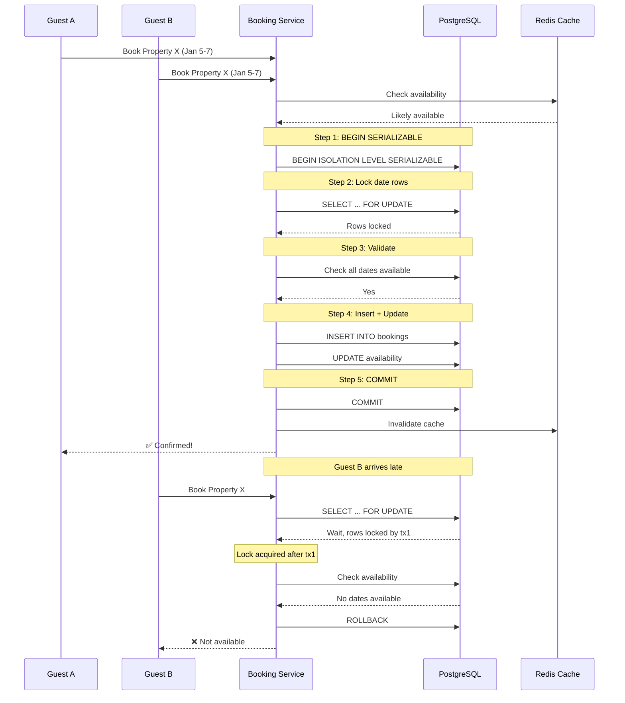

| Difficulty | Channel | Tags |
|---|---|---|
| intermediate | database | acid, isolation-levels, mvcc |

In 2021, Uber engineers faced a terrifying reality: their core Fulfillment Platform — the system that matches riders with drivers across 10,000+ cities — was suffering from a 'double matching' race condition [1]. Two drivers could be matched to the same rider. The same driver could be dispatched to multiple riders simultaneously. The root cause? Eventual consistency — the exact same dragon that makes double bookings possible in reservation systems. This is the story of how Uber killed that dragon, and what it means for any developer building booking or reservation systems today.

---

> ### Real-World Case — Uber
>
> Uber's Fulfillment Platform is the core system that matches riders with drivers across 10,000+ cities. By 2021, it was handling over a million concurrent users and billions of trips per year. Their original architecture, built on Cassandra (NoSQL) with Ringpop coordination, suffered from eventual consistency issues that could cause the equivalent of double booking — two drivers matched to the same rider, or the same driver dispatched to multiple riders simultaneously.
>
> | | |
> |---|---|
> | **Challenge** | As Uber scaled, the leaky abstractions between their NoSQL storage and application layers made it impossible to guarantee that each trip was fulfilled exactly once. Cassandra's eventual consistency meant that during high-demand periods (New Year's Eve, concerts), the system could not atomically enforce the invariant that a trip is matched to exactly one driver and one rider. The engineering team needed transactional consistency with horizontal scalability — a combination their NoSQL stack couldn't provide. |
> | **Solution** | Uber undertook a ground-up re-architecture of the Fulfillment Platform, migrating from Cassandra (NoSQL) to Google Cloud Spanner (NewSQL). They leveraged Spanner's TrueTime API for external consistency (stricter than SERIALIZABLE isolation), row-level locking via DML transactions, and multi-region replication with 99.999% availability. The new schema used entity tables modeled as key-value stores with statechart representations, plus explicit relationship tables, all operating under Spanner's strong ACID guarantees — ensuring every trip match was atomic and consistent. |
> | **Outcome** | The platform now processes billions of database transactions daily with strong consistency across millions of concurrent users. The migration was completed successfully across every Uber product and city by 100+ engineers spanning 30+ teams, with zero downtime. The new architecture eliminated the 'double matching' race condition that plagued the Cassandra-based system, while enabling Uber to rapidly scale new verticals like Uber Eats, Uber Direct, and Uber Reserve. |
> | **Lesson** | Strong consistency and horizontal scalability are not mutually exclusive — NewSQL databases like Spanner with TrueTime-based external consistency can provide both. The counterintuitive twist: Uber moved from NoSQL back to a relational/NewSQL paradigm, defying the conventional wisdom that NoSQL was the only path to scale. For booking/dispatch systems where double-allocation is catastrophic, external consistency (stronger than SERIALIZABLE) is worth the latency trade-off. |

---

## Hook — The Night the Database Couldn't Keep Up

Imagine you have built a booking system. Users love it. Traffic is growing. Then one day, a customer complains that two different people confirmed the exact same reservation. You check your logs. Both transactions succeeded. Both users got confirmation emails. But there is only one room. This is not a bug in the traditional sense — there is no crash, no stack trace, no 500 error. It is a race condition hiding in plain sight. The system worked correctly for each individual request, but the requests stepped on each other's toes. Uber's Fulfillment Platform hit this wall at planet-scale. Built on Cassandra with a Ringpop coordination layer, their architecture prioritized availability over consistency. The tradeoff seemed reasonable — until the inconsistencies started causing real-world double-matching incidents [1]. When you are moving people through cities, a double-match is not just a database anomaly. It is a customer trust crisis.

## Problem — When Two Users Click Book at the Exact Same Time

The core problem is deceptively simple: two concurrent transactions read the same state, both see available inventory, both proceed to book, and both succeed — but only one should have. This is the classic lost update problem, and it is everywhere in booking systems. Most developers encounter this pattern early in their careers. The naive approach is to check availability, then insert the booking. But between the check and the insert, another request sneaks in. You might think wrapping everything in a transaction solves it, but the default READ COMMITTED isolation level still allows phantom reads — new rows inserted by concurrent transactions that your running transaction cannot see [2]. The stakes are high: every double-booking means a furious customer, a support ticket, potentially a refund, and eroded trust. For a platform like Airbnb, where hosts manage their own calendars and guests browse across thousands of properties, the surface area for race conditions is enormous. For Uber, double-matching meant angry riders, frustrated drivers, and wasted time across the entire network.

## Real-World Case — Uber's Fulfillment Platform Rearchitecture

Uber's original Fulfillment Platform was built in 2014 on Apache Cassandra with Ringpop for coordination. The architecture used a tiered storage approach: local in-memory cache, then Redis, then Cassandra clusters. Ringpop maintained a consistent hash ring and forwarded requests to owning workers in a 'best-effort' manner — meaning availability was prioritized over consistency [1]. The result? Cassandra's last-write-wins semantics meant that concurrent writes could silently overwrite each other. Split-brain situations during deploys or region failovers introduced inconsistencies. Multi-entity transactions (like updating both a trip and a driver session) relied on the Saga pattern, which left the system in an internally inconsistent state between operations. Uber spent six months auditing every product flow, gathering 200+ pages of requirements from stakeholders. They benchmarked multiple database choices and ultimately migrated to Google Cloud Spanner — a NewSQL database providing external consistency (the strictest concurrency-control guarantee for transactions) [1]. The migration involved 100+ engineers across 30+ teams, took two years, and completed with zero downtime. Today, the platform processes billions of database transactions daily with strong consistency across millions of concurrent users. Uber eliminated double-matching by fundamentally changing their storage architecture — but you can apply the same principles in PostgreSQL today.

## Deep Dive — The Transaction Isolation Zoo

To understand how to prevent double-booking, you need to understand what isolation levels actually guarantee. Many developers learn about ACID in theory but struggle to apply it in practice. Here is the reality: the four isolation levels defined by the SQL standard form a sliding scale of protection against concurrency anomalies. READ UNCOMMITTED allows dirty reads — you see uncommitted data from other transactions. READ COMMITTED (PostgreSQL's default) prevents dirty reads but allows non-repeatable reads and phantom reads [2]. REPEATABLE READ prevents non-repeatable reads but can still allow phantoms in some databases. SERIALIZABLE guarantees complete isolation — transactions execute as if they ran one after another [2]. Here is the plot twist though: PostgreSQL's REPEATABLE READ actually prevents phantom reads too, making it stronger than the standard requires. And PostgreSQL's SERIALIZABLE uses Serializable Snapshot Isolation (SSI), which detects serialization conflicts using a predicate locking mechanism [2]. The key tradeoff: stronger isolation reduces concurrency and can increase abort rates under contention. For a hot property on Airbnb with dozens of booking requests per second, SERIALIZABLE transactions will conflict and abort frequently. This is where optimistic concurrency control comes in. Instead of locking rows upfront, optimistic strategies let transactions proceed and only check for conflicts at commit time [6]. If a conflict is detected, the transaction is retried. This works well when contention is moderate — most transactions succeed on the first try, and the retry overhead is an acceptable cost. Uber's Spanner migration essentially implemented this at global scale. Spanner uses TrueTime (Google's synchronized clock service) to provide external consistency — the strictest form of serializability [1]. Every transaction gets a globally consistent timestamp, eliminating the need for distributed locks.

## Workflow — Anatomy of a Safe Booking Transaction

Building on the concepts above, here is the step-by-step workflow for a double-booking-proof reservation system. The critical insight is that you need to lock the availability rows BEFORE checking them — not after. The workflow breaks down into five phases, illustrated by the diagram below: check cache, acquire locks, validate inventory, commit booking, and invalidate cache. The diagram shows two concurrent guests trying to book the same property. Guest A acquires the lock first, completes the booking, and Guest B finds the rows already locked — forcing a wait or immediate failure.

The mermaid diagram above visualizes this exact flow. Note how Guest B's transaction is blocked at the SELECT FOR UPDATE stage — it cannot even check availability until Guest A's transaction completes. This is the essence of pessimistic locking: the first transaction to arrive serializes access to the critical rows.

## Code Example — Building a Double-Booking-Proof Reservation in PostgreSQL

Here is a practical implementation of the pattern described above, written in Python with psycopg2 and PostgreSQL. The function uses SERIALIZABLE isolation, row-level locks with SELECT FOR UPDATE, and exponential backoff retry logic to handle the serialization failures that will inevitably occur under contention.

## Lessons Learned — What This Means for Your Code Tomorrow

After walking through the problem, Uber's real-world struggle, the isolation theory, and a concrete code example, here is what you should take back to your team. First, isolation levels are not just database trivia for interviews — they are the difference between a working booking system and a customer-support nightmare. The choice between optimistic and pessimistic concurrency control is fundamentally a bet on contention. If you expect low to moderate contention (most booking attempts succeed), optimistic locking with retries gives better throughput. If you expect high contention on specific resources (a Taylor Swift concert, a viral Airbnb listing), pessimistic locking with SELECT FOR UPDATE protects your database from thrashing [4]. Second, caching is a double-edged sword. Uber's original architecture used tiered caching that improved latency at the cost of cache coherence, which contributed to their inconsistency problems [1]. If you cache availability, you must invalidate the cache within the same transaction that modifies the database — never before commit. Third, the real takeaway from Uber's journey is that consistency is a spectrum, and you need to consciously choose where your system lands. Uber chose availability over consistency in 2014 and paid the price years later when they had to rearchitect everything. You can learn from that mistake without making it yourself. Here is the actionable checklist: audit your critical write paths for race conditions, set the appropriate isolation level for each transaction type, add retry logic with exponential backoff to every serializable transaction, and never check-then-act without locking the rows first.

---

## Concurrent Booking Transaction Flow

<strong>Original Interview Question</strong>

**Q:** You're building a booking system for Airbnb where multiple users can reserve the same property simultaneously. How would you design the transaction handling to prevent double bookings while maintaining high availability?

**A:** Use SERIALIZABLE isolation with optimistic concurrency control. Implement row-level locks on property availability tables, use MVCC snapshot reads for checking availability, and apply application-level validation to ensure atomic booking operations.

## Conclusion

Uber's Fulfillment Platform rearchitecture is a masterclass in why consistency matters — and what happens when you trade it away. You do not need to migrate to Spanner to avoid double-booking. You just need to use the right isolation level, lock the right rows, and handle retries with respect. The next time you build a reservation system — whether for a hackathon or a production platform — start with SERIALIZABLE, add SELECT FOR UPDATE on your availability rows, and never let two transactions see the same empty seat. Your users (and your support team) will thank you.

---

## References

1. [Uber's Fulfillment Platform: Ground-up Re-architecture](https://www.uber.com/us/en/blog/fulfillment-platform-rearchitecture/) — blog
2. [PostgreSQL Transaction Isolation Documentation](https://www.postgresql.org/docs/current/transaction-iso.html) — documentation
3. [Multiversion Concurrency Control — Wikipedia](https://en.wikipedia.org/wiki/Multiversion_concurrency_control) — article
4. [PostgreSQL Explicit Locking Documentation](https://www.postgresql.org/docs/current/explicit-locking.html) — documentation
5. [ACID — Wikipedia](https://en.wikipedia.org/wiki/ACID) — article
6. [Optimistic Concurrency Control — Wikipedia](https://en.wikipedia.org/wiki/Optimistic_concurrency_control) — article
7. [PostgreSQL SELECT Documentation (FOR UPDATE clause)](https://www.postgresql.org/docs/current/sql-select.html) — documentation
8. [Race Condition — Wikipedia](https://en.wikipedia.org/wiki/Race_condition) — article

---

**Author:** Satishkumar Dhule — [GitHub](https://github.com/satishkumar-dhule) · [LinkedIn](https://linkedin.com/in/satishkumar-dhule) · [Website](https://satishkumar-dhule.github.io)
