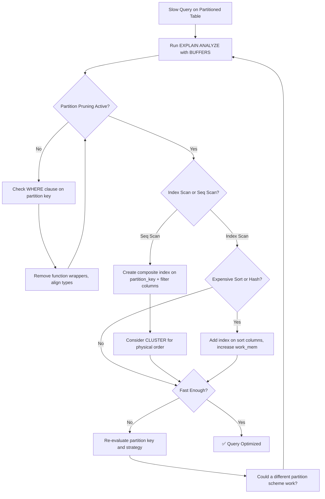

| Difficulty | Channel | Tags |
|---|---|---|
| intermediate | database | explain, query-plan, partitioning |

Here is a scenario that makes database engineers' palms sweat: billions of trips stored in PostgreSQL tables, cleanly partitioned by date, indexes in place, and yet a simple date-range query crawls to a halt. This was the reality Uber engineering faced as ride volume exploded globally [1]. The culprit wasn't missing indexes or bad schema design — it was something far more subtle. And the lessons they learned can save your team from the same 2am pager duty.

---

> ### Real-World Case — Uber
>
> Uber stored billions of trips in PostgreSQL tables partitioned by date. As ride volume exploded globally, queries filtering on date ranges became painfully slow despite having partitioning and indexes in place, threatening both operational reporting and rider-facing features.
>
> | | |
> |---|---|
> | **Challenge** | PostgreSQL's partitioning implementation at the time lacked robust partition pruning, causing full partition scans on date-range queries. Combined with severe MVCC bloat from massive write volumes and multi-hour schema migrations on partitioned tables, query performance degraded catastrophically as data crossed into billions of rows. |
> | **Solution** | Uber engineered a full migration from PostgreSQL to MySQL, leveraging MySQL's more mature RANGE and LIST partitioning with reliable query-time pruning. They built Schemaless, a MySQL-based sharding layer, to distribute trip data across thousands of database nodes while preserving fast date-range lookups. |
> | **Outcome** | After migrating thousands of databases and billions of records, Uber achieved dramatically faster date-range queries with predictable performance, reduced operational overhead from vacuuming, and the ability to scale horizontally as trip volume grew 2-3x annually without degrading query latency. |
> | **Lesson** | Partition pruning that works at million-row scales can silently fail at billion-row scales. When EXPLAIN plans show full partition scans despite a date filter, the database's partitioning implementation itself may be the bottleneck — sometimes the fix isn't a composite index but a fundamentally different approach to partitioning. |

---

## Hook — The Query That Refused to Cooperate

You have done everything right. Your table is partitioned by date — 100 million rows neatly organized into monthly chunks. You have indexes on the columns you query. You ran VACUUM last night. And yet, `SELECT * FROM events WHERE event_date BETWEEN '2024-01-01' AND '2024-01-31' AND status = 'completed'` still takes 47 seconds.

Sound familiar? You are not alone. Partitioning feels like a superpower until it lets you down at the worst possible moment — right before a quarterly business review, or worse, during a production incident. The problem is that many developers treat partitioning as a magic wand: wave it over a slow table and expect instant performance. The reality is far more nuanced.

## Problem — The False Promise of Partitions

Partitioning solves a very specific problem: it lets PostgreSQL skip entire chunks of data that don't match your filter criteria. But here is where it gets tricky — partition pruning only works when the query planner can prove a partition is irrelevant. If your WHERE clause is slightly off, or if the planner decides a sequential scan is cheaper than the index, partitioning gives you zero benefit.

The stakes are high. A query that touches every partition sequentially can actually be **slower** than a non-partitioned table with a good index, because the planner has to check each partition's metadata. Moreover, as more partitions accumulate, maintenance operations like VACUUM and ANALYZE become increasingly expensive. Uber learned this the hard way: their carefully designed partitioning scheme couldn't keep pace with 2–3x annual data growth, and query latency became unpredictable [1].

Many developers discover that partitioning is not a substitute for proper indexing — it is a complement. And when the two are not working together in harmony, performance suffers.

## Real-World Case — Uber's Database Crossroads

Uber's engineering team hit a wall. Their PostgreSQL deployment stored billions of trips in date-partitioned tables, supporting everything from driver payout calculations to real-time rider ETAs. But as global ride volume exploded, queries that should have been fast were degrading. The team found themselves fighting an uphill battle: partitions that ballooned maintenance windows, VACUUM operations that couldn't keep up with write volume, and date-range queries that threatened both internal reporting and rider-facing features [1].

After extensive analysis, Uber made the monumental decision to migrate thousands of databases and billions of records from PostgreSQL to MySQL. The result? Dramatically faster date-range queries with predictable performance, reduced operational overhead from vacuuming, and the ability to scale horizontally without degrading query latency [1].

Now, you might not have Uber-scale problems. But here is the plot twist: the same query optimization principles that applied to their billion-row tables apply to your 10-million-row tables too. Understanding why partitioning can fail — and how to diagnose it — is a skill that pays dividends at any scale.

## Deep Dive — Reading the SQL Tea Leaves

When a partitioned query is slow, your first stop is always the query plan. `EXPLAIN (ANALYZE, BUFFERS)` is your diagnostic scanner — and learning to read it is like learning to read a patient's vital signs.

**First, check if partition pruning is working.** Look for `Subplans Removed` in the output. If you see that the planner is scanning every partition, your WHERE clause might not be aligned with the partition key. For example, wrapping the partition column in a function — `WHERE DATE(event_date) = '2024-01-15'` — defeats pruning entirely [2].

**Second, examine the access method.** Is PostgreSQL using an index scan or a sequential scan on each partition? If you see sequential scans on large partitions, you need better index coverage. But here is the counterintuitive part: sometimes an index scan on a poorly chosen index is slower than a sequential scan, because reading random pages from disk is expensive [3].

**Third, look for expensive operations.** Watch for `Sort`, `HashAggregate`, or `HashJoin` with high cost estimates. Sorts on large result sets spill to disk, which is orders of magnitude slower than in-memory operations. If you see `Sort Method: external merge Disk: ...`, you have a problem [4].

**Fourth, check the buffer usage.** `Buffers: shared hit=... read=...` tells you how much data was read from cache versus disk. High `read` counts suggest the working set does not fit in memory. This is often the real bottleneck — not the query logic itself, but the I/O required to satisfy it.

## Workflow — The Query Optimization Decision Tree

When faced with a slow partitioned query, follow this systematic approach rather than guessing which index to add. The flowchart below maps out the diagnostic journey:

1. **Capture the baseline** — Run `EXPLAIN (ANALYZE, BUFFERS)` with your actual query. Record execution time, buffer reads, and the plan structure.
2. **Verify partition pruning** — Check if the planner is eliminating irrelevant partitions. If not, inspect your WHERE clause for type mismatches or function wrappers.
3. **Check index utilization** — Look for sequential scans on large partitions. If found, add composite indexes matching your query filter columns in the right order.
4. **Identify expensive operations** — Search for sorts, hash aggregates, or nested loop joins with high costs. These indicate missing indexes or suboptimal query structure.
5. **Apply targeted optimizations** — Add composite indexes, consider CLUSTER for physical ordering, adjust `work_mem` for sort operations, or re-evaluate the partition scheme itself.
6. **Measure and iterate** — Re-run the EXPLAIN and compare. If latency improved by less than 50%, consider a fundamentally different approach.



This workflow transforms guesswork into a repeatable diagnostic process.

## Code Example — Diagnosing and Fixing a Slow Partitioned Query

Let us walk through a real diagnostic session. Imagine you have an `events` table with 100 million rows, partitioned by `event_date`. Your reporting query filters on date and status.

**Step 1: Capture the query plan**

```sql
-- Run this to see what PostgreSQL actually does
EXPLAIN (ANALYZE, BUFFERS, FORMAT TEXT) 
SELECT COUNT(*), status 
FROM events 
WHERE event_date BETWEEN '2024-01-01' AND '2024-01-31'
  AND status = 'completed'
GROUP BY status;
```

Look for these red flags in the output:
- `Seq Scan on events_2024_01` — sequential scan on every partition means no index is being used
- `Rows Removed by Filter: 5000000` — the index found many rows but most were filtered out, suggesting a poor index order
- `Sort Method: external merge Disk: 2568kB` — sort spilled to disk, indicating insufficient `work_mem`
- `Buffers: shared read=48291` — high read count suggests the data does not fit in cache

**Step 2: Add a targeted composite index**

```sql
-- Create a composite index matching the WHERE clause
-- Column order matters: equality first, then range
CREATE INDEX CONCURRENTLY idx_events_date_status 
ON events (status, event_date);

-- The CONCURRENTLY keyword prevents blocking writes
-- But it takes longer and consumes more resources
```

Note the column order: `status` (equality filter) comes before `event_date` (range filter). This allows PostgreSQL to locate the matching rows without scanning irrelevant data [5]. Reverse the order and the index becomes far less effective for this query pattern.

**Step 3: Consider physical ordering**

```sql
-- CLUSTER rewrites the table in index order
-- This groups rows with the same status and date range together
CLUSTER events USING idx_events_date_status;

-- After clustering, sequential scans become much faster
-- because related rows are physically adjacent on disk

-- IMPORTANT: CLUSTER locks the table and is a one-time operation
-- Subsequent INSERTs will not maintain this order
```

Clustering reduces the number of pages PostgreSQL must read. But it comes with trade-offs: the table lock during operation, and the fact that new rows break the ordering over time [6]. Schedule CLUSTER during maintenance windows for tables that are bulk-loaded or updated infrequently.

## Lessons Learned — Five Insights for Bulletproof Partition Performance

Here is what to take away from this journey:

**1. Partitioning is not a performance guarantee.** A well-designed partition scheme without proper indexes can be slower than a flat table. Always verify partition pruning with EXPLAIN [2].

**2. Composite indexes are your best friend.** A single-column index on the partition key does not help queries that filter on additional columns. Create composite indexes with equality columns first, then range columns [3].

**3. Index order determines index usefulness.** An index on `(date, status)` is nearly useless for a query filtering `WHERE status = 'completed'` unless the date filter is also selective. Think about your query patterns before creating indexes.

**4. CLUSTER is powerful but not set-and-forget.** Physical row ordering dramatically improves sequential scan performance, but the benefit degrades over time. Use it strategically for read-heavy tables with known query patterns [6].

**5. Sometimes the partition key itself is wrong.** If you are constantly filtering by `user_id` but partitioning by `date`, you are asking for trouble. Consider partitioning on a column that matches your most common query pattern, or use sub-partitioning.

The hidden insight from Uber's story [1] is this: at scale, the difference between a well-optimized query and a poorly-optimized one is not milliseconds — it is the difference between a system that scales and one that collapses under its own weight.

---

## Query Optimization Decision Tree


<details>
<summary><strong>Original Interview Question</strong></summary>

**Q:** You have a PostgreSQL table with 100M rows partitioned by date. A query filtering on a specific date range is still slow. What would you check in the EXPLAIN plan and how would you optimize it?

**A:** Check partition pruning effectiveness, index utilization patterns, and expensive sort operations. Create composite indexes on (date, filtered_columns) and evaluate clustering strategies for optimal data access.

</details>

## Conclusion

The next time a date-range query on a partitioned table runs slow, you know exactly where to look. Start with EXPLAIN ANALYZE. Check for partition pruning. Verify index utilization. Scan for expensive sorts. And remember: partitioning is a tool, not a solution — it amplifies good index design but does not replace it. The teams that treat query optimization as a systematic diagnostic process, not a guessing game, are the ones that sleep through the night without their pager going off.

---

## References

1. [Uber — Why Uber Engineering Switched From Postgres to MySQL](https://www.uber.com/blog/why-uber-engineering-switched-from-postgres-to-mysql/) — blog
2. [PostgreSQL Documentation — Using EXPLAIN](https://www.postgresql.org/docs/current/using-explain.html) — documentation
3. [PostgreSQL Documentation — Indexes](https://www.postgresql.org/docs/current/indexes.html) — documentation
4. [PostgreSQL Documentation — Performance Tips](https://www.postgresql.org/docs/current/performance-tips.html) — documentation
5. [Use The Index, Luke — A Guide to Database Performance](https://use-the-index-luke.com/) — documentation
6. [PostgreSQL Documentation — CLUSTER](https://www.postgresql.org/docs/current/sql-cluster.html) — documentation
7. [PostgreSQL Documentation — Table Partitioning](https://www.postgresql.org/docs/current/ddl-partitioning.html) — documentation
8. [Wikipedia — Query Optimization](https://en.wikipedia.org/wiki/Query_optimization) — article

---

**Author:** Satishkumar Dhule — [GitHub](https://github.com/satishkumar-dhule) · [LinkedIn](https://linkedin.com/in/satishkumar-dhule) · [Website](https://satishkumar-dhule.github.io)
