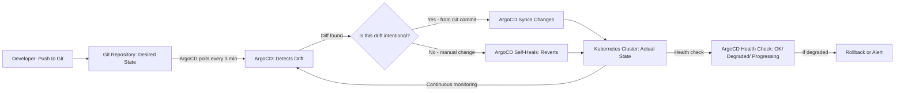

| Difficulty | Channel | Tags |
|---|---|---|
| beginner | devops | argocd, flux, declarative |

In 2018, Intuit had already moved to the public cloud but saw almost no improvement in deployment velocity — teams still took days to weeks for releases [1]. Their 'lift-and-shift' migration had freed them from managing hardware but did not change how they deployed software. They realized they needed a fundamentally different approach. What they discovered would transform not just their deployment pipeline, but the entire industry's understanding of what GitOps could do.

---

> ### Real-World Case — Intuit
>
> In 2018, Intuit had already moved to the public cloud but saw almost no improvement in deployment velocity — teams still took days to weeks for releases. Their 'lift-and-shift' migration freed them from managing hardware but didn't change how they deployed software. They realized they needed a fundamentally different approach.
>
> | | |
> |---|---|
> | **Challenge** | Intuit needed to containerize and adopt cloud native technologies but lacked in-house Kubernetes expertise. Their imperative deployment process relied on manual scripts, 'release ceremonies' taking days, and rollbacks requiring 45+ minutes of toil — unacceptable for a financial platform managing $2T+ in invoices, TurboTax filings, and QuickBooks payroll during tax season. |
> | **Solution** | Intuit acquired Applatix (the startup behind Argo) and built the 'Modern SaaS' platform around GitOps with ArgoCD. Git became the single source of truth for all Kubernetes manifests. ArgoCD continuously reconciled cluster state against Git, auto-syncing changes and self-healing when drift was detected — replacing imperative kubectl commands with declarative YAML-driven deployments. |
> | **Outcome** | MTTR dropped from 45 minutes to under 5 minutes. Deployment cycles fell from days to minutes. Service creation/upgrades dropped to under 10 minutes. By 2025, Intuit scaled to 345+ clusters, 32,000+ applications, 50+ ArgoCD instances, and 2,400+ PRs merged per day — all managed declaratively through Git. |
> | **Lesson** | Moving to the cloud without changing your deployment model only fixes half the problem. The real unlock was shifting from imperative scripts (kubectl run, manual rollbacks) to declarative GitOps (define desired state in Git, let ArgoCD reconcile). This also revealed that investing in open source tooling — even acquiring the startup behind it — can pay dividends far beyond the initial cost. |

---

## Hook — The Deployment That Wasn't

You have been there. SSH into a production box, run a quick kubectl command, and move on to the next fire. It feels productive in the moment — a direct fix, no bureaucracy, done. But weeks later, nobody remembers who ran that command. The incident report is empty. The next on-call engineer inherits a mystery. Configuration drift sets in. What started as a "quick fix" becomes a slow-moving disaster.

Every team hits this wall eventually. The question is not whether you will face configuration drift, but how badly it will hurt when you do.

## Problem — The Illusion of Cloud-Native Velocity

Moving to Kubernetes feels like unlocking fast-forward mode. Containers spin up in seconds, scaling is automatic, and the orchestrator handles failures gracefully. But here is the hidden trap: Kubernetes only amplifies whatever deployment practices you already have. If your team relies on imperative kubectl commands and manual runbooks, Kubernetes will let you make those mistakes faster and at a larger scale.

Configuration drift becomes exponentially worse when you have dozens of microservices. One engineer runs kubectl scale deployment foo --replicas=5 to handle a traffic spike. Another runs kubectl set image deployment foo myapp:v2 during an incident. Nobody updates the YAML in Git. Two weeks later, a new pod restarts and pulls the old image from the manifest — your production environment is now running something nobody intended.

This is the actual cost of imperative operations. Not just the drift itself, but the eroded trust in your deployment pipeline. When engineers cannot trust that Git reflects production, every deploy becomes a leap of faith.

## Real-World Case — Intuit's GitOps Transformation

Intuit's story is a masterclass in why cloud migration alone is not enough. By 2018, the company behind TurboTax, QuickBooks, and Mint had moved to the public cloud. Yet deployment cycles still spanned days — sometimes weeks. The cloud gave them elasticity, but it did not fix their human processes. Teams were still wiring up clusters manually, still debugging configuration drift, still treating deployments as high-risk events [1].

Enter GitOps. Intuit adopted ArgoCD as their deployment engine and committed to a radical principle: Git would become the single source of truth for everything running in production. No more drifting. No more mystery kubectl commands. Every change starts as a pull request, gets reviewed, gets merged, and ArgoCD makes it so.

The impact was staggering:
- Mean Time to Recovery (MTTR) dropped from 45 minutes to under 5 minutes
- Deployment cycles collapsed from days to minutes
- Service creation and upgrades dropped to under 10 minutes
- By 2025, Intuit operated 345+ clusters with 32,000+ applications managed through 50+ ArgoCD instances
- The team processed over 2,400 pull requests merged per day — all declaratively [1]

The key insight? Intuit did not just adopt a tool. They adopted a philosophy. Every change flows through Git. The cluster is merely a reflection of the repository. This single shift eliminated entire categories of production incidents.

## Deep Dive — Declarative vs Imperative: The Real Tradeoffs

The difference between declarative and imperative approaches runs deeper than "YAML files vs kubectl commands." It is a fundamental question about where truth lives in your system.

**The Imperative Trap**

Imperative commands (kubectl run, kubectl scale, kubectl set image) feel intuitive because they match how humans think: "Do this thing now." But here is the problem — each command is a side effect without a record. Kubernetes stores the resulting state in etcd, but the intent — the why behind the change — is lost [2].

When an incident occurs, imperative commands leave no breadcrumb trail. You see the current state but not the series of decisions that led there. Reverting requires manual detective work. Rollbacks become guesswork.

**The Declarative Advantage**

Declarative configuration flips the model. Instead of telling Kubernetes what to do, you describe what you want the world to look like. ArgoCD continuously reconciles the actual cluster state with the desired state declared in Git [3].

This creates several powerful properties:
- **Auditability**: Every change has a commit hash, an author, and a timestamp
- **Reproducibility**: Any environment can be rebuilt from Git at any point in history
- **Self-healing**: If someone manually changes a resource, ArgoCD automatically reverts it — no more drift
- **Collaboration**: Changes go through pull requests with code review, not direct commands

**When Imperative Still Makes Sense**

To be fair, imperative workflows have legitimate use cases. Debugging a misconfigured pod, running one-off database migrations, or performing emergency rollbacks during an outage — these situations demand speed over process. The real skill is knowing when to break the rules and having a mechanism (like ArgoCD's self-healing) to restore order afterward.

⚠️ **Watch Out**: Auto-sync without self-healing is just automation without guardrails. If someone makes a manual change, auto-sync will not correct it — it only syncs when Git changes. Always enable both for proper GitOps discipline.

## Workflow — The GitOps Reconciliation Loop

Building on the declarative model, here is how the GitOps workflow actually works in practice. The diagram below traces a change from developer laptop to production cluster:

A developer creates or updates a Kubernetes manifest (Deployment, Service, ConfigMap, etc.) and opens a pull request. The team reviews the change, and once merged, ArgoCD detects the diff between Git (the desired state) and the cluster (the actual state). ArgoCD then applies the necessary changes and continuously monitors to ensure nothing drifts.



This reconciliation loop is the heartbeat of GitOps. Every three minutes (configurable, of course), ArgoCD checks whether the cluster matches Git. If not, it takes corrective action. The result is a system that not only deploys your changes but actively prevents unauthorized modifications.

## Code Example — Defining Your First ArgoCD Application

The heart of any ArgoCD setup is the Application Custom Resource. This YAML tells ArgoCD what to deploy, where to deploy it, and how to keep it in sync. Here is a production-grade example:

```yaml
apiVersion: argoproj.io/v1alpha1
kind: Application
metadata:
  name: payment-service
  namespace: argocd
spec:
  project: default
  source:
    repoURL: https://github.com/your-org/payment-service.git
    targetRevision: main
    path: kubernetes/overlays/production
    # Using Kustomize for environment-specific overlays
    kustomize:
      namePrefix: prod-
  destination:
    server: https://kubernetes.default.svc
    namespace: payments
  syncPolicy:
    automated:
      prune: true         # Remove resources deleted from Git
      selfHeal: true      # Revert manual changes automatically
      allowEmpty: false   # Don't delete all resources if Git goes empty
    syncOptions:
      - CreateNamespace=true  # Auto-create the namespace if missing
      - ApplyOutOfSyncOnly=true  # Only touch resources that drifted
    retry:
      limit: 5            # Retry sync up to 5 times
      backoff:
        duration: 5s
        factor: 2
        maxDuration: 3m
  # Health checks via Prometheus or custom probes
  ignoreDifferences:
    - group: apps
      kind: Deployment
      jsonPointers:
        - /spec/replicas  # Ignore HPA-driven replica changes
```

**What is happening here?**

This Application resource declares everything ArgoCD needs. The `source` block points to a Git repository, branch, and path — in this case, a Kustomize overlay for production. The `destination` block targets the local cluster's `payments` namespace. 

The `syncPolicy` section is where the magic lives. `prune: true` ensures that removing a file from Git actually removes the resource from the cluster — no orphaned services. `selfHeal: true` is your drift protection: anyone running kubectl delete or kubectl patch directly will find their changes silently reverted within minutes.

Notice the `retry` block with exponential backoff. Network blips happen. API server timeouts happen. This pattern ensures ArgoCD keeps trying without overwhelming the control plane. The `ignoreDifferences` section is a pro tip — it tells ArgoCD to ignore replica count changes made by Horizontal Pod Autoscalers, so HPA can do its job without triggering false drift alerts.

After applying this with `kubectl apply -f application.yaml`, ArgoCD immediately scans the cluster, compares it to the repository, and begins the reconciliation loop.

## Lessons Learned — What Intuit's Journey Teaches Us

Intuit's transformation from days-long deployments to 2,400+ PRs merged per day did not happen overnight. Here are the takeaways that apply to any team adopting GitOps:

**1. Start with a single application.** Do not try to migrate 300 microservices at once. Pick one service, set up the Application CRD, enable auto-sync and self-healing, and let the team get comfortable with the workflow. Prove the pattern before scaling it.

**2. Auto-sync without self-healing is half the solution.** Many teams enable auto-sync but leave self-healing disabled because they "trust" their engineers not to make manual changes. They will. The self-healing mechanism is not a lack of trust — it is an acknowledgment that emergencies happen and humans make mistakes [4].

**3. Invest in observability.** ArgoCD's health checks and sync status indicators are only useful if your team actually monitors them. Set up alerts for Degraded and OutOfSync states. Integrate with your incident response platform. A GitOps pipeline without monitoring is just a fancy way to break things faster [5].

**4. Use Kustomize or Helm from day one.** Raw YAML duplicates constantly across environments. Kustomize overlays or Helm value files let you define base configurations once and layer environment-specific changes on top. Your staging, canary, and production environments should differ by a handful of values, not thousands of lines of YAML [6].

**5. The tool is not the transformation.** Intuit's success came from changing how their teams thought about deployments — not from installing ArgoCD. GitOps is a cultural shift. It requires discipline around code review, commit messages, and branch strategy. The tool amplifies the culture; it does not replace it [1].

**The bottom line:** Configuration drift is not a technical problem. It is a trust problem. GitOps rebuilds that trust by making every change visible, auditable, and reversible. Your future self — the one getting paged at 3 AM — will thank you.

---

## GitOps Reconciliation Loop with ArgoCD


<details>
<summary><strong>Original Interview Question</strong></summary>

**Q:** You're setting up GitOps for a microservices deployment. How would you configure ArgoCD to automatically sync changes from your Git repository to Kubernetes, and what's the difference between declarative and imperative approaches in this context?

**A:** I'd configure ArgoCD by setting up a Git repository containing Kubernetes manifests or Helm charts, creating an Application CRD that points to the Git repository, enabling auto-sync with a health check interval of 3 minutes, and implementing self-healing to automatically revert any manual changes. The declarative approach involves defining the desired state in Git through YAML manifests, Helm charts, or Kustomize configurations, where ArgoCD continuously reconciles the actual state with the desired state. In contrast, the imperative approach uses kubectl commands to make direct changes to the cluster, bypassing the Git repository as the single source of truth.

</details>

## Conclusion

Configuration drift is not a technical problem — it is a trust problem. GitOps rebuilds that trust by anchoring every change to Git, making deployments auditable, reversible, and automated. Start small: pick one service, set up your first Application CRD with auto-sync and self-healing, and prove the pattern before scaling. Your pager will thank you.

---

## References

1. [Intuit case study — CNCF](https://www.cncf.io/case-studies/intuit/) — article
2. [Kubernetes etcd documentation](https://kubernetes.io/docs/concepts/overview/components/#etcd) — documentation
3. [ArgoCD User Guide — Automated Sync Policy](https://argo-cd.readthedocs.io/en/stable/user-guide/auto_sync/) — documentation
4. [GitOps Principles — OpenGitOps](https://opengitops.dev/) — documentation
5. [ArgoCD Health Check Documentation](https://argo-cd.readthedocs.io/en/stable/operator-manual/health/) — documentation
6. [Kustomize — Kubernetes Native Configuration Management](https://kustomize.io/) — documentation
7. [Flux — GitOps for Kubernetes](https://fluxcd.io/) — documentation
8. [Weaveworks — Guide to GitOps](https://www.weave.works/technologies/gitops/) — article
9. [CNCF GitOps Survey 2024](https://www.cncf.io/reports/gitops-survey/) — article
10. [Kubernetes Deployments Documentation](https://kubernetes.io/docs/concepts/workloads/controllers/deployment/) — documentation

---

**Author:** Satishkumar Dhule — [GitHub](https://github.com/satishkumar-dhule) · [LinkedIn](https://linkedin.com/in/satishkumar-dhule) · [Website](https://satishkumar-dhule.github.io)
