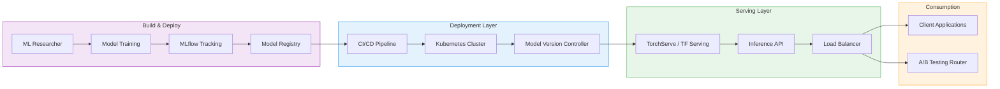

| Difficulty | Channel | Tags |
|---|---|---|
| beginner | devops | mlops, deployment |

In 2023, Netflix's centralized ML serving platform hit a critical inflection point. Handling over 1 million inference requests per second across hundreds of model types, their Switchboard proxy architecture became a latency bottleneck and single point of failure, threatening the rapid experimentation cycle that ML researchers depended on [1]. The root cause was not a lack of computing power — it was a fundamental architectural confusion between deployment and serving. What Netflix discovered has profound implications for any team building ML systems at scale.

---

> ### Real-World Case — Netflix
>
> Netflix's centralized ML serving platform handles over 1 million inference requests per second across hundreds of model types powering personalized recommendations. By 2023, as demand grew, their original serving proxy architecture (Switchboard) became a latency bottleneck and single point of failure, threatening the rapid experimentation cycle that ML researchers depended on.
>
> | | |
> |---|---|
> | **Challenge** | Their model serving proxy (Switchboard) processed all inference traffic through a single centralized service, creating two problems: (1) every request incurred an extra hop through Switchboard, adding unacceptable latency at 1M+ RPS, and (2) Switchboard itself was a single point of failure — if it went down, every ML-powered feature on Netflix stopped working. Meanwhile, ML researchers needed to rapidly A/B test new model versions without touching any of the client microservices consuming them. |
> | **Solution** | Netflix decoupled routing metadata from the routing proxy itself. They built Lightbulb, a standalone service that maintains routing configuration and exposes it via a sidecar that Envoy proxies poll. Now client services send inference requests directly to model instances through Envoy (which already handles their service mesh traffic), and Lightbulb simply tells Envoy which model version should handle which requests. This eliminated the extra proxy hop entirely while preserving context-aware routing capabilities. |
> | **Outcome** | The centralized platform handles 1M+ requests per second across hundreds of model types and versions. The new architecture eliminated the single point of failure, reduced end-to-end inference latency by removing the Switchboard middleware hop, and preserved the ability for ML researchers to deploy and A/B test new model versions without client-side changes. Netflix calls this the 'critical missing piece' of their ML serving infrastructure. |
> | **Lesson** | Model serving infrastructure requires fundamentally different architectural patterns than model deployment infrastructure. While deployment focuses on CI/CD, packaging, and infrastructure provisioning, serving demands ultra-low-latency request routing, traffic splitting for A/B tests, and horizontal scalability — best achieved by integrating with existing mesh infrastructure (Envoy) rather than building a standalone proxy. The decoupling of routing metadata (Lightbulb) from the data plane (Envoy) was the key architectural insight. |

---

## Hook — When 1 Million Requests Per Second Exposes the Truth

You might think deploying a model and serving it are the same thing. Many teams do — until production proves otherwise. Deployment and serving sit at opposite ends of the ML operations spectrum, yet they are constantly conflated, leading to architectures that crumble under real-world traffic. The difference sounds subtle on paper: deployment is how you get a model into production, and serving is how you run inference once it is there. In practice, that distinction determines whether your system handles 100 requests or 100 million. Netflix learned this the hard way when their Switchboard proxy — the middleware routing inference requests to model servers — became the single point of failure in a system processing over a million requests per second [1]. The irony? Switchboard was originally designed to simplify things.

## Problem — The Deployment vs Serving Confusion

Here is where most teams go wrong: they treat deployment and serving as one problem. A data scientist trains a model, packages it into a Docker container, exposes a REST endpoint, and calls it done. That works for a prototype. In production, the deployment layer and the serving layer solve fundamentally different problems with different constraints. Deployment encompasses CI/CD pipelines, infrastructure provisioning, model registries, monitoring dashboards, and rollback strategies [2]. It is about getting the model to the right place at the right time. Serving, on the other hand, is about runtime performance: request routing, model loading, inference optimization, autoscaling, and latency guarantees [3]. Deployment happens occasionally. Serving happens every millisecond. When you treat them as the same layer, you end up with architecture that is brittle under load, hard to debug when things fail, and painful to evolve. Netflix's Switchboard architecture was a perfect example — a shared proxy that handled routing for all models, creating both a bottleneck and a single point of failure.

## Real-World Case — Netflix's Switchboard Evolution

Netflix's ML serving platform was designed for flexibility. ML researchers could deploy new model versions and run A/B tests without any client-side changes — every request went through Switchboard, which handled routing to the right model version. It worked brilliantly at small scale. But as Netflix grew, so did the number of model types and inference requests. Switchboard became the middleman that nobody wanted but everyone depended on [1]. Every inference request had to pass through an extra hop, adding latency. Every deployment required routing changes in the proxy. And when Switchboard had issues, every model in the platform was affected. Netflix's engineering team realized they had a fundamental architectural problem: the routing logic, which was really part of the serving layer, was embedded in a centralized proxy that operated as a separate deployment concern. Their solution? Eliminate the middleman entirely. They distributed routing responsibilities to the client side using a concept called 'server-side routing at the client' — each client library receives routing tables from a lightweight control plane instead of routing every request through a centralized proxy [1]. This eliminated the single point of failure, reduced end-to-end latency by removing the Switchboard hop, and preserved the rapid experimentation cycle. Netflix calls this the 'critical missing piece' of their ML serving infrastructure.

## Deep Dive — The Two-Layer Architecture

Building on Netflix's lesson, let's break down what each layer actually handles. The deployment layer is your operational backbone: Kubernetes or Nomad for orchestration, Terraform for infrastructure provisioning, Docker for containerization, MLflow or SageMaker for model registry and experiment tracking, and GitHub Actions or Jenkins for CI/CD pipelines [2][4]. This layer answers questions like: 'Which version of the model is in production?', 'Can I roll back to last week's model?', and 'Is the infrastructure healthy?' The serving layer is your runtime engine: TensorFlow Serving or TorchServe for model loading and inference, FastAPI or gRPC for API endpoints, NGINX or Envoy for load balancing, and Prometheus or Grafana for real-time monitoring [3][5][6]. This layer answers: 'How fast is this inference request?', 'Can we handle a traffic spike?', and 'Should we route this request to model version A or B?' The key trade-offs between these layers are dramatically different. In deployment, you optimize for reliability and reproducibility — you want blue-green deployments, canary releases, and automated rollbacks. In serving, you optimize for latency and throughput — you want automatic batching, GPU memory pooling, and sub-millisecond routing [7]. A common mistake is applying deployment patterns to serving problems. For example, using Kubernetes rolling updates as a substitute for proper model version routing — yes, it works at low scale, but it breaks down when you need traffic splitting for A/B tests or gradual rollouts with immediate rollback capability.

## Workflow — From Notebook to Production Inference

The diagram below shows the full path a model takes from development to production inference. Notice the clear separation between the deployment layer (blue) and the serving layer (green). ML researchers develop and train models, which are tracked in MLflow and registered in the model registry. The CI/CD pipeline automatically provisions infrastructure via Kubernetes and deploys the model to the serving layer. The serving layer then handles real-time inference requests through model servers like TorchServe or TensorFlow Serving, routed through load balancers to client applications. A/B testing routers split traffic between model versions at the serving layer, not at the deployment layer. This separation means you can deploy a new model version without any serving interruption — the deployment pipeline stages the model, validates it, and only then tells the serving layer to start routing traffic to it.

## Code Example — Building a Production-Grade Serving Endpoint

Here is a practical example of a serving endpoint that handles model versioning, A/B testing, and latency monitoring — patterns that go far beyond a simple Flask app. The code shows how to load models from a registry on startup, route requests based on model version, and return latency metrics for monitoring.

## Lessons Learned — What Every ML Team Needs to Know

Three patterns separate teams that struggle with ML in production from those that scale effortlessly. First, draw a hard line between deployment and serving on your architecture diagrams — if they share the same box, you are setting yourself up for pain. Second, design your serving layer for the traffic pattern, not the workflow — batch inference and real-time inference need completely different serving architectures, and conflating them is one of the most common scalability mistakes [7]. Third, monitor at the right level — deployment metrics (deployment frequency, rollback rate) are different from serving metrics (p50/p99 latency, throughput, error rate), and mixing them hides problems until they become critical [8]. Netflix's journey from Switchboard to client-side routing is a master class in this separation. They did not need more servers — they needed clearer architectural boundaries. The next time your team plans an ML system, start by drawing two boxes. The clarity will save months of refactoring and more than a few 3am incident calls.

---

## ML Model Pipeline from Development to Production Serving

<strong>Original Interview Question</strong>

**Q:** Explain the key differences between model serving and model deployment in ML systems, including specific technologies, scaling considerations, and real-world implementation patterns?

**A:** Deployment encompasses CI/CD pipelines, infrastructure setup, and monitoring using tools like Kubernetes, MLflow, and SageMaker. Serving focuses on runtime inference APIs with frameworks like TensorFlow Serving, TorchServe, or BentoML, handling request routing, model versioning, and autoscaling. Key trade-offs include latency vs throughput, batch vs real-time inference, and cold start optimization.

## Conclusion

The line between deployment and serving is not just semantic — it is architectural. Netflix discovered this when their unified platform started bending under the weight of a million requests per second. The fix was not more servers; it was cleaner separation of concerns. Next time your team plans an ML system, start by drawing two boxes: deployment and serving. The clarity will save you months of refactoring and more than a few 3am incident calls.

---

## References

1. [Netflix incident report](https://netflixtechblog.com/state-of-routing-in-model-serving-16e22fe18741) — blog
2. [Kubernetes Architecture Documentation](https://kubernetes.io/docs/concepts/architecture/) — documentation
3. [TensorFlow Serving Documentation](https://www.tensorflow.org/tfx/guide/serving) — documentation
4. [MLflow Documentation](https://mlflow.org/docs/latest/index.html) — documentation
5. [AWS SageMaker Documentation](https://docs.aws.amazon.com/sagemaker/) — documentation
6. [FastAPI Documentation](https://fastapi.tiangolo.com/) — documentation
7. [Hidden Technical Debt in Machine Learning Systems](https://arxiv.org/abs/1608.06981) — paper
8. [TorchServe Documentation](https://pytorch.org/serve/) — documentation
9. [Docker Documentation](https://docs.docker.com/) — documentation
10. [GitHub Actions Documentation](https://docs.github.com/en/actions) — documentation

---

**Author:** Satishkumar Dhule — [GitHub](https://github.com/satishkumar-dhule) · [LinkedIn](https://linkedin.com/in/satishkumar-dhule) · [Website](https://satishkumar-dhule.github.io)
