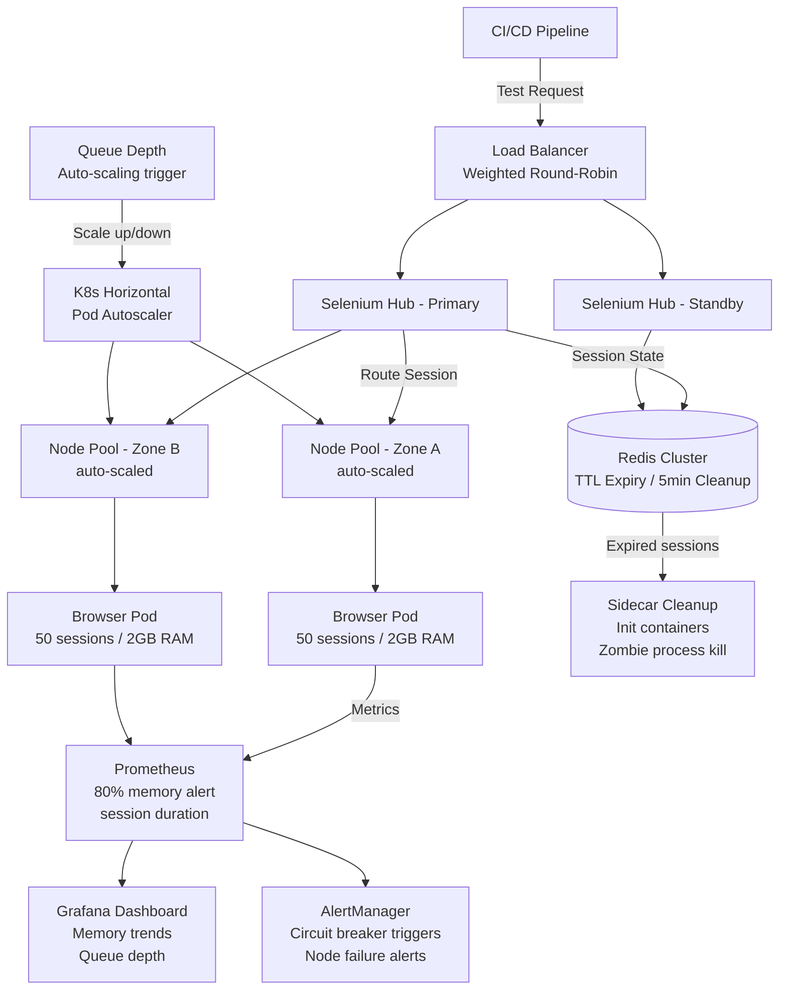

| Difficulty | Channel | Tags |
|---|---|---|
| advanced | system-design | selenium, webdriver, grid |

Expedia Group's engineering teams found themselves managing over 90 distinct Selenium Grid hubs while running 140,000+ UI tests daily — with 2-4 minute node provisioning times and idle infrastructure costs burning through their budget [1]. If you have ever watched your test suite grow from a handful of scripts to a sprawling pipeline that takes hours to complete, you know the exact moment when your test infrastructure stops being a utility and starts being a project in itself. This is the story of what it takes to scale beyond that breaking point.

---

> ### Real-World Case — Expedia Group
>
> Expedia Group's engineering teams were running 90-100+ Selenium Grid hubs across various CI/CD pipelines, executing 140,000-150,000+ UI tests daily. The challenge was that each team managed their own infrastructure, leading to slow node provisioning (2-4 minutes), static hubs that ran up costs even when idle, and complex maintenance across hundreds of Jenkins jobs.
>
> | | |
> |---|---|
> | **Challenge** | UI automation tests were a bottleneck in the CI pipeline. Sequential execution meant hundreds or thousands of tests could take hours, delaying developer feedback. The existing EC2-based SeleniumGridScaler required manual hub creation, took 2-4 minutes to scale up nodes, and incurred costs even when idle. Additionally, cross-browser testing with third-party vendors was projected to cost $2.41M annually at scale. |
> | **Solution** | Expedia built SeleniumGridScaler (Selenium Grid + AWS EC2 API) that auto-scaled nodes on-demand, launching instances only when tests needed to run and terminating them immediately afterward. They later evolved to DA-Kube (Distributed Automation on Kubernetes), deploying Selenium Grid on AWS EKS with Docker, Helm, and Traefik as a reverse proxy. This allowed each branch deployment to have its own Selenium Grid, with nodes spawning in seconds instead of minutes, and spot instances used for cost efficiency. |
> | **Outcome** | Achieved running 1,000 UI automation tests in 5 minutes (the time of the slowest test). Reduced cross-browser testing costs from $2.41M (third-party vendor) to ~$80K annually using internal distributed automation. Each c5.xlarge node runs 15 concurrent browser sessions. 90-100+ hubs execute 140K+ tests daily with full auto-scaling and pay-per-use billing. |
> | **Lesson** | The ideal is to make the total test suite execution time equal to the duration of the single slowest test. Combining Selenium Grid with elastic cloud infrastructure (auto-scaling EC2 → Kubernetes) enables massive parallelization with dramatic cost savings — the key is ephemeral, on-demand node creation and immediate teardown to avoid paying for idle capacity. |

---

## Hook — The Night the Hubs Stopped Scaling

Here is what nobody tells you about Selenium Grid at scale: the architecture that handles 50 tests a day will actively sabotage you at 5,000. Nodes crash without warning, leaving orphaned browser processes that eat memory like Pac-Man. Sessions leak resources until your CI pipeline looks like a slow-motion train wreck. Hubs become single points of failure that take down your entire test suite when they hiccup. The debugging sessions stretch past midnight as you hunt for why Chrome is silently consuming 4GB of RAM on a node that was supposed to be idle. The stakes here go beyond developer frustration — fragile test infrastructure is a direct drag on release velocity, and in a world where deployment frequency separates market leaders from also-rans, that is a competitive disadvantage you cannot afford.

## Problem — The Hidden Complexity of Browser Orchestration

The core challenge sounds deceptively simple: spin up browser instances, run tests, tear them down, and do it reliably at scale. But underneath that headline lies a nest of interconnected problems. Each browser session is stateful — it holds DOM references, network connections, and rendering contexts that must be meticulously cleaned up. Memory leaks in WebDriver sessions are not theoretical; they are a daily reality when tests fail to call `quit()` or when exceptions skip cleanup blocks. On top of that, the Selenium Hub itself has limits. A single hub can handle roughly 50-100 concurrent sessions before its internal message queue becomes a bottleneck [2]. Beyond that, you need distributed hubs, which means you need a load balancer, which means you need health checks, which means you need a way to detect and isolate failing nodes before they drag down the entire cluster. What looks like a testing problem is really a distributed systems problem wearing a browser mask.

## Real-World Case — Expedia Group's Distributed Automation Journey

Expedia Group lived through every one of these growing pains in vivid detail [1]. With 90 to 100 Selenium Grid hubs running across various CI/CD pipelines, their engineering teams were executing 140,000 to 150,000 UI tests every single day. Each team managed their own infrastructure independently — a decision that made sense for autonomy but created an operational nightmare. Node provisioning took 2 to 4 minutes. Static hubs ran 24/7 even when no tests executed, burning AWS credits. And maintaining hundreds of Jenkins jobs, each with slightly different Selenium configurations, was a tax on productivity that grew with every new team. The turning point came when they consolidated onto a distributed automation platform built on containerized browser nodes. Each c5.xlarge EC2 instance runs 15 concurrent browser sessions, with auto-scaling triggered by queue depth. The results were staggering: 1,000 UI automation tests complete in just 5 minutes — the time of the slowest individual test. Cross-browser testing costs dropped from $2.41 million (paid to a third-party vendor) to roughly $80,000 annually [1]. A 97% cost reduction, achieved not by cutting corners but by engineering the right architecture.

## Deep Dive — Architecture for 10,000 Concurrent Sessions

Building on what Expedia demonstrated, here is the architectural blueprint for a Selenium Grid that handles 10,000 concurrent sessions with 99.9% uptime. The foundation is a Kubernetes cluster with auto-scaling node pools distributed across multiple availability zones. Each browser node runs as a pod with strict resource limits: 2GB of RAM and 1 CPU per pod, with 50 sessions per node [7]. That means 200 nodes minimum for 10,000 sessions, with a 30% buffer bringing cluster memory to 520GB. Session state lives in a Redis cluster with TTL-based expiration policies [4]. A background worker scans for expired keys every 5 minutes, ensuring zombie sessions are cleaned up even if the client disconnects without calling `quit()`. Session initiation targets a P99 latency under 2 seconds through regional load balancing using weighted round-robin algorithms based on node capacity and response time [2]. Here is where the plot twist comes: many developers think bigger nodes solve scaling problems. In reality, the bottleneck is almost never CPU or RAM — it is the session registry's ability to coordinate state across the cluster. A distributed session store is not optional at this scale; it is the foundation everything else rests on.

Memory management requires a defense-in-depth approach. Each pod runs a sidecar container responsible for cleanup — killing orphaned browser processes, clearing temporary files, and reporting memory usage to Prometheus [5]. Weekly rolling restarts prevent gradual memory fragmentation from accumulating. Alerts fire when node memory exceeds 80% utilization. And for truly stubborn resource leaks, Kubernetes init containers sweep stale Docker volumes from previous sessions before the node starts accepting new work.

For failure isolation, each node exposes an HTTP `/status` endpoint checked every 10 seconds. Three consecutive failures trigger immediate node removal from the load balancer pool, and a circuit breaker pattern isolates failing nodes for a 30-second recovery window before allowing traffic back [6]. This prevents cascading failures — a single misbehaving node cannot bring down the entire grid. Pod Disruption Budgets ensure at least 85% capacity is maintained during rolling updates or node failures [8].

## Workflow — The Session Lifecycle from Request to Teardown

Here is how a test request flows through the architecture step by step — follow along with the Mermaid diagram below. Your CI/CD pipeline sends a test request to the load balancer, which uses weighted round-robin to route it to the healthiest Selenium Hub (primary or standby). The hub checks Redis for available capacity, then assigns the session to a browser pod in the appropriate node pool. The pod spins up a browser instance within its resource limits — 50 sessions per node, each with 2GB of RAM. If all nodes are at capacity, the request goes into a queue. The moment queue depth crosses the threshold, Kubernetes HPA triggers auto-scaling to spin up new node pool instances [3]. While the test runs, the sidecar container monitors memory and reports metrics to Prometheus. If memory exceeds 80%, the sidecar alerts before the node becomes unstable. After the test completes (or if the session TTL expires), Redis cleans up the session record, and the sidecar kills any remaining browser processes. The node returns to available capacity and waits for the next request. If a node fails three health checks in a row, the circuit breaker opens — the node is removed from the load balancer pool for 30 seconds, allowing it to recover without impacting the rest of the grid [6]. Pod Disruption Budgets guarantee that during scaling events or rolling updates, at least 85% of your capacity remains available, so your test suite never blocks on infrastructure [8].

## Code Example — Building a Resilient Selenium Grid Client

Architecture is only half the battle. Your test code needs to be a good citizen too. Below is a production-inspired Python client that implements circuit breaker patterns, exponential backoff retries, and automatic session lifecycle management — exactly the kind of client that prevents the resource leaks you read about earlier.

## Lessons Learned — What 150,000 Daily Tests Taught Us

Expedia Group's journey and this architecture reveal several hard-won truths about scaling test infrastructure. First, session lifecycle management is not a feature — it is a requirement. If your test framework does not guarantee cleanup in the face of exceptions, network failures, and timeouts, you are building a memory leak into your infrastructure. A context manager or `try/finally` block around every session is non-negotiable. Second, monitoring is not optional. You cannot fix what you cannot see, and at scale, problems appear as statistical trends before they become visible as failures. Prometheus metrics for session duration, queue depth, and memory usage per node give you the signal you need to act before pager duty calls [5]. Third, capacity planning needs buffers. The 30% overhead on memory, the 85% minimum capacity in PDBs — these are not arbitrary numbers. They absorb the variance inherent in distributed systems where nodes fail, networks partition, and traffic spikes without warning. Fourth, auto-scaling based on queue depth is more reliable than CPU-based scaling for test infrastructure [3]. CPU utilization fluctuates wildly during test execution, but queue depth is a direct measure of pending demand. Finally, the cost savings from internal distributed automation are massive — Expedia's 97% reduction in cross-browser testing costs proves that investing in test infrastructure pays for itself many times over [1]. The most important lesson might be this: your test architecture deserves the same engineering rigor as your production architecture. If you treat it as a second-class citizen, it will fail you at exactly the wrong moment — right before a critical release.

---

## Selenium Grid Architecture Flow — Session Lifecycle from CI/CD Pipeline to Browser Node Execution

<strong>Original Interview Question</strong>

**Q:** Design a scalable Selenium Grid architecture to handle 10,000 concurrent test sessions with 99.9% uptime, ensuring zero memory leaks through automatic session lifecycle management, real-time monitoring, and graceful node failure recovery across multiple data centers?

**A:** Deploy Kubernetes cluster with auto-scaling node pools, Redis session store with TTL policies, Prometheus metrics for memory monitoring, circuit breakers for node isolation, and sidecar containers for session cleanup. Implement health checks, resource quotas, and rolling updates.

## Conclusion

Your test infrastructure is production infrastructure. If you are treating it like a utility that runs on autopilot, you are betting your release velocity on an architecture that was never designed for the load you are giving it. Start with the fundamentals: containerized browser nodes with strict resource limits, a distributed session store with automated TTL-based cleanup, client-side circuit breakers, and real-time monitoring that tells you when nodes are struggling before users feel the pain. Expedia Group proved that investing in test infrastructure does not just reduce costs — it transforms what your team can ship. The next time someone says 'it is just testing,' show them the numbers: 97% cost reduction, 1,000 tests in 5 minutes, and a grid that does not wake you up at 3 AM.

---

## References

1. [Expedia Group — Distributed Automation: How to Run 1000 UI Automation Tests in 5 Mins](https://medium.com/expedia-group-tech/distributed-automation-how-to-run-1000-ui-automation-tests-in-5mins-cf9a84ca32d1) — blog
2. [Selenium Grid Documentation](https://www.selenium.dev/documentation/grid/) — documentation
3. [Kubernetes Horizontal Pod Autoscaling](https://kubernetes.io/docs/tasks/run-application/horizontal-pod-autoscale/) — documentation
4. [Redis — EXPIRE command documentation](https://redis.io/docs/latest/commands/expire/) — documentation
5. [Prometheus — Overview](https://prometheus.io/docs/introduction/overview/) — documentation
6. [Martin Fowler — Circuit Breaker Pattern](https://martinfowler.com/bliki/CircuitBreaker.html) — blog
7. [Docker — Runtime options with memory, CPUs, and GPUs](https://docs.docker.com/config/containers/resource_constraints/) — documentation
8. [Kubernetes — Pod Disruption Budgets](https://kubernetes.io/docs/tasks/run-application/configure-pdb/) — documentation

---

**Author:** Satishkumar Dhule — [GitHub](https://github.com/satishkumar-dhule) · [LinkedIn](https://linkedin.com/in/satishkumar-dhule) · [Website](https://satishkumar-dhule.github.io)
