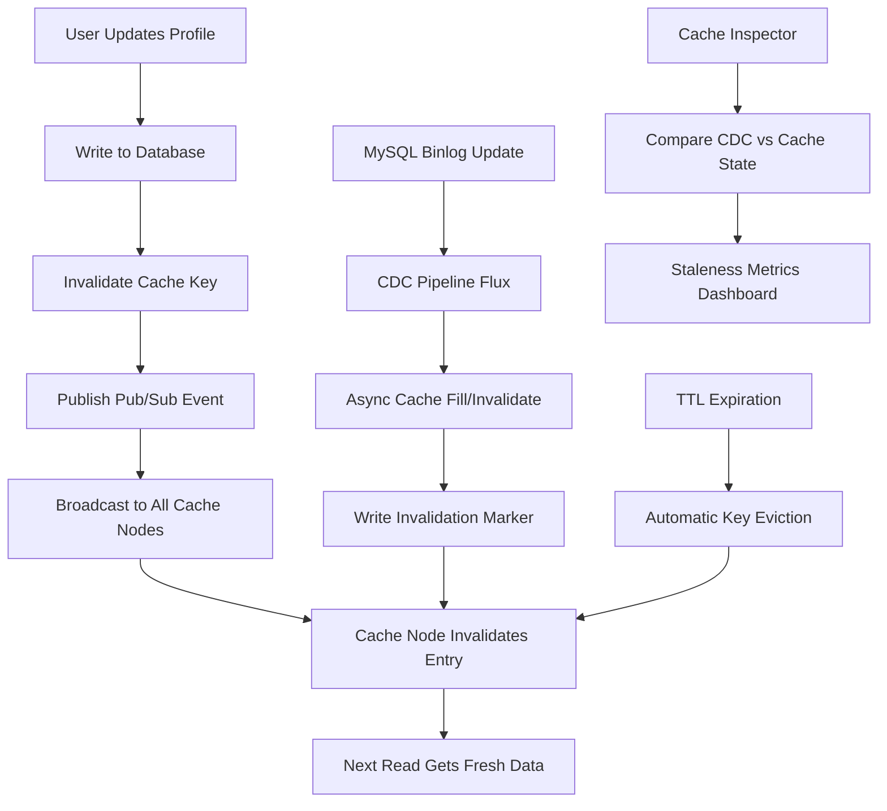

| Difficulty | Channel | Tags |
|---|---|---|
| beginner | backend | redis, memcached, cache-invalidation |

Imagine serving over 150 million cache reads per second during peak hours, only to realize your users are seeing stale driver locations, outdated trip statuses, and incorrect pricing from five minutes ago. That was the scale of the cache consistency problem Uber faced as its microservice fleet grew [1]. Every team managed their own Redis caches with duplicated invalidation logic, and the default 5-minute TTL meant stale data persisted far too long. The result? Developers had to explicitly call invalidation APIs for every write type, and cross-region failovers risked serving completely outdated state. This is the story of how Uber rebuilt its cache invalidation from the ground up — and what you can learn from their journey.

---

> ### Real-World Case — Uber
>
> Uber's microservices were each managing their own Redis caches with duplicated, inconsistent invalidation logic. Teams had to provision and maintain their own caches, and the default 5-minute TTL meant users saw stale data—driver locations, trip statuses, pricing—far too long after updates.
>
> | | |
> |---|---|
> | **Challenge** | Cache invalidation was decentralized and unreliable. TTL-only expiration was too slow for real-time needs. CDC (Change Data Capture) via MySQL binlog tailing provided sub-second updates but only eventual consistency, causing read-own-writes anomalies where users saw stale data after their own updates. Conditional updates (e.g., 'UPDATE ... WHERE ...') made it impossible to know which rows changed, so synchronous cache invalidation couldn't happen. |
> | **Solution** | Uber built CacheFront, an integrated Redis caching layer at the query engine level. They combined three invalidation mechanisms: (1) TTL expiration as a safety net, (2) Flux, a CDC service tailing MySQL binlogs for async invalidation within sub-second, and (3) a write-through protocol where the storage engine returns the set of affected row keys after each write transaction, allowing immediate synchronous cache invalidation via invalidation markers (instead of DEL). |
> | **Outcome** | 150 million+ reads per second during peak hours, 99.9%+ cache hit rate, sub-second cache invalidation across the fleet, cross-region failover with pre-warmed replicas, and automatic invalidation on every write type without requiring explicit developer calls. |
> | **Lesson** | No single invalidation strategy is sufficient at scale. TTL alone is too slow, CDC alone is eventual-consistency-only, and synchronous invalidation alone is fragile. The winning approach combines all three—TTL as a safety net, CDC for async coverage, and write-through for immediate consistency—with invalidation markers (not DEL) to prevent cache stampedes. |

---

## Hook — The Hidden Cost of a 5-Minute TTL

You set a TTL and move on. Five minutes seems reasonable — short enough that stale data clears quickly, long enough to get decent cache hit rates. But here is the thing: at Uber's scale, a 5-minute TTL meant that every profile update, every driver location ping, every pricing calculation could return data that was up to five minutes out of date. For a ride-hailing platform where pickup locations change by the second, that is an eternity. The real problem is not the TTL itself — it is what happens when you rely on TTL as your primary invalidation mechanism. Every cache miss triggers a database read, every stale read erodes user trust, and every team reinventing invalidation logic creates an unmanageable sprawl of inconsistent behavior.

## Problem — Why Cache Invalidation Is the Second Hardest Thing in Computer Science

Phil Karlton famously said there are only two hard things in computer science: cache invalidation and naming things. Most developers discover why during their first production incident involving stale data. The core challenge is deceptively simple: your database has the source of truth, your cache has a faster copy, and keeping them in sync requires solving a distributed consensus problem without the overhead of actual consensus. When a user updates their profile, you need to ensure that subsequent reads anywhere in your fleet see the new data — not a stale snapshot. The naive approach is to delete the cache key on every write and let the next read repopulate it. But this "cache-aside" pattern breaks down under concurrency: two requests can race, one reading stale data and repopulating the cache before the invalidation takes effect [2]. Suddenly you are serving stale data with fresh timestamps, making it nearly impossible to detect the inconsistency.

## Real-World Case — Uber's Cache Crisis at 150M Reads/Second

Uber's CacheFront system, their integrated cache layer built on top of Docstore and Redis, was serving over 150 million reads per second during peak hours [1]. Each microservice team managed their own Redis caches with duplicated, often inconsistent invalidation logic. The default 5-minute TTL became a crutch — teams cranked it up to improve hit rates, inadvertently making staleness worse. The inconsistency manifested in two specific ways: read-own-writes (you update a field and immediately read the old value) and read-own-inserts (negative caching returns "not found" for rows that now exist). Uber's engineering team realized the root cause was deeper than they expected. Even with a short TTL, the magnitude of staleness was theoretically unbounded — a row written a year ago could be cached today, and if the subsequent invalidation failed, that year-old data would be served for the entire TTL window again [1]. Fixing this required three simultaneous improvements: synchronous invalidation on every write path, a CDC pipeline that tailed MySQL binlogs for asynchronous fallback, and a Cache Inspector system to measure the actual staleness observed in production.

## Deep Dive — Redis vs Memcached: Beyond the Surface-Level Trade-offs

When choosing between Redis and Memcached for caching, most developers focus on speed. Memcached is marginally faster for simple key-value lookups — its multi-threaded architecture handles concurrent requests with lower overhead. Redis, on the other hand, uses a single-threaded event loop that excels at atomic operations but can become a bottleneck under high concurrency [3]. However, the real differentiator for cache invalidation is not throughput — it is the invalidation primitives each system provides. Redis supports pub/sub messaging, which allows one node to publish an invalidation event that all other nodes receive immediately [4]. This means when a user updates their profile, you can broadcast the invalidation across your entire fleet in milliseconds. Memcached offers no such mechanism. Invalidations must be managed externally or through TTL expiration alone. This makes Memcached simpler to reason about but fundamentally limited for distributed invalidation scenarios. Redis also supports Lua scripting for atomic cache operations, hash data structures for storing composite profile data under a single key, and persistence options that allow cache recovery after restarts without a full cold start [5].

## Workflow — The Write-Through Cache Invalidation Flow

Uber's solution combines three complementary invalidation mechanisms that work together to provide both strong consistency and high availability. The following diagram illustrates the complete flow: synchronous write-through invalidation for immediate consistency, an asynchronous CDC pipeline for fallback, and TTL expiration as the safety net. When a write request arrives, the query engine layer writes to the database first, then immediately invalidates the Redis cache key and publishes a pub/sub event. In parallel, Flux — Uber's CDC service — tails the MySQL binlog and performs asynchronous cache fills or invalidations as a backup. The Cache Inspector system continuously monitors cache staleness by comparing CDC events against current cache contents, feeding metrics back to the team [1]. This three-pronged approach means that even if the synchronous invalidation fails (due to a sluggish Redis node, for example), the CDC pipeline catches it within seconds, and the TTL provides the ultimate backstop.

## Code Example — Building a Self-Invalidating Cache Layer

The following Python implementation demonstrates the write-through pattern with Redis pub/sub for distributed invalidation. This is the pattern Uber's CacheFront adopted for point writes — immediate invalidation at write time, combined with pub/sub broadcast to all cache nodes.

## Lessons Learned — Cache Invalidation at Scale

Uber's journey from fragmented microservice caches to a unified CacheFront infrastructure offers several actionable lessons. First, never rely on TTL as your sole invalidation mechanism — it should be a safety net, not the primary strategy. Uber's Cache Inspector revealed that even with aggressive TTLs, staleness was theoretically unbounded due to invalidation failures [1]. Second, invest in observability for cache staleness before you need it. Uber built Cache Inspector specifically to measure the gap between database state and cache state, allowing them to quantify improvements and set data-driven TTL policies. Third, a three-layer invalidation strategy provides the best trade-off: synchronous write-through for immediate consistency, an async CDC pipeline for resilience against failures, and TTL as the ultimate backstop. Finally, automate invalidation at the infrastructure level — Uber's key insight was that requiring developers to explicitly call invalidation APIs for every write type was a scalability bottleneck. By automatically invalidating on every write type without explicit developer calls, they eliminated an entire class of consistency bugs [1].

---

## Three-Layer Cache Invalidation Architecture

<strong>Original Interview Question</strong>

**Q:** You're building a user profile service that caches frequently accessed profiles. How would you implement cache invalidation when a user updates their profile, and what trade-offs would you consider between Redis and Memcached?

**A:** Implement write-through caching with TTL-based expiration. On profile update, invalidate the cache by deleting the key and writing new data to both the database and cache. Redis offers pub/sub for automatic distributed invalidation, while Memcached requires manual coordination across nodes.

## Conclusion

Cache invalidation is not just about choosing between Redis and Memcached, or setting the right TTL. It is about building a system that can survive failures at every layer — when the invalidation message drops, when the Redis node is sluggish, when the CDC pipeline restarts. Uber's CacheFront journey shows that the path to 99.9%+ cache hit rates with strong consistency requires three layers of defense: synchronous invalidation at write time, an asynchronous CDC pipeline for resilience, and TTL as the ultimate safety net. Start your cache invalidation strategy by assuming every individual mechanism will fail. Build redundancy at each layer. And above all, measure your actual staleness — because what you cannot see will eventually wake you up at 3 AM.

---

## References

1. [How Uber Serves over 150 Million Reads per Second from Integrated Cache](https://www.uber.com/us/en/blog/how-uber-serves-over-150-million-reads/) — blog
2. [Cache (computing) — Wikipedia](https://en.wikipedia.org/wiki/Cache_(computing)) — article
3. [Redis Documentation — Introduction to Redis](https://redis.io/docs/latest/develop/) — documentation
4. [Redis Pub/Sub Documentation](https://redis.io/docs/latest/develop/interact/pubsub/) — documentation
5. [Redis Persistence Documentation](https://redis.io/docs/latest/operate/oss_and_stack/management/persistence/) — documentation
6. [Memcached Wiki — Introduction](https://github.com/memcached/memcached/wiki/Introduction) — documentation
7. [AWS ElastiCache — What is ElastiCache](https://docs.aws.amazon.com/AmazonElastiCache/latest/red-ug/WhatIs.html) — documentation
8. [Cache stampede — Wikipedia](https://en.wikipedia.org/wiki/Cache_stampede) — article

---

**Author:** Satishkumar Dhule — [GitHub](https://github.com/satishkumar-dhule) · [LinkedIn](https://linkedin.com/in/satishkumar-dhule) · [Website](https://satishkumar-dhule.github.io)
