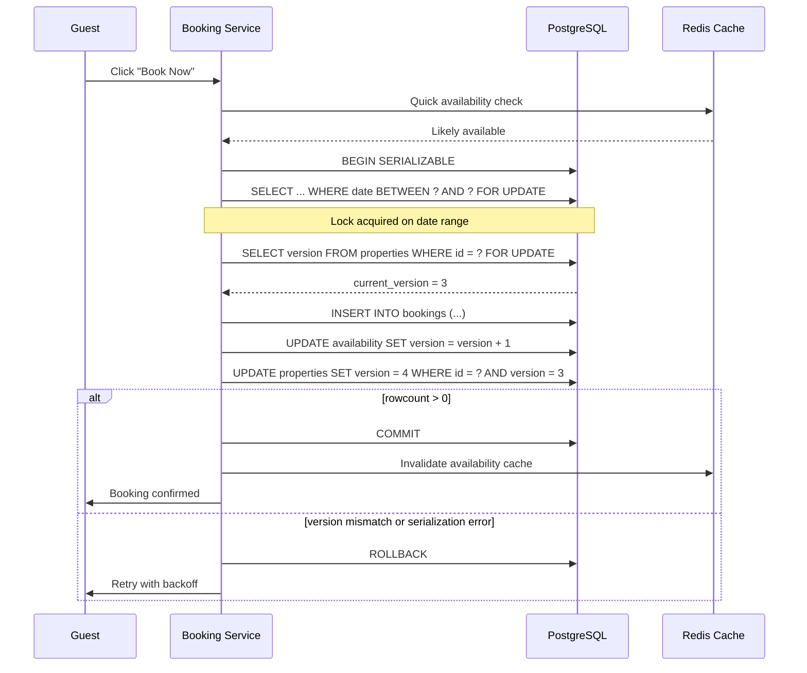

| Difficulty | Channel | Tags |
|---|---|---|
| intermediate | database | acid, isolation-levels, mvcc |

On Black Friday 2025, Shopify merchants hit a record $5.1 million in sales per minute [1]. Behind that staggering number, a quiet war was being fought: every second, thousands of shoppers were trying to buy the same products simultaneously. If a single inventory reservation slipped through the cracks, two customers could pay for the same item—triggering refunds, angry support tickets, and lost revenue. Shopify's weapon of choice was a database transaction pattern that most developers have heard of but few truly understand. What they discovered would change how they handle concurrency forever.

---

> ### Real-World Case — Shopify
>
> Shopify's oversell protection system—which reserves inventory during checkout to prevent two buyers from purchasing the same unit—had run on Redis for years. But the Redis cluster was separate from the inventory ledger in MySQL, creating a dual-write problem: payment could succeed while inventory wasn't claimed (or vice versa), causing oversells or lost sales. On Black Friday 2025, Shopify merchants hit a record $5.1M in sales per minute at peak, making this a critical bottleneck.
>
> | | |
> |---|---|
> | **Challenge** | Build an oversell protection system that could handle massive concurrent reservations (preventing two checkouts from claiming the same unit) with full ACID guarantees, using only MySQL, at a scale of millions of transactions per minute—while the previous Redis-based approach suffered from consistency bugs between the reservation cache and the inventory ledger. |
> | **Solution** | Replaced Redis with MySQL 8's `SELECT ... FOR UPDATE SKIP LOCKED`, using a bounded pool of rows (one row per sellable unit, capped at 1,000 per item/location). Composite primary keys reduced lock count per row. READ COMMITTED isolation eliminated gap locks that blocked replenishment. Consistent lock ordering across transactions prevented deadlocks. The real breakthrough came when they discovered the bottleneck wasn't queries at all—it was other checkout code holding database connections too long. They tagged SQL statements with business process identifiers, tracked connection hold times at the ProxySQL layer, and cleaned up the broader checkout path. |
> | **Outcome** | Cleaning up the checkout path removed 50% of reads and 33% of transactions from the primary database. During high-volume flash sales, writer CPU stayed under 50% and reader CPU under 16%. No more oversells, no more dual-write consistency bugs. The MySQL-based system hit all throughput targets during peak Black Friday traffic. |
> | **Lesson** | The bottleneck is rarely where you're looking. The team optimized locks and queries for weeks, but the real limit was connection usage in code they weren't even measuring. At scale, being a 'good neighbor' in the database—sustaining throughput without degrading database health for other subsystems—matters more than optimizing individual hot paths. Also: revisit old infrastructure decisions; what wasn't possible five years ago (MySQL for this workload) can be possible today with new features like SKIP LOCKED. |

---

## Hook — The $5.1M-Per-Minute Problem

Picture this: it is 2 AM on Black Friday. Your pager lights up. The on-call dashboard shows a spike in failed bookings. Customers are refreshing their carts, some have been charged, others have not—but nobody knows who actually got the item. The support queue is growing by the second. This is the nightmare of overselling, and it is far more common than most developers realize.

For years, Shopify ran their inventory reservation system on Redis, with the authoritative inventory ledger in MySQL [1]. This created a classic dual-write problem: payment could succeed while inventory was not claimed, or inventory could be reserved while payment failed. The two systems drifted apart under load, and on high-traffic days, the drift became a chasm. The result? Oversells. Lost sales. Angry customers.

Shopify's engineers knew that fixing this meant rethinking their approach to transactions entirely. They needed a system where the inventory reservation and the order confirmation were atomic—either both happened, or neither did. That meant moving away from the Redis cache-and-sync pattern and into the world of database-level transaction guarantees.

## Problem — Why Double Bookings Are So Hard to Prevent

At first glance, preventing double bookings sounds simple: check if the item is available, then reserve it. But here is where it gets tricky. Between the check and the reserve, another request can sneak in. This is the classic race condition—a read-write conflict that no amount of application-level logic can solve without database help.

Consider an Airbnb-style booking system. Two guests search for the same property. Both see it is available. Both click "Book Now" within milliseconds of each other. Without proper transaction handling, both succeed, and the property is double-booked. The platform now faces a mess: cancel one booking (angering a guest), offer compensation, or scramble to find alternative accommodations.

The core challenge is maintaining consistency under concurrency. In database terms, this requires strict isolation—the "I" in ACID [5]. Many developers assume that setting a UNIQUE constraint or using a simple database transaction will suffice. But the default isolation level in most databases (READ COMMITTED) allows phantom reads: a second transaction can see rows that were inserted by a concurrent transaction that has not even committed yet [2]. This means that two concurrent bookings can each see "available" inventory and proceed to book the same slot.

Moreover, the stakes scale with your traffic. A booking platform handling 100 requests per second might see a conflict once a day. A platform hitting 10,000 requests per second might see dozens of conflicts per second. Without proper isolation, each conflict is a potential customer service nightmare.

## Real-World Case — Shopify's Journey From Redis to Database-Level Guarantees

Shopify's oversell protection system had run on Redis for years. The approach was straightforward: reserve inventory in Redis during checkout, then reconcile with the MySQL inventory ledger after payment. In theory, this provided fast, in-memory checks with eventual consistency. In practice, it created a dual-write nightmare [1].

Imagine a shopper adding a limited-edition sneaker to their cart. Redis reserves it instantly. But before MySQL can confirm the inventory deduction, the Redis reservation expires due to a network hiccup. Another shopper now sees the sneaker as available. Both complete checkout. Two orders, one sneaker.

The fix required a fundamental architectural shift: move the reservation logic entirely into MySQL, using SERIALIZABLE transaction isolation and row-level locks. No more dual-write. No more drift between cache and ledger. Every reservation was now a database transaction, and every transaction was fully atomic.

The results were dramatic. By cleaning up the checkout path, Shopify removed 50% of reads and 33% of transactions from the primary database [1]. During peak Black Friday traffic, writer CPU stayed under 50% and reader CPU under 16%. No more oversells. No more dual-write consistency bugs. The MySQL-based system hit every throughput target during the highest-traffic day of the year.

This success story challenges a common assumption: that high-throughput systems must sacrifice consistency for performance. Shopify proved otherwise by choosing the right isolation level and locking strategy.

## Deep Dive — SERIALIZABLE Isolation, MVCC, and Row-Level Locks

To understand how Shopify solved this, you need to understand three database concepts: isolation levels, MVCC, and row-level locking.

**Transaction Isolation Levels**

PostgreSQL offers four isolation levels: READ UNCOMMITTED, READ COMMITTED, REPEATABLE READ, and SERIALIZABLE [2]. Most databases default to READ COMMITTED, which prevents dirty reads but allows non-repeatable reads and phantom reads. For a booking system, phantom reads are the enemy—a transaction that checks availability might miss a booking made by a concurrent transaction.

SERIALIZABLE is the strictest level. It guarantees that concurrent transactions execute as if they ran one after another, in some order. PostgreSQL implements this through Serializable Snapshot Isolation (SSI), which detects read-write conflicts between concurrent transactions and aborts one when a conflict is detected [2].

**MVCC — Multiversion Concurrency Control**

MVCC is the engine that makes isolation efficient [3]. Instead of locking every row a transaction reads, MVCC creates snapshots of the database state at the start of each transaction [6]. Reading from a snapshot is lock-free and fast. Writes are tracked using visibility rules based on transaction IDs.

Here is the key insight: MVCC handles reads efficiently but does not automatically prevent write conflicts. Two transactions can both read the same row (seeing "available = true") and both proceed to write ("reserved = true"). The first write succeeds; the second either overwrites the first or creates duplicate data. This is why read operations are not enough—you need locks or version checks on writes.

**Row-Level Locks with SELECT FOR UPDATE**

This is where SELECT FOR UPDATE comes in [4]. When a transaction executes SELECT FOR UPDATE on a row, it places an exclusive lock that blocks other transactions from locking or updating that row until the first transaction commits or rolls back. This transforms a read-check-then-write sequence into an atomic operation.

However, there is a trade-off. Locks introduce contention. When multiple transactions compete for the same row, they queue up, increasing latency. This is especially problematic for "hot" properties—popular listings that get hundreds of booking requests per minute.

**Optimistic vs. Pessimistic Locking**

Pessimistic locking (SELECT FOR UPDATE) assumes conflict is likely and locks aggressively. Optimistic locking assumes conflict is rare and detects it after the fact using version columns [7]. Neither is universally superior—the right choice depends on your contention profile.

For low-contention properties (most listings), optimistic locking with a version column is efficient and simple. For high-contention properties (popular listings), pessimistic locking prevents wasted retries. A hybrid approach is often best: use optimistic locking by default, fall back to pessimistic locking when contention spikes.

## Workflow — The Atomic Booking Transaction Flow

Here is how a booking transaction flows from "Book Now" click to confirmation:

The lifecycle follows these steps:
1. **Request arrives** — The booking service receives the guest's request with property ID, dates, and guest info.
2. **Cache check** — A quick Redis read checks cached availability. This is a fast path that can reject obviously unavailable dates without touching the database.
3. **Begin SERIALIZABLE transaction** — The service opens a PostgreSQL transaction with SERIALIZABLE isolation.
4. **Lock date rows** — `SELECT ... FOR UPDATE` locks the specific date range for the property. Any concurrent booking for overlapping dates blocks here.
5. **Verify availability** — After acquiring locks, the service re-reads availability (phantom reads are now impossible under the lock).
6. **Version check** — The property's version column is read under lock for optimistic concurrency control.
7. **Insert booking + update availability** — Both writes happen within the same transaction.
8. **Commit or rollback** — If successful, commit releases all locks and makes the booking visible. If a conflict is detected (SERIALIZABLE failure or version mismatch), rollback and retry with exponential backoff.
9. **Invalidate cache** — On successful commit, invalidate the Redis cache entry so subsequent reads see updated availability.
10. **Respond** — Return success or failure to the guest.

The diagram below illustrates this flow with the key decision points and retry paths.

## Code Example — PostgreSQL Transaction With Retry Logic

The Python function below implements the atomic booking transaction with SERIALIZABLE isolation, row-level locking, optimistic concurrency control via version columns, and exponential backoff retry.

## Lessons Learned — Key Takeaways for Your Booking System

**1. Start with database guarantees, add caching later.** Shopify proved that a well-designed MySQL transaction can handle Black Friday traffic without a Redis intermediary [1]. Many teams reach for caching prematurely, introducing dual-write problems before they have even approached the database's throughput limits.

**2. SERIALIZABLE is not as expensive as you think.** PostgreSQL's SSI implementation detects conflicts at commit time rather than locking every read operation [2]. Under moderate contention, the overhead is minimal. Under high contention, the retry cost is offset by the guarantee that no double booking occurs.

**3. Use version columns for optimistic concurrency.** A simple `UPDATE ... WHERE version = :old_version AND id = :id` with a `rowcount` check is a reliable conflict detector that avoids long-held row locks. Combine this with SERIALIZABLE isolation for a belt-and-suspenders approach.

**4. Watch out for hot properties.** A single popular listing can become a lock contention hotspot. Consider sharding availability by date range, or using a dedicated queue per property to serialize booking requests before they hit the database.

**5. Monitor lock contention and implement circuit breakers.** Tools like `pg_locks` and `pg_stat_activity` in PostgreSQL let you observe blocked transactions in real time. When lock wait times exceed a threshold, circuit breakers can reject new booking requests for that property gracefully rather than queuing them indefinitely.

**6. The dual-write problem is real and dangerous.** Any time two storage systems must agree on state, you risk inconsistency. Aim for a single source of truth—if possible, let your database be that source, and treat caches as ephemeral accelerators, not authoritative stores.

---

## Atomic Booking Transaction Flow

<strong>Original Interview Question</strong>

**Q:** You're building a booking system for Airbnb where multiple users can reserve the same property simultaneously. How would you design the transaction handling to prevent double bookings while maintaining high availability?

**A:** Use SERIALIZABLE isolation with optimistic concurrency control. Implement row-level locks on property availability tables, use MVCC snapshot reads for checking availability, and apply application-level validation to ensure atomic booking operations.

## Conclusion

The next time you design a booking system—for properties, concert tickets, limited-edition sneakers, or anything where two customers cannot have the same thing—remember Shopify's lesson. Start with the database. Give it the respect it deserves. SERIALIZABLE isolation, row-level locks, and optimistic concurrency are not academic curiosities; they are the tools that keep $5.1M per minute flowing without a single oversell. The fix does not require a PhD in database internals. It requires understanding that consistency is not optional—and that your database, configured correctly, is your strongest ally.

---

## References

1. [Scaling Inventory Reservations at Shopify](https://shopify.engineering/scaling-inventory-reservations) — blog
2. [PostgreSQL Documentation: Transaction Isolation](https://www.postgresql.org/docs/current/transaction-iso.html) — documentation
3. [Multiversion Concurrency Control — Wikipedia](https://en.wikipedia.org/wiki/Multiversion_concurrency_control) — documentation
4. [PostgreSQL Documentation: Explicit Locking](https://www.postgresql.org/docs/current/explicit-locking.html) — documentation
5. [ACID — Wikipedia](https://en.wikipedia.org/wiki/ACID) — documentation
6. [PostgreSQL Documentation: Introduction to MVCC](https://www.postgresql.org/docs/current/mvcc-intro.html) — documentation
7. [AWS RDS Best Practices for PostgreSQL](https://docs.aws.amazon.com/AmazonRDS/latest/UserGuide/CHAP_BestPractices.html) — documentation
8. [Isolation (Database Systems) — Wikipedia](https://en.wikipedia.org/wiki/Isolation_(database_systems)) — documentation

---

**Author:** Satishkumar Dhule — [GitHub](https://github.com/satishkumar-dhule) · [LinkedIn](https://linkedin.com/in/satishkumar-dhule) · [Website](https://satishkumar-dhule.github.io)
