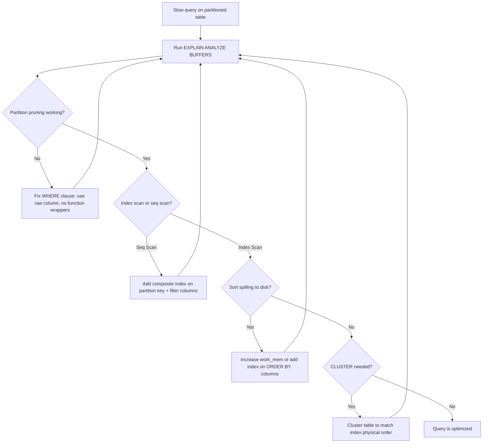

| Difficulty | Channel | Tags |
|---|---|---|
| intermediate | database | explain, query-plan, partitioning |

Imagine your CEO just tweeted about a new feature, traffic surges, and your API starts buckling under the weight of 30-second queries. That was CoinGecko's reality after 8 years of accumulating hourly crypto price data into a single 1TB+ PostgreSQL table [1]. IOPS alerts fired daily, replica lag threatened their SLO, and scaling IOPS to 24K only bought them weeks. Their story is a masterclass in what happens when you treat partitioning as a set-and-forget solution — and what you must check in your EXPLAIN plans before it is too late.

---

> ### Real-World Case — CoinGecko
>
> After 8 years of operation, CoinGecko's 1TB+ PostgreSQL table storing hourly crypto price data became cripplingly slow. Queries averaged 30+ seconds, IOPS alerts fired daily, and replica lag threatened their SLO/SLA commitments. Their short-term fix of scaling IOPS to 24K kept getting breached.
>
> | | |
> |---|---|
> | **Challenge** | A 1TB+ table with 8 years of hourly crypto price data that was so slow even copying 1 day of data took 15+ minutes. Adding indexes wasn't feasible because queries used JSONB columns with currency-dependent keys. They needed to partition without downtime while the table was under heavy production load. |
> | **Solution** | Implemented monthly range partitioning by timestamp and used PostgreSQL Foreign Data Wrappers to read from a pre-warmed replica to avoid cold-cache issues during migration. They created composite primary keys including the partition key. Critically, they discovered that after partitioning, queries without proper date bounds (e.g., `created_at > ?` without upper limit, or missing lower bound) scanned ALL partitions — performing worse than the unpartitioned table. They fixed these by adding proper date range bounds and removing empty future partitions. |
> | **Outcome** | p99 response time dropped 86% (4.13s → 578ms), IOPS reduced 20% across all replicas (multiplied cost savings), replica lag eliminated, and the API became resilient to request spikes. However, they learned the hard way that partition pruning requires explicit date bounds — a query that worked fine on the unpartitioned table became a disaster after partitioning. |
> | **Lesson** | Partitioning is not a universal speedup — it can make queries slower if the WHERE clause doesn't include proper bounds on the partition key. A query with `created_at > ?` (missing upper bound) will scan all empty future partitions. Every query on a partitioned table MUST include explicit partition key boundaries for partition pruning to work. Always verify with EXPLAIN ANALYZE that only relevant partitions are scanned. |

---

## Hook — The Database That Couldn't Say No

Every high-growth PostgreSQL database starts innocent enough. A few million rows here, a well-tuned index there. Then suddenly, you are staring at 100 million rows partitioned by date, and a query with a perfectly reasonable date filter still takes minutes. Sound familiar? This is where most developers reach for the same lever: throw more IOPS at it. CoinGecko did exactly that, cranking their provisioned IOPS to 24K. But the alerts kept coming, the replica lag kept growing, and the query times kept creeping up [1]. The real fix wasn't more hardware — it was understanding what their EXPLAIN plans were screaming at them all along.

## Problem — The Silent Scourge of Partitioned Tables

Partitioning is supposed to be the magic bullet for large tables. Divide and conquer, right? The reality is more nuanced. A partitioned table introduces failure modes that do not exist in flat tables. Specifically, three silent killers await unsuspecting teams: **partition pruning failures** where the query planner ignores your beautiful partition scheme and scans every child table; **index misuse** where sequential scans take over because your index does not align with the partition key; and **hidden expensive operations** like sort or hash aggregates that balloon in cost across dozens of partitions. Many developers discover too late that partitioning without query discipline is actually worse than no partitioning at all.

## Real-World Case — CoinGecko: The 1TB Wake-Up Call

CoinGecko's engineering team ran a PostgreSQL table storing hourly cryptocurrency prices that had grown past 1TB over 8 years [1]. Average query time: 30+ seconds. Their short-term fix — scaling IOPS to 24K — kept getting breached. Alerts fired daily. The replica lag threatened their SLO commitments. After investigating, they chose range partitioning by month and executed a meticulous migration with dry runs, foreign data wrappers, and `pg_prewarm` to warm caches. The results were staggering: **p99 response time dropped 86%** (4.13s → 578ms), **IOPS dropped 20%** (with multiplied cost savings across replicas), and replica lag vanished entirely. But here is the plot twist: a query that worked perfectly on the unpartitioned table became a disaster after partitioning — because it lacked explicit date bounds, causing scans across *all* partitions [1]. This is the hidden danger that every developer needs to understand.

## Deep Dive — Reading the EXPLAIN Plan Like a Detective

When a query on a partitioned table is slow, the EXPLAIN plan is your forensic evidence. Here is what to look for, and in what order:

**1. Partition Pruning — Is it actually working?**
Look for `-> Seq Scan on ` entries. If you see *every* partition listed instead of only the relevant ones, pruning failed. The most common cause? Your WHERE clause on the partition key uses a function call like `WHERE date_trunc('month', event_date) = '2024-01-01'` instead of a raw column comparison. PostgreSQL cannot prune through function wrappers.

**2. Index Utilization — Sequential scan or index scan?**
A `Seq Scan` on a partition does not automatically mean disaster — but when it happens across 12 monthly partitions for a query that should touch only 2, you have a problem. Check for bitmap index scans that combine multiple partitions inefficiently.

**3. Expensive Sorts and Hash Aggregates**
Sort operations are especially costly in partitioned setups. PostgreSQL must sort data within each partition and then merge-sort across partitions. Look for `Sort Method: external merge Disk:` in the plan — that means your `work_mem` is too low and the sort spilled to disk.

**The Counterintuitive Truth**: A query that performs an index scan on every partition can be *slower* than a sequential scan on a single large table. This is because each partition access incurs overhead — opening the relation, checking visibility, and potentially reading multiple buffer pool pages. If your filter does not prune partitions effectively, you multiply this overhead across N partitions [2][3].

## Workflow — From Slow Query to Sub-Second Response

Here is the battle-tested workflow for diagnosing and fixing slow queries on partitioned tables. Each step builds on the previous one:



**Step-by-step**:
1. Run `EXPLAIN (ANALYZE, BUFFERS)` to capture actual execution stats
2. Check the partition pruning diagnostic: count how many partitions appear in the plan
3. If pruning failed, rewrite the WHERE clause to compare against the raw partition column
4. If pruning works but seq scans dominate, add a composite index on `(partition_key, filtered_column)`
5. Re-run EXPLAIN to verify the index is used
6. Check for sort operations — if they spill to disk, either increase `work_mem` or add a covering index for the ORDER BY clause
7. Consider `CLUSTER` to physically reorder rows to match your index, improving locality of reference [4]

## Code Example — The Diagnostic Toolkit

Here is the exact set of queries you need in your performance toolkit. Start with diagnostics, then apply fixes incrementally.

```sql
-- Step 1: Diagnose partition pruning and index usage
EXPLAIN (ANALYZE, BUFFERS, TIMING) 
SELECT * FROM events 
WHERE event_date BETWEEN '2024-01-01' AND '2024-01-31'
  AND status = 'completed'
ORDER BY event_date;

-- What to look for:
-- "Append" with only 1-2 child tables = partition pruning working
-- "Seq Scan on events_202401" = full scan on that partition
-- "Sort Method: external merge Disk:" = sort spilled to disk

-- Step 2: Add a composite index matching the WHERE clause
-- Order matters: partition key first, then filtered columns
CREATE INDEX CONCURRENTLY idx_events_date_status 
ON events (event_date, status);

-- Step 3: Re-order table rows to match index (improves locality)
-- WARNING: This locks the table; schedule during maintenance
CLUSTER events USING idx_events_date_status;

-- Step 4: Verify the improvement
EXPLAIN (ANALYZE, BUFFERS, TIMING) 
SELECT * FROM events 
WHERE event_date BETWEEN '2024-01-01' AND '2024-01-31'
  AND status = 'completed'
ORDER BY event_date;
-- Expected: Index Only Scan, no sort, minimal buffers

-- Step 5: Analyze for the query planner
ANALYZE events;
```

**Key design decisions explained**: The composite index places `event_date` first because that is the partition key and the most selective filter. Adding `status` as the second column enables index-only scans when both filters are present. The `CONCURRENTLY` option builds the index without blocking writes — critical for production systems. CLUSTER physically rewrites the table in index order, but it is a one-time operation requiring a table lock, so plan it during low-traffic windows. After CLUSTER, the `ANALYZE` command updates statistics so the planner accurately estimates row counts per partition [5].

## Lessons Learned — The Hidden Tax of Partitions

CoinGecko's journey [1] and this technical deep dive converge on several hard-earned truths:

**1. Partition pruning is not automatic — you must prove it works.**
A query without explicit date bounds on the partition key will scan every partition. CoinGecko discovered this when a query using `created_at > ?` (without an upper bound) scanned all future empty partitions, causing a regression that nearly triggered a rollback [1].

**2. Composite indexes on partitioned tables follow different rules.**
The partition key must be the leading column of any index you expect to be used for partition-wise operations. A non-aligned index that covers only filter columns will still require scanning every partition to apply the filter [6].

**3. CLUSTER is powerful but expensive.**
It physically reorders data to match an index, dramatically improving range scan performance — but it locks the table and requires downtime. Use `pg_repack` as a zero-downtime alternative [7].

**4. Test with production-sized data in a dry run.**
CoinGecko spun up an identical database for testing and discovered that prewarming partitions took 3 hours vs. 10 hours for the original table — critical data that influenced their go-live plan [1].

**5. Warm up everything — primary AND replicas.**
CoinGecko nearly missed warming their replicas, which would have caused a performance cliff when the read traffic shifted to cold caches [1].

**What to do tomorrow**: Add an `EXPLAIN (ANALYZE, BUFFERS)` step to your deployment pipeline for any query hitting partitioned tables. Count the partitions scanned. If the number exceeds what your date range should touch, flag it as a deployment blocker.

---

## Query Optimization Decision Flow for Partitioned Tables


<details>
<summary><strong>Original Interview Question</strong></summary>

**Q:** You have a PostgreSQL table with 100M rows partitioned by date. A query filtering on a specific date range is still slow. What would you check in the EXPLAIN plan and how would you optimize it?

**A:** Check partition pruning effectiveness, index utilization patterns, and expensive sort operations. Create composite indexes on (date, filtered_columns) and evaluate clustering strategies for optimal data access.

</details>

## Conclusion

Partitioning is not a silver bullet — it is a scalpel that requires precision. CoinGecko's 86% response time improvement proves partitioning works spectacularly when done right. But the regression they nearly rolled back proves it can fail just as spectacularly when a single query lacks explicit date bounds. The lesson is simple: verify partition pruning on every query, check every EXPLAIN plan before deploying, and never assume a query that worked on a flat table will work on a partitioned one. Your future self — and your SLO dashboard — will thank you.

---

## References

1. [Scaling PostgreSQL Performance with Table Partitioning](https://amree.dev/2025/06/13/scaling-postgresql-performance-with-table-partitioning/) — blog
2. [PostgreSQL Documentation: Partition Pruning](https://www.postgresql.org/docs/current/ddl-partitioning.html#DDL-PARTITION-PRUNING) — documentation
3. [PostgreSQL Documentation: Using EXPLAIN](https://www.postgresql.org/docs/current/using-explain.html) — documentation
4. [PostgreSQL Documentation: CLUSTER](https://www.postgresql.org/docs/current/sql-cluster.html) — documentation
5. [PostgreSQL Documentation: CREATE INDEX](https://www.postgresql.org/docs/current/sql-createindex.html) — documentation
6. [PostgreSQL Documentation: Indexes on Partitioned Tables](https://www.postgresql.org/docs/current/ddl-partitioning.html#DDL-PARTITIONING-DECLARATIVE-INDEXES) — documentation
7. [Wikipedia: Database Partitioning](https://en.wikipedia.org/wiki/Partition_(database)) — documentation
8. [PostgreSQL Documentation: Routine Database Maintenance Tasks](https://www.postgresql.org/docs/current/routine-vacuuming.html) — documentation

---

**Author:** Satishkumar Dhule — [GitHub](https://github.com/satishkumar-dhule) · [LinkedIn](https://linkedin.com/in/satishkumar-dhule) · [Website](https://satishkumar-dhule.github.io)
