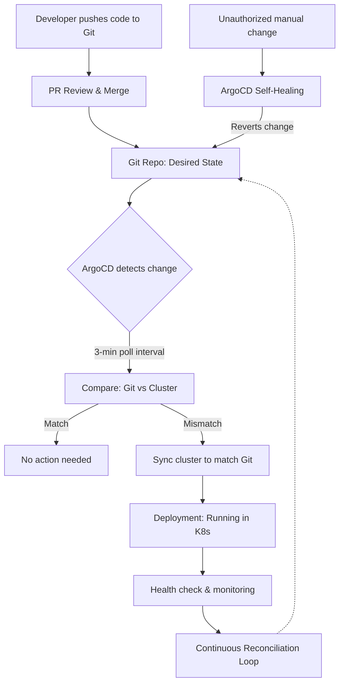

| Difficulty | Channel | Tags |
|---|---|---|
| beginner | devops | argocd, flux, declarative |

Adobe's internal platform called Moonbeam was running 10,400 build pipelines. It was brittle, slow, and nobody trusted it anymore. Hundreds of teams, thousands of services, and configuration drift had turned deployment into a daily nightmare [1]. What happened next changed how one of the world's largest software companies ships code — and it might just change how you think about GitOps too.

---

> ### Real-World Case — Adobe
>
> Adobe ran 10,400 build pipelines on a legacy internal platform called Moonbeam (Container-as-a-Service) that had become brittle, slow, and impossible to scale securely. With hundreds of teams and thousands of services, configuration drift, queue bottlenecks, and manual deployment pain were the norm — and nobody trusted the pipeline anymore.
>
> | | |
> |---|---|
> | **Challenge** | Migrate 10,400 CI/CD pipelines across hundreds of teams from a fragile legacy CaaS platform to a modern GitOps-based delivery system — without disrupting 3,000+ developers shipping production software. The legacy platform had accumulated years of technical debt: orphaned services, duplicated pipelines, and tribal knowledge as the only 'deployment docs'. |
> | **Solution** | Adobe built 'Flex,' a GitOps delivery platform on Kubernetes using Argo CD, Argo Workflows, Argo Events, and Argo Rollouts — integrated with service registration, secrets management, change workflows, and deployment guardrails. They created a Node.js/React migration interface backed by Argo Workflows so teams could self-serve their migration with start/pause/continue/resume controls. Every environment now reconciles against Git as the single source of truth. |
> | **Outcome** | 10,400 pipelines migrated or decommissioned. ~80% of previously registered services turned out to be stale/abandoned — their retirement alone drove substantial cost savings. 6,000+ services now run across 50,000 environments (19,000 production) supporting 3,300+ production services. GitOps eliminated deployment queue times, gave teams real-time visibility and sub-minute rollbacks, and gave Adobe end-to-end auditability through Git-native controls. |
> | **Lesson** | The biggest 'plot twist' was that the migration surfaced thousands of abandoned services — roughly 80% of what they thought they were running was dead weight. The second lesson: mandates create urgency but value drives adoption. Teams migrated fastest when they saw GitOps eliminate their real pain (drift, slow rollbacks, no audit trail), not because of a deadline. |

---

## Hook — The pipeline nobody trusted

Imagine you are on call at 3 AM. A production incident is unfolding, and you need to roll back a deployment. But there is no single source of truth. Some changes were made with `kubectl`, others through a Jenkins job that someone forgot to document, and a few more via a hotfix that 'we will clean up later.' Sound familiar? This is the reality of imperative infrastructure management — and it is exactly the world Adobe found itself trapped in before they migrated 10,400 pipelines off Moonbeam [1]. The stakes? Configuration drift, queue bottlenecks, and deployments that took hours instead of seconds.

## Problem — Configuration drift is eating your deployment sanity

Every time a developer runs `kubectl apply` directly against a cluster, they create a tiny crack in the foundation. Do it a few hundred times across dozens of services, and those cracks become canyons. This is configuration drift — when the actual state of your infrastructure silently diverges from what your configuration files say it should be. Suddenly, QA environments behave differently from production, rollbacks become guesswork, and your audit trail is whoever remembers what they typed into a terminal three weeks ago [3]. Many developers think a 'fast pipeline' means one that deploys quickly. The real bottleneck is trust — when nobody knows what is actually running in production, every deploy feels like rolling dice.

## Real-World Case — Adobe's 80% cleanup surprise

When Adobe decided to tackle this problem head-on, they uncovered something shocking. As they began migrating their 10,400 build pipelines off the legacy Moonbeam platform, engineers discovered that roughly 80% of registered services were stale or completely abandoned [1]. Someone had spun up a service for a hackathon two years ago, it never got cleaned up, and Adobe had been paying for its infrastructure ever since. Six thousand services now run across 50,000 environments — 19,000 of them production — supporting over 3,300 production services. By adopting GitOps with ArgoCD, Adobe eliminated deployment queue times entirely. Teams gained sub-minute rollbacks, real-time visibility into deployment status, and end-to-end auditability through Git-native controls [1]. Here is the plot twist: the biggest win was not the performance improvement. It was discovering that most of their pipelines did not need to exist at all.

## Deep Dive — Declarative vs. Imperative: The philosophical divide

The difference between declarative and imperative infrastructure is not just technical — it is cultural. With imperative approaches (`kubectl run`, `kubectl apply`, shell scripts), you are telling Kubernetes exactly what steps to take, in order, right now. The system does what you say, but it does not remember what you wanted. With declarative approaches (YAML manifests, Helm charts, Kustomize overlays), you define the desired state and the system figures out how to get there — and stay there [4]. This distinction matters because production systems change. Containers crash. Nodes fail. Someone on another team runs `kubectl delete deployment` by accident. An imperative pipeline only reacts when you tell it to. A declarative GitOps system like ArgoCD continuously reconciles, detecting drift and correcting it automatically [2]. Think of it like the difference between giving someone turn-by-turn directions (imperative) versus giving them a destination and trusting them to navigate (declarative).

## Workflow — From commit to cluster: the GitOps loop

Here is how a production deployment flows through GitOps once it is set up properly. A developer opens a pull request against the Git repository containing Kubernetes manifests. Teammates review the change, catching issues before they ever touch a cluster. Once merged, ArgoCD detects the change in the repository — typically within a configurable poll interval of three minutes. ArgoCD compares the desired state (what is in Git) against the live state (what is running in Kubernetes). If they differ, ArgoCD synchronizes the cluster to match Git. If someone makes an unauthorized change directly on the cluster, ArgoCD's self-healing mode kicks in and reverts it automatically [5]. The diagram below shows this reconciliation loop in action.

## Code Example — Declaring your first ArgoCD Application

The core of any GitOps setup is the ArgoCD Application Custom Resource Definition (CRD). This YAML tells ArgoCD what to watch, where to sync, and how to behave when something goes wrong.

## Lessons Learned — What 10,400 pipelines taught Adobe (and you)

Three things stand out from Adobe's migration journey that apply to teams of any size. First, before you optimize anything, audit what you have. Adobe discovered 80% of their registered services were dead weight. Your team probably has similar skeletons in the closet. Second, GitOps is not primarily about speed — it is about trust. The sub-minute rollbacks and real-time visibility are great, but the real win is that developers stopped fearing deployments. Third, declarative infrastructure is not a set-it-and-forget-it solution. You still need monitoring, alerting, and incident response. What GitOps eliminates is the 'how did this happen?' question — because every change is in Git, and every drift is detected within minutes. After debugging deployments across dozens of teams, the pattern that works is simple: commit, review, sync, reconcile, repeat [8].

---

## GitOps Reconciliation Loop with ArgoCD

<strong>Original Interview Question</strong>

**Q:** You're setting up GitOps for a microservices deployment. How would you configure ArgoCD to automatically sync changes from your Git repository to Kubernetes, and what's the difference between declarative and imperative approaches in this context?

**A:** I'd configure ArgoCD by setting up a Git repository containing Kubernetes manifests or Helm charts, creating an Application CRD that points to the Git repository, enabling auto-sync with a health check interval of 3 minutes, and implementing self-healing to automatically revert any manual changes. The declarative approach involves defining the desired state in Git through YAML manifests, Helm charts, or Kustomize configurations, where ArgoCD continuously reconciles the actual state with the desired state. In contrast, the imperative approach uses kubectl commands to make direct changes to the cluster, bypassing the Git repository as the single source of truth.

## Conclusion

Adobe's story proves something counterintuitive: sometimes the best way to make your infrastructure faster is to stop running so many pipelines. GitOps forces you to confront what you actually need versus what you are maintaining out of habit. The declarative approach does not just prevent drift — it exposes the 80% of your services that nobody is using. Start tomorrow by auditing your current deployments. Count how many are stale. Then set up one ArgoCD Application pointing at a Git repo. The moment you revert a bad deploy with `git revert` instead of scrambling for old YAML files, you will understand why Adobe never looked back.

---

## References

1. [Adobe Cloud Native Case Study](https://www.cncf.io/case-studies/adobe/) — article
2. [ArgoCD Documentation](https://argo-cd.readthedocs.io/en/stable/) — documentation
3. [Kubernetes Declarative Management](https://kubernetes.io/docs/concepts/overview/working-with-objects/object-management/) — documentation
4. [OpenGitOps Principles](https://opengitops.dev/) — documentation
5. [ArgoCD Auto-Sync and Self-Healing](https://argo-cd.readthedocs.io/en/stable/user-guide/auto_sync/) — documentation
6. [Helm Documentation](https://helm.sh/docs/) — documentation
7. [Kustomize Official Site](https://kustomize.io/) — documentation
8. [What is GitOps? A DigitalOcean Tutorial](https://www.digitalocean.com/community/tutorials/what-is-gitops) — article

---

**Author:** Satishkumar Dhule — [GitHub](https://github.com/satishkumar-dhule) · [LinkedIn](https://linkedin.com/in/satishkumar-dhule) · [Website](https://satishkumar-dhule.github.io)
