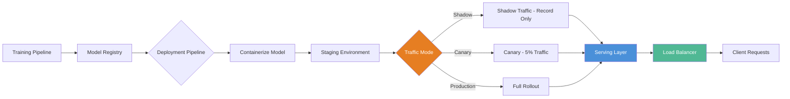

| Difficulty | Channel | Tags |
|---|---|---|
| beginner | devops | mlops, deployment |

Netflix's ML platform serves 250M+ users with personalized recommendations, fraud detection, search ranking, and more. As ML usage exploded, they hit a wall: standard API gateways like AWS API Gateway simply could not handle the complexity of routing inference requests. Managing A/B tests, shadow traffic, gradual rollouts, and hundreds of model types across shared infrastructure pushed their architecture to the breaking point [1]. This is the story of why deployment and serving are not the same thing — and why confusing them will cost you.

---

> ### Real-World Case — Netflix
>
> Netflix's ML platform serves 250M+ users with personalized recommendations, fraud detection, search ranking and more. As ML usage exploded, they found that standard API gateways like AWS API Gateway couldn't handle the complexity of routing inference requests — managing A/B tests, shadow traffic, gradual rollouts, and hundreds of model types simultaneously across shared infrastructure.
>
> | | |
> |---|---|
> | **Challenge** | Standard API gateways handle generic HTTP routing but weren't built for ML serving: routing the same request to different model versions for A/B testing, managing shadow traffic for safe experimentation, supporting hundreds of model types on shared infrastructure, and enabling instant rollback of model versions without service disruption. |
> | **Solution** | Netflix built Switchboard, a custom ML serving router with a domain-independent API abstraction that cleanly separates the serving layer (routing, traffic splitting, A/B experimentation, version management) from model inference (the actual computation). Researchers deploy new model versions through CI/CD pipelines, and Switchboard handles the serving concern of routing the right request to the right model instance on the right cluster shard. |
> | **Outcome** | 1M+ requests per second across hundreds of model types and versions, enabling researchers to rapidly experiment and safely release models into production without affecting live user traffic, all through a uniform API that abstracts away ML serving complexity. |
> | **Lesson** | Model serving and model deployment require fundamentally different infrastructure — deployment pipelines handle CI/CD and monitoring, while the serving layer needs ML-aware routing capabilities (A/B testing, shadow traffic, gradual rollouts) that generic API gateways don't provide. Companies must invest in dedicated serving infrastructure as they scale past a handful of models. |

---

## Hook — The Moment Your Model Goes Silent

You have spent weeks training the perfect model. Validation accuracy is stellar. Your team is excited. Then you deploy it to production and... nothing. Requests timeout. Latency spikes. Users complain. The model that crushed your benchmarks is failing in the wild. Sound familiar? This scenario plays out every day because teams treat deployment — getting your model onto a server — as the finish line. In reality, it is only halftime. Serving — keeping that model responsive under real traffic — is where most architectures break.

## Problem — Two Jobs Wearing the Same Hat

Many developers use "deployment" and "serving" interchangeably, but they solve fundamentally different problems. Deployment is the infrastructure and pipeline work: CI/CD, container orchestration, environment configuration, monitoring, rollback strategies. Serving is the runtime layer: inference APIs, request routing, model versioning, autoscaling, latency optimization. The confusion is understandable — modern ML platforms blur the line — but treating them as one problem leads to brittle systems. You can deploy a model flawlessly and still fail at serving it at scale. The stakes are high: research shows that ML system failures in production are more often caused by serving infrastructure issues than by model accuracy problems.

## Real-World Case — Netflix's Routing Revolution

Netflix operates one of the most complex ML serving environments on the planet: over 1 million requests per second across hundreds of model types and versions, all serving 250M+ subscribers. Their ML platform team discovered that traditional API gateways were not designed for the nuanced traffic patterns ML requires. A/B testing, shadow traffic (sending requests to a new model without affecting user-facing results), gradual rollouts, and per-model version routing are not capabilities general-purpose gateways support. Netflix built a custom routing layer that abstracts away serving complexity, giving researchers a uniform API to deploy experiments safely. The impact was transformative: researchers could rapidly test models in production without risking user experience, and the platform could handle hundreds of model variants simultaneously [1]. The key insight? They separated deployment pipelines from serving infrastructure and built an intelligent routing layer between them.

## Deep Dive — Deployment vs Serving: A Technical Taxonomy

Building on Netflix's approach, let us break down where each discipline lives and why the separation matters.

**Deployment** owns the lifecycle before the request arrives:
- CI/CD pipelines (GitHub Actions, Jenkins, GitLab CI)
- Infrastructure provisioning (Kubernetes, Terraform, Docker)
- Model registry and versioning (MLflow, DVC, Weights & Biases)
- Environment configuration (dev/staging/prod, secrets management)
- Monitoring and alerting (Prometheus, Grafana, Datadog)
- Rollback strategies (blue-green, canary, shadow deployments)

**Serving** owns the lifecycle during the request:
- Inference API endpoints (FastAPI, Flask, gRPC)
- Model server frameworks (TorchServe, TensorFlow Serving, BentoML)
- Request routing and load balancing (NGINX, Envoy, custom routers)
- Autoscaling policies (horizontal pod autoscaling, request-based scaling)
- Latency optimization (model quantization, batching, GPU sharing)
- A/B testing and traffic splitting

**The critical trade-offs you will face:**

| Dimension | Real-time Serving | Batch Serving |
|-----------|------------------|--------------|
| Latency target | <100ms | <1s to minutes |
| Throughput | Lower per node | High, batched |
| Infrastructure | GPU-heavy, low-latency | CPU-heavy, throughput-optimized |
| Cold start | Critical issue | Tolerable |
| Cost per inference | Higher | Lower |
| Example use case | Recommendation API | Daily customer churn report |

Here is the plot twist many teams miss: optimizing for throughput kills latency, and optimizing for latency destroys throughput. A model server configured for maximum throughput will batch requests until the batch is full, adding milliseconds of latency. A server configured for minimum latency will fire single-inference requests, wasting GPU capacity. You cannot optimize both simultaneously — you must choose based on your use case.

Cold starts are another hidden killer. When a model server scales up a new pod, it must load the model into memory — which can take 30 seconds to several minutes for large transformer models. During that time, incoming requests queue up or timeout. Techniques like pre-warming, model streaming, and keep-alive pools help, but they add infrastructure complexity.

## Workflow — From Training to Production Inference

The journey from a trained model to a live inference endpoint follows a clear pipeline. Here is the flow that separates deployment concerns from serving concerns:

The process starts with a trained model artifact pushed to a model registry. The deployment pipeline picks it up, runs validation tests, packages it into a container, and deploys it to a staging environment. Traffic is routed through shadow mode first — requests go to both the old and new models, but only the old model's response reaches the user. This validates the new model without risk. Once validated, traffic gradually shifts to the new model through canary releases. The serving layer handles the live routing, autoscaling, and latency optimization throughout.

## Code Example — Building a Production-Ready Serving Layer

Let us build a minimal but production-ready model serving setup that separates deployment concerns from serving concerns:

## Lessons Learned — What to Do Differently Tomorrow

After walking through Netflix's architecture and building a serving layer yourself, three lessons stand out:

**1. Separate your pipelines from your servers.** Your CI/CD deployment pipeline deploys containers; your serving layer handles requests. Do not couple them. Netflix succeeded because researchers could deploy experiments through the pipeline without touching the serving infrastructure.

**2. Choose your latency/throughput trade-off consciously.** You cannot optimize both. Measure your traffic patterns before deciding. If you need both, run separate serving clusters for real-time and batch inference.

**3. Test your serving layer, not just your model.** A model with 99% accuracy is useless if the serving infrastructure cannot handle peak traffic. Load test your serving endpoints with production-level concurrency before going live.

**Battle scar to avoid:** One team deployed a new transformer model that took 45 seconds to load. Their autoscaler kicked in during a traffic spike, spawned new pods, then the pods timed out immediately because the health check fired before the model finished loading. The fix? Adding a startup probe that waits for the model to be ready before accepting traffic.

The next time someone says "just deploy the model", remember: deployment is the beginning, not the end. The real work starts when the first request hits your API.

---

## Model Deployment to Serving Pipeline

<strong>Original Interview Question</strong>

**Q:** Explain the key differences between model serving and model deployment in ML systems, including specific technologies, scaling considerations, and real-world implementation patterns?

**A:** Deployment encompasses CI/CD pipelines, infrastructure setup, and monitoring using tools like Kubernetes, MLflow, and SageMaker. Serving focuses on runtime inference APIs with frameworks like TensorFlow Serving, TorchServe, or BentoML, handling request routing, model versioning, and autoscaling. Key trade-offs include latency vs throughput, batch vs real-time inference, and cold start optimization.

## Conclusion

Deployment gets your model onto a server. Serving keeps it alive under fire. Netflix did not build the world's most sophisticated ML platform by conflating these two jobs — they separated them and built an intelligent routing layer between them. You can start smaller: decouple your CI/CD pipeline from your inference API, choose your latency/throughput trade-off deliberately, and always test your serving layer under production-level load. Your model may be brilliant, but it is only as good as the infrastructure that serves it.

---

## References

1. [Netflix — State of Routing in Model Serving](https://netflixtechblog.com/state-of-routing-in-model-serving-16e22fe18741) — blog
2. [Kubernetes Overview — Container Orchestration](https://kubernetes.io/docs/concepts/overview/) — documentation
3. [TensorFlow Serving — Production ML Serving](https://www.tensorflow.org/tfx/guide/serving) — documentation
4. [MLflow Documentation — Model Registry and Deployment](https://mlflow.org/docs/latest/index.html) — documentation
5. [AWS SageMaker — Deploy Models for Inference](https://docs.aws.amazon.com/sagemaker/latest/dg/whatis.html) — documentation
6. [FastAPI — Modern Python Web Framework](https://fastapi.tiangolo.com/) — documentation
7. [gRPC Documentation — High Performance RPC](https://grpc.io/docs/) — documentation
8. [Docker — Containerization Basics](https://docs.docker.com/get-started/) — documentation

---

**Author:** Satishkumar Dhule — [GitHub](https://github.com/satishkumar-dhule) · [LinkedIn](https://linkedin.com/in/satishkumar-dhule) · [Website](https://satishkumar-dhule.github.io)
