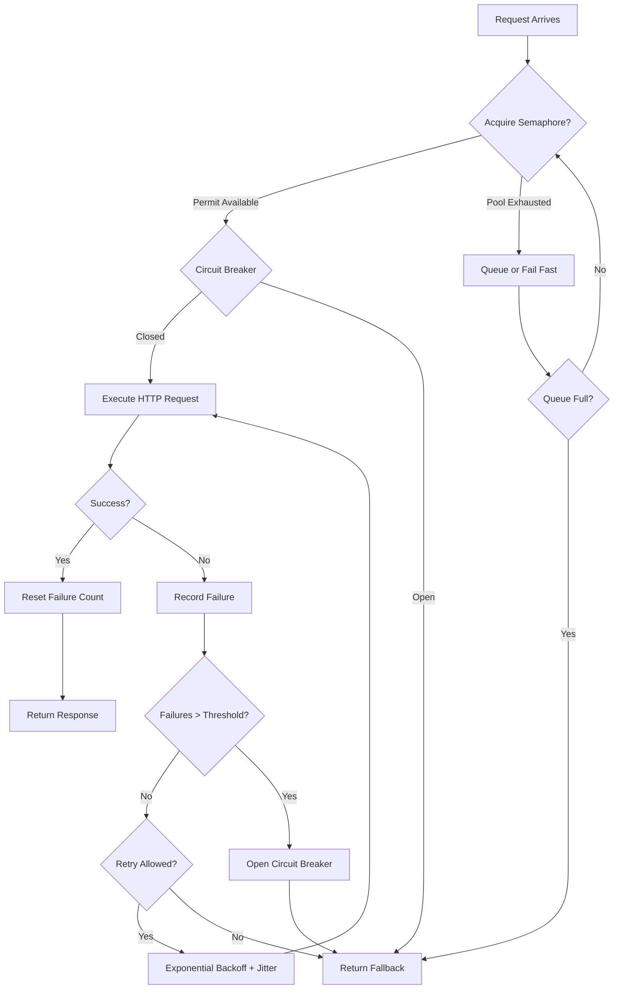

| Difficulty | Channel | Tags |
|---|---|---|
| advanced | backend | asyncio, aiohttp, concurrency |

By 2011, Netflix faced a nightmare that any engineer would recognize in their bones. A single video playback request — something users did millions of times a day — fanned out into dozens of microservice calls spanning recommendation engines, billing systems, user profiles, and encoding pipelines. Any one of those services going *slow* (not even failing, just slow) could cascade upward, eating thread pools until the entire edge API ground to a halt [1]. This is the story of how Netflix tamed the cascade, and what every developer building distributed systems today must understand about connection pool management.

---

> ### Real-World Case — Netflix
>
> By 2011-2012, Netflix's microservice migration meant a single video play request fanned out into dozens of service calls across recommendation, billing, profiles, and encoding. Any one service going slow (not failing, just slow) could exhaust thread pools on the calling service, cascading the slowness upward until the entire edge API stalled. The API already handled 1B+ incoming calls/day fanning out to several billion outgoing calls with peaks over 100k dependency requests/second across thousands of EC2 instances.
>
> | | |
> |---|---|
> | **Challenge** | A single slow downstream dependency could silently hold Tomcat request threads hostage, exhausting connection pools and causing cascading failures. Traditional timeouts were too coarse — thread-pool exhaustion was the real failure mode. With 30+ dependencies, even 99.99% uptime per dependency mathematically meant only 99.7% overall uptime (2+ hours downtime/month). |
> | **Solution** | Netflix built Hystrix, which wrapped every external call with: (1) bulkhead pattern — a dedicated thread pool (default 10 threads) per dependency to isolate failures; (2) semaphore-based limiting for non-thread-isolated calls; (3) circuit breaker that opens when error rate exceeds 50% over a 10-second rolling window with ≥20 requests; (4) half-open state allowing one test request after a 5-second sleep window; (5) fallback methods returning cached/degraded data when a circuit is open. This maps directly to the connection pool manager pattern with semaphore limiting + circuit breaker + graceful degradation. |
> | **Outcome** | Dramatic improvement in uptime and resilience across Netflix's entire platform. Hystrix now executes tens of billions of thread-isolated and hundreds of billions of semaphore-isolated calls daily. A single slow dependency no longer takes down the entire API — fallbacks provide degraded but functional user experiences. The pattern became the industry standard for connection pool management and graceful degradation in microservices. |
> | **Lesson** | A slow service is more dangerous than a failed one. Failing services release resources quickly; slow services silently consume connection pools and cascade failure across the entire system. The key insight: fail fast and shed load is better than wait and propagate. This is why connection pool managers need circuit breakers, not just timeouts. |

---

## Hook — Picture a single request bringing down your entire API

You have deployed your microservices. The architecture diagram looks beautiful — clean boxes, tidy arrows, each service with its own responsibility. But here is the uncomfortable truth that Netflix engineers discovered the hard way: in a distributed system, any component can become the weakest link, and the weakest link *always* breaks under enough load. The question is not *if* a downstream service will slow down, but *when* — and whether your system will gracefully degrade or collapse entirely. A slow database query, a congested network link, a noisy-neighbor VM eating CPU cycles — any of these can turn a snappy microservice into a silent bottleneck. And when that happens, connection pools become ground zero for the chaos.

## Problem — The hidden danger of shared connection pools

Here is the scenario that keeps infrastructure engineers up at night: your service handles 10,000 requests per second. Each request makes 3 downstream calls. That is 30,000 outbound connections. Now imagine one of those downstream services starts responding in 10 seconds instead of 10 milliseconds. Every connection to that service becomes a slow, blocking drain on your pool. Threads pile up. Memory grows. Other, perfectly healthy downstream services suddenly cannot get a connection because the pool is exhausted. This is the *cascade effect*, and it is the single most destructive failure mode in microservice architectures. Many developers assume that connection pooling is just about reusing TCP connections for efficiency. In reality, it is your first and last line of defense against systemic collapse. Connection pooling without circuit breakers, backpressure, and graceful degradation is not resilience — it is just organized chaos [2].

## Real-World Case — Netflix

By 2012, Netflix’s API was handling over 1 billion incoming calls per day, which fanned out to *several billion* outbound dependency requests, peaking at over 100,000 dependency requests per second across thousands of EC2 instances [1]. The architecture had migrated from a monolithic application to a distributed microservice mesh, and with that migration came a brutal discovery: any single slow dependency could exhaust thread pools across the entire call chain, cascading upward until the edge API completely stalled. The situation was so severe that Netflix built an internal library called Hystrix — a circuit breaker-based resilience system that isolated failure, defined fallbacks, and prevented cascading collapses. The impact was dramatic: Hystrix now executes tens of billions of thread-isolated and hundreds of billions of semaphore-isolated calls daily [1]. A single slow dependency no longer took down the entire platform. Fallbacks provided degraded but functional user experiences. The pattern became the industry standard, inspiring resilience frameworks like Resilience4j, Sentinel, and Akka’s circuit breaker [3].

## Deep Dive — Semaphores, circuit breakers, and the art of failing gracefully

Building on the Netflix example, three core mechanisms form the backbone of any production-grade connection pool manager. First, **semaphore-based concurrency limiting**: unlike a thread pool (which ties up OS threads), a semaphore simply counts permits. When all permits are exhausted, new requests either queue, wait, or fail fast — but crucially, they do not consume system threads while waiting. For I/O-bound async applications with aiohttp, semaphores are the right choice because they limit concurrency without the overhead of thread management [4]. Second, **the circuit breaker pattern**: this is the game-changer that Netflix proved at scale. The breaker monitors failure rates. After a threshold of failures, it *opens* and subsequent requests fail immediately without hitting the downstream service. After a recovery timeout, it transitions to *half-open*, allowing a probe request through. Success resets the breaker; failure restarts the timeout. This prevents the thundering-herd problem where a recovering service gets immediately overwhelmed by all clients retrying simultaneously [5]. Third, **exponential backoff with jitter**: when retrying failed requests, stagger the retries with exponential delay plus random jitter. Without jitter, all clients retry in lockstep, creating a synchronized wave of traffic that can overwhelm the recovery [6]. The counterintuitive insight? *Failing fast is often better than retrying* — especially when the downstream is genuinely degraded. Circuit breakers encode this wisdom directly into the architecture.

## Workflow — The lifecycle of a resilient request

Here is how these mechanisms work together in the complete request lifecycle. The diagram below shows the full flow from request arrival through semaphore acquisition, circuit breaker evaluation, request execution, and the retry/backoff loop.

**Step 1 — Semaphore Acquisition**: The request arrives and attempts to acquire a semaphore permit. If the pool is saturated (all permits taken), the request either queues with a bounded buffer or fails immediately—never blocks a thread.

**Step 2 — Circuit Breaker Check**: Before making any network call, check the circuit breaker state. If open, skip the downstream call entirely and return a cached or degraded response. This should be the fastest code path in your system.

**Step 3 — Request Execution**: Send the HTTP request with a strict timeout. Never use default timeouts. A missing timeout is the single most common cause of connection pool exhaustion in production [7].

**Step 4 — Success or Failure Handling**: On success, reset the circuit breaker failure count. On failure, increment the counter and check if the threshold is exceeded. If so, trip the breaker open with a timestamp.

**Step 5 — Retry with Backoff**: If the failure is transient (network blip, DNS issue), retry with exponential backoff plus jitter. Cap the maximum backoff delay to prevent excessively long wait times.

**Step 6 — Fallback**: If all retries fail, return a graceful fallback — stale cache data, a simplified response, or a clear error message. A degraded experience beats a broken page every time.

## Code Example — Production-grade connection pool in Python with aiohttp

Here is a production-ready connection pool manager that implements everything discussed: semaphore limiting, circuit breaker with half-open state, exponential backoff with jitter, and graceful cleanup.

## Lessons Learned — Build resilience in, not on

Netflix’s journey with Hystrix taught the industry a fundamental lesson that is too often forgotten: *resilience cannot be bolted on after the fact*. It must be architected into the connection layer from day one. Here are the actionable takeaways. First, **always set timeouts** — a connection pool without timeouts is a memory leak waiting to happen [8]. Second, **implement circuit breakers early** — they are cheap to add and expensive to retrofit. Third, **measure everything** — connection pool utilization, failure rates, circuit breaker state transitions, queue depths. Without metrics, you are flying blind [9]. Fourth, **test failure scenarios** — use chaos engineering (Netflix’s Chaos Monkey was born from the same era as Hystrix) to validate that your fallbacks actually work [10]. Fifth, **never trust a single pattern** — semaphores, circuit breakers, backoff, and fallbacks each cover different failure modes. Use them together.

---

## Connection Pool Request Lifecycle

<strong>Original Interview Question</strong>

**Q:** How would you implement a connection pool manager for aiohttp that handles graceful degradation under high load and connection timeouts?

**A:** Implement a connection pool manager for aiohttp using a semaphore to limit concurrent connections, exponential backoff for retrying failed requests, and circuit breaker pattern to gracefully degrade under high load and connection timeouts.

## Conclusion

The cascade that nearly broke Netflix in 2012 is the same cascade that threatens every microservice architecture today. The difference between a team that panics at 3am during a production incident and a team that sleeps through it is not clever coding — it is intentional resilience design. Connection pools, circuit breakers, backoff strategies, and fallbacks are not optional infrastructure. They are the seat belts, airbags, and crumple zones of distributed systems. Build them in from the start. And the next time a downstream service slows down, you will not just survive it — you will barely notice.

---

## References

1. [Fault Tolerance in a High Volume Distributed System](https://netflixtechblog.com/fault-tolerance-in-a-high-volume-distributed-system-91ab4faae74a) — blog
2. [Circuit Breaker Pattern](https://en.wikipedia.org/wiki/Circuit_breaker_design_pattern) — documentation
3. [Resilience4j: Fault Tolerance Library for Java](https://github.com/resilience4j/resilience4j) — blog
4. [Python asyncio Synchronization Primitives — Semaphore](https://docs.python.org/3/library/asyncio-sync.html) — documentation
5. [Exponential Backoff and Jitter](https://aws.amazon.com/blogs/architecture/exponential-backoff-and-jitter/) — blog
6. [Fallacies of Distributed Computing](https://en.wikipedia.org/wiki/Fallacies_of_distributed_computing) — documentation
7. [aiohttp Client Best Practices](https://docs.aiohttp.org/en/stable/client_advanced.html) — documentation
8. [HTTP Connection Management in RFC 7230](https://datatracker.ietf.org/doc/html/rfc7230) — documentation
9. [Google SRE Book: Handling Overload](https://sre.google/sre-book/handling-overload/) — documentation
10. [Principles of Chaos Engineering](https://principlesofchaos.org/) — documentation

---

**Author:** Satishkumar Dhule — [GitHub](https://github.com/satishkumar-dhule) · [LinkedIn](https://linkedin.com/in/satishkumar-dhule) · [Website](https://satishkumar-dhule.github.io)
