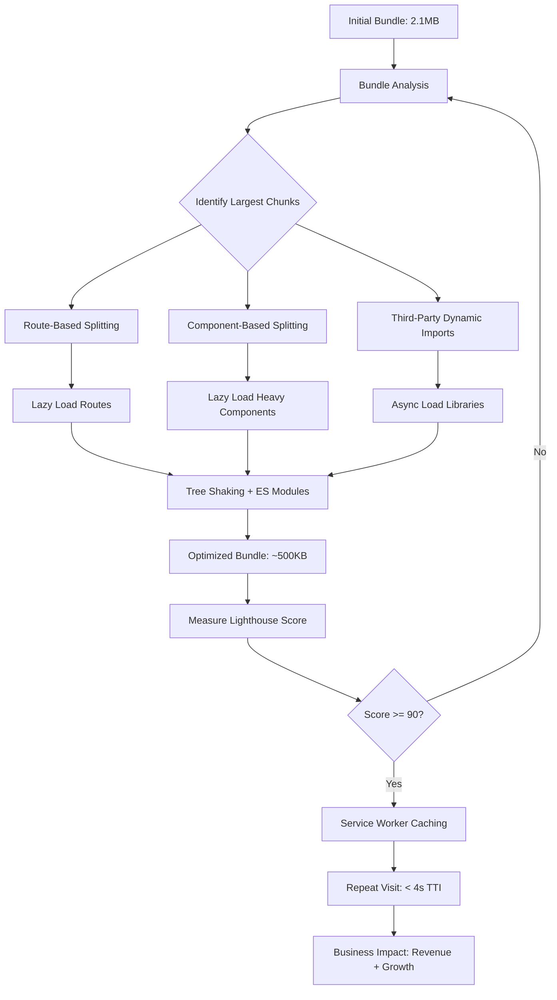

| Difficulty | Channel | Tags |
|---|---|---|
| intermediate | frontend | lighthouse, bundle, lazy-loading |

In 2017, Pinterest's mobile web was a ticking time bomb. A monolithic React app loaded 2.5MB of JavaScript, and users on 3G networks stared at a blank screen for 23 seconds before they could interact [1]. Only 1% of mobile visitors converted. International growth was grinding to a halt. The engineering team faced an impossible choice: rebuild the entire experience from scratch, or find a way to make React fly on slow networks. Their journey from 23 seconds to 5.6 seconds interactive is a masterclass in performance optimization — and every lesson applies to your React app today.

---

> ### Real-World Case — Pinterest
>
> Pinterest's old mobile web was a monolithic React app with 2.5MB+ of JavaScript that took 23 seconds to become interactive on 3G. Only 1% of mobile web users converted to sign-ups or app installs, and international growth was bottlenecked by the poor experience on slower networks.
>
> | | |
> |---|---|
> | **Challenge** | Reduce a 650KB+ core JavaScript bundle and 23s Time To Interactive to something usable on average Android hardware over slow 3G, without rebuilding the entire app from scratch. |
> | **Solution** | Over 3 months, Pinterest rebuilt their mobile web using React + Redux + webpack with aggressive route-based code splitting. They used Webpack Bundle Analyzer to identify duplicate code across async chunks, split every route into its own chunk loaded via dynamic imports, shrank the core bundle by swapping heavy dependencies for lighter alternatives, and added Service Worker caching for instant repeat-visit loads. |
> | **Outcome** | Core bundle reduced 77% (650KB → 150KB). First Meaningful Paint dropped from 4.2s to 1.8s. Time To Interactive collapsed from 23s to 5.6s (3.9s on repeat visits). Time spent increased 40%, user-generated ad revenue rose 44%, core engagements up 60%, and weekly active mobile web users grew 103%. The 150KB PWA delivered a near-native experience at <1% of the download cost of their iOS app (56MB). |
> | **Lesson** | Route-based code splitting is the single highest-impact optimization for React SPAs — splitting at route boundaries naturally aligns with user behavior and avoids the 'over-splitting' trap. Combine with bundle analysis tools to identify the real culprits before optimizing. |

---

## Hook — The 23-Second Wall

Imagine shipping a product where 99% of first-time visitors hit the back button before anything happens. That was Pinterest's reality. Their mobile web was hemorrhaging users, especially in emerging markets where 3G was the norm. The root cause was hiding in plain sight: a 2.5MB JavaScript bundle that took nearly half a minute to parse and execute. This is not a problem unique to Pinterest. Many developers discover their React app is bloated only when growth stalls. The question is: what do you do when Lighthouse hands you a score of 65 and your Time to Interactive is measured in epochs, not milliseconds?

## Problem — The Silent Bundle Bloat

Bundle bloat is insidious. It does not happen overnight. You add one library here, a charting component there, import a utility function from a massive package, and before you know it, your production bundle is 2.1MB and your app takes 4.2 seconds to become interactive on a fast connection. On mobile, it is far worse. The core issue is that React applications, by default, send the entire application code to the browser on the first page load — even if the user only needs a login screen. This violates the first rule of web performance: only ship what is needed, when it is needed. Every kilobyte of unnecessary JavaScript delays the moment your app becomes useful.

## Real-World Case — Pinterest's Progressive Web Awakening

Pinterest's engineering team decided to treat their mobile web problem as a crisis. The stakes were existential for their international growth strategy. They adopted a Progressive Web App approach, but the real magic was in how they attacked bundle size. Through aggressive code splitting, tree shaking, and a ruthlessly critical look at every dependency, they collapsed their core bundle from 650KB to 150KB — a 77% reduction [1]. The results were staggering: First Meaningful Paint dropped from 4.2s to 1.8s. Time to Interactive collapsed from 23s to 5.6s (3.9s on repeat visits thanks to service worker caching). But the business metrics told the real story: time spent increased 40%, user-generated ad revenue rose 44%, core engagements jumped 60%, and weekly active mobile web users grew 103%. The 150KB PWA delivered a near-native experience at less than 1% of the download cost of their 56MB iOS app. This is the power of performance optimization done right.

## Deep Dive — The Anatomy of a Fast React App

Optimizing a React app for performance requires understanding three interconnected concepts: bundle analysis, code splitting, and caching strategy. Bundle analysis comes first — you cannot fix what you cannot measure. Tools like webpack-bundle-analyzer [2] reveal which packages are consuming your budget. Common culprits include moment.js (its locale data alone is 300KB+), charting libraries, and icon sets imported without tree-shaking. Code splitting is the surgical solution. React.lazy() and Suspense [3] let you defer loading components until they are actually rendered. You have two strategies: route-based splitting (each route loads its own chunk) and component-based splitting (heavy dialogs, graphs, or editors load on demand). The trade-off is granularity versus overhead — too many tiny chunks hurt performance with network overhead, too few defeats the purpose. A good rule is to split at route boundaries by default, then component-split anything over 20KB that is not above the fold. Tree shaking [4] eliminates dead code. It requires ES module syntax (import/export) rather than CommonJS (require/module.exports). Transpilers like Babel can silently convert your ES modules to CommonJS, breaking tree shaking. A common trap is configuring @babel/preset-env with modules: 'commonjs' and then wondering why your bundle is full of unused code. The save is simple: set modules: false in Babel and let webpack handle module resolution. Service worker caching [5] turns repeat visits into near-instant loads. By caching the app shell and key assets in a Cache-First strategy, you eliminate network latency entirely for repeat visitors. Pinterest's 3.9s repeat-visit TTI came from combining code splitting with intelligent caching.

## Workflow — From 65 to 90+ Lighthouse Score

The optimization workflow follows a diagnose-split-measure loop. Start by running webpack-bundle-analyzer to audit your current bundle composition. Identify the top 5 largest modules and ask: does the user need this on first paint? Route-split by default, component-split heavy elements, and dynamic-import third-party libraries. Integrate a loading sequence that shows a skeleton or spinner immediately, fetches critical CSS and JS in parallel, then streams in route chunks on navigation. The diagram below visualizes this decision flow. The critical insight is the feedback loop — you measure, identify, split, and repeat until you hit your target. Pinterest went through this loop many times to reach 150KB.

## Code Example — Lazy Loading in Practice

The implementation combines three patterns: route-based splitting for pages, component-based splitting for heavy UI elements, and error boundaries for resilience. Here is how they fit together in a modern React app. The code walks through three connected patterns. First, bundle analysis via webpack-bundle-analyzer generates a visual treemap of your bundle, making it obvious which modules are the biggest offenders. Second, React.lazy() with dynamic imports splits the bundle at route boundaries — each page component becomes its own JavaScript chunk loaded only when the user navigates to that route. Third, nested Suspense and ErrorBoundary patterns handle heavy component loading: the outer Suspense shows a spinner during route transitions, while an inner Suspense with a skeleton placeholder handles the chart loading separately. The error boundary prevents a failed chunk load (e.g., network failure or deployment version mismatch) from crashing the entire app. This layered approach mirrors what Pinterest implemented: coarse route-splitting for the main navigation, fine-grained component-splitting for heavy elements, and defensive error handling for resilience.

## Lessons Learned — What Pinterest Taught Us About Performance

Pinterest's transformation offers several lessons that apply to any React project. First, measure before you optimize. The team did not guess — they used real user monitoring and bundle analysis to pinpoint the 20% of code causing 80% of the bloat. Second, aggressive code splitting is a feature, not a hack. Route-based splitting alone took them most of the way, but component-level splitting on heavy elements like pin boards and modals gave them the final edge. Third, caching turns first-visit optimizations into repeat-visit superpowers. Their 3.9s repeat TTI came from service worker caching, not from making the initial load faster. Fourth, the developer experience matters for ongoing performance. Pinterest invested in tooling that flagged bundle size increases in CI, preventing regressions from shipping. Finally, performance is a business metric, not just an engineering one. The 44% ad revenue increase and 103% MAU growth were direct results of technical decisions made months earlier. When you frame performance in terms of user retention and revenue, it stops being a 'nice to have' and becomes a competitive advantage.

---

## React Bundle Optimization Decision Flow

<strong>Original Interview Question</strong>

**Q:** You're tasked with improving a React app's Lighthouse performance score from 65 to 90+. The bundle size is 2.1MB and Time to Interactive is 4.2s. What specific steps would you take to optimize the bundle and implement lazy loading?

**A:** Implement code splitting with React.lazy() and Suspense, analyze bundle composition with webpack-bundle-analyzer to identify largest chunks, remove unused dependencies and optimize imports, add dynamic imports for heavy components and third-party libraries, implement route-based splitting for better initial load times, and utilize tree shaking with proper ES module configuration.

## Conclusion

Pinterest's journey from 23 seconds to 5.6 seconds is proof that performance is not a one-time optimization sprint — it is a continuous discipline. The same techniques that saved their mobile web — bundle analysis, code splitting, tree shaking, and intelligent caching — are available to every React developer today. The next time someone says 'Lighthouse score does not matter,' show them a 44% revenue lift and 103% user growth. Then open webpack-bundle-analyzer and start cutting. Your users on slow networks are waiting.

---

## References

1. [A Pinterest Progressive Web App Performance Case Study](https://medium.com/dev-channel/a-pinterest-progressive-web-app-performance-case-study-3bd6ed2e6154) — blog
2. [webpack-bundle-analyzer](https://github.com/webpack-contrib/webpack-bundle-analyzer) — documentation
3. [React.lazy and Suspense Documentation](https://react.dev/reference/react/lazy) — documentation
4. [Webpack Tree Shaking Guide](https://webpack.js.org/guides/tree-shaking/) — documentation
5. [Service Worker Caching Strategies Overview](https://developer.chrome.com/docs/workbox/caching-strategies-overview/) — documentation
6. [Lighthouse Performance Scoring](https://developer.chrome.com/docs/lighthouse/performance/) — documentation
7. [Apply Instant Loading with the PRPL Pattern](https://web.dev/apply-instant-loading-with-prpl/) — documentation
8. [React Code Splitting and Suspense](https://react.dev/reference/react/Suspense) — documentation

---

**Author:** Satishkumar Dhule — [GitHub](https://github.com/satishkumar-dhule) · [LinkedIn](https://linkedin.com/in/satishkumar-dhule) · [Website](https://satishkumar-dhule.github.io)
