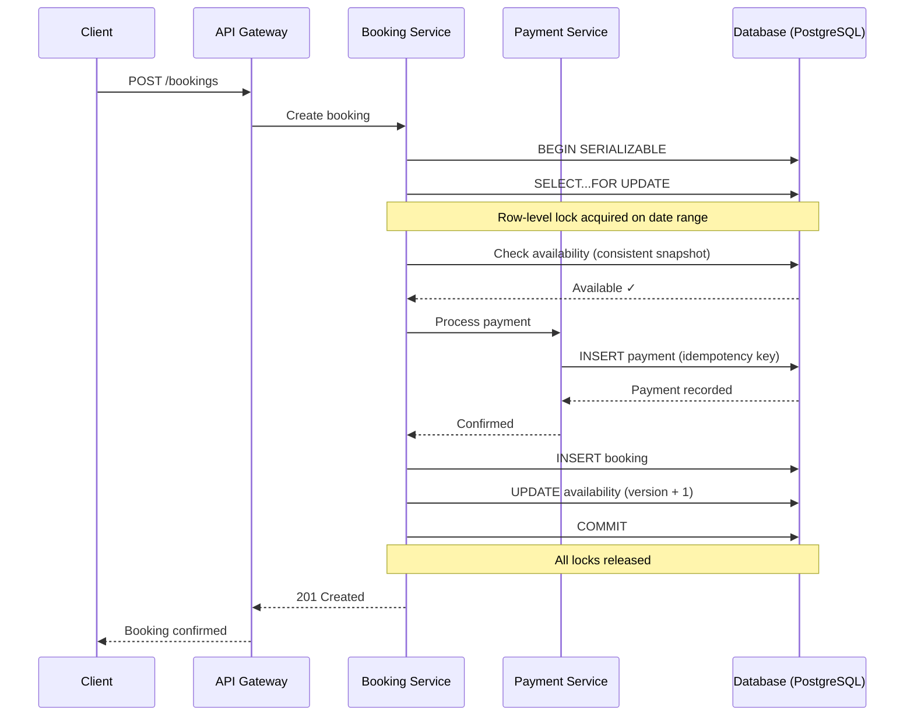

| Difficulty | Channel | Tags |
|---|---|---|
| intermediate | database | acid, isolation-levels, mvcc |

Imagine your pager goes off at 3 AM. Users are being double-charged for bookings. Your CEO is tweeting about the new feature launch that's now in flames. This isn't a hypothetical — Airbnb's payments team lived this nightmare when a Service Oriented Architecture migration turned a simple click into a distributed systems puzzle [1]. The same race conditions that caused double payments can cause double bookings, and the fix reveals everything you need to know about transactional integrity in modern systems.

---

> ### Real-World Case — Airbnb
>
> Airbnb's payments team faced double charges when users clicked "Book" twice or network timeouts caused retries. As they migrated to a Service Oriented Architecture (SOA), maintaining data integrity across distributed payment services became increasingly difficult — a failed API response after a successful charge left clients unsure whether to retry, risking duplicate payments for their community.
>
> | | |
> |---|---|
> | **Challenge** | Race conditions from duplicate booking requests and unreliable network calls could result in guests being charged multiple times for a single reservation. They needed a generic, low-latency idempotency solution usable across all payments SOA services that could guarantee eventual consistency without forcing every developer to become a distributed systems expert. |
> | **Solution** | They built "Orpheus," a generic idempotency library using unique idempotency keys with database row-level locks (leases) and Java lambda-based atomic transactions. API calls were split into three phases (Pre-RPC, RPC, Post-RPC) with strict separation of network and database work. Idempotency state was always read from the sharded master database to prevent replica lag from causing duplicate charges. |
> | **Outcome** | Achieved five nines (99.999%) consistency in payments while their annual payment volume simultaneously doubled, with Orpheus deployed across multiple payment services as a lightweight library that product engineers could import and use without deep distributed systems expertise. |
> | **Lesson** | Idempotency alone isn't enough — you must combine it with row-level database locks (leases with expiration), strict phase separation between network and database operations, and always read idempotency state from the master database. Even seconds of replica lag can cause catastrophic duplicate charges in a booking system. |

---

## Hook — The Click That Broke Your Database

What happens when two travelers click "Book" on the same property at the exact same millisecond? In many systems, both get a confirmation email. Then both show up. One sleeps on the couch. This isn't just a UX bug — it's a distributed systems failure that costs companies millions in refunds, customer trust, and midnight emergency calls. Every booking platform eventually faces this moment: the line between "available" and "booked" gets razor-thin, and your database transactions are all that stand between a seamless experience and a PR disaster. The hidden truth? Most developers design for the happy path and discover the failure modes at 2 AM with a production incident on their hands.

## Problem — The Race You Can't Afford to Lose

At its core, the double booking problem is a textbook race condition. Two concurrent transactions read the same availability, both see "available," both proceed to book. The classic read-check-write pattern that works perfectly in single-threaded code crumbles under concurrency. The window of vulnerability is microscopically small — measured in microseconds — but it's always there. Every booking platform must solve this: ride-sharing apps competing for drivers, airlines selling the last seat, event ticketing systems where a Taylor Swift presale breaks the internet. The stakes are identical, and the solution space is the same. It's a universal distributed systems problem hiding behind a deceptively simple use case. Sound familiar? It should — because nearly every developer building financial or booking systems has shipped this bug at least once.

## Real-World Case — Airbnb's Payments Evolution

Airbnb's payments team encountered this exact class of problem during their migration to a Service Oriented Architecture [1]. As they decomposed their monolithic application into distributed services, a deceptively simple scenario emerged: a user clicks "Book," the payment is processed successfully in the downstream service, but the network response times out before reaching the client. The client doesn't know whether to retry or give up. Retry risks a double charge. Give up risks losing the booking. This is the fundamental distributed systems dilemma — exactly-once semantics are notoriously hard to achieve when networks are unreliable [6]. Airbnb's response was Orpheus, a lightweight library that product engineers could import without deep distributed systems expertise [1]. Orpheus provided idempotency guarantees and transaction-like semantics across service boundaries. The result? Five nines (99.999%) consistency in payments while their annual payment volume simultaneously doubled [1]. A 0.001% failure rate sounds tiny until you calculate the absolute dollar impact at billions in transaction volume.

## Deep Dive — Dissecting the Transactional Toolbox

This brings us to the core question: what tools does a database give you to prevent race conditions? PostgreSQL offers four isolation levels, but for booking systems, you choose between READ COMMITTED and SERIALIZABLE [2]. Many developers think READ COMMITTED is sufficient — after all, you can just use SELECT FOR UPDATE and lock the rows you care about, right? Here's the plot twist: SELECT FOR UPDATE only protects against concurrent writes, not against phantom reads. Another transaction could insert a new row that matches your WHERE clause between your read and your write, and you'd never notice [4]. This is where SERIALIZABLE isolation changes everything. It guarantees that concurrent transactions execute as if they ran one at a time, eliminating phantom reads, non-repeatable reads, and dirty reads entirely [2]. Under the hood, PostgreSQL implements this using Serializable Snapshot Isolation (SSI), a technique built on MVCC that detects read-write conflicts between concurrent transactions [3]. The catch? It comes with a non-trivial performance cost. More transactions will abort due to serialization failures, and you need retry logic to handle them. This is the fundamental trade-off: consistency vs. throughput. The battle-tested pattern combines optimistic concurrency control with version columns and application-level validation [5]. Each availability record carries a version number. When you book, your UPDATE includes WHERE version = :old_version. If another transaction modified it first, zero rows are updated, you detect the failure, and you retry. No locks held between retries means higher concurrency. The trade-off? Higher abort rates under contention.

## Workflow — The Atomic Booking Orchestration

A properly designed booking transaction follows a strict sequence, each step building on the last to guarantee correctness. The diagram below shows the complete flow — from client request through idempotent payment processing to the final commit that releases all locks. Here's how the orchestration plays out step by step. First, the API gateway receives the booking request and forwards it to the Booking Service. The Booking Service opens a SERIALIZABLE transaction and immediately acquires row-level locks on the relevant availability records using SELECT FOR UPDATE [4]. This serializes access to those specific date rows — no other transaction can read or modify them until this one commits. Next, within the same transaction, availability is checked against a consistent snapshot guaranteed by the isolation level. If available, the Booking Service calls the Payment Service, which processes the payment using idempotency keys to prevent double charges [8]. The Payment Service inserts the payment record within its own transaction and responds. Only then does the Booking Service insert the booking record, update the availability status, and commit. If any step fails — a payment timeout, a serialization conflict, a constraint violation — the entire transaction rolls back atomically [6]. The client is told to retry, safe in the knowledge that no partial state was left behind.

## Code Example — Implementing Safe Bookings in Production

The theory is clean, but the implementation is where most developers slip. Here is a production-ready booking function that combines SERIALIZABLE isolation, explicit row locking, idempotency keys, and exponential backoff retry logic.

## Lessons Learned — What 99.999% Consistency Really Takes

Airbnb achieved five nines without rewriting their database or adopting exotic technology. They used well-understood primitives — idempotency keys, transaction isolation, and careful retry logic — applied with discipline [1]. Here are the battle scars worth sharing with your team. First, idempotency is non-negotiable. Every booking system should generate a unique idempotency key per request — typically a hash of guest ID, property ID, and date range — and use it with ON CONFLICT DO NOTHING or equivalent [8]. This prevents double charges even when clients retry aggressively. Second, measure lock contention before you optimize. Most properties have low booking velocity, so SERIALIZABLE isolation with row-level locks introduces negligible overhead. The hot properties — the ones that cause incidents — are the exception, not the rule. Profile first, optimize second. Third, retry logic must use exponential backoff with jitter [7]. Retrying immediately after a serialization failure guarantees another failure because the conflicting transaction is likely still in flight. A 100ms initial backoff with 2x multiplier gives the system breathing room. Fourth, monitor serialization failure rates as a critical SLO. A spike in aborted transactions is an early warning that a hot property needs special handling — perhaps a dedicated queue or rate limiting. Finally, circuit breakers are your safety net for extreme contention. When lock wait times exceed thresholds, reject requests fast rather than piling onto a queued database connection pool. Airbnb's Orpheus handled this elegantly by keeping the complexity hidden behind a library API, letting product teams focus on features while the distributed systems layer just worked [1].

---

## Atomic Booking Transaction Flow

<strong>Original Interview Question</strong>

**Q:** You're building a booking system for Airbnb where multiple users can reserve the same property simultaneously. How would you design the transaction handling to prevent double bookings while maintaining high availability?

**A:** Use SERIALIZABLE isolation with optimistic concurrency control. Implement row-level locks on property availability tables, use MVCC snapshot reads for checking availability, and apply application-level validation to ensure atomic booking operations.

## Conclusion

Next time you design a booking system, start with the failure modes. What happens if the user clicks twice? What happens if the network dies mid-request? What happens if two requests arrive at the same nanosecond? If your answer doesn't include SERIALIZABLE isolation, idempotency keys, and explicit row-level locking, you're not done yet. Airbnb learned this the hard way so you don't have to [1]. These primitives aren't exotic — they've been part of PostgreSQL for over a decade. The real challenge is applying them with discipline at every layer of your stack. Start with the database, validate at the application layer, and protect against duplicates with idempotency keys. The difference between a booking system that works and one that explodes is measured in microseconds. Make yours the former.

---

## References

1. [Avoiding Double Payments in a Distributed Payments System](https://medium.com/airbnb-engineering/avoiding-double-payments-in-a-distributed-payments-system-2981f6b070bb) — blog
2. [PostgreSQL Transaction Isolation](https://www.postgresql.org/docs/current/transaction-iso.html) — documentation
3. [Multiversion Concurrency Control](https://en.wikipedia.org/wiki/Multiversion_concurrency_control) — documentation
4. [PostgreSQL Explicit Locking](https://www.postgresql.org/docs/current/explicit-locking.html) — documentation
5. [Optimistic Concurrency Control](https://en.wikipedia.org/wiki/Optimistic_concurrency_control) — documentation
6. [ACID Properties](https://en.wikipedia.org/wiki/ACID) — documentation
7. [Isolation (Database Systems)](https://en.wikipedia.org/wiki/Isolation_(database_systems)) — documentation
8. [Idempotence](https://en.wikipedia.org/wiki/Idempotence) — documentation

---

**Author:** Satishkumar Dhule — [GitHub](https://github.com/satishkumar-dhule) · [LinkedIn](https://linkedin.com/in/satishkumar-dhule) · [Website](https://satishkumar-dhule.github.io)
