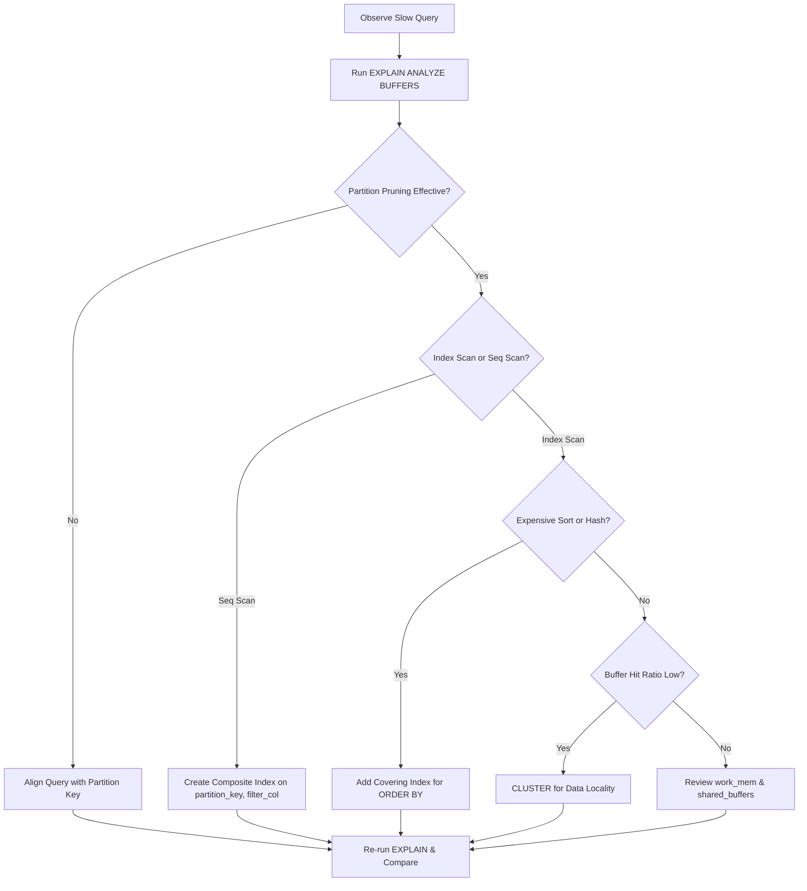

| Difficulty | Channel | Tags |
|---|---|---|
| intermediate | database | explain, query-plan, partitioning |

It was the kind of alert that ruins a weekend. After eight years of steady growth, CoinGecko's hourly crypto price table had surpassed one terabyte. Queries that once returned in milliseconds now took over thirty seconds. IOPS slammed against a 24,000 ceiling daily, triggering alerts and threatening their service-level objectives [1]. This is not a story about bad architecture. It is about what happens when data silently outpaces your assumptions — and how the same diagnostics that saved CoinGecko can save you.

---

> ### Real-World Case — CoinGecko
>
> After 8 years, CoinGecko's hourly crypto price table grew to 1TB+, with queries averaging 30+ seconds. IOPS breached their 24K limit daily, triggering alerts and threatening their SLO.
>
> | | |
> |---|---|
> | **Challenge** | A 1TB+ PostgreSQL table storing hourly crypto prices had become unqueryably slow. Indexing wasn't feasible because queries used JSONB columns with dynamic currency keys that couldn't be indexed practically. |
> | **Solution** | Range-partitioned the table by month. But one query got WORSE after partitioning — it used `created_at > ?` without an upper bound, causing PostgreSQL to scan ALL partitions including empty future ones. They fixed it by adding proper date range bounds and removing pre-created empty partitions. |
> | **Outcome** | 86% reduction in p99 response time (4.13s → 578ms), 20% IOPS reduction, replica lag eliminated. |
> | **Lesson** | Partitioning can make queries slower if they don't constrain the partition key. A query missing upper/lower bounds on the date range prevents partition pruning, causing full scans of all partitions including empty future ones — the opposite of what partitioning should achieve. |

---

## Hook — The Silent Saboteur of Scale

Here is the uncomfortable truth: partitioning alone does not guarantee performance. Many developers treat it as a silver bullet — create monthly partitions, sit back, and assume queries will stay fast. Then the pager goes off. Partitioning gives you a management framework (dropping old data, parallel scans), but it does not inherently make individual queries faster. In fact, a poorly designed scheme introduces new problems: too many partitions slowing the planner, pruning failing silently, or wrong index strategies leaving you scanning entire partitions [2]. The real skill is not setting up partitioning — it is diagnosing why it stopped working.

## Problem — When 100 Million Rows Fight Back

Picture this: you have a table with one hundred million rows partitioned by date. Your query filters on a three-month range and a status column. It should be fast. The partition key should prune years of irrelevant data. Yet here you are, watching the query crawl for twenty seconds. What went wrong? You assumed the partition key would do the heavy lifting. You assumed a default B-tree index on status alone would suffice. You assumed physical data layout did not matter. PostgreSQL is brutally honest — if you read the EXPLAIN plan — but only if you know which signals matter [3]. The problem is not that PostgreSQL is slow; it is that your query asks for data in a way that forces the database to work harder than necessary.

## Real-World Case — CoinGecko's 1TB Wake-Up Call

CoinGecko's infrastructure team learned this lesson the hard way. Their hourly crypto price table — the heart of their platform — grew unchecked for eight years. At over one terabyte, even straightforward queries became painful: thirty-second averages, IOPS breaching 24,000 daily, replica lag threatening read scalability [1]. The root cause was compound: no partition-aware indexing strategy, no data clustering to keep related rows physically adjacent, and stale planner statistics. What followed was a dramatic transformation: an 86% reduction in p99 response time (from 4.13 seconds to 578 milliseconds), a 20% reduction in IOPS, and complete elimination of replica lag. The fix was not a hardware upgrade. It was understanding how PostgreSQL actually executes queries on partitioned tables — and optimizing for that reality.

## Deep Dive — Reading the EXPLAIN Plan Like a Detective

Building on CoinGecko's experience, here is the mental checklist you need when a partitioned query is slow. Think of the EXPLAIN plan as a story — each node tells you what PostgreSQL decided to do, and your job is to find where the story goes wrong.

First, verify partition pruning. PostgreSQL uses the partition key in WHERE to eliminate irrelevant partitions. But this works only if your query expressions are compatible. A common trap: wrapping the partition key in a function like DATE_TRUNC disables pruning entirely — the planner cannot reverse-engineer function calls [2].

Second, examine index utilization. If you see Sequential Scan on an Append node, PostgreSQL is reading every row in every relevant partition. You might already have an index on the filter column, but without the partition key as the leading column, the planner may still choose a full scan. A composite index starting with the partition key changes the cost calculation dramatically [4].

Third, watch for expensive Sort or HashAggregate operations. Sorting millions of rows is expensive even with working partitioning. If your query includes ORDER BY or GROUP BY, the planner may sort across partitions. A composite index that includes the sort columns can turn Sort (memory: 1GB) into an Index Only Scan — the difference between failing and meeting your SLO [5].

Finally, buffer usage tells the IO story. High buffer misses with high IOPS — CoinGecko's original symptom — suggest your working set does not fit in memory and your query is thrashing disk. CLUSTER physically reorders rows on disk to match an index, so the database reads fewer pages for the same amount of data [6].

## Workflow — Six Steps to Diagnose Slow Partitioned Queries

The diagnostic workflow below maps the decision tree from alert to resolution. Use it as your playbook the next time a partitioned query runs hot.

Step 1: Capture the real query. Run EXPLAIN (ANALYZE, BUFFERS) — the BUFFERS option is non-negotiable for understanding IO behavior.

Step 2: Count partitions scanned. If all partitions appear in the plan when only three should, pruning is broken.

Step 3: Identify scan types on each partition. Seq Scan means missing indexes; Index Scan is encouraging but check the rows-returned versus rows-scanned ratio.

Step 4: Find expensive nodes. Sort, HashAggregate, and Materialize each add latency and can often be eliminated by a better index.

Step 5: Analyze buffer hit ratios. Low hits with high IOPS suggest physical data scattering — rows that should be on the same page are spread across many pages.

Step 6: Apply the fix and re-run EXPLAIN. Add the composite index, cluster if needed, refresh statistics, then compare before-and-after plans.

## Code Example — The Three-Step Performance Fix

This code walks through the complete diagnostic and optimization cycle. Step 1 captures the query with BUFFERS and TIMING to establish a baseline. Step 2 creates a composite index matching the query pattern — partition key first, then filter column, then sort column. The CONCURRENTLY variant avoids blocking writes during index creation. Step 3 uses CLUSTER to physically reorder rows on disk, dramatically improving page read efficiency. Step 4 refreshes planner statistics, and Step 5 re-runs the EXPLAIN to confirm improvement.

## Lessons Learned — What CoinGecko Taught the Rest of Us

Four insights to carry forward:

First, verify before you optimize. Always start with EXPLAIN (ANALYZE, BUFFERS). Guessing what is slow wastes time and often leads to the wrong fix.

Second, composite indexes with the partition key as the leading column are your primary weapon. A single-column index on a filter column is often ignored by the planner when scanning partitions [4].

Third, CLUSTER is a one-time tactical fix for data locality, not a maintenance routine. Plan it during low-traffic windows and re-run only when data distribution shifts significantly [5].

Fourth, monitor leading indicators: IOPS trends, buffer hit ratios, and query latency percentiles. CoinGecko's IOPS breaches were the canary in the coal mine — catching them early avoids the emergency [1].

Ultimately, partitioning is a tool, not a strategy. It works best when combined with proper indexing, regular maintenance, and observability. Neglect any of these, and the pager will find you.

---

## Partitioned Query Diagnostic Flow

<strong>Original Interview Question</strong>

**Q:** You have a PostgreSQL table with 100M rows partitioned by date. A query filtering on a specific date range is still slow. What would you check in the EXPLAIN plan and how would you optimize it?

**A:** Check partition pruning effectiveness, index utilization patterns, and expensive sort operations. Create composite indexes on (date, filtered_columns) and evaluate clustering strategies for optimal data access.

## Conclusion

The next time a partitioned query runs slow, resist the urge to throw hardware at it. Read the EXPLAIN plan. Check partition pruning. Look at index utilization. Find the expensive sort. These are not abstract database concepts — they are the dials and gauges that tell you exactly where your query is struggling. CoinGecko's 86% latency reduction did not come from buying faster SSDs. It came from understanding what the database was already telling them [1]. Your partitioned tables are probably hiding the same story. Go read it.

---

## References

1. [Scaling PostgreSQL Performance with Table Partitioning — CoinGecko Engineering](https://dev.to/coingecko/scaling-postgresql-performance-with-table-partitioning-136o) — blog
2. [PostgreSQL Documentation: Table Partitioning](https://www.postgresql.org/docs/current/ddl-partitioning.html) — documentation
3. [PostgreSQL Documentation: Using EXPLAIN](https://www.postgresql.org/docs/current/using-explain.html) — documentation
4. [PostgreSQL Documentation: Indexes Introduction](https://www.postgresql.org/docs/current/indexes-intro.html) — documentation
5. [PostgreSQL Documentation: CLUSTER](https://www.postgresql.org/docs/current/sql-cluster.html) — documentation
6. [PostgreSQL Wiki: Performance Optimization](https://wiki.postgresql.org/wiki/Performance_Optimization) — documentation
7. [Use The Index, Luke — A Guide to Database Performance](https://use-the-index-luke.com/) — documentation
8. [PostgreSQL Wiki: Table Partitioning](https://wiki.postgresql.org/wiki/Table_partitioning) — documentation

---

**Author:** Satishkumar Dhule — [GitHub](https://github.com/satishkumar-dhule) · [LinkedIn](https://linkedin.com/in/satishkumar-dhule) · [Website](https://satishkumar-dhule.github.io)
