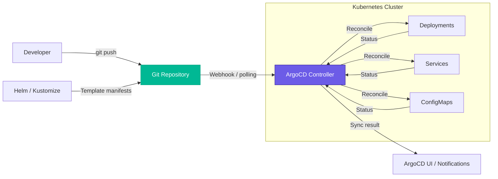

| Difficulty | Channel | Tags |
|---|---|---|
| beginner | devops | argocd, flux, declarative |

It started like any other deploy. But when sync times crept from 15 to 25+ minutes, Adobe's production deployments started failing. Their 1,600+ microservices were being managed by ArgoCD, and it was breaking under its own weight [1]. This is the story of how one of the world's largest software companies bent GitOps to their will — and what your team can learn before you hit that same wall.

---

> ### Real-World Case — Adobe
>
> Adobe built Flex, an enterprise GitOps delivery platform on ArgoCD, to replace their legacy Moonbeam platform. As they scaled to 1,600+ services and 50,000+ ArgoCD applications, they hit a wall: ArgoCD sync times crept from 15 to 25+ minutes, causing production outages and making GitOps unreliable.
>
> | | |
> |---|---|
> | **Challenge** | ArgoCD sync time degraded in lockstep with Argo Workflows load — at 30 workflows/min sync took 15min, at 90 workflows/min it hit 25min. Both tools shared the same Kubernetes API server, so workflow bursts caused API server latency spikes that choked ArgoCD reconciliation. A single control plane became a contention bottleneck. |
> | **Solution** | Adobe isolated ArgoCD and Argo Workflows into separate vClusters with dedicated K8s control planes; scaled controller replicas from 8→12; increased reconciliation timeout from 3→6→9 minutes; removed health status from app CRDs to slash etcd churn; boosted QPS/burst limits; and archived old workflows to reduce API server load. |
> | **Outcome** | Achieved reliable sync for 50K+ ArgoCD apps across 1,600 onboarded services (460 production), running 16,500+ deployments per month. Sync times stabilized at 13-16 minutes even at 150 workflows/min — down from 25 minutes at 90 workflows/min before isolation. Migrated or decommissioned 10,400 pipelines and saved substantial infrastructure costs. |
> | **Lesson** | ArgoCD and Argo Workflows silently compete for the same K8s API server — at scale, they need isolated control planes. More importantly, GitOps performance tuning is counterintuitive: you have to slow down the reconciliation loop (longer timeouts) and remove health data to speed up the overall system by reducing etcd churn. |

---

## Hook — The Crisis at Adobe Scale

You have probably heard the GitOps pitch: commit your Kubernetes manifests to Git, let ArgoCD handle the rest, and sleep soundly knowing your cluster matches your repository. Sounds dreamy, right? Here is the catch — that dream turns into a nightmare when your pipeline handles 150 sync workflows per minute across 50,000 applications. Adobe hit this wall hard. Their legacy Moonbeam platform could not keep up, and the migration to ArgoCD-based Flex seemed like the answer — until sync times ballooned past 25 minutes. Production outages became routine. The question everyone was asking: *is GitOps fundamentally broken at scale, or were they doing it wrong?*

## Problem — When GitOps Breaks at Scale

The core promise of GitOps is elegant: your Git repository is the single source of truth, and a controller continuously reconciles your cluster to match it. But many teams discover this simplicity conceals a brutal scaling challenge. Every ArgoCD Application requires a watch loop, a sync operation, health checks, and resource tracking. Multiply that by thousands of applications, and you are no longer solving deployment problems — you are solving distributed systems problems. You start seeing pattern: shared controllers become contention points, sync queues pile up like unread emails, and a single misconfigured app can throttle every other team's deployments. Sound familiar? If you are managing more than a handful of microservices, you have probably felt this pain.

## Real-World Case — Adobe's 50,000-App ArgoCD Migration

Adobe built Flex, an enterprise GitOps delivery platform on top of ArgoCD, to replace their legacy Moonbeam system [1]. The scale was staggering — 1,600+ services onboarded, 460 in production, and over 50,000 ArgoCD Application objects. At peak, they were running 16,500+ deployments per month. But as the fleet grew, ArgoCD's default architecture showed its seams. Sync times stretched from an acceptable 15 minutes to an agonizing 25+ minutes. The root cause? A single shared controller instance was processing all sync operations, creating a bottleneck that impacted every team. Adobe engineers made a pivotal discovery: ArgoCD's out-of-the-box configuration assumes a handful of applications, not tens of thousands. They had to fundamentally rethink how to isolate workloads, shard controllers, and optimize sync policies. The result after months of engineering: stable sync times of 13–16 minutes even under 150 workflows per minute — down from 25 minutes at only 90 workflows before isolation. They migrated or decommissioned 10,400 legacy pipelines and saved substantial infrastructure costs along the way.

## Deep Dive — Declarative vs Imperative: The Philosophical Shift

Here is a question that surfaces in every team meeting about GitOps: *why not just use kubectl?* It is a fair question. The imperative approach — running `kubectl apply` or `kubectl set image` — is fast, familiar, and gets the job done. Many teams start this way. But the hidden tax of imperative operations reveals itself over time. Without a single source of truth, configuration drift becomes inevitable. Someone runs `kubectl scale deployment` during an incident and forgets to update the manifest. A month later, no one knows why production has 15 replicas when the YAML says 5. **Declarative configuration** solves this by making your Git repository the authoritative definition of your system — every change flows through version control, every commit is auditable, every rollback is a `git revert` away [2]. Kubernetes itself is built on this declarative model: you submit desired state to the API server, and the control plane figures out how to get there [3]. ArgoCD extends this principle from individual resources to entire environments. The controller continuously reconciles, meaning if someone bypasses Git and manually edits a Deployment, ArgoCD automatically reverts it within the health check interval. This is the self-healing property that makes declarative GitOps so powerful — and so disruptive to teams accustomed to imperative workflows.

## Workflow — Configuring ArgoCD for Production GitOps

Setting up ArgoCD for a small cluster is straightforward. Setting it up for 500 services requires deliberate architecture decisions. Here is a battle-tested workflow that incorporates lessons from Adobe's experience: **Step 1: Structure your Git repositories.** Use one repository per team or service domain, each containing Kubernetes manifests, Helm charts, or Kustomize overlays [4][5]. Avoid giant monorepos with 50,000 Applications pointing to a single repo — that is a contention bomb. **Step 2: Implement Application Sets.** Instead of manually creating 500 Application CRDs, use the ApplicationSet controller to template them from a Git directory or SCM provider. This reduces boilerplate and ensures consistent configuration across teams. **Step 3: Shard your controllers.** Adobe's key insight was that a single ArgoCD instance cannot handle 50,000 Applications. Deploy multiple ArgoCD instances, each responsible for a subset of workloads, and use a routing layer to distribute traffic [1]. **Step 4: Configure auto-sync with care.** Enable auto-sync with a health check interval of 3 minutes for critical services, but use manual sync or wave-based progressive delivery for lower-risk deployments. Not everything needs instantaneous reconciliation. **Step 5: Implement self-healing selectively.** Auto-healing is a superpower until it is not. For stateful workloads or databases, consider disabling prune and self-heal to prevent accidental data loss.

The architecture below visualizes this flow — from developer commit to reconciled cluster state, with the controller as the intelligent bridge ensuring reality matches intent.

## Code Example — ArgoCD Application Manifest in Action

The centerpiece of any ArgoCD setup is the Application Custom Resource. This YAML manifest tells ArgoCD where to find your manifests, which cluster to deploy to, and how to keep them in sync. Below is a production-grade example with auto-sync, self-healing, and proper health checks configured.

## Lessons Learned — What 50,000 Apps Taught Us

After digging into Adobe's journey and the technical mechanics of ArgoCD, several patterns emerge that every team should internalize: **Start with isolation.** The single biggest mistake teams make is assuming ArgoCD scales horizontally by default. It does not. Plan for workload isolation and controller sharding from day one — even if you only have 10 applications today [1][7]. **Auto-sync is not free.** Every sync operation consumes API server resources. Set realistic health check intervals (3–5 minutes for most workloads) and reserve aggressive sync for critical paths. **Self-healing cuts both ways.** Auto-reverting manual changes is powerful, but it can also fight with operators during incident response. Consider disabling self-heal in namespaces where on-call engineers need to make emergency hotfixes. **Git is not fast.** When your repository has thousands of commits and manifests, cloning and diffing becomes a bottleneck. Use shallow clones and cache repository data where possible [8]. **Know when to go imperative.** Despite the declarative ideal, there are moments when imperative kubectl commands are the right call — emergency rollbacks, one-off debugging, or bootstrapping a cluster that has not yet adopted GitOps. The goal is not purity; it is reliability.

---

## GitOps Pipeline Architecture

<strong>Original Interview Question</strong>

**Q:** You're setting up GitOps for a microservices deployment. How would you configure ArgoCD to automatically sync changes from your Git repository to Kubernetes, and what's the difference between declarative and imperative approaches in this context?

**A:** I'd configure ArgoCD by setting up a Git repository containing Kubernetes manifests or Helm charts, creating an Application CRD that points to the Git repository, enabling auto-sync with a health check interval of 3 minutes, and implementing self-healing to automatically revert any manual changes. The declarative approach involves defining the desired state in Git through YAML manifests, Helm charts, or Kustomize configurations, where ArgoCD continuously reconciles the actual state with the desired state. In contrast, the imperative approach uses kubectl commands to make direct changes to the cluster, bypassing the Git repository as the single source of truth.

## Conclusion

GitOps is not a technology — it is a discipline. Adobe proved that even at 50,000 applications, the declarative model holds up — but only when you understand where it flexes and where it fractures. The real takeaway is this: start small, plan for scale, and never assume a tool's defaults match your production reality. The teams that thrive with GitOps are the ones that treat it as a journey, not a destination. Tomorrow, take a hard look at your own ArgoCD setup. How many applications are you running? Are your sync times growing? If you do not know the answer, that is your first clue.

---

## References

1. [How Adobe modernized their GitOps delivery with ArgoCD](https://www.cncf.io/case-studies/adobe/) — article
2. [Kubernetes Object Management — Declarative Configuration](https://kubernetes.io/docs/tasks/manage-kubernetes-objects/declarative-config/) — documentation
3. [Kubernetes Concepts — Overview](https://kubernetes.io/docs/concepts/) — documentation
4. [Helm Documentation](https://helm.sh/docs/) — documentation
5. [Kustomize — Kubernetes Native Configuration Management](https://kustomize.io/) — documentation
6. [GitOps — Wikipedia](https://en.wikipedia.org/wiki/GitOps) — article
7. [FluxCD Documentation](https://fluxcd.io/) — documentation
8. [Kubernetes Deployments Documentation](https://kubernetes.io/docs/concepts/workloads/controllers/deployment/) — documentation

---

**Author:** Satishkumar Dhule — [GitHub](https://github.com/satishkumar-dhule) · [LinkedIn](https://linkedin.com/in/satishkumar-dhule) · [Website](https://satishkumar-dhule.github.io)
