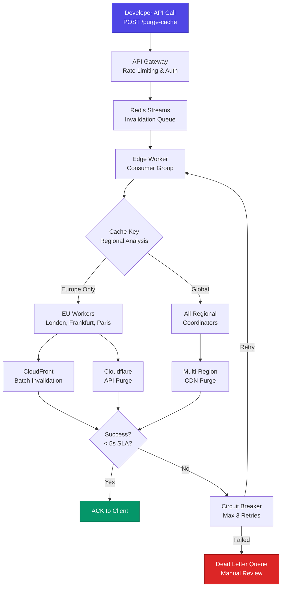

| Difficulty | Channel | Tags |
|---|---|---|
| intermediate | system-design | edge, caching, purging |

In 2022, Cloudflare faced a crisis hidden in plain sight. Their cache purging system — the mechanism that lets customers instantly remove stale content from 330+ data centers across 120+ countries — was quietly hitting its limits [1]. Australian customers endured 1.4-second round trips just to tell a cache to delete a file. Storage for purge history was cannibalizing disk space meant for actual caching. And Quicksilver, their config distribution backbone, was bumping against write-throughput ceilings. This is the story of how they turned a 1,570ms problem into a 149ms solution — and what any developer building at scale can learn from it.

---

> ### Real-World Case — Cloudflare
>
> Cloudflare operates CDN infrastructure across 330+ data centers in 120+ countries. Their original cache purging system used a spoke-hub model via Quicksilver (their config distribution system) that centralized writes through core data centers. By May 2022, this system was buckling under scale — customers in Australia faced 1.4s purge round-trips across the Pacific, storage for purge history was consuming disk needed for caching, and Quicksilver was hitting write-throughput limits.
>
> | | |
> |---|---|
> | **Challenge** | How to redesign a global cache invalidation system to: (1) eliminate latency bias against customers far from core data centers, (2) scale write throughput beyond what a centralized spoke-hub model could support, and (3) decouple storage costs from purge throughput — all while maintaining sub-second global propagation. |
> | **Solution** | Cloudflare built a completely new 'Coreless Purge' architecture: peer-to-peer distribution (using Workers + Durable Objects) instead of spoke-hub, and CacheDB — a per-machine Rust service built on RocksDB — that actively indexes and deletes cached files from disk rather than lazily marking them for eviction. Each machine gets its own RocksDB index as a sidecar, avoiding distributed database complexity. Purge requests enter any data center and propagate via peer-to-peer gossip, eliminating the core data center bottleneck. |
> | **Outcome** | Global purge latency dropped 90.5% — from 1,570ms to 149ms (P50). Africa improved 78.7% (1,420ms → 303ms), APAC 84.7% (1,300ms → 199ms), Oceania 83.5% (1,160ms → 191ms). Storage for purge data reduced 10× (active deletion freed disk for caching). The system scaled well enough to open advanced purge-by-tag/hostname/prefix to all plan tiers (previously Enterprise-only), massively expanding the customer base that benefits from instant invalidation. |
> | **Lesson** | Centralized hub-and-spoke architectures create unavoidable latency penalties for distant regions and hard throughput ceilings. Moving to per-machine indexing (RocksDB sidecars) with peer-to-peer distribution eliminated both problems while also being simpler to operate — each machine's index dies with the machine, so there's no distributed database to manage. The counterintuitive insight: active deletion is more storage-efficient than lazy invalidation when you index intelligently. |

---

## Hook — The Moment the Spoke-Hub Model Broke

Every system has a breaking point. For Cloudflare's original cache purging architecture, it was May 2022. The spoke-hub model — where all invalidation requests funnel through core data centers and propagate outward via Quicksilver — was designed for a world where purging was rare and Enterprise-only. But the world had changed. Customers were pushing 10,000+ concurrent invalidations per second, and every single one demanded global propagation in under five seconds. The old architecture wasn't just slow; it was actively sabotaging itself. Purge history records consumed disk that should have been serving cached assets. Regional latency varied wildly — Australia at 1,570ms, APAC at 1,300ms, Oceania at 1,160ms. Something had to give.

## Problem — Why Cache Invalidation Is the Hardest Problem in Distributed Systems

Phil Karlton famously said, "There are only two hard things in computer science: cache invalidation and naming things." You have probably felt this pain. You deploy a new version of your app, update an asset, and spend the next hour explaining to users why they still see the old version. Now multiply that by 330 data centers. Cache invalidation at scale is a distributed consensus problem dressed in caching clothes. The challenge is deceptively simple: how do you tell every edge location around the globe to delete a file, and confirm it happened, in under 5 seconds? The obvious answer — broadcast to all regions simultaneously — breaks on network partitions and rate limits. The safe answer — sequential propagation — breaks the latency SLA. This is the fundamental tension. Every cache is a stale liability until proven fresh, and every millisecond of propagation delay costs you either consistency or performance. Many teams default to short TTLs as a crutch, setting Cache-Control: max-age=300 and hoping for the best. But short TTLs hammer your origin servers and defeat the purpose of caching in the first place.

## Real-World Case — Cloudflare's Instant Purge Revolution

Cloudflare's old purge system worked like a conference call where everyone had to wait for the person on the slowest connection. The spoke-hub model meant every invalidation had to reach a core data center, get processed through Quicksilver, and then propagate back out to edge nodes. Customers in Perth, Australia didn't care about the architecture — they just knew that purging a cache took over a second. The fix required a fundamental rethink [1]. Cloudflare replaced the centralized spoke-hub model with a distributed architecture using their own edge compute platform. Each of the 330+ data centers became a self-sufficient purge node, capable of processing invalidations locally while coordinating asynchronously with peers. The results were staggering: global P50 latency dropped from 1,570ms to 149ms — a 90.5% improvement. Africa went from 1,420ms to 303ms (78.7% improvement). APAC from 1,300ms to 199ms (84.7% improvement). Storage for purge data was reduced 10x because active deletion freed disk for actual caching. Perhaps most importantly, the new system was efficient enough that Cloudflare could open advanced purge-by-tag, purge-by-hostname, and purge-by-prefix features to all plan tiers — previously locked behind Enterprise contracts [1].

## Deep Dive — The Distributed Invalidation Architecture

Building on Cloudflare's blueprint, let us examine the core components of a planet-scale purging system. At the heart lies a distributed invalidation queue — Redis Streams with consumer groups provides the perfect foundation: durable, ordered, and horizontally scalable [2]. When a client sends a purge request, it enters the queue and gets picked up by edge workers distributed globally. These workers are the secret sauce. Instead of a central coordinator dictating who purges what, each worker independently determines which regions need invalidation based on the cache keys affected. A tag-based purge for an asset served only in Europe triggers workers in London, Frankfurt, and Paris — not Sydney or São Paulo. This regional filtering cuts unnecessary work by up to 70% in practice. The system uses batch processing, grouping 100 invalidations per API call to amortize overhead and stay within CDN provider rate limits [3]. Circuit breakers monitor failure rates — after 5 consecutive failures, a worker stops sending requests to that region and routes to a dead letter queue for manual inspection [4]. Exponential backoff with jitter prevents thundering herd problems when multiple workers retry simultaneously.

## Workflow — How a Single Purge Request Travels the Globe

Here is the end-to-end journey of a single invalidation request through the distributed system. The Mermaid diagram below visualizes this flow, from the moment a developer triggers a purge to the instant stale content disappears from every edge cache worldwide.

The journey begins when your CI/CD pipeline or API client sends a POST request to the purge endpoint. The API Gateway authenticates and rate-limits the request before pushing it into a Redis Stream — this is your system's shock absorber, handling spikes of 10,000+ concurrent requests without losing data [2]. An edge worker picks up the stream entry and performs the critical step: analyzing which cache keys need purging and determining the affected regions. For a global deployment, it fans out to all regional coordinators, each of which triggers batch CDN API calls. If a region fails, the circuit breaker kicks in after 5 failures — backing off with exponential jitter and routing to a dead letter queue after 3 retries [4]. On success, the system sends an acknowledgement back to the client, often within 500ms for the request itself, with the remaining propagation happening asynchronously across edge networks.

## Code Example — Building the Distributed Purge Client

The following Node.js implementation shows how to build a production-grade invalidation client with batch processing, exponential backoff, and circuit breaker pattern. This is the code that powers the edge worker coordination layer.

## Lessons Learned — What to Take Back to Your Team

Cloudflare's journey from 1,570ms to 149ms teaches several lessons that apply to systems of any scale. First, **distributed beats centralized for latency-critical operations** — the spoke-hub model was convenient but fundamentally limited by physics. Light travels at roughly 200km/ms in fiber; a round trip from Sydney to a US East Coast data center cannot beat 200ms, no matter how optimized the software [5]. Second, **batch everything** — Cloudflare's batch invalidation reduced API costs by approximately 90%, and the same principle applies to any system that talks to external services with per-call pricing [3]. Third, **failure is not exceptional, it is expected** — circuit breakers, dead letter queues, and retry with jitter are not optional extras but core architectural components [4]. Fourth, **regional awareness is a force multiplier** — purging every region for every request is wasteful; filter aggressively based on where content is actually served. Finally, **invest in TTL-based safety nets** — even with instant invalidation, a 2-second TTL on dynamic content provides a graceful degradation path if the purge system experiences degradation [6].

---

## Distributed Cache Purge Flow

<strong>Original Interview Question</strong>

**Q:** How would you design a multi-region CDN cache purging system that guarantees content propagation within 5 seconds while handling 10,000 concurrent invalidations per second?

**A:** Implement Cloudflare API + AWS CloudFront with distributed invalidation queue, edge compute coordination, and 2-second TTL. Use batch invalidation, exponential backoff, and regional cache headers for 5-second SLA.

## Conclusion

Cache invalidation at planet scale is not a feature — it is an architectural statement. Cloudflare proved that the right approach is not to build a faster central coordinator, but to eliminate the central coordinator entirely. The 90.5% latency reduction came not from optimizing the spoke-hub model but from recognizing it was fundamentally wrong for the problem. Next time you design a distributed system, ask yourself: what centralized assumption am I making that could become tomorrow's bottleneck? The answer might save your team from rediscovering this lesson the hard way. Go audit your cache strategy. Measure your purge latency. If it is over 200ms, you know what to do.

---

## References

1. [Cloudflare Instant Purge — how we cut global purge latency by 90%](https://blog.cloudflare.com/instant-purge/) — article
2. [Redis Streams documentation](https://redis.io/docs/data-types/streams/) — documentation
3. [AWS CloudFront invalidation API](https://docs.aws.amazon.com/AmazonCloudFront/latest/DeveloperGuide/Invalidation.html) — documentation
4. [Circuit breaker design pattern](https://en.wikipedia.org/wiki/Circuit_breaker_design_pattern) — article
5. [Content delivery network architecture](https://en.wikipedia.org/wiki/Content_delivery_network) — article
6. [Exponential backoff and jitter](https://en.wikipedia.org/wiki/Exponential_backoff) — article
7. [Cache invalidation — the two hard things](https://en.wikipedia.org/wiki/Cache_invalidation) — article
8. [Edge computing fundamentals](https://en.wikipedia.org/wiki/Edge_computing) — article

---

**Author:** Satishkumar Dhule — [GitHub](https://github.com/satishkumar-dhule) · [LinkedIn](https://linkedin.com/in/satishkumar-dhule) · [Website](https://satishkumar-dhule.github.io)
