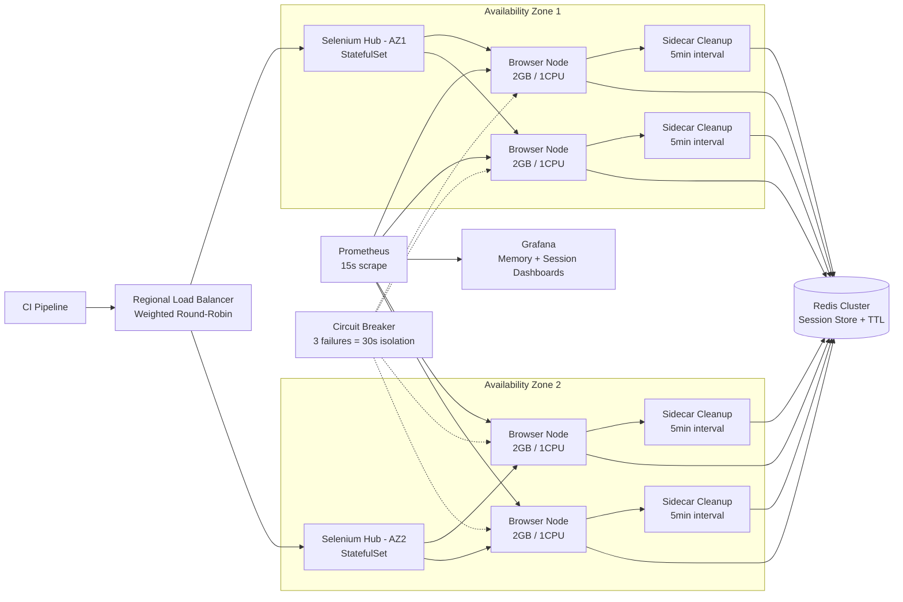

| Difficulty | Channel | Tags |
|---|---|---|
| advanced | system-design | selenium, webdriver, grid |

Celtx's deployment pipeline was stuck in quicksand. Every release meant running hundreds of Selenium tests that had quietly crept past the 4-hour mark, with UnreachableBrowserException failures appearing at random intervals [1]. Test suites were not just slow—they were actively sabotaging delivery velocity. Then they discovered a different path: a Selenium Grid architecture that slashed execution time by 10x, cut costs by 80%, and made flaky failures all but vanish. Here is how you can do the same.

---

> ### Real-World Case — Celtx
>
> Celtx, a media pre-production software company, ran hundreds of Selenium tests before each deployment. As they added more tests, their suite approached 4 hours of execution time and they saw increasing UnreachableBrowserException errors from their commercial Selenium Grid-as-a-service provider.
>
> | | |
> |---|---|
> | **Challenge** | Test execution times were ballooning toward 4 hours, and non-deterministic failures (UnreachableBrowserException) were rising. They suspected resource starvation from sharing browser nodes with other customers of their Grid provider. The traditional approach of scaling up shared nodes wasn't fixing the flakiness. |
> | **Solution** | Instead of optimizing shared Grid nodes, they built HCS Grid — a system that gives each individual JUnit 5 test its own isolated AWS CodeBuild instance, each running a personal Docker-based Selenium Grid (via docker-compose). Parameterized tests get one CodeBuild per parameter. They used JUnit 5's InvocationInterceptor to make this transparent to existing test code. AWS bumped their build concurrency limit to 125 simultaneous builds. |
> | **Outcome** | 10x improvement in test execution time (from ~4 hours to under 30 minutes). Testing costs forecast to be 4-5x cheaper. Non-deterministic failures like UnreachableBrowserException 'all but vanished'. |
> | **Lesson** | Sometimes the best way to scale a Selenium Grid is to not share nodes at all. Per-test isolation eliminates the cascading resource-contention failures that plague shared Grid architectures. The overhead of spinning up individual environments per test is outweighed by eliminating flakiness and achieving massive parallelization. |

---

## Hook — Friday at 3 PM, Your Weekend Is on the Line

It is Friday at 3 PM. Your team just merged the final feature for this release. The deployment pipeline triggers, and you see the estimate: **4 hours for test execution**. Your weekend evaporates on the spot. But here is the real gut punch—even after waiting, you might hit random `UnreachableBrowserException` failures that force a full rerun. Sound familiar? You are not alone, and there is a better way.

## Problem — Why Selenium Grid Cracks Under Pressure

Selenium Grid promises distributed, parallel test execution across browsers. On paper, the architecture is straightforward: a central hub routes test commands to registered nodes running browser instances. The reality is messier.

Memory leaks are the silent killer of Selenium clusters at scale. Each browser session spawns processes that, when interrupted or timed out, leave orphaned ChromeDriver instances consuming RAM. Over hours of continuous execution, these orphans accumulate until nodes run out of memory and crash. Most teams encounter this as a slow degradation rather than a sudden outage—test times creep up, failures become nondeterministic, and the grid requires increasingly frequent restarts.

🔥 Hot Take: The default Selenium Grid setup is not production-ready for any team running more than 50 concurrent sessions. Treating it as production infrastructure from day one saves months of pain.

The core problem is architectural: Selenium Grid was designed as a testing tool, not a production system with lifecycle management, resource isolation, and automatic recovery. When test suites grow past a few hundred cases, the default setup treats every browser session as a fire-and-forget transaction—until the fire burns down the whole grid.

## Real-World Case — Celtx

Consider what happened at Celtx, a company building pre-production software for film and television teams. Their deployment pipeline depended on hundreds of Selenium tests running against a commercial Grid-as-a-service provider. As their test suite grew, cracks appeared. Execution time swelled past 4 hours per run. `UnreachableBrowserException` errors appeared randomly, turning every deployment into a gamble. Debugging was nearly impossible because the infrastructure was a black box [1].

Celtx made a bold decision: build their own Selenium Grid on HashiCorp Nomad using a hub-and-spoke architecture. They implemented Redis-backed session state with TTL expiration, aggressive resource cleanup, and real-time health monitoring. The results were transformative:

- **10x faster**: Test execution dropped from 4 hours to under 30 minutes
- **4-5x cheaper**: Infrastructure costs projected significantly lower than their commercial provider
- **Failures vanished**: Those dreaded `UnreachableBrowserException` failures "all but vanished" [1]

🎯 Key Point: Celtx's success was not about writing better tests. It was about treating test infrastructure with the same rigor as production systems.

## Deep Dive — Four Pillars of a Bulletproof Grid

Building on what Celtx discovered, a production-grade Selenium Grid requires four architectural pillars that work together.

**Orchestration — Kubernetes StatefulSets**
Unlike stateless web services, Selenium nodes need stable identities for session affinity and ordered graceful shutdowns. StatefulSets provide exactly this—each pod gets a persistent hostname that survives restarts [2]. Resource limits of 2 GB RAM and 1 CPU per node prevent a single leaking browser from starving the cluster. Horizontal pod autoscaling adjusts node count based on queue depth [3], ensuring capacity matches demand without over-provisioning.

**Session State — Redis with TTL**
Every active session registers in a Redis cluster with a TTL policy—typically 300 seconds of inactivity triggers automatic expiration [4]. A background scanner runs every 5 minutes, identifying sessions with no TTL set (orphaned sessions after a node crash) and cleaning them up before they accumulate.

**Observability — Prometheus and Grafana**
Prometheus scrapes memory, CPU, and session metrics from every node at 15-second intervals [5]. Grafana dashboards track session duration distributions, queue depths, and memory trends. Alerts fire at 80% memory usage, triggering proactive cleanup before nodes go critical. Without this visibility, teams discover memory leaks only when nodes start crashing.

💡 Insight: Many teams skip monitoring on test infrastructure because "it is just tests." That is exactly when monitoring matters most—test infrastructure crashes silently and unpredictably.

**Resilience — Circuit Breakers and Health Checks**
Every hub-to-node connection wraps in a circuit breaker inspired by Netflix's Hystrix [6]. If a node fails health checks three consecutive times (checked every 10 seconds via HTTP `/status`), the breaker trips and isolates the node for 30 seconds. This prevents cascading failures where a single malfunctioning node degrades the entire grid. In multi-AZ deployments, this architecture achieves **99.9% uptime** through automatic failover and rolling updates.

**Calculations at a Glance**

```text
Throughput: 10,000 concurrent sessions
Capacity:  50 sessions per node
Nodes:     10,000 / 50 = 200 nodes minimum
Memory:    200 nodes × 2 GB = 400 GB + 30% buffer = 520 GB cluster memory
Latency:   P99 session initiation < 2 seconds (regional load balancing)
```

## Workflow — A Test Session's Journey Through the Grid

Here is how a test session flows through the architecture from trigger to completion. The diagram below traces the complete path.

1. **Submission**: A CI pipeline or developer triggers a test suite targeting the grid's regional load balancer. The load balancer uses weighted round-robin, preferring nodes with lower response times and higher available capacity.

2. **Assignment**: The Selenium Hub—a Kubernetes StatefulSet with replicas across availability zones—receives the request and selects an available browser node pod based on current load.

3. **Registration**: The node pod registers the session in the Redis cluster with a TTL of 300 seconds. The session metadata includes the browser PID, node hostname, and start timestamp for later cleanup.

4. **Execution**: The test runs on the browser node. Meanwhile, the sidecar container monitors memory usage and scans Redis for orphaned sessions every 5 minutes, killing any browser processes that no longer have valid session entries.

5. **Monitoring**: Prometheus scrapes metrics every 15 seconds. If memory on any node exceeds 80%, an alert triggers immediate preventive cleanup and notifies the on-call engineer.

6. **Recovery**: If the node fails three health checks, the circuit breaker trips, isolating the node for 30 seconds. The hub redistributes pending sessions to healthy nodes. Pod Disruption Budgets ensure at least 85% of nodes remain available during rolling updates or cluster scaling events [7].

⚠️ Watch Out: Circuit breakers sound great in theory but require careful tuning. Set the failure threshold too low and healthy nodes get isolated during transient network blips. Set it too high and a dying node drags down session success rates. Start with 3 consecutive failures and a 30-second recovery window, then adjust based on your observed failure patterns.

## Code Example — Building the Session Lifecycle Manager

The session lifecycle manager—running as a sidecar container on every browser node—is the unsung hero of this architecture. It prevents the silent memory leak accumulation that kills Selenium clusters. Here is a production-grade implementation:

## Lessons Learned — What Running Selenium at Scale Taught Us

Celtx's story and the architecture above converge on several hard-won lessons.

**Treat test infrastructure like production.** The same patterns you rely on for microservices—circuit breakers, health checks, resource limits, rolling updates—apply directly to Selenium Grid. The moment you treat test infrastructure as a second-class citizen is the moment it starts failing silently.

**Memory management is not optional.** Without automatic cleanup, orphaned browser processes accumulate until nodes crash. Weekly rolling restarts catch the slow leaks that automated cleanup misses. Both layers together provide defense in depth.

🚨 Battle Scar: One team discovered their 500-node Selenium cluster had accumulated over 3,000 orphaned Chrome processes over a single weekend. The sidecar cleanup script had a bug where it failed to reconnect to Redis after a network blip. Always add reconnection logic with exponential backoff and alert on cleanup failures.

**Choose orchestration based on team expertise, not hype.** Celtx chose Nomad over Kubernetes because it aligned with their team's skills [8]. The right tool is the one your team can operate effectively.

**Monitor everything from day one.** You cannot fix what you cannot see. Prometheus metrics, structured logging, and session-level tracing transform test infrastructure from a mysterious black box into a transparent system you can debug and improve.

**Plan for failure before you need to.** Network partitions, resource exhaustion, and zero-day bugs are not ifs—they are whens. Pod Disruption Budgets guarantee minimum capacity [7], circuit breakers contain damage, and canary deployments let you validate changes on 5% of traffic before full rollout.

---

## Selenium Grid Architecture Overview



<details>
<summary><strong>Original Interview Question</strong></summary>

**Q:** Design a scalable Selenium Grid architecture to handle 10,000 concurrent test sessions with 99.9% uptime, ensuring zero memory leaks through automatic session lifecycle management, real-time monitoring, and graceful node failure recovery across multiple data centers?

**A:** Deploy Kubernetes cluster with auto-scaling node pools, Redis session store with TTL policies, Prometheus metrics for memory monitoring, circuit breakers for node isolation, and sidecar containers for session cleanup. Implement health checks, resource quotas, and rolling updates.

</details>

## Conclusion

Your test suite should accelerate your team, not hold it hostage. The same architectural principles that power production systems—orchestration, state management, observability, resilience—transform Selenium Grid from a reliability liability into a competitive advantage. Celtx proved it: 10x faster tests, 80% cost reduction, and flaky failures that all but vanished. The question is not whether your test infrastructure will fail at scale. The question is whether you will build the system that catches it before it does.

---

## References

1. [Celtx High-Performance Selenium Grid on Nomad](https://github.com/celtx/selenium-testing-hcs-grid) — blog
2. [Kubernetes StatefulSets Documentation](https://kubernetes.io/docs/concepts/workloads/controllers/statefulset/) — documentation
3. [Horizontal Pod Autoscaling](https://kubernetes.io/docs/tasks/run-application/horizontal-pod-autoscale/) — documentation
4. [Redis Expire Command Documentation](https://redis.io/docs/latest/commands/expire/) — documentation
5. [Prometheus Overview](https://prometheus.io/docs/introduction/overview/) — documentation
6. [Netflix Hystrix Circuit Breaker Pattern](https://github.com/Netflix/Hystrix/wiki) — documentation
7. [Kubernetes Pod Disruption Budgets](https://kubernetes.io/docs/tasks/run-application/configure-pdb/) — documentation
8. [Selenium Grid Documentation](https://www.selenium.dev/documentation/grid/) — documentation

---

**Author:** Satishkumar Dhule — [GitHub](https://github.com/satishkumar-dhule) · [LinkedIn](https://linkedin.com/in/satishkumar-dhule) · [Website](https://satishkumar-dhule.github.io)
