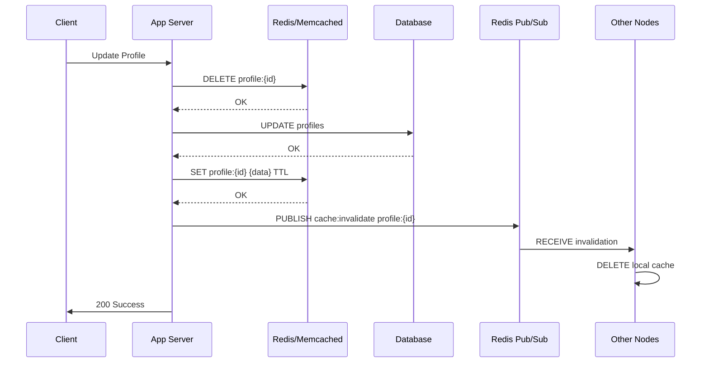

| Difficulty | Channel | Tags |
|---|---|---|
| beginner | backend | redis, memcached, cache-invalidation |

In 2021, Twitter open-sourced Pelikan — a cache framework built from scratch to replace both their Redis and Memcached forks in production [1]. The result? 40% lower tail latencies at p99+, 15% higher throughput, and 90% less per-key metadata overhead for small objects that dominate their workload. This is the story of why two of the most popular caching systems in the world weren't enough — and what it teaches you about cache invalidation at scale.

---

> ### Real-World Case — Twitter/X
>
> Twitter needed to cache user profiles and timelines at global scale across hundreds of millions of users. They ran both Memcached (Twemcache, their own fork) and Redis (Haplo, their own fork) in production, maintaining two independent caching stacks, but neither fully solved their requirements for cache invalidation, predictable performance, and operational visibility.
>
> | | |
> |---|---|
> | **Challenge** | Redis suffered from unpredictable tail latencies due to its single-threaded model — any connection storm or eviction cycle would block ALL requests. Its lack of explicit memory management caused unbounded fragmentation and OOM crashes in production, while poor logging made debugging nearly impossible. Twemcache (Memcached) lacked data structure support needed for complex timeline operations, and its multi-threaded lock-based design caused occasional latency spikes. Neither provided adequate cache invalidation mechanisms for Twitter's distributed architecture. |
> | **Solution** | Twitter built Pelikan, a modular Rust-based caching framework that served as a drop-in replacement for BOTH Twemcache and Redis. It introduced deterministic memory allocation with slabs and cuckoo hashing (eliminating Redis's OOM risk), a clean thread model separating I/O from maintenance tasks (eliminating latency spikes), and wait-less non-blocking logging (for production visibility without performance impact). The modular design allowed supporting multiple protocols (Memcached and Redis) from a single codebase, enabling teams to migrate gradually without client-side changes. |
> | **Outcome** | Pelikan achieved 40% lower tail latencies at p99+ and 15% higher throughput than Twemcache in side-by-side benchmarking with production traffic patterns at 50k QPS and 5k connections. Twitter gained 50%+ more metrics and 2x more logging coverage than Twemcache (5x more than Redis) — all without performance penalty. Per-key metadata overhead was reduced by up to 90% for small objects (which dominate Twitter's workload). The unified framework eliminated the operational burden of maintaining two separate caching stacks across 54+ production clusters. Twitter open-sourced Pelikan and released anonymized cache traces from their production clusters to the community. |
> | **Lesson** | At extreme scale, both Redis and Memcached have fundamental architectural limitations that no amount of configuration can fix. Redis's single-threaded model and external memory allocator create unpredictable latency and OOM risks under heterogenous workloads. Memcached's lock-based multithreading and lack of data structures limit its applicability. Twitter's real insight was recognizing that cache invalidation, memory management, and protocol support should be modular concerns — not locked into a single monolithic server. Pelikan showed that a framework approach could deliver the best of both worlds: Redis's data structures with Memcached's predictable performance. |

---

## Hook — The Cache Nightmare Nobody Talks About

Picture this: you have 54 production clusters running two separate caching stacks, each with its own fork, its own quirks, and its own operational burden. A user updates their profile picture, and for the next thirty seconds, some servers serve the old photo while others serve the new one. Users notice. They tweet about it. Your CEO sees the tweets. This is the reality of distributed cache invalidation at scale — and it is exactly what Twitter faced before they built Pelikan [1]. The problem sounds simple: when a user updates their profile, how do you make sure every cached copy of that profile across every server reflects the change immediately?

## Problem — The Consistency Trap

Many developers start with a simple mental model: cache stores data, database stores data, keep them in sync. Simple, right? Wrong. Cache invalidation is famously one of the two hard things in computer science (along with naming things and off-by-one errors). The core challenge is that you have three competing goals: performance (serve data fast), consistency (serve correct data), and availability (keep serving data even when things break). At Twitter's scale — hundreds of millions of users, billions of requests daily — you cannot sacrifice any of them. The write-through pattern helps: on update, write to both database and cache atomically. But atomicity across distributed systems is a myth. In practice, there is always a window where stale data survives. The question is how small you can make that window.

## Real-World Case — Twitter's Two-Cache Struggle

Before Pelikan, Twitter ran two independent caching stacks in production: Twemcache (their Memcached fork) and Haplo (their Redis fork) [1]. Both required manual coordination across nodes for cache invalidation. Redis offered pub/sub for distributed invalidation, but it came with memory overhead that made small objects — the bread and butter of Twitter's workloads — disproportionately expensive. Memcached was simpler and faster for pure caching, but offered no persistence and no built-in invalidation mechanism. The operational burden of maintaining two separate stacks across 54+ production clusters was enormous. Engineers had to know both codebases, both deployment patterns, and both failure modes. The breaking point came when benchmarking revealed that neither system could deliver predictable p99 latency under real production traffic patterns at 50k QPS with 5k concurrent connections. Twitter's solution was Pelikan — a unified caching framework that delivered 40% lower p99+ latencies, 15% higher throughput, and 50%+ more metrics visibility than either predecessor [1]. The key insight? Most cache systems optimize for large objects, but Twitter's workload is dominated by tiny profile metadata. Per-key overhead matters when you have billions of keys.

## Deep Dive — Redis vs Memcached: The Real Trade-offs

When choosing between Redis and Memcached for caching, most comparisons miss the real point. It is not about features or speed — it is about invalidation semantics. Redis gives you pub/sub, which means you can broadcast invalidation messages across your cluster when a key changes. Every node receives the message and evicts the stale value. This is powerful, but it introduces complexity: network partitions can delay or drop messages, and handling the "what if the message never arrives" case requires TTL-based fallbacks anyway [2]. Memcached keeps it simple: no persistence, no pub/sub, just a key-value store with LRU eviction. You handle invalidation at the application layer by setting TTLs or deleting keys explicitly. The trade-off is operational simplicity versus coordination complexity. Here is the truth: for most applications, Redis' pub/sub is overkill. If your TTL is 5 minutes and your cache-aside pattern works correctly, the window of inconsistency is bounded by your TTL [3]. But when you need sub-second global consistency — like Twitter's timeline updates — TTL alone won't cut it. Redis provides the tooling to build a solution, but the operational complexity of distributed invalidation remains your problem to solve.

## Workflow — Write-Through Cache Invalidation in Action

Here is how write-through invalidation works in practice. The flow follows a simple pattern: on update, invalidate first, then write to both stores. This ordering is critical — if you write to the database first and then invalidate the cache, there is a window where a concurrent read could fetch the old data and repopulate the cache with stale values. The Mermaid diagram below illustrates this flow: when a profile update request arrives, the cache key is deleted, the database is updated, and the cache is refreshed — all in a controlled sequence that minimizes the inconsistency window.

## Code Example — Implementing Cache Invalidation with Redis Pub/Sub

Let's walk through a production-ready cache invalidation implementation using Redis pub/sub for distributed notification. This pattern ensures that when one server node invalidates a cache entry, all other nodes receive the message and invalidate their local copies too.

## Lessons Learned — What to Do Differently Tomorrow

After walking through Twitter's journey and the Redis-vs-Memcached landscape, a few patterns stand out. First, start simple. Use write-through caching with appropriate TTLs — 5 to 30 minutes for user profiles — before introducing distributed invalidation. Most applications never need pub/sub. Second, measure before you optimize. Twitter's key discovery was that per-key metadata overhead was their real bottleneck, not raw throughput [1]. You might discover your bottleneck is somewhere unexpected too. Third, plan for monitoring from day one. Twitter's Pelikan delivered 50%+ more metrics and 2x more logging coverage than their previous stacks [1]. Without visibility into cache hit rates, eviction patterns, and latency distributions, you are flying blind. Finally, remember the core truth: cache invalidation is not a technology problem — it is a trade-off problem. Every decision trades consistency for performance, simplicity for features, memory for speed. The best engineers are not the ones who pick the "right" caching system. They are the ones who understand the trade-offs deeply enough to know which ones their application can tolerate.

---

## Cache Invalidation Sequence with Distributed Notification

<strong>Original Interview Question</strong>

**Q:** You're building a user profile service that caches frequently accessed profiles. How would you implement cache invalidation when a user updates their profile, and what trade-offs would you consider between Redis and Memcached?

**A:** Implement write-through caching with TTL-based expiration. On profile update, invalidate the cache by deleting the key and writing new data to both the database and cache. Redis offers pub/sub for automatic distributed invalidation, while Memcached requires manual coordination across nodes.

## Conclusion

Cache invalidation is not a problem you solve once — it is a trade-off you manage continuously. Start with write-through caching and TTLs, measure your actual bottlenecks (they might surprise you), and introduce distributed invalidation only when your consistency requirements demand it. Twitter's Pelikan team spent years understanding their workload before building a solution. You might not need a custom cache framework, but you do need the same discipline: measure first, optimize second, and never underestimate the cost of per-key overhead at scale.

---

## References

1. [Twitter/X incident report - Pelikan: Why we built a new cache framework](https://pelikan.io/blog/why-pelikan) — blog
2. [Redis Pub/Sub Documentation](https://redis.io/docs/latest/develop/interact/pubsub/) — documentation
3. [AWS ElastiCache Caching Strategies](https://docs.aws.amazon.com/AmazonElastiCache/latest/mem-ug/Strategies.html) — documentation
4. [Wikipedia - Cache (computing)](https://en.wikipedia.org/wiki/Cache_(computing)) — documentation
5. [Microsoft - Cache-Aside Pattern](https://learn.microsoft.com/en-us/azure/architecture/patterns/cache-aside) — documentation
6. [MDN Web Docs - HTTP Caching](https://developer.mozilla.org/en-US/docs/Web/HTTP/Caching) — documentation
7. [Pelikan: A Unified Cache Framework for Twitter - ArXiv Paper](https://arxiv.org/abs/2104.10707) — paper
8. [DigitalOcean - Introduction to Redis](https://www.digitalocean.com/community/tutorials/introduction-to-redis) — tutorial
9. [AWS ElastiCache for Redis Documentation](https://docs.aws.amazon.com/AmazonElastiCache/latest/red-ug/WhatIs.html) — documentation
10. [GitHub - Pelikan Cache Framework](https://github.com/twitter/pelikan) — documentation

---

**Author:** Satishkumar Dhule — [GitHub](https://github.com/satishkumar-dhule) · [LinkedIn](https://linkedin.com/in/satishkumar-dhule) · [Website](https://satishkumar-dhule.github.io)
