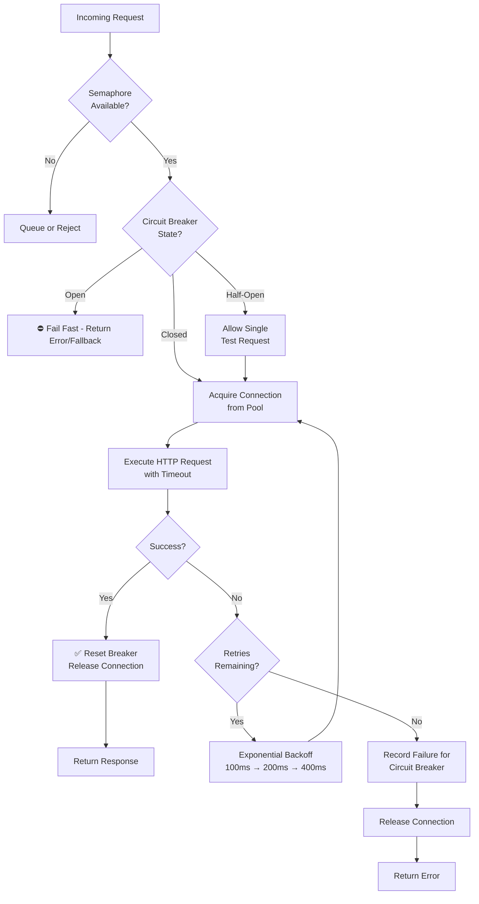

| Difficulty | Channel | Tags |
|---|---|---|
| advanced | backend | asyncio, aiohttp, concurrency |

Imagine your Netflix API handling over 1 billion incoming calls per day, fanning out to billions of dependency requests across 3,000+ servers. Now imagine a single slow database throttling issue cascading through hundreds of microservices, saturating thread pools, and taking down the entire system. This was the reality Netflix engineers faced — and it led to one of the most influential patterns in distributed systems engineering [1].

---

> ### Real-World Case — Netflix
>
> Netflix's SOA had hundreds of microservices where a single slow downstream service would cascade into total system failure. A database throttling issue or a latent dependency would saturate thread pools across the entire call chain, taking down the entire API. At peak, the Netflix API handled 1 billion incoming calls/day fanning out to several billion outgoing calls at 100k+ dependency requests/second across 3000+ servers.
>
> | | |
> |---|---|
> | **Challenge** | A single slow dependency would saturate connection and thread pools across the entire call chain, causing cascading failures. Traditional approaches like increasing timeouts or pool sizes made things worse by letting more requests pile up on failing services. Netflix needed a way to isolate failures, shed load gracefully, and let downstream services recover without taking down the whole system. |
> | **Solution** | Netflix built Hystrix, implementing the circuit breaker pattern with thread-pool and semaphore isolation per dependency. Each downstream service got its own isolated resource pool (bulkhead pattern). Circuit breakers trip when error rates exceed 50% in a 10-second window, immediately failing fast with fallbacks instead of blocking. Semaphores control concurrent access and prevent non-trusted fallbacks from causing damage. Real-time metrics dashboards provide ~1-second latency visibility into all bulkheads. |
> | **Outcome** | Prevented cascading failures across hundreds of microservices handling billions of daily calls. By 2014, Netflix API operated 100+ HystrixCommand types and 40+ thread pools, executing tens of billions of thread-isolated and hundreds of billions of semaphore-isolated calls per day. The pattern became the industry standard for circuit breakers, open-sourced and adopted globally. |
> | **Lesson** | When a dependency becomes latent, increasing thread-pools, queues, or timeouts is the opposite of what you should do — it makes cascading failures worse. Instead, let circuit breakers shed load, fail fast, and release pressure on struggling downstream systems so they can recover. Latency is far more damaging than hard failures because it silently exhausts connection pools. |

---

## Hook — The Cascade That Almost Broke Streaming

Here is a scenario every backend developer dreads: you deploy what looks like an innocent change, and suddenly your pager explodes. Latency spikes. Timeouts cascade. One by one, your services start failing — not because they have bugs, but because a single downstream dependency decided to take a nap. This is not a hypothetical. At Netflix's scale — 100,000+ dependency requests per second across hundreds of microservices — a single slow endpoint could saturate every thread pool in the call chain, turning a database hiccup into a total API outage [1]. The question is not whether this will happen to you. It is whether your system will survive it.

## Problem — The Silent Killer of Distributed Systems

When you make an HTTP call to another service, you are placing trust in that service to respond quickly. That trust is often misplaced. In a typical microservices architecture, a single request might fan out to 10, 20, or 100 downstream services. If any one of those services is slow or unavailable, your threads block, your connection pool dries up, and suddenly every other request — even ones that have nothing to do with the failing service — starts timing out. This is called cascading failure, and it is the most common cause of large-scale outages in distributed systems. Many developers discover this the hard way: during a production incident at 2 AM, watching error rates climb while they scramble to identify which dependency is the culprit.

## Real-World Case — Netflix

By 2014, Netflix's service-oriented architecture had grown so complex that engineers needed a dedicated system just to keep failures from spreading. They built Hystrix: a latency and fault tolerance library designed to isolate points of access between services, stop cascading failures, and provide fallback options. At peak, Netflix's API operated 100+ HystrixCommand types and 40+ thread pools, executing tens of billions of thread-isolated calls and hundreds of billions of semaphore-isolated calls per day [1]. The core insight was deceptively simple: if a downstream service is failing, stop calling it for a while. Give it time to recover. This pattern — the circuit breaker — became the industry standard, open-sourced and adopted by teams worldwide. The same principles that saved Netflix at planetary scale apply equally to a single Python service making HTTP calls to three APIs.

## Deep Dive — The Three Pillars of Graceful Degradation

Building on the Netflix playbook, there are three fundamental mechanisms that protect your services from cascading failures. First, **semaphore-based concurrency limiting**: think of it as a velvet rope at a club — when the pool is full, new requests wait politely instead of crashing the party. Second, **exponential backoff**: when a request fails, retrying immediately is almost never the right answer. You back off — 100ms, 200ms, 400ms, 800ms — giving the downstream service room to breathe. Third, **the circuit breaker**: after N consecutive failures within a time window, the circuit trips to open. New requests fail fast (return an error or fallback immediately) instead of waiting for a timeout. After a recovery period, the circuit transitions to half-open, allowing a single test request through. If it succeeds, the circuit closes and normal operation resumes. These three patterns work together like a immune system for your architecture, each reinforcing the others.

## Workflow — From Request to Resilient Response

Here is how a resilient connection pool processes a request through each layer of defense. The Mermaid diagram below visualizes the complete flow — follow it as you read through the steps.

1. **Semaphore check**: The request attempts to acquire a semaphore slot. If the pool is saturated, the request is queued or rejected immediately rather than blocking a thread indefinitely.
2. **Circuit breaker inspection**: Before making any network call, check the breaker state. If it is open, fail fast — do not even attempt the request.
3. **Connection acquisition**: Pull a connection from the pool. Healthy pools use keepalive to reuse TCP connections and reduce overhead.
4. **Execute with timeout**: Fire the HTTP request with a strict timeout. No request should wait longer than your SLA permits.
5. **Success handling**: Reset the circuit breaker failure counter, release the connection back to the pool, return the response.
6. **Failure handling**: If the request times out or fails, decrement the retry budget. If retries remain, wait with exponential backoff and retry. If no retries remain, record the failure for the circuit breaker and return an error.

## Code Example — Production-Grade Connection Pool Manager

The code below implements all three patterns — semaphore limiting, exponential backoff, and circuit breaker — in a reusable Python class. This is not a toy example; it follows the same architectural principles Netflix codified in Hystrix, adapted for Python's async ecosystem.

## Lessons Learned — What Netflix Taught the Industry

The patterns that saved Netflix at global scale apply at every level of software engineering. Here are the takeaways you should carry into your next project:

- **Fail fast is better than fail slow**. A request that fails immediately frees resources for requests that can succeed. A request that blocks for 30 seconds waiting for a timeout is a resource leak in slow motion.
- **Protect your dependencies from each other**. A shared connection pool without isolation means one slow service can starve every other service of connections. Use separate pools or semaphores per dependency.
- **Timeouts are not optional**. Every HTTP call needs a timeout. Not having one is like driving without brakes — you will eventually crash.
- **Circuit breakers need recovery logic**. An open circuit that never closes is just a permanent kill switch. Always implement half-open testing to detect recovery.
- **Monitor the right metrics**. Track pool utilization, circuit breaker state transitions, retry rates, and timeout distribution. These are your early warning system.
- **Graceful degradation beats total failure**. A degraded experience is infinitely better than a 503. Cache stale data. Return partial results. Give users something rather than nothing.

---

## Connection Pool Flow with Circuit Breaker

<strong>Original Interview Question</strong>

**Q:** How would you implement a connection pool manager for aiohttp that handles graceful degradation under high load and connection timeouts?

**A:** Implement a connection pool manager for aiohttp using a semaphore to limit concurrent connections, exponential backoff for retrying failed requests, and circuit breaker pattern to gracefully degrade under high load and connection timeouts.

## Conclusion

Netflix's war story is not about a problem unique to hyperscale — it is a warning for every team building distributed systems. The same patterns that protected billions of calls at Netflix will protect your 10-service architecture today. Start small: add timeouts to your HTTP calls, then introduce a semaphore, then wire in a circuit breaker. Do not wait for the cascade. By the time you see the pager, it is already too late.

---

## References

1. [Netflix Hystrix Operations Wiki](https://github.com/Netflix/Hystrix/wiki/Operations) — documentation
2. [Circuit Breaker Pattern by Martin Fowler](https://martinfowler.com/bliki/CircuitBreaker.html) — blog
3. [aiohttp Client Advanced Usage](https://docs.aiohttp.org/en/stable/client_advanced.html) — documentation
4. [Python asyncio Documentation](https://docs.python.org/3/library/asyncio.html) — documentation
5. [Timeouts, Retries, and Backoff with Jitter — AWS Builders Library](https://aws.amazon.com/builders-library/timeouts-retries-and-backoff-with-jitter/) — blog
6. [Semaphore — Wikipedia](https://en.wikipedia.org/wiki/Semaphore_(programming)) — article
7. [Connection Pool — Wikipedia](https://en.wikipedia.org/wiki/Connection_pool) — article
8. [Netflix Hystrix GitHub Repository](https://github.com/Netflix/Hystrix) — documentation

---

**Author:** Satishkumar Dhule — [GitHub](https://github.com/satishkumar-dhule) · [LinkedIn](https://linkedin.com/in/satishkumar-dhule) · [Website](https://satishkumar-dhule.github.io)
