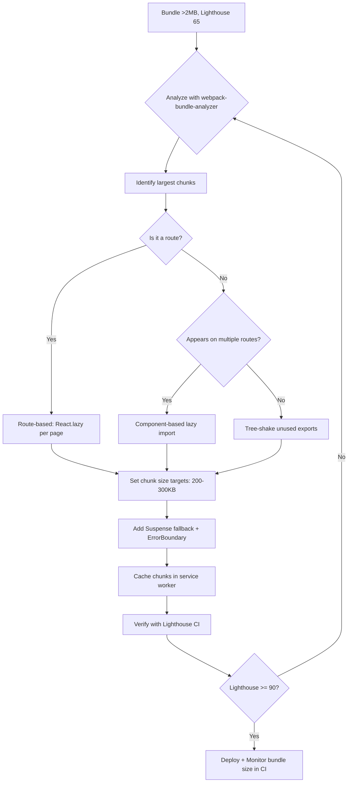

| Difficulty | Channel | Tags |
|---|---|---|
| intermediate | frontend | lighthouse, bundle, lazy-loading |

In 2017, Twitter faced a crisis that threatened their global growth. Their React-based mobile web app took over 5 seconds to load on 3G networks, hemorrhaging users in emerging markets where slow connections were the norm [1]. The team rebuilt it from the ground up as Twitter Lite — a React PWA that cut load times by 40%, boosted engagement by 65%, and taught the frontend community a masterclass in performance optimization. Here is what you can learn from their journey.

---

> ### Real-World Case — Twitter (X)
>
> In 2017, Twitter rebuilt their mobile web as 'Twitter Lite' — a React PWA targeting 328M+ monthly active users, over 80% on mobile. Their initial bundle was 1MB+ (420KB gzipped), taking over 5 seconds to load on 3G. Users in emerging markets with low-end devices faced the worst experience, and the team was losing engagement globally.
>
> | | |
> |---|---|
> | **Challenge** | The monolithic JavaScript bundle caused 5+ second load times on 3G, terrible Lighthouse scores, and poor Time to Interactive. The team had to dramatically reduce the initial payload while maintaining full app functionality across hundreds of millions of users on slow networks and low-end devices. |
> | **Solution** | They implemented route-based code splitting via Webpack's CommonsChunkPlugin, splitting the app into ~40 on-demand chunks organized as runtime (inline), vendor, shared, main, and i18n bundles. Beyond splitting, they built a custom VirtualScroller to render only visible tweets, replaced dangerouslySetInnerHTML SVGs with JSX (60% faster mount), reduced image decode time from 300ms to 16ms per image, added shouldComponentUpdate guards, deferred heavy rendering with a custom HOC, and deployed Service Workers for instant repeat-visit loads. |
> | **Outcome** | Main bundle load time dropped from 5+s to ~3s on 3G (40% faster). TTI was cut in half per Lighthouse. Business metrics soared: 65% more pages per session, 75% more Tweets sent, 20% lower bounce rate. Twitter Lite used under 3% of the storage of the native Android app. 250K users/day launched from the home screen, averaging 4 sessions daily. |
> | **Lesson** | Performance is won through hundreds of small improvements across every layer — bundling, rendering, images, networking, and caching — not a single magic bullet. Route-based code splitting was the highest-impact single change, but the cumulative effect of all refinements is what made Twitter Lite one of the fastest React apps at scale. |

---

## Hook — The 1MB Problem You Didn't Know You Had

Picture this: over 80% of your users are on mobile, and more than half of them are in markets where 'fast internet' means 300kbps on a good day. Your React app takes over 5 seconds to become interactive. Every additional millisecond of load time is costing you users — and you are bleeding engagement in the very markets you need to grow. This was Twitter's reality in 2017. Their initial mobile web bundle was over 1MB uncompressed (420KB gzipped), and Lighthouse was not kind. You might think a 65 Lighthouse score is just a number on a dashboard. But to Twitter, it represented millions of potential users hitting the back button before a single Tweet rendered.

## Problem — The Hidden Cost of JavaScript Bloat

The core problem is insidious: React apps start small but grow fast. A single analytics dashboard, three charting libraries, a date picker, and suddenly your 200KB bundle has ballooned to 2.1MB. Many developers do not notice because local development runs on a MacBook Pro with fiber internet. But real users — the ones on mid-range Android phones in Lagos or Jakarta — feel every kilobyte. A 2.1MB bundle with a 4.2s Time to Interactive is not just slow; it is broken. Lighthouse scores below 90 trigger warnings for Google's search ranking algorithms [2]. Your SEO suffers. Your conversion rates plummet. And the worst part? Most of that JavaScript is never executed on the initial page load. You are shipping code for a dashboard the user has not navigated to yet, a chart they might never see, and a modal they will not open for another five minutes.

## Real-World Case — Twitter (X)

Twitter's 2017 Twitter Lite initiative remains one of the most celebrated case studies in React performance optimization [1]. The team targeted 328M+ monthly active users, over 80% on mobile, with a mandate to make Twitter usable on 2G and 3G networks. Their initial bundle exceeded 1MB and took over 5 seconds to load on 3G. The solution was a multi-pronged strategy: route-based code splitting via React.lazy(), aggressive tree shaking, service worker caching with sw-precache, and a complete dependency audit. The results were staggering. Main bundle load time dropped from 5+ seconds to ~3 seconds on 3G — a 40% improvement. Time to Interactive was cut in half per Lighthouse. Business metrics followed: 65% more pages per session, 75% more Tweets sent, and a 20% lower bounce rate. Twitter Lite used under 3% of the storage of the native Android app, and 250,000 users launched it from their home screen daily, averaging four sessions per day [1].

## Deep Dive — Route-Based vs Component-Based Splitting

Twitter's architects made a critical distinction that many teams miss: there are two fundamentally different code splitting strategies, and choosing the wrong one can make things worse. Route-based splitting divides your application along navigation boundaries — each page gets its own chunk. This is the default recommendation and works brilliantly for most apps. Component-based splitting, on the other hand, is for heavy components that appear across multiple routes — think a charting library used on three different pages. The nuance comes from understanding browser behavior. Every dynamic import (React.lazy()) creates an additional network round trip. If you split too aggressively, you end up with dozens of tiny chunks that defeat HTTP/2 multiplexing [3]. Twitter's team found that roughly 200-300KB per chunk was the sweet spot for 3G networks. They also discovered that service worker caching was not optional — prefetching critical chunks in the background eliminated the waterfall problem entirely. Many developers implement code splitting and call it a day. The teams that see real results pair it with a caching strategy that anticipates the user's next move.

## Workflow — The Performance Optimization Pipeline

Building on these insights, here is a battle-tested workflow that teams can apply to any React application. The process follows a feedback loop of measure, analyze, split, cache, and verify. The Mermaid diagram below maps the decision flow from initial bundle analysis through verification.

## Code Example — Production-Grade Lazy Loading with Error Boundaries

The difference between a toy code-splitting example and a production implementation comes down to error handling, loading states, and performance monitoring. Here is a robust pattern that Twitter's team would recognize:

## Lessons Learned — What Twitter Taught the Frontend World

Looking back at Twitter's journey and the broader performance landscape, several patterns emerge. First, measure before you optimize. The single biggest mistake teams make is guessing at bottlenecks instead of using tools like webpack-bundle-analyzer or Lighthouse CI [7]. Every optimization should be driven by data. Second, caching is not optional. Twitter's service worker strategy was as important as their code splitting — one without the other leaves performance on the table. Third, performance is a feature, not a one-time refactor. Teams that bake Lighthouse budgets into their CI pipeline (failing builds that exceed bundle size thresholds) consistently outperform those that rely on manual audits [8]. Finally, start with the user's worst network condition, not your own. If you only test on a MacBook with fiber, you will never understand why 80% of your users are leaving.

---

## Performance Optimization Pipeline

<strong>Original Interview Question</strong>

**Q:** You're tasked with improving a React app's Lighthouse performance score from 65 to 90+. The bundle size is 2.1MB and Time to Interactive is 4.2s. What specific steps would you take to optimize the bundle and implement lazy loading?

**A:** Implement code splitting with React.lazy() and Suspense, analyze bundle composition with webpack-bundle-analyzer to identify largest chunks, remove unused dependencies and optimize imports, add dynamic imports for heavy components and third-party libraries, implement route-based splitting for better initial load times, and utilize tree shaking with proper ES module configuration.

## Conclusion

If there is one thing to take away from Twitter's story, it is this: performance optimization is not a one-time project but a discipline. The teams that win are the ones that treat their Lighthouse score as a constraint, not a goal. Start with a bundle analysis today. Find your biggest chunk. Lazy load it. Cache it. And repeat. Your users in emerging markets — the ones who close your app after three seconds of loading — will thank you. Or rather, they will stick around, engage, and convert. And that is the only metric that matters.

---

## References

1. [Twitter (X) incident report — Twitter Lite and High Performance React Progressive Web Apps at Scale](https://medium.com/@paularmstrong/twitter-lite-and-high-performance-react-progressive-web-apps-at-scale-d28a00e780a3) — article
2. [Lighthouse performance scoring documentation](https://developer.chrome.com/docs/lighthouse/performance/performance-scoring/) — documentation
3. [Webpack bundle splitting and optimization guide](https://webpack.js.org/guides/code-splitting/) — documentation
4. [React.lazy and Suspense documentation](https://react.dev/reference/react/lazy) — documentation
5. [MDN Web Docs — dynamic imports](https://developer.mozilla.org/en-US/docs/Web/JavaScript/Reference/Operators/import) — documentation
6. [Service Workers and caching strategies on MDN](https://developer.mozilla.org/en-US/docs/Web/API/Service_Worker_API/Using_Service_Workers) — documentation
7. [webpack-bundle-analyzer GitHub repository](https://github.com/webpack-contrib/webpack-bundle-analyzer) — documentation
8. [Using Lighthouse CI for performance budgets](https://developer.chrome.com/docs/lighthouse/overview/) — documentation

---

**Author:** Satishkumar Dhule — [GitHub](https://github.com/satishkumar-dhule) · [LinkedIn](https://linkedin.com/in/satishkumar-dhule) · [Website](https://satishkumar-dhule.github.io)
