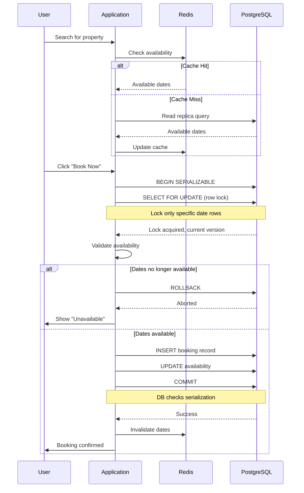

| Difficulty | Channel | Tags |
|---|---|---|
| intermediate | database | acid, isolation-levels, mvcc |

On November 15, 2022, the internet broke. Not literally — but for millions of Taylor Swift fans waiting for Eras Tour presale access, it sure felt that way. Ticketmaster's systems were hit with 3.5 billion requests in a single day as 14 million users — including armies of scalper bots — fought for 2.4 million tickets [1]. The site crashed within an hour. The general public on-sale was canceled. And here is the part that should make every developer sit up straight: the core problem wasn't just traffic. It was a database design problem hiding in plain sight. When thousands of users want the same resource simultaneously and your transaction handling treats that as a surprise, no amount of autoscaling will save you. This is the story of why database isolation levels matter — and how they can make or break a system under fire.

---

> ### Real-World Case — Ticketmaster
>
> On November 15, 2022, Ticketmaster opened presale for Taylor Swift's Eras Tour. 3.5 million fans had registered for Verified Fan access, but when the sale went live, 14 million users (including scalper bots) hit the site simultaneously, generating 3.5 billion system requests — 4x the previous peak. The site crashed within an hour, and the general public on-sale was eventually canceled.
>
> | | |
> |---|---|
> | **Challenge** | Ticketmaster's seat reservation system couldn't handle extreme concurrent demand for a finite inventory (~2.4M tickets vs 14M+ requests). When users selected seats, a temporary hold was placed with a TTL, but cascading failures from overloaded payment processing dependencies caused checkout failures. Released seats were immediately re-carted by waiting users, creating a thundering-herd feedback loop of lock contention and release that effectively self-DDOS'd the database. |
> | **Solution** | The industry postmortem revealed the need for: (1) a virtual waiting queue to strictly control admission rate into the booking system, (2) circuit breakers around external payment dependencies to prevent cascading failures, (3) Redis-based distributed locks with TTL for ephemeral seat holds backed by PostgreSQL SELECT FOR UPDATE as the atomic source of truth, and (4) staggering high-demand sales across multiple days instead of a single-day onsale. |
> | **Outcome** | 2.4 million tickets were sold (a single-day record), but millions of fans got nothing. The general sale was canceled. The controversy led to a US Senate Judiciary Committee hearing, multiple state laws targeting scalper bots and hidden fees, and ultimately a DOJ antitrust lawsuit against Live Nation-Ticketmaster seeking to dissolve the 2010 merger. In April 2026, a federal jury found Live Nation liable for operating an illegal monopoly. |
> | **Lesson** | When demand exceeds supply by 6x, no amount of database-level locking can save you if the admission layer itself is the bottleneck. A booking system's concurrency control must span the entire stack — admission queue, distributed locks, database atomicity, and circuit breakers for external dependencies — not just the final database transaction. |

---

## Hook — The Day Ticketmaster Met Its Match

Picture this: you are the engineer on call when 3.5 billion requests hit your infrastructure. That is 40,000 requests per second — four times anything your system has ever seen [1]. Ticketmaster had prepared for high demand. They had Verified Fan registration, queuing systems, and what they thought was a scalable architecture. None of it mattered. Within an hour, the site was crippled. The aftermath? A Senate Judiciary Committee hearing, multiple state laws, a DOJ antitrust lawsuit, and a federal jury finding Live Nation liable for operating an illegal monopoly in April 2026 [1]. For developers, the lesson is brutal but clear: when your database can't handle concurrent access to shared resources, the entire business comes crashing down. The Taylor Swift ticket fiasco is not a story about too much traffic. It is a story about what happens when transactions fail at scale.

## Problem — The Double Booking Nightmare

Every booking system faces the same fundamental challenge: multiple users want the same limited resource at the same time. For Airbnb hosts, it is a property with a popular weekend date. For airlines, it is the last seat on a flight. For concert venues, it is front-row tickets. The naive approach — check availability, then book — has a fatal flaw. Between the check and the book, another transaction can swoop in and claim the resource. This is a classic race condition, and it manifests as the dreaded double booking. Many developers discover this the hard way when their application works perfectly in development but collapses under production load. The stakes are high: double bookings mean angry customers, chargebacks, reputational damage, and in Ticketmaster's case, federal scrutiny. The root cause is almost always the same: insufficient transaction isolation and a misunderstanding of how databases actually handle concurrency.

## Real-World Case — What Broke Inside Ticketmaster's Database

Let us go deeper into what actually happened at Ticketmaster. The Verified Fan system was designed to filter bots from real fans. 3.5 million people registered. That should have been manageable. But when the presale launched, 14 million users — including bot networks — flooded the system, generating 3.5 billion total requests [1]. The queue system, designed to throttle traffic, was overwhelmed. But here is the technical insight: even if the queue held, the booking engine had a deeper problem. Ticketmaster's architecture relied on checking ticket availability against inventory caches before writing bookings. Under normal load, this works. Under 40,000 req/s, cache reads returned stale data, multiple users saw the same tickets as available, and the database's default transaction isolation could not prevent conflicting writes. The result was over-selling, voided orders, and a complete loss of trust. The general on-sale was canceled because they could not guarantee inventory accuracy. When your transaction handling fails at scale, you do not just lose sales — you lose your license to operate.

## Deep Dive — SERIALIZABLE Isolation and the Battle Against Race Conditions

This leads to the core technical question: how do you prevent two users from booking the same resource when both transactions execute at nearly the same instant? The answer lies in understanding PostgreSQL's isolation levels and how they interact with concurrent access patterns [2].

**READ COMMITTED** (PostgreSQL's default) guarantees you will never see uncommitted data. But it does not prevent phantom reads — where a second transaction inserts a row that your first transaction already checked. In a booking system, this means User A checks availability, finds dates free, and while they fill in payment details, User B swoops in and books those same dates. Both see availability. Both book. Both get confirmation emails. Then the fire starts.

**REPEATABLE READ** prevents dirty reads and non-repeatable reads, but still allows serialization anomalies in certain edge cases [2]. In PostgreSQL, REPEATABLE READ actually prevents most anomalies, but it can still fail under specific concurrent write patterns.

**SERIALIZABLE** is the nuclear option. It guarantees that concurrent transactions execute as if they ran one after another — even though the database runs them in parallel [2]. PostgreSQL implements this using Serializable Snapshot Isolation (SSI), which detects read-write conflicts across transactions and aborts one when a serialization anomaly would occur. Here is the plot twist though: SERIALIZABLE does not mean you write simpler code. It means the database will abort transactions when it detects conflicts, and your application must retry them. This is where optimistic concurrency control comes in [5].

Optimistic concurrency control (OCC) flips the traditional approach. Instead of locking everything preemptively (pessimistic), you let transactions run, then check for conflicts at commit time [5]. If a conflict is detected, one transaction is aborted and retried. This works brilliantly for booking systems because most of the time, users want different properties. Conflicts are rare. Paying the cost of a lock on every read is wasteful when only 1% of transactions actually contend for the same resource.

**MVCC** (Multiversion Concurrency Control) is the engine that makes all of this possible [4]. PostgreSQL maintains multiple versions of each row. Readers never block writers, and writers never block readers. Each transaction sees a snapshot of the database as of a specific point in time. This is why availability checks can run on read replicas without blocking active bookings — the replicas see a consistent snapshot that guides users to available properties without ever locking the primary database for read operations.

The performance strategy combines three layers:
- **Read replicas** for availability checks: users can browse and search properties without touching the primary database
- **Row-level locking with SELECT FOR UPDATE** at booking time: when a user decides to book, the transaction locks only the specific date rows they need [3]
- **Write-through caching**: a Redis layer caches availability data with TTL-based invalidation; successful bookings invalidate the relevant cache keys immediately

The key insight is that most database contention problems in booking systems are not about too many writes. They are about reads that happen between writes. SERIALIZABLE isolation closes that window by detecting when a read is no longer valid by the time the transaction commits.

## Workflow — From Availability Check to Confirmed Booking

Here is the step-by-step journey of a booking request through a properly designed system:

**Step 1 — Availability Check (Cache):** The user searches for properties. The application queries Redis for available dates. If cached, return immediately. If not, fall back to a read replica.

**Step 2 — Initiate Booking:** The user clicks "Book Now." The application begins a transaction with SERIALIZABLE isolation level on the primary database.

**Step 3 — Row-Level Lock:** Inside the transaction, the application executes SELECT FOR UPDATE on the specific property's availability rows for the requested date range [3]. This locks only those rows — other users can still book different dates for the same property.

**Step 4 — Validation:** The application checks that all requested dates are still available. If any have been taken since the initial check, the transaction rolls back and notifies the user.

**Step 5 — Write Operations:** The application inserts the booking record and updates the availability calendar, incrementing the version counter for optimistic locking.

**Step 6 — Commit or Abort:** The database checks for serialization conflicts. If none, commit. If a conflict exists, abort and the application retries with exponential backoff.

**Step 7 — Cache Invalidation:** On successful commit, the application invalidates the cached availability for the booked dates, ensuring subsequent reads see accurate data.

The diagram below visualizes this flow — notice how the critical path is the transaction lifecycle, not just the query execution.

## Code Example — Building a Resilient Booking Transaction in Python

The theory is important, but here is where it becomes real. The following Python function implements a booking transaction using psycopg2 with PostgreSQL's SERIALIZABLE isolation, row-level locking, and exponential backoff retry logic.

## Lessons Learned — What Every Developer Should Take Away

If there is one insight to share with your team tomorrow, it is this: **your default transaction isolation is probably wrong for your most critical operations.** PostgreSQL defaults to READ COMMITTED, which is fine for most reads. But for operations where two users should never get the same resource, SERIALIZABLE is worth the retry overhead.

🔥 **Hot Take:** Optimistic concurrency is almost always the right default for booking systems. Pessimistic locking (locking the entire table) kills throughput. Row-level locks with SELECT FOR UPDATE give you precision without the global bottleneck [3].

⚠️ **Watch Out:** Read replicas are great for browsing, but never for booking decisions. A user who sees availability on a replica that is milliseconds behind the primary might try to book something already taken. Use replicas for reads, but always validate against the primary within the transaction [7].

💡 **Insight:** The retry pattern is not optional — it is part of your data model. If you use SERIALIZABLE isolation without retry logic, your application will randomly fail under load and you will have no idea why. Build retry with exponential backoff from day one [5].

🎯 **Key Point:** Cache invalidation on successful writes is more important than cache population on reads. A stale cache showing unavailable dates as available is fine (the transaction will fail). A stale cache showing available dates as unavailable loses revenue. Invalidate aggressively on write.

The Ticketmaster story is not unique. It happens to companies of every size because database transactions are deceptively simple in tutorials and brutally complex in production. The difference between a system that melts under 40,000 req/s and one that gracefully sheds load is not server count — it is understanding what your database actually guarantees when multiple transactions hit the same row at the same instant [6].

---

## Booking Transaction Flow with SERIALIZABLE Isolation

<strong>Original Interview Question</strong>

**Q:** You're building a booking system for Airbnb where multiple users can reserve the same property simultaneously. How would you design the transaction handling to prevent double bookings while maintaining high availability?

**A:** Use SERIALIZABLE isolation with optimistic concurrency control. Implement row-level locks on property availability tables, use MVCC snapshot reads for checking availability, and apply application-level validation to ensure atomic booking operations.

## Conclusion

The next time your team debates whether to use SERIALIZABLE isolation or stick with the default, remember the 3.5 billion requests that brought Ticketmaster to its knees. Database transactions are not just an implementation detail — they are a business decision. Every double booking, every crashed checkout flow, every angry customer email traces back to a transaction that was not properly isolated. Start by identifying your most contention-heavy write paths. Add SERIALIZABLE isolation with retry logic. Implement row-level locks instead of table locks. And always, always invalidate your caches on write. The code you deploy today determines whether your system survives tomorrow's traffic spike. Make sure it does not become the next Senate hearing.

---

## References

1. [Taylor Swift–Ticketmaster Controversy](https://en.wikipedia.org/wiki/Taylor_Swift%E2%80%93Ticketmaster_controversy) — article
2. [PostgreSQL Transaction Isolation](https://www.postgresql.org/docs/current/transaction-iso.html) — documentation
3. [PostgreSQL Explicit Locking](https://www.postgresql.org/docs/current/explicit-locking.html) — documentation
4. [PostgreSQL MVCC](https://www.postgresql.org/docs/current/mvcc.html) — documentation
5. [Optimistic Concurrency Control](https://en.wikipedia.org/wiki/Optimistic_concurrency_control) — article
6. [ACID Properties](https://en.wikipedia.org/wiki/ACID) — article
7. [Isolation (Database Systems)](https://en.wikipedia.org/wiki/Isolation_(database_systems)) — article
8. [Working with PostgreSQL on Amazon RDS](https://docs.aws.amazon.com/AmazonRDS/latest/UserGuide/CHAP_PostgreSQL.html) — documentation

---

**Author:** Satishkumar Dhule — [GitHub](https://github.com/satishkumar-dhule) · [LinkedIn](https://linkedin.com/in/satishkumar-dhule) · [Website](https://satishkumar-dhule.github.io)
