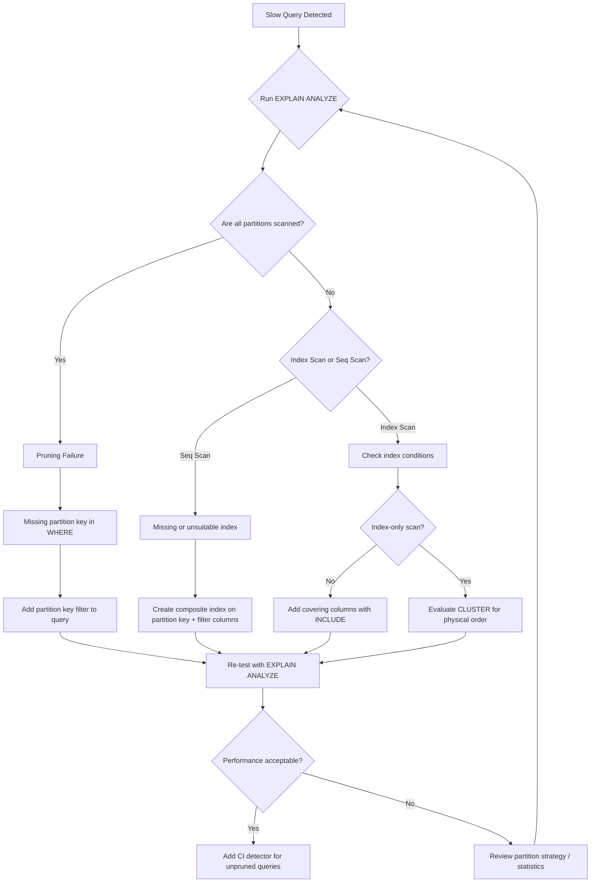

| Difficulty | Channel | Tags |
|---|---|---|
| intermediate | database | explain, query-plan, partitioning |

In March 2026, GitLab's database team watched in horror as a routine partition rotation triggered cascading failures across their CI infrastructure [1]. New Sidekiq jobs stalled, database replicas saturated, and two Severity 2 incidents (INC-8367 and INC-8474) lit up their dashboards. The culprit? A pattern so subtle that most teams never see it coming — until it is too late. If you manage partitioned tables with 10M+ rows, this story could save your weekend.

---

> ### Real-World Case — GitLab
>
> GitLab's CI database tables (p_ci_builds) were partitioned, but many high-frequency production queries lacked partition key filters. When a new partition was automatically added, unpruned queries suddenly had to scan one more partition, pushing LockManager LWLock contention past a critical threshold and triggering two Severity 2 incidents (INC-8367, INC-8474) in March 2026. Sidekiq job processing slowed dramatically and database replicas became saturated.
>
> | | |
> |---|---|
> | **Challenge** | High-volume queries to partitioned CI tables lacked partition_id filters, causing full cross-partition scans. As partitions grew, each non-pruned query acquired locks on every partition and its indexes, creating LockManager LWLock saturation that caused Sidekiq queueing delays and CI job status lag across multiple shards. |
> | **Solution** | Identified and fixed the highest-call-rate unpruned queries by adding partition_id filters (starting with PipelineProcessWorker), built Redis-based caching for partition routing, created automated CI tooling to detect and block new unpruned queries from being merged, and temporarily disabled automatic partition creation until all high-volume queries were confirmed to prune partitions. |
> | **Outcome** | LockManager LWLock contention was reduced, Sidekiq queueing delays resolved, and GitLab re-established confidence in partition creation — but only after building systematic tooling (pg_stat_statements analysis, CI pipeline detectors) to prevent unpruned queries from reaching production. |
> | **Lesson** | Partitioning can make performance WORSE than a flat table if queries don't include the partition key. Each additional partition adds lock acquisition overhead for unpruned queries. Always verify partition pruning in EXPLAIN plans before deploying queries against partitioned tables — and build automated guardrails to catch violations in CI. |

---

## Hook — The Partition That Broke Production

Partitioning is supposed to make your database faster. Smaller tables, targeted scans, automatic pruning — you learned these promises in every Postgres tutorial. But here is the ugly truth that those tutorials never mention: partitioning only helps queries that actually use the partition key. Queries that forget the key? They do not just stay the same speed. They get slower. Every. Single. Month.

When GitLab's CI pipeline rotated in a new partition for `p_ci_builds`, every unpruned query suddenly had one more partition to scan. LockManager LWLock contention spiked past the breaking point. Sidekiq job processing ground to a halt. The fix was not rolling back the partition — the fix was finding and fixing every query that skipped the partition key filter. And that required building entirely new tooling to detect unpruned queries before they reached production [1].

## Problem — Why Your Partitioned Queries Still Crawl

You have a Postgres table with 100M rows, partitioned by date. You run a query filtering on a specific date range. It should be fast — after all, partition pruning should eliminate every partition except the one you need. But it crawls. Sound familiar?

Many developers assume partitioning is a performance silver bullet. You add `PARTITION BY RANGE (event_date)`, celebrate the clean schema, and move on. Months later, your monitoring starts showing slow queries on tables that were supposed to be optimized. You dig into the EXPLAIN plan and discover something unsettling: Postgres is scanning every partition, not just the relevant one.

The core pain is not partitioning itself. It is a mismatch between how you partitioned and how your application queries. If your WHERE clause references `status = 'completed'` but never includes `event_date`, Postgres cannot prune. It must visit every partition sequentially. And if those partitions use indexes? Even worse — the planner might choose sequential scans across all of them, assuming the cost of 10+ index lookups exceeds a brute-force sweep.

This is not a Postgres bug. It is a design gap between the schema you created and the queries your application actually runs. And it festers silently until the data grows large enough to matter.

## Real-World Case — GitLab's Unpruned Query Crisis

GitLab runs one of the largest self-managed Postgres deployments in the world. Their CI database tables — specifically `p_ci_builds` — are partitioned by time to manage the enormous write throughput from millions of pipeline executions. The partitioning strategy was solid. The problem was invisible until it broke.

In March 2026, a scheduled maintenance task added a new partition to `p_ci_builds`. This was normal. But GitLab discovered that many high-frequency production queries did not include partition key filters. Every unpruned query had been scanning N partitions. After the rotation, it had to scan N+1. This incremental increase pushed LockManager LWLock contention past a critical threshold, causing two Severity 2 incidents [1].

Sidekiq — the backbone of GitLab's async job processing — slowed to a crawl. Database replicas became saturated trying to serve unpruned queries that should have been fast. The team had to act quickly: they identified the worst offending queries via `pg_stat_statements`, added partition key filters where possible, and — crucially — built CI pipeline detectors that block unpruned queries from deploying to production moving forward [1].

The lesson? Partitioning is not "set and forget." It requires ongoing validation that queries actually respect the partition key. GitLab's systematic approach — detecting unpruned queries in CI — turned a reactive crisis into a proactive safeguard.

## Deep Dive — EXPLAIN Plans, Composite Indexes, and the Cost of Pruning Failures

Let us walk through what is actually happening under the hood when a query hits a partitioned table. The key tool in your arsenal is `EXPLAIN (ANALYZE, BUFFERS)` — the diagnostic that reveals whether Postgres is pruning partitions or scanning everything.

**Reading the EXPLAIN Plan**

When you see `Seq Scan on events_2024_01` followed by `Seq Scan on events_2024_02`, `events_2024_03`, and so on, you are looking at a pruning failure. Postgres should show only the partitions relevant to your date range. If it shows all of them, your WHERE clause does not match the partition key — or the planner's statistics are stale.

A properly pruned query looks different: `Append` with a `Subquery Scan on events_2024_01` only. That is the win condition.

**Composite Indexes: The Missing Link**

Here is the counterintuitive twist: even when pruning works, you might still get slow results. A partition with 10M rows still needs an efficient access path. A single-column index on `event_date` helps pruning but does not help filter on `status`. Postgres might need to filter millions of rows by `status` after fetching by date.

The fix is a composite index `(event_date, status)` where the partition key comes first. This serves dual purposes: the leading column enables partition pruning, and the second column accelerates the remaining filter. But there is a trade-off — composite indexes on large tables add write overhead and storage cost [2][4].

**Clustering: The Hidden Lever**

Postgres does not maintain physical row order on disk. Even with an index, scattered rows increase I/O. `CLUSTER` reorganizes the table to match your index order, dramatically reducing the number of pages read for range scans. However, `CLUSTER` is a blocking operation on large tables — you need concurrent approaches or maintain order through `pg_repack` or careful `INSERT` patterns [5].

**The Cost Breakdown**

Consider a 100M row table with 12 monthly partitions (~8.3M rows each). An unpruned sequential scan touches all 100M rows — potentially gigabytes of data. A pruned scan with a composite index touches ~500K rows. That is a 200x difference in data volume, which translates directly to query latency [3].

## Workflow — Diagnosing and Fixing Slow Partition Queries

Building on the EXPLAIN plan analysis, here is a systematic workflow for diagnosing and fixing slow queries on partitioned tables. The following diagram maps the decision tree from the first slow query alert to the production fix.

When you encounter a slow query on a partitioned table, follow this diagnostic workflow:

**Step 1: Capture the EXPLAIN plan** — Run EXPLAIN (ANALYZE, BUFFERS) and check for Seq Scan entries across multiple partitions. Count how many partitions Postgres touches. If the number exceeds what your date range should require, pruning is broken.

**Step 2: Check query structure** — Does your WHERE clause include the partition key? If not, add it. If adding it changes the application logic, consider whether the partition key aligns with your access patterns.

**Step 3: Inspect index utilization** — Look for Index Scan vs Seq Scan. If Postgres chooses sequential scans across relevant partitions, your indexes might not match the filter columns, or statistics might be stale. Run ANALYZE and retest.

**Step 4: Add composite indexes** — Create `(partition_key, filter_column)` indexes. Use `CREATE INDEX CONCURRENTLY` to avoid blocking writes. Monitor index size and write amplification.

**Step 5: Evaluate clustering** — For tables where range scans dominate (analytics, reporting, time-series), CLUSTER on the composite index to align physical order with query patterns. Test on a replica first [5].

**Step 6: Build CI detectors** — This is GitLab's critical insight. Add automated checks using `pg_stat_statements` or query analysis tools to detect queries hitting partitioned tables without partition key filters. Block new code that introduces unpruned queries [1].

## Code Example — From Slow to Optimized in Five Queries

Let us walk through a real diagnostic session. Imagine you have an `events` table with 100M rows partitioned by `event_date`. Users report that the dashboard page for 'completed' events in January 2024 takes 30 seconds to load.

## Lessons Learned — What GitLab's Crisis Taught the Postgres Community

The story of GitLab's March 2026 incidents is not just about databases. It is about the gap between how we think systems behave and how they actually behave under load. Here are the takeaways you can apply tomorrow:

**1. Partitioning is not a performance guarantee.** It is a data organization strategy. Performance depends on query alignment. Every new partition is a potential liability if queries do not respect the key [1].

**2. Pruning failures are invisible until they hurt.** Your monitoring might show slow queries, but it rarely shows *why*. You must instrument EXPLAIN plan analysis or use tools like `pg_stat_statements` to detect unpruned scans proactively [6][7].

**3. Composite indexes are your best friend — and your worst enemy.** They accelerate reads but amplify write costs. Benchmark before and after. Use `pg_stat_user_indexes` to track unused indexes and drop them [4].

**4. CLUSTER is powerful but dangerous.** It rewrites the entire table and blocks reads. Use `pg_repack` for online reorganization, or plan maintenance windows. Better yet, design your INSERT patterns to maintain order naturally [5].

**5. Add CI gates for database queries.** GitLab built pipeline detectors to catch unpruned queries before they ship. This is the single highest-leverage investment you can make. A few hours building automated checks saves weeks of incident response [1].

**6. Partition key selection is strategic.** Date-based partitioning feels natural, but if your application rarely queries by date, it is the wrong key. Consider hash partitioning for evenly distributed access or list partitioning for categorical splits [8].

The Postgres community continues to improve partitioning — PostgreSQL 17 introduced incremental sorting and improved partition-wise join capabilities. But no version upgrade can fix a design mismatch between schema and queries.

---

## Partition Query Diagnostic Workflow

<strong>Original Interview Question</strong>

**Q:** You have a PostgreSQL table with 100M rows partitioned by date. A query filtering on a specific date range is still slow. What would you check in the EXPLAIN plan and how would you optimize it?

**A:** Check partition pruning effectiveness, index utilization patterns, and expensive sort operations. Create composite indexes on (date, filtered_columns) and evaluate clustering strategies for optimal data access.

## Conclusion

Partitioning is a powerful tool, but it demands respect. GitLab's incident proves that the difference between a healthy partitioned system and a crisis is often a single missing WHERE clause. Start today: run `pg_stat_statements` against your largest partitioned tables. Find the queries that skip the partition key. Add composite indexes. If you do nothing else, build a CI detector that catches unpruned queries before they ship. Your future self — the one who gets a quiet weekend instead of a Severity 2 page at 3am — will thank you.

---

## References

1. [GitLab incident report — unpruned partition queries causing LWLock contention](https://gitlab.com/gitlab-com/gl-infra/production/-/work_items/21562) — blog
2. [PostgreSQL Documentation — Indexes](https://www.postgresql.org/docs/current/indexes.html) — documentation
3. [PostgreSQL Documentation — Partition Pruning](https://www.postgresql.org/docs/current/ddl-partitioning.html#DDL-PARTITION-PRUNING) — documentation
4. [PostgreSQL Documentation — Monitoring Index Usage](https://www.postgresql.org/docs/current/monitoring-stats.html#MONITORING-PG-STAT-ALL-INDEXES) — documentation
5. [PostgreSQL Documentation — CLUSTER](https://www.postgresql.org/docs/current/sql-cluster.html) — documentation
6. [PostgreSQL Documentation — pg_stat_statements](https://www.postgresql.org/docs/current/pgstatstatements.html) — documentation
7. [DigitalOcean — How to Use PostgreSQL Partitioning](https://www.digitalocean.com/community/tutorials/how-to-use-table-partitioning-in-postgresql) — documentation
8. [PostgreSQL Documentation — Table Partitioning Overview](https://www.postgresql.org/docs/current/ddl-partitioning.html) — documentation

---

**Author:** Satishkumar Dhule — [GitHub](https://github.com/satishkumar-dhule) · [LinkedIn](https://linkedin.com/in/satishkumar-dhule) · [Website](https://satishkumar-dhule.github.io)
