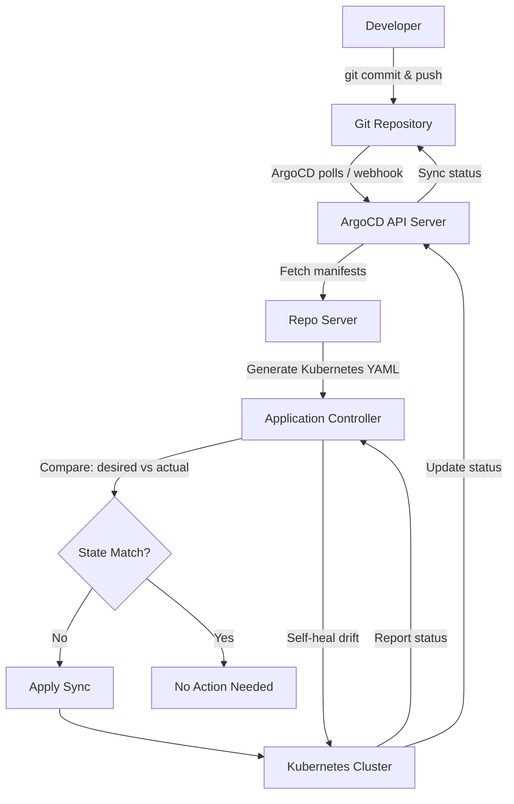

| Difficulty | Channel | Tags |
|---|---|---|
| beginner | devops | argocd, flux, declarative |

It was the kind of problem that keeps infrastructure engineers up at night. Okta's Auth0 private cloud started modestly — just 12 Kubernetes clusters for a handful of enterprise customers, built with Snowflake configurations and entirely manual deployment processes [1]. Then enterprise demand exploded. Suddenly, those 12 clusters became 100, then 500, then over 1,000. The architecture that worked for a dozen clusters was actively breaking at scale. Customer support was suffering, and the team was drowning in manual kubectl commands. This is the story of how GitOps and ArgoCD turned that chaos into order — and what every developer can learn from it.

---

> ### Real-World Case — Okta (Auth0 private cloud)
>
> Okta's Auth0 private cloud started with only 12 Kubernetes clusters for a small set of customers, built with Snowflake configurations and entirely manual deployment processes. As enterprise demand exploded, they faced a crisis — their architecture couldn't scale and customer support was suffering.
>
> | | |
> |---|---|
> | **Challenge** | Scale from 12 to 1,000+ Kubernetes clusters over 5 years while managing customer-specific deployment windows, Terraform dependencies, multiple plugin versions per customer, and without the ability to use ArgoCD's built-in auto-sync because their release model bundled service images, Terraform code, Kustomize plugins, and Kubernetes manifests together — making each cluster's desired state unique. |
> | **Solution** | Adopted ArgoCD as the GitOps foundation with a hub-spoke Agent architecture. Implemented controller sharding (crossing the threshold at ~100 clusters), built a custom homegrown scheduler using Argo Workflows to orchestrate syncs with retry logic and priority queuing, created Kustomize plugins running in Docker-in-Docker for per-customer version isolation, and used ApplicationSets for templated multi-cluster management. |
> | **Outcome** | Scaled from 12 to 1,000+ Kubernetes clusters, managing 800–2,000 ArgoCD applications with 2+ million Kubernetes resources, running on 32 application controller pods, 24 repo server pods, and 8 API server pods — all from a single ArgoCD instance. |
> | **Lesson** | ArgoCD can scale to 1,000+ clusters, but the built-in auto-sync doesn't work for every deployment model — especially when releases are complex bundles with infrastructure dependencies. You need to architect for sharding around 100 clusters, build custom sync orchestration for deployment windows, and treat your GitOps tool as a platform foundation rather than a turnkey solution. GitOps doesn't solve organizational problems; it exposes them. |

---

## Hook — When Manual Deployment Breaks at Scale

Imagine waking up to 15 Slack messages about production issues across different Kubernetes clusters. Each one slightly different — a Snowflake configuration here, a manual hotfix there. You have no idea which clusters are out of sync, who made the last change, or how to roll back safely. This was reality for the Okta Auth0 team as their customer base grew exponentially [1]. When you are managing infrastructure manually, every new cluster makes the problem worse, not better. The tipping point comes faster than most teams expect — and by the time you feel the pain, you are already in crisis mode.

## Problem — The Hidden Cost of Imperative Deployments

Here is the thing about imperative Kubernetes deployments: they feel fast. A kubectl apply here, a kubectl edit there — you fixed the issue in seconds. But that speed is an illusion. Every direct change bypasses your Git repository, creating configuration drift that silently accumulates across environments [2]. Before long, production looks nothing like staging, and nobody can explain why. You might think this only matters at huge scale, but configuration drift starts the moment your second engineer runs their first imperative command. The real cost surfaces during incident response: when you need to roll back and cannot because you do not know what changed, when, or by whom. Suddenly, the five seconds you saved by running kubectl edit directly costs you five hours of debugging.

## Real-World Case — How Okta Tamed 1,000+ Kubernetes Clusters with ArgoCD

Okta's Auth0 private cloud team was living this nightmare. They started with 12 clusters built as Snowflakes — each one configured differently, each one requiring manual hand-holding. As enterprise demand surged, the cracks became canyons. Their architecture could not scale, and customer trust was on the line [1]. The team made a bet on GitOps with ArgoCD, and the results speak for themselves. They scaled from 12 to over 1,000 Kubernetes clusters, managing between 800 and 2,000 ArgoCD applications representing more than 2 million Kubernetes resources — all from a single ArgoCD instance running on just 32 application controller pods, 24 repo server pods, and 8 API server pods [1]. Two million resources. One source of truth. No more Snowflake clusters.

## Deep Dive — Declarative vs Imperative: Why the Distinction Matters More Than You Think

At its core, this debate comes down to one question: where does the truth live? In imperative workflows, you tell Kubernetes what to do through commands — kubectl create, kubectl apply, kubectl delete. The truth is scattered across terminal histories, CI logs, and engineer memories [3]. In declarative workflows with GitOps, you tell Kubernetes what you want the world to look like by committing YAML to a Git repository. ArgoCD continuously reconciles the actual cluster state with that declared desired state [4]. If someone sneaks in a manual change, ArgoCD's self-healing mechanism reverts it automatically. 🎯 **Key Point**: The declarative approach does not just give you auditability — it gives you a time machine. Every commit is a known good state you can return to. Imperative changes are like surgery without anesthesia: fast but dangerous. Declarative GitOps is preventive medicine: slower upfront, infinitely safer at scale.

## Lessons Learned — What 1,000 Clusters Taught the Okta Team

Okta's journey from 12 to 1,000+ clusters left behind a trail of hard-won wisdom. First, start GitOps early — the cost of migrating imperative clusters grows exponentially with cluster count. Second, resist the temptation to bypass Git for quick fixes. Every shortcut today becomes tomorrow's incident. Third, invest in your Application CRD structure from day one. Okta's team organized their 2,000 applications with clear naming conventions and project hierarchies that made troubleshooting possible [1]. 🔥 **Hot Take**: Self-healing is not optional at scale. When you have 1,000 clusters, you cannot have humans deciding which manual changes to accept. Configure prune: true and selfHeal: true from the start. Finally, remember that GitOps is as much a team workflow as a technical one. It requires discipline in code review, branch management, and release processes. The tool is the easy part. The culture shift is where teams either succeed or stall.

---

## GitOps Reconciliation Loop with ArgoCD

<strong>Original Interview Question</strong>

**Q:** You're setting up GitOps for a microservices deployment. How would you configure ArgoCD to automatically sync changes from your Git repository to Kubernetes, and what's the difference between declarative and imperative approaches in this context?

**A:** I'd configure ArgoCD by setting up a Git repository containing Kubernetes manifests or Helm charts, creating an Application CRD that points to the Git repository, enabling auto-sync with a health check interval of 3 minutes, and implementing self-healing to automatically revert any manual changes. The declarative approach involves defining the desired state in Git through YAML manifests, Helm charts, or Kustomize configurations, where ArgoCD continuously reconciles the actual state with the desired state. In contrast, the imperative approach uses kubectl commands to make direct changes to the cluster, bypassing the Git repository as the single source of truth.

## Conclusion

Okta's story is not unique, but it is a warning that every growing team should heed. The manual approach that works for 12 clusters will break at 100 — and by the time you realize it, you are already in damage control mode. The declarative GitOps model with ArgoCD does not just solve the scaling problem; it changes how your team thinks about deployments. Git becomes your deployment logbook, your rollback mechanism, and your single source of truth all at once. Here is the question every team should ask themselves tomorrow morning: if your cluster went down right now, could you rebuild it from scratch with one command? If the answer is no, it is time to stop kubectl'ing and start committing.

---

## References

1. [How Okta Scaled from 12 to 1,000 Kubernetes Clusters with Argo CD](https://thenewstack.io/how-okta-scaled-from-12-to-1000-kubernetes-clusters-with-argo-cd/) — article
2. [ArgoCD Official Documentation](https://argo-cd.readthedocs.io/en/stable/) — documentation
3. [Kubernetes Imperative Management](https://kubernetes.io/docs/tasks/manage-kubernetes-objects/imperative-command/) — documentation
4. [Kubernetes Declarative Management](https://kubernetes.io/docs/tasks/manage-kubernetes-objects/declarative-config/) — documentation
5. [Helm Package Manager for Kubernetes](https://helm.sh/docs/) — documentation
6. [Kustomize - Kubernetes Native Configuration Management](https://kustomize.io/) — documentation
7. [OpenGitOps - Principles of GitOps](https://opengitops.dev/) — documentation
8. [GitLab GitOps Workflow Overview](https://about.gitlab.com/topics/gitops/) — article
9. [ArgoCD GitHub Repository](https://github.com/argoproj/argo-cd) — documentation

---

**Author:** Satishkumar Dhule — [GitHub](https://github.com/satishkumar-dhule) · [LinkedIn](https://linkedin.com/in/satishkumar-dhule) · [Website](https://satishkumar-dhule.github.io)
