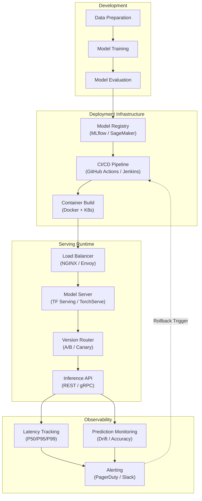

| Difficulty | Channel | Tags |
|---|---|---|
| beginner | devops | mlops, deployment |

By 2015, Uber's data scientists were building ML models in Jupyter notebooks while engineers built bespoke serving containers for each model type [1]. There was no unified path to production. As demand exploded, every team reinvented infrastructure — different Docker images for TensorFlow vs PyTorch vs XGBoost, no standardized rollback, and silent model degradation in production. This story isn't unique to Uber — and understanding the crucial distinction between deployment and serving is the key to avoiding the same fate in your own ML pipelines.

---

> ### Real-World Case — Uber
>
> By 2015, Uber's data scientists were building ML models in Jupyter notebooks while engineers built bespoke serving containers for each model type. There was no unified path to production. As demand exploded, every team reinvented infrastructure — different Docker images for TensorFlow vs PyTorch vs XGBoost, no standardized rollback, and silent model degradation in production.
>
> | | |
> |---|---|
> | **Challenge** | Uber needed to separate model deployment (CI/CD, infrastructure, monitoring) from model serving (inference, routing, autoscaling) to handle 400+ ML use cases across ETA prediction, Eats ranking, fraud detection, and surge pricing — each with different latency SLAs (some <5ms, others <100ms) and framework requirements. |
> | **Solution** | They built Michelangelo, an end-to-end ML platform with a Kubernetes Operator control plane (CRDs for models, deployments, inference servers) and a separate online data plane. Deployment used automated CI/CD with validation gates, gradual rollout, and auto-rollback on metric breaches. Serving used containerized prediction services with a feature store sidecar (Palette) for low-latency lookups. In v2.0, they replaced their custom Neuropod engine with NVIDIA Triton as a unified serving runtime across all frameworks, and implemented reactive scheduling to opportunistically allocate idle serving GPU capacity to training workloads during off-peak hours. |
> | **Outcome** | 30 million predictions per second at peak across 5,000+ production models, P95 latency under 5ms for tree-based models and under 100ms for deep learning models. Deployments that once took custom engineering per model now use standardized pipelines with automated rollback safety. Model regressions that lingered for days now surface within hours via automated monitoring. |
> | **Lesson** | Model deployment and model serving require fundamentally different infrastructure patterns — deployment needs CI/CD with gradual rollout and validation gates, while serving needs framework-agnostic runtimes with feature store sidecars. The counterintuitive insight: building a custom in-house serving engine (Neuropod) was the right call initially, but replacing it with an open-source alternative (Triton) was the right call later as the ecosystem matured, enabled by modular architecture that allowed swapping serving engines without rewriting the platform. |

---

## Hook — The 3 AM Page That Changes Everything

Everyone tells you the hard part is building the model. You wrestle with loss functions, curse at vanishing gradients, spend weeks hyperparameter tuning. Then you finally get that beautiful 94% accuracy. Ship it, right? Wrong. The real nightmare starts when your model has to actually work — in production, under load, serving real users with real money on the line. You might think pushing a model to production is the finish line. In reality, it is the starting gun for a completely different race.

## Problem — You Deployed Your Model. Why Is It Still Failing?

Here is the confusion that trips up every team: deployment and serving are two separate disciplines that most developers treat as the same thing. Deployment is the "getting there" — the CI/CD pipelines, the infrastructure provisioning, the container registries, the rollback strategies. It is about packaging your model artifact and making sure it lands on a server somewhere. Serving is the "staying alive" — the HTTP endpoints handling request routing, the model versioning logic, the autoscaling policies that decide whether you can handle a traffic spike without crashing. A team that conflates the two inevitably builds infrastructure that works fine in staging but crumbles under production load. Ever wondered why that SageMaker deployment works perfectly in testing but melts down when real traffic hits? Now you know.

## Real-World Case — Uber's Million-Model Meltdown

Uber's ML platform in 2015 was a classic case of success outpacing infrastructure. Data scientists cranked out models in Jupyter notebooks, but there was no standardized path to get those models into production [1]. Every team independently built serving infrastructure — one team's TensorFlow model needed a custom container, another team's XGBoost model needed a completely different setup. The result? A sprawling, unmanageable fleet with no unified monitoring, no standard rollback, and silent degradation that could go undetected for days. Fast-forward to today and Uber handles over 30 million predictions per second at peak across 5,000+ production models [1]. Their P95 latency stays under 5ms for tree-based models and under 100ms for deep learning models. The transformation happened when they stopped treating deployment and serving as the same problem. They built standardized ML pipelines with automated rollback safety, centralized model registries, and real-time monitoring that surfaces regressions in hours instead of days. That 30 million predictions-per-second number? It became achievable only after they separated the concern of deploying the model from the concern of serving predictions.

## Deep Dive — Deployment vs. Serving: The Two-Layer Cake

Think of deployment as the foundation of a house and serving as the plumbing and electrical systems inside. Both are essential, but they solve fundamentally different problems.

**Deployment** focuses on infrastructure: setting up Kubernetes clusters, configuring Docker images, managing Terraform state files, and building CI/CD pipelines with tools like GitHub Actions or Jenkins [2]. This is where you choose your orchestration layer — maybe Kubernetes for container management or SageMaker for a managed alternative [3]. You define your rollback strategy (canary deployments, blue-green, or straight rollback) and your monitoring stack (Prometheus + Grafana, Datadog, or MLflow tracking) [4].

**Serving**, on the other hand, is all about runtime. This is where TensorFlow Serving, TorchServe, and BentoML come into play [5][6]. These frameworks handle the actual inference: loading model weights into memory, batching requests for throughput, routing to the correct model version, and managing GPU memory allocation. The tooling is completely different from deployment tooling. You care about request queuing, response compression, and cold start latency.

Here is the trade-off matrix that matters:

| Concern | Deployment | Serving |
|---|---|---|
| Primary question | "Is the model accessible?" | "Is the model fast enough?" |
| Key metric | Uptime, deployment success rate | Latency, throughput, P50/P95/P99 |
| Scaling trigger | New model version, infra change | Traffic spikes, concurrent requests |
| Failure mode | Model fails to load | Model is too slow, OOM, timeout |
| Rollback trigger | Deployment fails | Latency degrades past SLO |

**Latency vs. throughput** is the classic serving trade-off. Batching requests improves throughput but adds latency. Real-time inference demands sub-100ms responses, sometimes even sub-5ms for tree-based models [1]. Batch inference can tolerate seconds. Your architecture must reflect this — a fraud detection endpoint needs different infrastructure than a nightly churn prediction job.

**Cold starts** deserve special attention. Every time a new model version is deployed, the serving container must load the model into memory. For deep learning models, this can take 30 seconds or more. Smart serving systems pre-warm model versions using shadow traffic or keep-alive mechanisms. This is why you see patterns like "canary rollout with traffic mirroring" — you warm up the new version with duplicated production traffic before directing real requests to it.

**Autoscaling** connects deployment and serving. Kubernetes Horizontal Pod Autoscaler scales pods based on CPU or memory. But serving-aware autoscalers look at inference latency, request queue depth, and GPU utilization. A deployment that scales on CPU alone will throttle before it ever sees a memory warning.

## Workflow — The Standardized ML Pipeline

The pipeline that separates deployment from serving follows a clear progression. Each stage has distinct responsibilities and the handoffs between them are where most production failures originate.

The diagram below traces the journey from model development to production inference. Notice how deployment and serving exist as separate phases connected by a model registry — not as a monolithic "push to prod" step.

## Code Example — A Production-Ready Serving Pipeline

Let's bring this to life with a concrete example. Here is a Python serving pipeline using FastAPI and BentoML that separates deployment configuration from serving logic. The deployment side handles model loading and versioning; the serving side handles request routing and autoscaling.

## Lessons Learned — What Uber's Journey Teaches Us

If there is one thing Uber's story makes clear, it is that deployment and serving require different expertise, different tooling, and different operational playbooks. Here is what to do differently starting tomorrow:

**First, audit your pipelines.** Trace the journey of a model from your training script to the production endpoint. Where does deployment end and serving begin? If you cannot find a clean boundary, you have found your problem.

**Second, instrument serving metrics separately from deployment metrics.** Track deployment success rate as a deployment metric. Track P50, P95, and P99 latency as serving metrics. A model can deploy successfully and still fail in production — your monitoring should catch both.

**Third, plan for the cold start problem.** Every serving framework handles model loading differently. Benchmark how long your models take to warm up and design your rollout strategy around that number. Use traffic mirroring or shadow deployments to pre-warm new versions.

**Fourth, standardize your model registry.** Uber's breakthrough came when they centralized how models were stored, versioned, and retrieved [1]. Without a single source of truth, every team builds their own deployment path — and that is how you end up with 50 different Docker images doing the same thing.

**Fifth, test rollbacks aggressively.** The question is not if a bad model version will reach production, but when. Can you roll back in under 60 seconds? Do your serving clients handle version transitions gracefully? The only thing worse than a bad model is not being able to undo it.

The teams that master this distinction ship more reliably, debug faster, and sleep better at night. Start treating deployment and serving as two different disciplines — your on-call rotation will thank you.

---

## ML Pipeline Architecture — From Development to Production Inference

<strong>Original Interview Question</strong>

**Q:** Explain the key differences between model serving and model deployment in ML systems, including specific technologies, scaling considerations, and real-world implementation patterns?

**A:** Deployment encompasses CI/CD pipelines, infrastructure setup, and monitoring using tools like Kubernetes, MLflow, and SageMaker. Serving focuses on runtime inference APIs with frameworks like TensorFlow Serving, TorchServe, or BentoML, handling request routing, model versioning, and autoscaling. Key trade-offs include latency vs throughput, batch vs real-time inference, and cold start optimization.

## Conclusion

Uber's journey from notebook chaos to 30 million predictions per second was not about building better models — it was about understanding that deployment and serving are fundamentally different problems demanding different solutions. When you separate these concerns, you unlock standardized rollbacks, automated monitoring, and an infrastructure that scales without every team reinventing the wheel. The next time your team debates how to push a model to production, ask the harder question: how will you keep it alive under load? The answer to that question is what separates a demo from a production system. Share this with your team, audit your pipeline, and start treating deployment and serving as the two distinct disciplines they are. Your future self — awake at 3 AM staring at a latency spike — will thank you.

---

## References

1. [Uber: From Predictive to Generative AI](https://www.uber.com/en/blog/from-predictive-to-generative-ai/) — blog
2. [Kubernetes Production Best Practices](https://kubernetes.io/docs/setup/best-practices/) — documentation
3. [Amazon SageMaker Deployment Documentation](https://docs.aws.amazon.com/sagemaker/latest/dg/deploy-model.html) — documentation
4. [MLflow Models Documentation](https://mlflow.org/docs/latest/models.html) — documentation
5. [TensorFlow Serving Overview](https://www.tensorflow.org/tfx/guide/serving) — documentation
6. [TorchServe Architecture](https://pytorch.org/serve/architecture.html) — documentation
7. [BentoML Documentation](https://docs.bentoml.com/en/latest/) — documentation
8. [gRPC Performance Benchmarks](https://grpc.io/docs/guides/benchmarking/) — documentation
9. [The ML Test Score: A Rubric for ML Production Readiness](https://research.google/pubs/pub46485/) — paper

---

**Author:** Satishkumar Dhule — [GitHub](https://github.com/satishkumar-dhule) · [LinkedIn](https://linkedin.com/in/satishkumar-dhule) · [Website](https://satishkumar-dhule.github.io)
