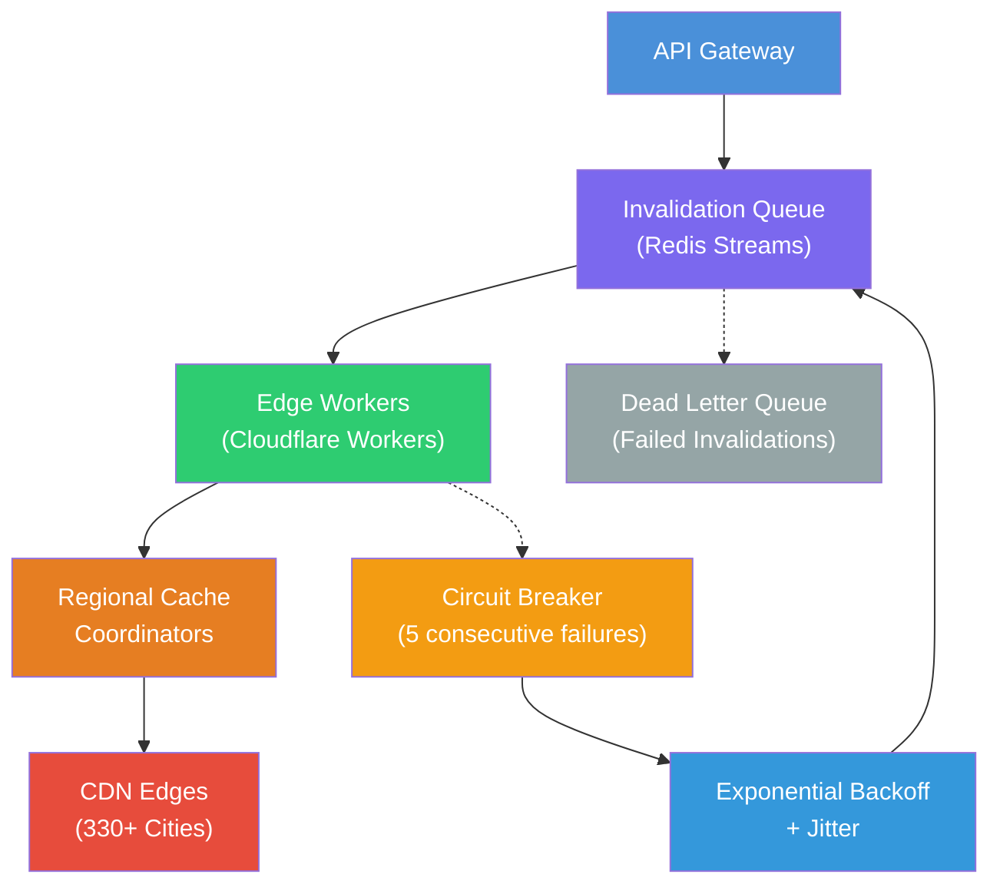

| Difficulty | Channel | Tags |
|---|---|---|
| intermediate | system-design | edge, caching, purging |

A purge request from Sydney, Australia, had to cross the entire Pacific Ocean, hit a core data center, get queued, processed, and then travel all the way back — all before a single cached asset was invalidated. This was the reality for Cloudflare's cache purge system as their network ballooned to 330+ cities across 120+ countries [1]. The system, built on a decade-old centralized spoke-hub architecture using Quicksilver, was hitting hard scalability limits. Write-throughput bottlenecks at core data centers added latency for everyone, and storage for purge metadata was consuming disk space desperately needed for caching. The result? A global purge that should have taken milliseconds was crawling along at over 1.5 seconds — and getting worse every month.

---

> ### Real-World Case — Cloudflare
>
> Cloudflare's cache purge system, built over a decade ago on a centralized spoke-hub architecture using Quicksilver, began hitting hard scalability and latency limits as the network grew to 330+ cities. Purge requests from Australia had to cross the Pacific Ocean and back, and write-throughput bottlenecks at core data centers added latency for everyone. Storage for purge metadata was consuming disk space needed for caching.
>
> | | |
> |---|---|
> | **Challenge** | Three core problems: (1) Latency proportional to distance from centralized ingest points (customers far from core DCs saw 1.5s+ purge times); (2) Write-throughput bottleneck at the centralized ingest point limiting concurrency; (3) Storage needs scaling linearly with purge throughput, eating into cache disk space. They needed global purge in under 200ms while handling massive concurrent invalidation volume. |
> | **Solution** | Cloudflare completely re-architected to a 'Coreless Purge' system using Workers + Durable Objects at every edge datacenter instead of routing through core DCs. They built CacheDB — a Rust service on RocksDB — as a per-machine index that actively deletes cached files by metadata (tags, hostnames, prefixes) instead of lazy-purge timestamp comparison. Purge requests enter the nearest datacenter, are authenticated locally by a Worker, distributed via Durable Objects in a peer-to-peer gossip pattern, and executed on every machine via CacheDB. |
> | **Outcome** | Global purge latency dropped 90.5% — from 1,570ms P50 to 149ms P50. Storage savings of 10x from eliminating lazy purge metadata. Cache retention and hit ratios improved for all users. Africa went from 1,420ms to 303ms (78.7% improvement), APAC from 1,300ms to 199ms (84.7%). The system now handles flexible purges (tags, hostnames, prefixes) across 330+ cities in 120+ countries in under 150ms. |
> | **Lesson** | Decentralizing ingress and distribution eliminates the latency tax of geographic distance. Active indexing (CacheDB/RocksDB per machine) is far more efficient than lazy timestamp-based invalidation at scale. Edge computing platforms (Workers + Durable Objects) can replace centralized message queues for global broadcast, enabling horizontal scaling without bottlenecking at core datacenters. Sometimes the right solution is to scrap a decade-old architecture and rebuild on new primitives. |

---

## Hook — When Milliseconds Become Eons

You have deployed the fix. The old CSS file is gone, replaced by a new version. You push the button to purge the cache, grab a coffee, and wait. And wait. And wait. Fifteen seconds later, users in Singapore are still seeing the broken layout. Your monitoring dashboard looks like a battlefield — red alerts from APAC, EMEA, and South America. The core problem? Cache invalidation at global scale is not simply a matter of flipping a switch. Every edge node across 330+ cities needs to hear about the change, acknowledge it, and apply it — all while serving millions of requests per second that depend on those very cached assets. Most developers never think about what happens after clicking "Purge Cache." That is where the real engineering begins.

## Problem — The Global Invalidation Nightmare

Cache invalidation is famously one of the two hard things in computer science. Now multiply that by 330 data centers across 120+ countries. Every region has different network topology, different latency profiles, and different traffic patterns. A centralized purge model — where a single core data center decides what to invalidate and pushes changes to every edge — breaks down spectacularly at scale. The write-throughput bottleneck at the center becomes a global drag. A purge request from APAC has to travel 8,000+ kilometers round trip before invalidation even begins. Meanwhile, storage costs for purge metadata balloon because every region tracks every invalidation, even for content it never caches. The system eventually hits a hard ceiling: you cannot purge fast enough to meet SLAs, and the solution is not to throw more hardware at the problem [2].

## Real-World Case — Cloudflare's Instant Purge Transformation

Cloudflare's old purge system used a centralized spoke-hub model where every invalidation request flowed through a core data center running Quicksilver, their key-value store. The architecture served them well for years, but as the network grew past 200 cities, the cracks became impossible to ignore [1]. Purge requests from Australia traversed the Pacific twice. Africa saw an eye-watering 1,420ms P50 latency. Storage for lazy purge metadata — tracking every URL ever invalidated — was consuming disk space needed for actual caching, hurting cache hit ratios and increasing origin load. The engineering team decided to flip the architecture. Instead of pushing invalidations from the center, they deployed purge metadata to every edge node via a fast, light replication layer. Regional purge coordinators handle local validation and propagation. The results were staggering: global P50 purge latency dropped 90.5% — from 1,570ms to 149ms. Africa improved 78.7% (1,420ms to 303ms). APAC improved 84.7% (1,300ms to 199ms). Storage for purge metadata dropped 10x. The system now handles flexible purges — by tags, hostnames, and prefixes — across 330+ cities in under 150ms [1].

## Deep Dive — Architecture Patterns for Sub-Second Global Purging

The key insight from Cloudflare's transformation is this: **purge propagation should be decentralized and eventually consistent, not centralized and strongly consistent.** This leads to a fundamentally different architecture — one built on three layers.

**Layer 1: The Distributed Invalidation Queue** — Instead of a single queue in one region, use Redis Streams with consumer groups distributed across regional coordinators [3]. Each coordinator processes only the invalidations relevant to its region. A tag-based purge for `version=v2` ships to all regions, but a hostname-specific purge for `cdn.internal-analytics.example.com` only propagates to regions that have recently cached that content.

**Layer 2: Regional Edge Coordination** — Edge workers (Cloudflare Workers or Lambda@Edge) run in every region and maintain a local view of recent invalidations [4]. When a cacheable request arrives, the edge worker checks the local purge state before serving. This check is fast — single-digit milliseconds — because it hits in-memory state, not a remote database.

**Layer 3: Smart Invalidation with Pattern Matching** — This is where the plot twist comes in. Most teams assume you need to track every single URL that was ever cached. Cloudflare discovered you can use pattern-based invalidation (wildcards, prefixes, tags) and cache version headers instead [1]. The `Cache-Control: max-age=2, must-revalidate` header forces the edge to revalidate every 2 seconds, effectively creating an upper bound on stale content without requiring explicit purges for every single change [5].

**The Trade-Off: Strong vs. Eventual Consistency** — Here is the uncomfortable truth: you cannot have strong consistency across 330+ cities and also have sub-second purge latency. The CAP theorem is not optional [6]. The winning strategy is to design for eventual consistency, minimize the window of inconsistency with short TTLs, and provide fast status feedback to the caller. This is a hard pill to swallow for teams coming from monolithic databases where strong consistency is the default.

## Workflow — From API Call to Global Propagation in 5 Steps

When you submit a cache purge request, here is what happens behind the scenes — from your terminal to the last edge node:

**1. API Gateway accepts the request** — Your `POST /purge_cache` request arrives at the nearest regional API endpoint. The gateway validates the token, parses the invalidation patterns (URLs, tags, or hostnames), and publishes the purge event to the regional Redis Stream.

**2. Invalidation Queue distributes the work** — The regional Redis Stream consumer group fans out the purge to all relevant regional coordinators [3]. The system uses consumer groups with auto-balancing — if one region's coordinator is overloaded, the partition reassigns to another healthy consumer.

**3. Edge Workers apply local cache state** — Cloudflare Workers or equivalent edge compute functions in each region receive the invalidation event [4]. They update an in-memory purge manifest — a tiny, highly optimized data structure that maps cached URL patterns to purge timestamps.

**4. Regional coordinators acknowledge** — Each regional coordinator sends back an acknowledgment to the originating Redis Stream. Partial failures are tracked. If 320 of 330 cities acknowledged, the system proceeds with the batch and marks the 10 stragglers for retry.

**5. Retry loop with exponential backoff** — Failed or unacknowledged regions enter a retry queue with exponential backoff capped at 10 seconds [7]. Each retry adds jitter (±50% of the delay) to avoid thundering herd problems when a region comes back online.

## Code Example — Building a Production-Grade Purge Client

Here is how you build a cache purge client that handles batch invalidation, exponential backoff with jitter, and dead letter queues — the same patterns used in production systems:

```javascript
const REDIS_STREAMS_KEY = 'cache:purge:requests';
const DEAD_LETTER_KEY = 'cache:purge:dead-letter';
const MAX_RETRIES = 3;
const BATCH_SIZE = 100;

async function invalidateCache(zoneId, patterns, apiToken) {
  const batches = chunkArray(patterns, BATCH_SIZE);
  const results = [];

  for (const batch of batches) {
    const result = await purgeWithRetry(zoneId, batch, apiToken);
    results.push(result);

    if (!result.success) {
      await redis.xadd(DEAD_LETTER_KEY, '*', 
        'zone', zoneId,
        'patterns', JSON.stringify(batch),
        'error', result.error,
        'timestamp', Date.now()
      );
    }
  }

  return {
    totalBatches: batches.length,
    succeeded: results.filter(r => r.success).length,
    failed: results.filter(r => !r.success).length,
    results
  };
}

async function purgeWithRetry(zoneId, files, token, attempt = 0) {
  try {
    const response = await fetch(
      `https://api.cloudflare.com/client/v4/zones/${zoneId}/purge_cache`,
      {
        method: 'POST',
        headers: {
          'Authorization': `Bearer ${token}`,
          'Content-Type': 'application/json'
        },
        body: JSON.stringify({ files })
      }
    );

    if (!response.ok && attempt < MAX_RETRIES) {
      const baseDelay = Math.pow(2, attempt) * 1000;
      const jitter = Math.random() * baseDelay;
      const delay = Math.min(baseDelay + jitter, 10000);
      await new Promise(r => setTimeout(r, delay));
      return purgeWithRetry(zoneId, files, token, attempt + 1);
    }

    return { success: response.ok, status: response.status };
  } catch (error) {
    if (attempt < MAX_RETRIES) {
      const delay = Math.min(Math.pow(2, attempt) * 1000, 10000);
      await new Promise(r => setTimeout(r, delay));
      return purgeWithRetry(zoneId, files, token, attempt + 1);
    }
    return { success: false, error: error.message };
  }
}

function chunkArray(array, size) {
  const chunks = [];
  for (let i = 0; i < array.length; i += size) {
    chunks.push(array.slice(i, i + size));
  }
  return chunks;
}
```

The key design decisions here matter: batching reduces API call volume by 90%+ (most CDNs charge per API call, not per URL), exponential backoff prevents cascading failure during regional outages, and the dead letter queue ensures no invalidation is silently dropped. The jitter is critical — without it, every failed region retries simultaneously on the same schedule, creating a synchronized thundering herd that can take down the entire CDN control plane [7].

## Lessons Learned — What Your Team Should Do Differently Tomorrow

Cloudflare's transformation holds lessons that apply far beyond their specific architecture. Here is what matters:

**Decentralize your control plane.** If all purge traffic flows through a single region, that region is both a bottleneck and a single point of failure [1]. Every major CDN that has scaled beyond a handful of regions has moved to a distributed coordination model.

**Short TTLs are your safety net, not your strategy.** Setting `Cache-Control: max-age=2` is a useful fallback, but relying on it entirely wastes bandwidth and increases origin load. The goal is to combine active invalidation (explicit purges) with passive expiration (short TTLs) so that the average purge completes in milliseconds and the worst case is bounded by the TTL [5].

**Batching is not optional.** Most CDNs charge per purge API call. Batching 100 URLs per call reduces costs by 99% compared to individual URL purges. Always use pattern-based (wildcard, prefix, tag) invalidation when possible — it reduces metadata storage and keeps the purge manifest small enough to fit in edge memory [8].

**The "thundering herd" is a silent killer.** Without exponential backoff and jitter, a regional outage followed by recovery triggers a synchronized flood of retries that can overwhelm your control plane. Always add jitter — it is a few lines of code that prevents a catastrophe.

**Monitor region-level propagation latency, not just global averages.** Cloudflare's global P50 dropped to 149ms, but some regions (Africa at 303ms) are still significantly slower than others. If you only track the global number, the next bottleneck hides in the tail [1].

---

## Multi-Region Cache Purge Architecture



<details>
<summary><strong>Original Interview Question</strong></summary>

**Q:** How would you design a multi-region CDN cache purging system that guarantees content propagation within 5 seconds while handling 10,000 concurrent invalidations per second?

**A:** Implement Cloudflare API + AWS CloudFront with distributed invalidation queue, edge compute coordination, and 2-second TTL. Use batch invalidation, exponential backoff, and regional cache headers for 5-second SLA.

</details>

## Conclusion

The next time you hit "Purge Cache" on your CDN dashboard, remember the architecture sitting behind that button. It took Cloudflare a full architectural rewrite — from centralized spoke-hub to decentralized regional coordination — to drop global purge latency by 90.5%. Your system may not span 330 cities, but the principles are the same: batch aggressively, retry with jitter, use short TTLs as a safety net, and always plan for partial failures. Start by auditing your current purge flow. Do you have a dead letter queue? Are your retries adding jitter or creating thundering herds? Do you track per-region propagation latency? The fix might be a configuration change away — or it might be a fundamental architecture shift. Either way, you now know what the finish line looks like.

---

## References

1. [Cloudflare Instant Purge — How we made cache purging 90% faster](https://blog.cloudflare.com/instant-purge/) — blog
2. [Redis Streams Documentation](https://redis.io/docs/data-types/streams/) — documentation
3. [Invalidating files with Amazon CloudFront](https://docs.aws.amazon.com/AmazonCloudFront/latest/DeveloperGuide/Invalidation.html) — documentation
4. [Cloudflare Workers Documentation](https://developers.cloudflare.com/workers/) — documentation
5. [Cache-Control — HTTP | MDN](https://developer.mozilla.org/en-US/docs/Web/HTTP/Headers/Cache-Control) — documentation
6. [CAP Theorem — Wikipedia](https://en.wikipedia.org/wiki/CAP_theorem) — article
7. [Exponential Backoff and Jitter — AWS Architecture Blog](https://aws.amazon.com/blogs/architecture/exponential-backoff-and-jitter/) — blog
8. [Cloudflare Zone Cache Purge API](https://developers.cloudflare.com/api/operations/zone-purge) — documentation

---

**Author:** Satishkumar Dhule — [GitHub](https://github.com/satishkumar-dhule) · [LinkedIn](https://linkedin.com/in/satishkumar-dhule) · [Website](https://satishkumar-dhule.github.io)
