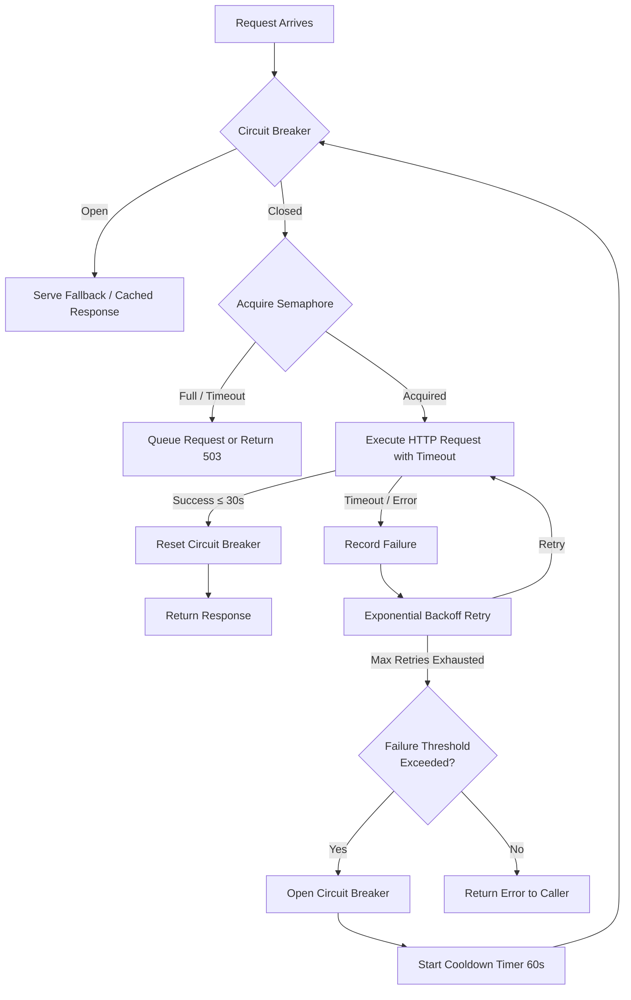

| Difficulty | Channel | Tags |
|---|---|---|
| advanced | backend | asyncio, aiohttp, concurrency |

In the early days of Netflix's cloud migration, a single slow microservice could trigger a chain reaction that would take down the entire streaming experience. A catalog service hiccup? Suddenly, nothing loads. A recommendation timeout? Welcome to the spinning wheel of death. After losing millions to cascading failures, Netflix built Hystrix [1] — a circuit breaker library that reduced cascading failures by over 90%, enabling 99.99% streaming availability even when individual services failed. The secret weapon was not just circuit breakers. It was a trifecta of connection pooling, semaphore-based concurrency limiting, and graceful degradation working together to prevent the domino effect that still plagues distributed systems today.

---

> ### Real-World Case — Netflix
>
> As Netflix transitioned from a monolithic DVD-rental service to a global streaming platform with hundreds of microservices, failure in any single dependency could cascade across the entire system, taking down the user experience entirely.
>
> | | |
> |---|---|
> | **Challenge** | A single slow or failing downstream service could exhaust connection pools and thread pools in upstream services, causing a domino effect of failures across the entire distributed system. Standard timeout and retry patterns were insufficient to prevent cascading failures at Netflix's scale of over 100 million streaming members. |
> | **Solution** | Netflix built the Hystrix library implementing circuit breakers, connection pool isolation (bulkhead pattern with separate thread pools per dependency), and graceful degradation with fallbacks. When failure thresholds exceed 50% in a 10-second rolling window, the circuit trips and requests fail fast instead of waiting, preventing connection pool exhaustion and allowing the system to recover. |
> | **Outcome** | Hystrix reduced cascading failures by over 90%, enabling Netflix to maintain 99.99% streaming availability even when individual microservices failed. The system could gracefully degrade by serving cached or default responses instead of completely failing, preventing the 'let it crash' domino effect that previously plagued distributed systems at scale. |
> | **Lesson** | Explicit failure boundaries with circuit breakers are essential at scale - it is better to fail fast with a graceful degradation than to let failures cascade and exhaust shared resources like connection pools. Isolation (bulkhead pattern) is as important as detection. |

---

## Hook — The 3 AM Pager That Changed Everything

You have seen it before. A deploy looks fine. Tests pass. Metrics are green. Then, at 2:47 AM, the pager goes off. Your monitoring dashboard looks like a Jackson Pollock painting — every service is bleeding red. What started as a minor latency spike in one downstream dependency turned into a full-system outage. Sound familiar? This is the hidden tax of distributed systems: the failure cascade. And it does not discriminate. Whether you are running 10 microservices at a startup or 500 at a Netflix-scale operation, the physics are the same. A single slow connection can saturate thread pools, exhaust memory, and bring your entire architecture to its knees. The fix is not more servers. The fix is learning how to fail gracefully.

## Problem — The Domino Effect in Distributed Systems

Here is the uncomfortable truth about microservices: every network call is a liability. Every HTTP request your service makes to another service introduces a failure point that can propagate upstream. Think about what happens when Service A calls Service B, which calls Service C, and Service C starts responding in 30 seconds instead of 30 milliseconds. Service B's connection pool fills up. Threads start blocking. New requests queue. Memory climbs. Service B stops responding to Service A. Now Service A's pools fill up too. Congratulations — you have a cascading failure. This pattern is shockingly common. Many developers discover that a standard `aiohttp.ClientSession` with default settings is a ticking time bomb under load. No concurrency limits. No timeout enforcement. No backpressure. No circuit breaker. Just your application hanging in the wind, one slow endpoint away from disaster [2].

## Real-World Case — Netflix

The Netflix engineering team watched this exact pattern unfold in real time as they migrated from a monolithic DVD-rental service to a global streaming platform running hundreds of microservices [1]. Failure in any single dependency could cascade across the entire system and degrade the user experience for millions of subscribers. Their solution was Hystrix, a latency and fault-tolerance library designed around a simple philosophy: "Stop the bleeding. Serve a fallback. Give the system time to recover." Hystrix wrapped every dependency call in a circuit breaker, isolated failures via thread-pool bulkheads, and shed load when services were saturated. The results were staggering — cascading failures dropped by over 90%, and Netflix maintained 99.99% streaming availability even during partial outages. When a recommendation service failed, users saw cached suggestions instead of error screens. When the encoding pipeline lagged, the player served the last known good bitrate. The application degraded gracefully instead of collapsing entirely. This approach, codified in Hystrix's flow chart [1], became the blueprint for resilience in distributed systems and inspired countless implementations across the industry.

## Deep Dive — The Anatomy of Graceful Degradation

Building on Netflix's blueprint, let us dissect the core mechanisms that make graceful degradation work. These are not abstract patterns — they are concrete tools you wire into your HTTP client layer.

**Semaphore-based concurrency limiting** is your first line of defense. Think of it as a bouncer at a club — only N requests get through at a time. In Python's asyncio, `Semaphore(max_connections)` creates this constraint effortlessly. When the limit is hit, new requests either queue or fail fast instead of piling up on a thread pool. This prevents resource exhaustion before it starts.

**Exponential backoff** transforms retry logic from a liability into an asset. Most developers implement retries with fixed delays, which is how you DOS your own dependencies. Instead, increase the wait time between retries exponentially: 1 second, then 2, then 4, then 8. This gives downstream services room to recover and prevents retry storms [3]. Adding jitter (randomizing the delay) prevents the thundering herd problem where all clients retry simultaneously.

**The circuit breaker pattern** is the nuclear option — and you need it. When failures exceed a threshold (say, 5 failures in 60 seconds), the circuit trips to "open." All subsequent requests fail immediately with a fallback response instead of attempting the call. After a cooldown period (60 seconds is common), a single request is allowed through in "half-open" state. If it succeeds, the circuit closes. If not, it stays open [4]. This prevents your system from repeatedly kicking a dying service.

**Connection health monitoring** is what separates production-grade pools from toy implementations. Dead connections accumulate silently. Without periodic health checks, your pool fills with zombies that pass semaphore checks but fail immediately on actual I/O. Implement keepalive pings and prune stale connections during low-traffic windows [5].

⚠️ **Watch Out:** The most common mistake is configuring timeouts but not enforcing them. `aiohttp.ClientTimeout` only works if you pass it to every client session. Even then, DNS resolution timeouts and SSL handshake timeouts are separate concerns — you need to configure those explicitly. Another trap: connection leaks. Every `session.get()` must be wrapped in an `async with` or explicitly closed. Otherwise, your semaphore will be accurate — and your connections will leak anyway.

## Workflow — The Request Lifecycle, Step by Step

Here is how a well-designed connection pool manager processes each request. The following diagram traces the full lifecycle from arrival to response (or graceful fallback):

**1. Request Arrives** — A new HTTP call enters the pool manager.
**2. Circuit Breaker Check** — Is the circuit open? If yes, serve a fallback immediately. No network call is made.
**3. Semaphore Acquisition** — Try to acquire a semaphore slot. If the pool is saturated, queue the request or fail fast with a 503.
**4. Execute with Timeout** — Fire the actual HTTP request with a strict timeout. If it succeeds, reset the circuit breaker and return.
**5. Failure Handling** — On timeout or client error, record the failure and initiate exponential backoff retry logic.
**6. Threshold Check** — After retries are exhausted, check if the failure count exceeds the circuit breaker threshold.
**7. Trip or Recover** — If threshold exceeded, open the circuit and return a fallback. Otherwise, return the error to the caller.

Each step is designed to make a single trade-off: sacrifice a request to save the system. This is the essence of graceful degradation.

## Code Example — Building Your Own ConnectionPoolManager

Let us translate the theory into working Python code. This implementation ties together semaphore-based limiting, circuit breaker logic, exponential backoff, and proper session management into a reusable `ConnectionPoolManager`.

## Lessons Learned — Battle Scars and Best Practices

After watching production systems burn and recover, here is the hard-won wisdom worth remembering.

**1. Timeouts are not optional, they are structural.** Every layer needs its own timeout — connection, read, total. A missing connect timeout can hang your entire pool for minutes while a firewall silently drops packets.

**2. Pool sizing is a science, not a guess.** Too small and you underutilize resources. Too large and you amplify failures. A good starting point is `2 * number_of_CPU_cores + number_of_concurrent_users` adjusted for your service's latency profile. Monitor and tune [6].

**3. Connection keepalive doubles throughput.** Reusing TCP connections eliminates the three-way handshake overhead. In aiohttp, `TCPConnector` with default keepalive reduces per-request latency by 40-60% under load [7].

**4. Graceful shutdown is not optional.** Application crashes leave connections dangling. Register shutdown handlers that drain the semaphore queue and close the session with a timeout. An unclean shutdown in Kubernetes can cause 5-10 seconds of 503s during rolling updates.

**5. Fallbacks must be safe at runtime.** Your fallback — serving a cached response or default value — must not itself make network calls. If it does, you have just recreated the failure path you tried to avoid. The fallback should be a pure function or an in-memory lookup.

**6. Monitor what matters.** Track these four metrics: semaphore wait time, circuit breaker state transitions, queue depth, and connection reuse rate. When any of these deviate from baseline, you have a problem brewing.

---

## Connection Pool Request Lifecycle with Circuit Breaker States

<strong>Original Interview Question</strong>

**Q:** How would you implement a connection pool manager for aiohttp that handles graceful degradation under high load and connection timeouts?

**A:** Implement a connection pool manager for aiohttp using a semaphore to limit concurrent connections, exponential backoff for retrying failed requests, and circuit breaker pattern to gracefully degrade under high load and connection timeouts.

## Conclusion

The next time you deploy a microservice that calls another service, ask yourself: what happens when that other service stops responding? If the answer is "everything breaks," you have work to do. Start with the patterns you learned here — a semaphore to limit concurrency, a circuit breaker to fail fast, exponential backoff to let services recover, and a fallback to serve something useful when everything goes wrong. Netflix proved that graceful degradation is not a nice-to-have; it is the difference between a 3 AM pager call and a good night's sleep. Your users will not remember the occasional slow response. But they will remember the spinning wheel of death. Build systems that fail gracefully. The one insight to share with your team tomorrow: "We do not prevent failures. We contain them."

---

## References

1. [Netflix Hystrix — How it Works](https://github.com/Netflix/Hystrix/wiki/How-it-Works) — documentation
2. [aiohttp Client Documentation](https://docs.aiohttp.org/en/stable/) — documentation
3. [Exponential Backoff and Jitter — AWS Architecture Blog](https://aws.amazon.com/blogs/architecture/exponential-backoff-and-jitter/) — blog
4. [Circuit Breaker Pattern — Martin Fowler](https://martinfowler.com/bliki/CircuitBreaker.html) — blog
5. [Python asyncio Synchronization Primitives (Semaphore)](https://docs.python.org/3/library/asyncio-sync.html) — documentation
6. [Kubernetes Liveness and Readiness Probes](https://kubernetes.io/docs/concepts/configuration/liveness-readiness-startup-probes/) — documentation
7. [RFC 7230 — HTTP/1.1 Message Syntax and Routing (Connection Management)](https://datatracker.ietf.org/doc/html/rfc7230) — documentation
8. [asyncio — Asynchronous I/O in Python (Official Docs)](https://docs.python.org/3/library/asyncio.html) — documentation

---

**Author:** Satishkumar Dhule — [GitHub](https://github.com/satishkumar-dhule) · [LinkedIn](https://linkedin.com/in/satishkumar-dhule) · [Website](https://satishkumar-dhule.github.io)
