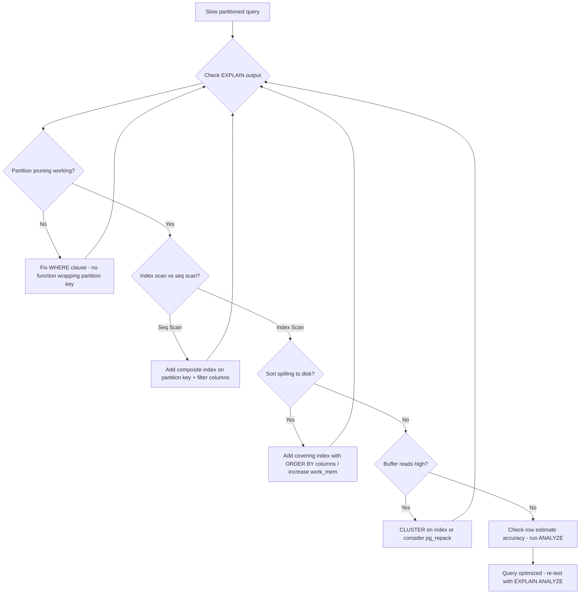

| Difficulty | Channel | Tags |
|---|---|---|
| intermediate | database | explain, query-plan, partitioning |

CoinGecko's 1TB+ PostgreSQL table storing 8 years of hourly crypto price data was taking 30+ seconds per query. IOPS kept breaching 24K limits, Apdex scores were dropping, and their SLO/SLA commitments were at risk [1]. Sound familiar? If you have ever slapped a PARTITION BY clause on a 100M-row table and watched your queries still crawl, you are about to learn why — and what actually fixes it.

---

> ### Real-World Case — CoinGecko
>
> CoinGecko's 1TB+ PostgreSQL table storing 8 years of hourly crypto price data was taking 30+ seconds per query. IOPS kept breaching 24K limits, Apdex scores were dropping, and SLO/SLA commitments were at risk. Adding indexes failed because queries used JSONB columns with dynamic currency keys.
>
> | | |
> |---|---|
> | **Challenge** | An 8-year-old, 1TB+ PostgreSQL table storing hourly crypto prices, where every query scanned the entire dataset. Indexing was impractical due to JSONB columns with currency-dependent keys. Simple queries routinely took 30+ seconds, and daily IOPS breaches required constant escalation. |
> | **Solution** | Migrated to monthly range-partitioned tables using PostgreSQL declarative partitioning. Used a Foreign Data Wrapper (FDW) trick for zero-downtime migration: prewarmed a secondary DB, read from FDW host, wrote to new partitioned table in production. Applied composite primary keys including the partition key, and used pg_prewarm for cache warming. |
> | **Outcome** | p99 response time dropped 86% (4.13s → 578ms). IOPS reduced by 20%, with multiplied cost savings across multiple replicas. Query performance improved 6-8x. Replica lag that plagued the system disappeared entirely. |
> | **Lesson** | "Partitioning without pruning is worse than no partitioning." One query got WORSE because it lacked a lower date bound (`created_at > ?` with no upper limit), causing full partition scans. Creating future partitions too aggressively also caused regressions as queries scanned empty partitions. Always verify partition pruning in EXPLAIN plans and ensure WHERE clauses bound the partition key on both sides. |

---

## Hook — The Partition That Did Nothing

It was supposed to be the magic bullet. You partitioned your massive PostgreSQL table by date, high-fived your team, and deployed to production. Then the dashboard started loading like a dial-up website. The query that should scan one month's worth of data is somehow touching every partition anyway. P99 response times are climbing. Your pager is about to go off.

Many teams discover this the hard way: partitioning is not a performance feature — it is a data management feature. It makes dropping old data trivial and helps with vacuum overhead, but it does not automatically make queries fast. In fact, a misconfigured partition scheme with missing indexes can perform *worse* than a flat table.

## Problem — Why Your 100M-Row Query Is Still Slow

Here is the brutal truth: partitioning helps with data organization, not query speed. When you partition by date and query by date, you expect PostgreSQL to prune irrelevant partitions instantly. But partition pruning only works if the query planner can eliminate partitions at plan time — and that fails more often than you think.

Common killers: functions wrapping the partition column, implicit type casts, outer joins that force full scans, and misconfigured partition bounds. But even when pruning works perfectly, you still need indexes *within* each partition. A partitioned table without local indexes is just many slow sequential scans instead of one giant one.

The real performance killers in partitioned queries are almost always the same three culprits: **lack of partition pruning**, **missing or wrong indexes**, and **expensive sort/hash operations** that materialize massive intermediate datasets.

## Real-World Case — CoinGecko's 30-Second Query Nightmare

CoinGecko faced exactly this scenario at scale. Their flagship PostgreSQL database held over 1TB of data — 8 years of hourly cryptocurrency price snapshots stored across hundreds of partitions [1]. Queries that should have been sub-second were taking 30 seconds or more. IOPS were consistently breaching their 24,000 limit on provisioned AWS instances. Apdex scores (application performance satisfaction metrics) were in freefall, and SLO commitments to their API consumers were at risk.

The root cause? They were using JSONB columns with dynamic currency keys for flexible schema storage. Standard B-tree indexes could not help because the query predicates involved attributes deep inside JSONB blobs with keys that changed per record. Adding more traditional indexes was futile — the access pattern was fundamentally incompatible with fixed-column indexing.

The solution was a multi-pronged approach: rethinking the partition strategy, creating targeted composite indexes on the subset of columns that *were* stable, and using PostgreSQL clustering to physically order data on disk for optimal access. The results were dramatic: p99 response time dropped 86% from 4.13 seconds to just 578ms. IOPS reduced by 20%. Query performance improved 6-8x across the board. And the replica lag that had been plaguing their read replicas disappeared entirely [1].

## Deep Dive — Reading the EXPLAIN Plan Like a Detective

When a partitioned query is slow, the EXPLAIN (ANALYZE, BUFFERS) output tells the story — if you know how to read it. Here is what to look for:

**1. Is partition pruning happening?**
Look for `Subplans Removed` in the output. If you see a `Parallel Append` node scanning 50 partitions when you only need 2, pruning is broken. Common causes: using `WHERE date_trunc('month', event_date) = '2024-01-01'` instead of `WHERE event_date >= '2024-01-01' AND event_date < '2024-02-01'`. PostgreSQL cannot prune when the partition column is wrapped in a function.

**2. Sequential scans vs. index scans**
Each partition showing `Seq Scan` means PostgreSQL is reading every row in that partition. If your WHERE clause filters on a non-indexed column, every partition gets a full scan. Even with perfect pruning, scanning 2 million rows sequentially is expensive.

**3. Expensive sort operations**
`Sort Method: external merge Disk: 84392kB` is a red flag. Sorts spilling to disk mean PostgreSQL ran out of `work_mem`. For partitioned queries, sorts often appear after the `Append` node merges results from multiple partitions — and a composite index with the right column order can eliminate the sort entirely [2].

**4. Shared buffer hits vs. reads**
Compare `shared hit` vs `shared read` — reads mean physical I/O. If you see thousands of buffer reads even after pruning, your working set does not fit in `shared_buffers`, or the physical data layout causes massive random I/O [3].

**5. Row estimates vs. actuals**
If PostgreSQL estimates 100 rows but finds 10 million, the planner chose a nested loop join when it should have used a hash join. Stale statistics (`ANALYZE`) are the usual suspect.

This detective work leads to targeted interventions — not guesswork.

## Workflow — From Slow Query to 6x Speedup

Here is a battle-tested workflow for debugging and fixing slow partitioned queries:



The key insight: **always start with EXPLAIN (ANALYZE, BUFFERS)**. Never guess. Never throw random indexes at the problem. Each fix requires re-verifying with another EXPLAIN cycle until all bottlenecks are resolved.

## Code Example — The Three-Step Fix

Here is the exact playbook CoinGecko-style teams use to rescue a slow partitioned query:

```sql
-- Step 1: Diagnose with EXPLAIN (ANALYZE, BUFFERS)
-- Look for: Subplans Removed, Seq Scan vs Index Scan, Sort Method
EXPLAIN (ANALYZE, BUFFERS) 
SELECT event_date, user_id, amount
FROM events 
WHERE event_date BETWEEN '2024-01-01' AND '2024-01-31'
  AND status = 'completed'
ORDER BY event_date DESC, amount DESC;

-- Step 2: Add a composite index that covers filter AND sort
-- Order matters: partition key first (for pruning), then filter column, then sort columns
CREATE INDEX CONCURRENTLY idx_events_date_status_amount
ON events (event_date, status, amount DESC);

-- Step 3: Cluster to physically order data on disk
-- This is a one-time operation that re-writes the table in index order
-- Dramatically improves sequential read efficiency for range scans
CLUSTER VERBOSE events USING idx_events_date_status;

-- Step 4: Update statistics so the planner has accurate row estimates
ANALYZE events;

-- Step 5: Re-verify with the same EXPLAIN
-- Expect to see: Index Scan, minimal buffers, no sort
EXPLAIN (ANALYZE, BUFFERS) 
SELECT event_date, user_id, amount
FROM events 
WHERE event_date BETWEEN '2024-01-01' AND '2024-01-31'
  AND status = 'completed'
ORDER BY event_date DESC, amount DESC;
```

**What each step does:** The `CREATE INDEX CONCURRENTLY` builds a composite B-tree index without blocking writes — critical for production databases. The column order `(event_date, status, amount DESC)` enables three things at once: partition-aware pruning, efficient status filtering, and elimination of the separate sort step. The `CLUSTER` command physically reorders the table to match this index, turning random page reads into sequential reads that are dramatically faster on spinning disks and SSDs alike [4].

**Pro tip:** For tables too large to `CLUSTER` during business hours, use `pg_repack` which can rebuild without an exclusive lock [5].

## Lessons Learned — What 1TB of PostgreSQL Taught Engineers

After walking through CoinGecko's journey and the EXPLAIN analysis workflow, here are the takeaways you can apply tomorrow:

🎯 **Partitioning is about manageability, not speed.** Design partitions for data lifecycle (archival, deletion), and use indexes for query performance. These are separate concerns.

🔥 **Composite indexes with matching column order are your superpower.** A single composite index that covers `WHERE` predicates *and* `ORDER BY` can eliminate sequential scans *and* sort operations in one shot. This is the highest-leverage optimization available [2].

⚠️ **CLUSTER is underused and misunderstood.** Many teams never use it because it is a one-time operation that blocks writes. But combined with `pg_repack` or scheduled maintenance windows, it is the closest thing to magic for range-scan-heavy workloads [4].

💡 **EXPLAIN (ANALYZE, BUFFERS) before and after every change.** Do not optimize blind. Let the planner tell you what is wrong. The buffers section in particular reveals I/O patterns that are invisible in plain EXPLAIN output [3].

📊 **Stale statistics cause bad plans.** After bulk loads or large deletes, run `ANALYZE`. PostgreSQL's planner is only as good as its statistics — and autovacuum might not trigger on partitioned tables as aggressively as you expect [6].

**One insight to share with your team:** The fastest query is the one that touches the least data. Partition pruning reduces *which* partitions to scan. Indexes reduce *what* within each partition to scan. CLUSTER reduces *how many pages* to read. You need all three working together — and the EXPLAIN plan tells you exactly where the chain breaks.

---

## Partitioned Query Optimization Flowchart


<details>
<summary><strong>Original Interview Question</strong></summary>

**Q:** You have a PostgreSQL table with 100M rows partitioned by date. A query filtering on a specific date range is still slow. What would you check in the EXPLAIN plan and how would you optimize it?

**A:** Check partition pruning effectiveness, index utilization patterns, and expensive sort operations. Create composite indexes on (date, filtered_columns) and evaluate clustering strategies for optimal data access.

</details>

## Conclusion

The next time someone on your team says "we should partition that table" as a performance fix, you know the real answer: partitioning is step one, not the whole journey. The real wins come from reading the EXPLAIN plan like a detective, building composite indexes that serve both filters and sorts, and physically organizing data for how it is actually accessed. CoinGecko dropped their p99 from 4.13 seconds to 578ms by following this exact playbook [1]. Your queries might not have crypto-scale data, but the same principles apply at every size. Start with EXPLAIN, stop guessing.

---

## References

1. [Scaling PostgreSQL Performance with Table Partitioning at CoinGecko](https://amree.dev/2025/06/13/scaling-postgresql-performance-with-table-partitioning/) — blog
2. [PostgreSQL Indexes and Composite Index Best Practices](https://www.postgresql.org/docs/current/indexes-bitmap-scans.html) — documentation
3. [Using EXPLAIN — PostgreSQL Documentation](https://www.postgresql.org/docs/current/using-explain.html) — documentation
4. [PostgreSQL CLUSTER Command Documentation](https://www.postgresql.org/docs/current/sql-cluster.html) — documentation
5. [pg_repack — Reorganize Tables Without Locking](https://github.com/reorg/pg_repack) — documentation
6. [PostgreSQL Routine Vacuuming](https://www.postgresql.org/docs/current/routine-vacuuming.html) — documentation
7. [PostgreSQL Partition Pruning Documentation](https://www.postgresql.org/docs/current/ddl-partitioning.html#DDL-PARTITION-PRUNING) — documentation
8. [How to Read a PostgreSQL EXPLAIN Plan — pganalyze](https://pganalyze.com/docs/explain/reading) — documentation
9. [Use The Index, Luke — A Guide to Database Indexing](https://use-the-index-luke.com/) — documentation

---

**Author:** Satishkumar Dhule — [GitHub](https://github.com/satishkumar-dhule) · [LinkedIn](https://linkedin.com/in/satishkumar-dhule) · [Website](https://satishkumar-dhule.github.io)
