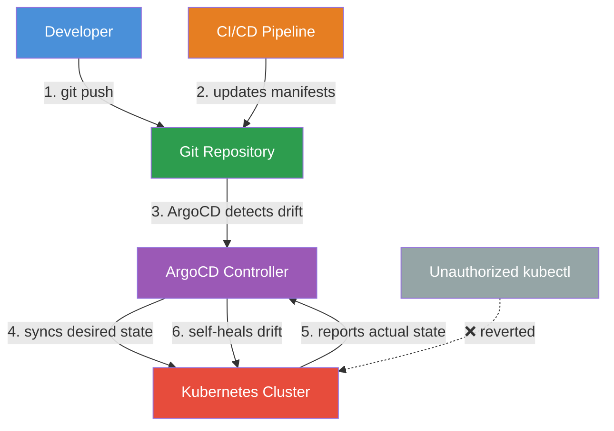

| Difficulty | Channel | Tags |
|---|---|---|
| beginner | devops | argocd, flux, declarative |

Imagine waking up to a production incident at a company that serves 100 million customers during tax season. One wrong `kubectl` command in the wrong cluster and millions of TurboTax filings could be affected. This was the reality Intuit faced before they bet everything on GitOps [1]. Today, the fintech giant manages 345+ Kubernetes clusters and 32,000+ applications through ArgoCD—the very tool they co-created and open-sourced. Here is how declarative GitOps took them from firefighting to flying, and how you can do the same.

---

> ### Real-World Case — Intuit
>
> Intuit, the $15B+ fintech company behind TurboTax and QuickBooks, co-created and open-sourced Argo CD. They manage one of the largest Argo CD deployments in the world, supporting 4,000+ developers deploying across 345+ Kubernetes clusters with 32,000+ applications.
>
> | | |
> |---|---|
> | **Challenge** | As Intuit scaled from dozens to hundreds of clusters, their Argo CD application controller started experiencing severe CPU spikes, Kubernetes API rate limiting, memory exhaustion, and application sync slowness. The default Argo CD configuration—built by Intuit themselves—couldn't handle the reconciliation load at this scale. |
> | **Solution** | Intuit's engineering team performed deep pprof CPU profiling on the application controller and discovered 32,000 reconciliations firing on a single Sunday morning. They traced the root cause to overly aggressive orphaned resource monitoring. They implemented: (1) resource exclusion filters to ignore platform-managed resources, (2) reconciliation jitter to smooth out spike patterns, (3) manual sharding with consistent hashing to distribute load across controller instances, (4) cluster namespace filters to limit each shard's scope, and (5) Kubernetes client QPS/burst tuning to avoid API throttling. |
> | **Outcome** | Intuit now runs GitOps at massive scale across 345+ clusters, 32,000+ applications, processing 2,400+ PRs per day through 50+ Argo CD instances. They reduced reconciliation-related CPU spikes, eliminated Kubernetes API throttling, and served 100M+ customers through tax season without deployment instability—all while remaining Argo CD's largest open-source contributor and maintainer. |
> | **Lesson** | Even the creators of a tool hit hard scaling walls. The biggest lesson: orphan resource monitoring is deceptively expensive—it forces reconciliation of every resource in every namespace, even those Argo CD doesn't manage. Default Argo CD configurations work for modest deployments, but at hyperscale you need sharding, resource exclusions, reconciliation jitter, and aggressive Kubernetes client tuning. Scale problems show up on quiet Sunday mornings, not during peak load. |

---

## Hook — The Scale That Would Break Most Teams

Four thousand developers. Three hundred forty-five clusters. Thirty-two thousand applications. Two thousand four hundred pull requests every single day [1]. These are not hypothetical numbers from a case study—they are the everyday reality for Intuit's platform engineering team. If you have ever felt the cold sweat of running `kubectl apply` in production, imagine doing that across 345 clusters while managing contributions from thousands of developers. The stakes could not be higher: one configuration drift, one missed sync, and Intuit's 100 million tax-filing customers could face service disruptions. Yet somehow, Intuit sails through tax season without deployment instability. The secret? A complete commitment to declarative GitOps powered by ArgoCD—the very project they co-created and still maintain.

## Problem — The Imperative Trap That Catches Everyone

Here is a scenario you have probably lived through. A hotfix needs to go out. Someone runs `kubectl run` or `kubectl apply -f patch.yaml` directly against the cluster. The fix works. Everyone moves on. Three weeks later, no one remembers what changed, why it changed, or who changed it. The Git repository—supposedly the source of truth—is now out of sync with production. This is the imperative approach, and it is a ticking time bomb. Configuration drift silently accumulates. Environment parity deteriorates. Rollbacks become archaeological digs through terminal history. Auditors ask questions you cannot answer. For a company like Intuit, where a single misconfigured cluster could impact millions of users during the busiest time of the year, this risk is simply unacceptable. The imperative workflow is fast in the moment but catastrophic over time.

## Real-World Case — Intuit's GitOps Transformation

Intuit did not just adopt GitOps—they wrote the playbook. As the company that co-created and open-sourced ArgoCD, they have become the definitive reference for GitOps at scale [1]. Their deployment infrastructure is staggering: 50+ ArgoCD instances running across multiple regions, processing 2,400+ pull requests daily, managing 32,000+ applications across 345+ Kubernetes clusters—all while serving over 100 million customers through the highest-stakes season in fintech. The challenges they overcame were not trivial. As their deployment count grew, they hit severe reconciliation-related CPU spikes and Kubernetes API throttling. Their team had to rebuild ArgoCD's reconciliation engine to handle the load, contributing those optimizations back to the open-source project. The result? Elimination of CPU spikes, zero API throttling, and most importantly—stable deployments through tax season, year after year. Intuit's journey shows that GitOps is not just for startups with three microservices—it is the only approach that scales to enterprise complexity.

## Deep Dive — Declarative vs. Imperative: The Paradigm Shift

The difference between declarative and imperative approaches is not just technical—it is philosophical. The imperative approach says "do this now." Run a command, something happens. Simple. Direct. And utterly un-auditable at scale. The declarative approach says "this is what should exist—make it so." You define the desired state in Git, and the system continuously reconciles reality with that definition. With ArgoCD, this reconciliation happens automatically. You configure an Application Custom Resource Definition (CRD) that points to a Git repository. ArgoCD polls that repository (typically every three minutes), detects any drift between the desired state in Git and the actual state in the cluster, and syncs them automatically. Enable self-healing, and ArgoCD will even revert manual changes made through `kubectl`—effectively making your cluster read-only for anything outside the Git workflow.

Here is the trade-off that surprises most developers: declarative GitOps is actually slower for the first deploy but infinitely faster for every subsequent operation. Debugging? The Git log tells you exactly what changed and why. Rollbacks? A single `git revert`. Auditing? Every change is a commit with an author, timestamp, and diff. Imperative workflows feel productive in the moment but create a nightmare of configuration drift and tribal knowledge over time. As Intuit's experience proves, at scale, declarative is not just better—it is the only option that works.

## Workflow — The GitOps Pipeline from Commit to Cluster

The GitOps workflow that Intuit and thousands of other organizations follow creates a closed feedback loop between developers, version control, and production clusters. Here is how the pieces fit together:

## Code Example — ArgoCD Application Manifest with Auto-Sync

The heart of any ArgoCD configuration is the Application CRD. This YAML manifest declares everything ArgoCD needs to know: where the source code lives, which cluster to deploy to, and how to handle drift detection and synchronization.

## Lessons Learned — What Intuit's Journey Teaches Us

There are three takeaways from Intuit's experience that every team should internalize. First, start declarative from day one. The cost of migrating from imperative to declarative grows exponentially with your cluster count—Intuit's engineering investment in scaling ArgoCD was necessary precisely because they had already committed to the declarative model. Second, self-healing is not optional. Without it, a single manual `kubectl` command in the wrong namespace breaks your single source of truth and creates drift that automated rollbacks cannot fix. Enable `selfHeal: true` on every production Application and treat your clusters as immutable infrastructure managed entirely through Git. Third, invest in your reconciliation strategy early. As Intuit discovered, the default sync behavior that works for 10 applications breaks at 1,000 [1]. You need to understand ArgoCD's sync waves, pruning behavior, and health checks long before you hit scale. Start by reading ArgoCD's production deployment guide [2] and Intuit's scaling talk [1]—they contain hard-won lessons that will save you months of debugging.

---

## GitOps Pipeline — From Commit to Cluster

<strong>Original Interview Question</strong>

**Q:** You're setting up GitOps for a microservices deployment. How would you configure ArgoCD to automatically sync changes from your Git repository to Kubernetes, and what's the difference between declarative and imperative approaches in this context?

**A:** I'd configure ArgoCD by setting up a Git repository containing Kubernetes manifests or Helm charts, creating an Application CRD that points to the Git repository, enabling auto-sync with a health check interval of 3 minutes, and implementing self-healing to automatically revert any manual changes. The declarative approach involves defining the desired state in Git through YAML manifests, Helm charts, or Kustomize configurations, where ArgoCD continuously reconciles the actual state with the desired state. In contrast, the imperative approach uses kubectl commands to make direct changes to the cluster, bypassing the Git repository as the single source of truth.

## Conclusion

Intuit's journey from 345 clusters and 32,000 applications to stable, automated deployments is proof that declarative GitOps is not just a buzzword—it is the only approach that scales. The fundamental insight is this: treating infrastructure as code means treating Git as the single source of truth and enforcing that truth through automated reconciliation. Start where Intuit started: with one Application manifest, one Git repository, and the discipline to never run `kubectl apply` in production again. Your future self—and your 4,000-person engineering team—will thank you.

---

## References

1. [Intuit — Scaling ArgoCD From Symptoms to Solutions (ArgoCon EU 2025)](https://hosted-files.sched.co/colocatedeventseu2025/74/ArgoCon%2025%20EU%20-%20Scaling%20Argo%20CD%20From%20Symptoms%20to%20Solutions.pdf) — paper
2. [ArgoCD Documentation — Production Deployment Guide](https://argo-cd.readthedocs.io/en/stable/operator-manual/) — documentation
3. [Kubernetes Documentation — Declarative Management](https://kubernetes.io/docs/tasks/manage-kubernetes-objects/declarative-config/) — documentation
4. [GitOps — Wikipedia](https://en.wikipedia.org/wiki/GitOps) — documentation
5. [ArgoCD — GitHub Repository](https://github.com/argoproj/argo-cd) — documentation
6. [CNCF — GitOps for Kubernetes and Cloud-Native Applications](https://www.cncf.io/reports/gitops/) — paper
7. [Helm Documentation — Chart Template Guide](https://helm.sh/docs/chart_template_guide/) — documentation
8. [Kustomize — Declarative Configuration Customization](https://kubectl.docs.kubernetes.io/) — documentation

---

**Author:** Satishkumar Dhule — [GitHub](https://github.com/satishkumar-dhule) · [LinkedIn](https://linkedin.com/in/satishkumar-dhule) · [Website](https://satishkumar-dhule.github.io)
