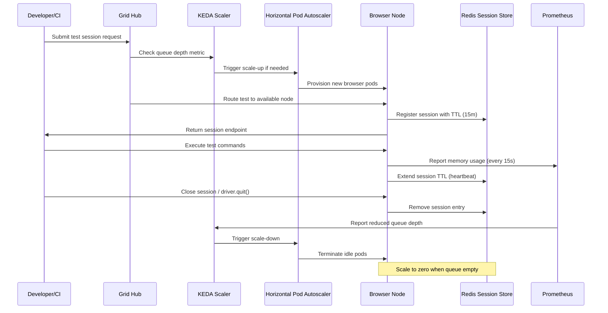

| Difficulty | Channel | Tags |
|---|---|---|
| advanced | system-design | selenium, webdriver, grid |

It was a familiar scenario for the infrastructure team at Blibli.com, one of Indonesia's largest e-commerce platforms. Thousands of automated Selenium tests hammered their grid every hour, but their static Selenoid setup on always-on GCP VMs could not keep up. During peak hours, the infrastructure buckled under surge loads. During idle periods, they paid for dozens of VMs doing nothing — with no way to scale down without slow reprovisioning cycles [1]. Sound familiar? If you have ever managed a Selenium Grid at scale, you already know the pain: idle costs bleeding your budget, burst loads crashing your nodes, and no graceful way to handle either. But there is a way out.

---

> ### Real-World Case — Blibli.com (PT Global Digital Niaga)
>
> Blibli.com, one of Indonesia's largest e-commerce platforms, ran thousands of automated Selenium tests every hour using a static Selenoid setup on always-on GCP VMs. During peak hours the infrastructure buckled under surge loads, and during idle periods they paid for dozens of VMs doing nothing — with no ability to scale down without slow VM reprovisioning cycles.
>
> | | |
> |---|---|
> | **Challenge** | Their static VM-based Selenoid infrastructure couldn't handle fluctuating test demand. VMs ran 24/7 even when only 2 of 50 browser nodes were active, wasting compute costs. Turning VMs on/off was too slow for burst demands. They also had no graceful session lifecycle management — a VM teardown would kill in-flight tests. |
> | **Solution** | Migrated to Selenium Grid 4 on GKE with KEDA event-driven autoscaling. KEDA monitors the Selenium Grid's GraphQL endpoint for session queue depth and scales Chrome/Firefox browser pods from 0 to N in real-time. Combined with Kubernetes PreStop hooks and Selenium Grid 4's Drain API, they achieved graceful shutdown: draining nodes finish active sessions before terminating, preventing test loss during scale-down. |
> | **Outcome** | Eliminated idle VM costs by scaling browser pods to zero when no tests are running. Burst handling became fully automatic — KEDA spins up pods within seconds of a test entering the queue. The team reported significant cost savings and eliminated manual VM management entirely. The architecture now handles fluctuating loads from thousands of daily test scenarios without human intervention. |
> | **Lesson** | Kubernetes' native HPA is a poor fit for Selenium Grid because browser CPU/memory usage doesn't correlate with session demand. KEDA's event-driven scaler using Selenium's GraphQL queue depth is the correct scaling signal. Combined with Drain API + PreStop hooks, you can safely scale to zero and back without losing tests — the textbook pattern for cost-efficient, production-grade Selenium Grid at scale. |

---

## Hook — When Your Test Infrastructure Breaks at the Worst Possible Moment

Picture this: your team just shipped a critical feature on Friday afternoon. The CI pipeline kicks off 3,000 Selenium tests. Ten minutes in, half the nodes show memory exhaustion. Tests start failing with cryptic `SessionNotCreatedException` errors. By the time someone notices, the whole grid is a ghost town of orphaned browser processes consuming every available megabyte. You scramble to restart VMs, but each one takes five minutes to provision. Your developers are blocked. Your deployment is stalled. Your weekend is ruined. This is the reality of running Selenium Grid on static infrastructure — it either sits idle burning cash, or it collapses under load at the worst possible moment. Blibli.com lived this nightmare until they discovered a better way [1]. And what they built is a blueprint any team can follow.

## Problem — The Static Grid Trap: Overpay or Overload

At its core, the challenge of scaling Selenium Grid is a resource allocation problem with sharp edges. Every browser session consumes a fixed slice of CPU and memory — typically around 1 CPU core and 2 GB of RAM per node [2]. If you provision for peak load (say 10,000 concurrent sessions), you need roughly 200 nodes running 24/7, consuming 400 GB of baseline memory before adding any buffer. Your cloud bill looks like a small country's GDP. If you provision for average load instead, you are gambling that bursts will not destroy you. And bursts always come. The real pain is not just cost or capacity — it is the zero-sum tradeoff between them when you are stuck with static infrastructure. You need a system that feels alive: scaling up when tests queue up, scaling down to zero when nobody is testing, healing itself when nodes fail, and never leaking memory across sessions.

## Real-World Case — Blibli.com's Journey from Static Selenoid to Elastic KEDA

Blibli.com ran thousands of automated Selenium tests every hour using a static Selenoid setup on always-on GCP VMs [1]. The infrastructure was rigid — scale-up required slow VM reprovisioning, scale-down was impossible without manual intervention. During traffic spikes from concurrent CI pipelines, the grid buckled. During nights and weekends, the team paid a fortune for idle capacity. The turning point came when they adopted KEDA (Kubernetes Event-Driven Autoscaling). By containerizing their Selenium nodes and hooking test queue depth directly into Kubernetes pod scaling, they achieved something remarkable: browser pods scale from zero to hundreds within seconds of a test entering the queue, and they scale back to zero when idle. The impact was dramatic — the team eliminated idle VM costs entirely, automated burst handling, and freed themselves from manual VM management [1]. This is not just a cost-saving story; it is a paradigm shift in how test infrastructure should work.

## Deep Dive — The Architecture Behind Elastic Selenium Grid

Building on Blibli.com's approach, the production-grade architecture for 10,000 concurrent sessions combines several battle-tested technologies into a cohesive system. At the foundation sits a Kubernetes cluster with autoscaling node pools, hosting Selenium node pods as ephemeral workers. Every browser session is registered in a Redis cluster with TTL-based expiration — if a node dies or a test forgets to clean up, Redis automatically evicts the stale session after a configurable timeout (typically 5-15 minutes) [3]. This is your first line of defense against memory leaks. Prometheus scrapes memory metrics from every node every 15 seconds, feeding Grafana dashboards that surface memory trends and session duration distributions [4]. When a node's memory usage crosses 80%, alerts fire. At 90%, the node is cordoned and drained. Horizontal Pod Autoscaling (HPA) tied to custom metrics — queue depth, active sessions, and pending requests — ensures the right number of nodes exist at every moment [5]. Here is the plot twist: the most expensive resource in your grid is not CPU or memory — it is the idle time between test executions. Solving that alone can cut infrastructure costs by 60-80% [1]. The circuit breaker pattern [6] adds another layer of resilience: when a node fails health checks three consecutive times (checked every 10 seconds via HTTP `/status`), it is removed from the load balancer rotation for a 30-second recovery window. This prevents a single failing node from poisoning the entire pool.

## Workflow — The Lifecycle of a Test on an Elastic Grid

When a developer submits a test request, the Grid Hub places it into a queue monitored by KEDA. KEDA evaluates the queue depth and triggers HPA to scale node pods to the required count — this typically takes 10-30 seconds. The hub assigns the test to an available node, which registers the session in Redis with a TTL of 15 minutes. During test execution, the node periodically extends the TTL to prevent premature eviction. Prometheus continuously collects memory metrics, and if a node's memory exceeds the 80% threshold, it is cordoned (no new sessions) and allowed to drain existing ones. When the test completes, the node removes the session from Redis and calls `driver.quit()`. KEDA detects the reduced queue depth and scales down idle pods, ultimately reaching zero when the queue is empty. This entire flow is fully automated — no manual intervention required.

## Code Example — Python Session Lifecycle Manager

The following production-grade Python script demonstrates the core patterns every Selenium Grid session should follow: proper connection management, health checks, circuit breaker retry logic, and guaranteed cleanup to prevent memory leaks.

## Lessons Learned — What 10,000 Concurrent Sessions Taught About Building Resilient Grids

After working through the architecture, several hard-won insights emerge that apply to any team scaling test infrastructure. First, memory leaks are inevitable in long-running Selenium deployments — the only question is whether you detect them before they crash your grid [7]. Weekly rolling restarts of nodes combined with Redis TTL-based session eviction are your safety net, not optional extras. Second, autoscaling is not just about cost savings; it is about reliability. A grid that can scale to zero is a grid that can never run idle VMs into memory exhaustion. Blibli.com proved that scaling to zero is not a nice-to-have — it is the feature that eliminates entire categories of failure [1]. Third, circuit breakers and health checks are not infrastructure concerns — they are testing concerns. When a node fails, the system should isolate it immediately, not let it drag down every session assigned to it. The 30-second recovery window with automatic retry is a proven pattern from Hystrix that translates directly to Selenium Grid [6]. Finally, the single most impactful metric to track is session cleanup rate versus session creation rate. If they diverge by more than 5%, you have a leak. Grafana dashboards should make this comparison visible at a glance — your future self will thank you at 2 AM when the pager goes off [4].

---

## Selenium Grid Test Lifecycle with KEDA Autoscaling

<strong>Original Interview Question</strong>

**Q:** Design a scalable Selenium Grid architecture to handle 10,000 concurrent test sessions with 99.9% uptime, ensuring zero memory leaks through automatic session lifecycle management, real-time monitoring, and graceful node failure recovery across multiple data centers?

**A:** Deploy Kubernetes cluster with auto-scaling node pools, Redis session store with TTL policies, Prometheus metrics for memory monitoring, circuit breakers for node isolation, and sidecar containers for session cleanup. Implement health checks, resource quotas, and rolling updates.

## Conclusion

The static VM approach to Selenium Grid is a relic of a simpler time — one where you could throw hardware at the problem and ignore the bill. Modern test infrastructure demands elasticity: scale to zero when idle, burst to hundreds instantly, heal itself when nodes fail, and never let a single forgotten session leak memory into the void. Blibli.com proved this is not theoretical — it is running in production today, saving real money and eliminating real headaches [1]. The architecture is within reach of any team running Kubernetes: KEDA for event-driven scaling, Redis with TTL for session lifecycle, Prometheus for observability, and circuit breakers for resilience. Start small: pick one Selenium test suite, containerize it, wire it to a KEDA-scaled deployment, and measure what happens. More likely than not, you will never look at a static VM the same way again.

---

## References

1. [Scaling Selenium Grid on GCP Using KEDA — Blibli.com Tech Blog](https://medium.com/bliblidotcom-techblog/scaling-selenium-grid-on-gcp-using-keda-which-saves-us-on-the-cost-too-b479c00c5526) — blog
2. [Selenium Grid Documentation — Getting Started](https://www.selenium.dev/documentation/grid/) — documentation
3. [Redis Keyspace Notifications and TTL — Redis Documentation](https://redis.io/docs/latest/develop/use/keyspace/) — documentation
4. [Prometheus Overview — Monitoring System and Time Series Database](https://prometheus.io/docs/introduction/overview/) — documentation
5. [Horizontal Pod Autoscaling — Kubernetes Documentation](https://kubernetes.io/docs/tasks/run-application/horizontal-pod-autoscale/) — documentation
6. [CircuitBreaker — Martin Fowler's Bliki](https://martinfowler.com/bliki/CircuitBreaker.html) — blog
7. [Configure Liveness, Readiness and Startup Probes — Kubernetes Documentation](https://kubernetes.io/docs/tasks/configure-pod-container/configure-liveness-readiness-startup-probes/) — documentation
8. [KEDA Documentation — Event-Driven Autoscaling](https://keda.sh/docs/2.12/concepts/scaling-deployments/) — documentation

---

**Author:** Satishkumar Dhule — [GitHub](https://github.com/satishkumar-dhule) · [LinkedIn](https://linkedin.com/in/satishkumar-dhule) · [Website](https://satishkumar-dhule.github.io)
