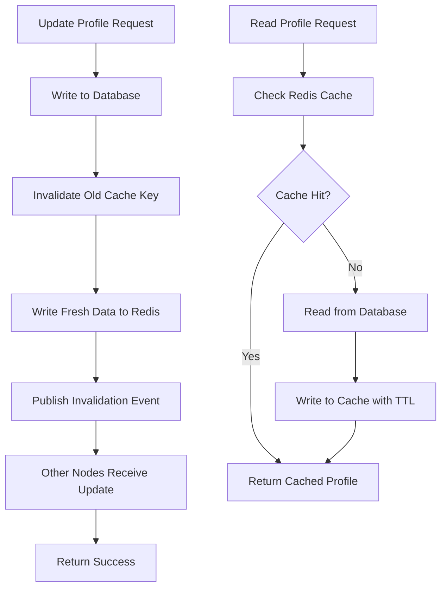

| Difficulty | Channel | Tags |
|---|---|---|
| beginner | backend | redis, memcached, cache-invalidation |

Imagine your cache serving 150 million reads per second with 99.9% hit rates and sub-10ms consistency windows. That is not a fantasy — it is what Uber achieved with CacheFront v2 [1]. But getting there required confronting one of distributed systems' thorniest problems: cache invalidation. Here is what Uber's engineering team discovered, and what every developer building profile services needs to know.

---

> ### Real-World Case — Uber
>
> Uber's Docstore storage system serves critical ride-hailing data — user profiles, trip history, driver availability, and pricing. Their Redis-based CacheFront initially handled 40M reads/second with eventual consistency (TTL + CDC binlog tailing), but service owners demanded stronger guarantees and higher hit rates. Stale profile data persisted for minutes, and staleness was theoretically unbounded when Redis nodes failed during invalidation.
>
> | | |
> |---|---|
> | **Challenge** | Cache invalidation under eventual consistency caused three types of failures: (1) racing cache fills between concurrent reads/writes overwriting fresh data with stale, (2) CDC (Flux) delays of 100-500ms breaking read-your-own-writes guarantees, and (3) Redis node unavailability silently dropping invalidations. Service owners were stuck — raising TTLs improved hit rates but made stale data worse, while lowering TTLs defeated caching entirely. A one-year-old row could be served for an entire TTL window if a single invalidation failed. |
> | **Solution** | Uber deeply integrated Redis caching with their MySQL storage engine. They added soft-delete tombstones and strictly monotonic microsecond-precision timestamps to MySQL. Now, before each COMMIT, the storage engine queries all row keys modified in the transaction and returns them with the commit timestamp. A callback in the query engine immediately writes invalidation markers to Redis. This gives three simultaneous protection layers: synchronous invalidation from the query engine, async CDC from Flux tailing binlogs, and TTL expiration as a safety net. They also built Cache Inspector to measure staleness in real-time. |
> | **Outcome** | CacheFront v2 serves 150M+ reads/second (3.75x from v1). Cache hit rate hit 99.9%+ (from ~99%). TTLs were extended from 5 minutes to 24 hours — a 288x increase. Consistency windows dropped from 500ms+ to sub-10ms. P75 latency fell 75%, P99.9 fell 67%. For one use case, 60K CPU cores of storage engine were replaced with 3K Redis cores. The dedicated cache-invalidation API was fully deprecated. Uber's engineers state they've 'achieved a truly state-of-the-art integrated caching infrastructure.' |
> | **Lesson** | Cache invalidation is solvable — but not by adding more cache servers or complex eviction policies. The key is integrating the cache layer deeply with the storage engine itself. By making the database return exactly which rows changed in each transaction (with monotonic timestamps), you can invalidate synchronously at write time while still benefiting from async CDC and TTL as layered safety nets. The write path becomes the consistency enforcer, not an afterthought. |

---

## Hook — The Cache That Almost Broke Uber

Uber's Docstore system handles everything from user profiles to driver availability and trip pricing. Their first-generation cache, CacheFront v1, processed an impressive 40 million reads per second. But here is the catch: stale profile data persisted for minutes, and when Redis nodes failed during invalidation, staleness became theoretically unbounded [1]. Service owners were not happy. They demanded stronger consistency guarantees and higher hit rates. Sound familiar?

## Problem — Why Cache Invalidation Is Hard

The fundamental tension in caching is simple: you want data fast, but you also want it correct. Every developer discovers this the hard way. You add a cache, performance improves overnight, but then users start seeing old profile pictures or stale pricing data. The problem compounds at scale. With multiple application servers, each holding their own cache state, how do you know when to evict what? Many teams reach for TTL-based expiration and call it a day. That works — until someone changes their name and it takes five minutes to reflect everywhere. Suddenly your user trust is eroding, and you are debugging stale data across dozens of nodes.

## Real-World Case — Uber's CacheFront v2 Transformation

This is where Uber's story gets interesting. Their Docstore team rebuilt CacheFront from the ground up, moving from eventual consistency (TTL + CDC binlog tailing) to a strongly consistent architecture. The results are staggering: CacheFront v2 serves over 150 million reads per second — a 3.75x improvement from v1. Cache hit rates jumped from ~99% to 99.9%+. TTLs were extended from 5 minutes to 24 hours — a 288x increase [1]. Consistency windows dropped from over 500 milliseconds to under 10 milliseconds. The p75 latency fell 75%, and p99.9 fell 67%. In one particularly dramatic case, 60,000 CPU cores of storage engine were replaced with just 3,000 Redis cores. As Uber's engineers put it, they achieved "a truly state-of-the-art integrated caching infrastructure." The key insight? They fully deprecated their dedicated cache-invalidation API.

## Deep Dive — Redis vs Memcached: The Real Trade-offs

Building on Uber's experience, let us examine the two most popular caching solutions and their real trade-offs. Redis and Memcached are often presented as interchangeable, but they solve fundamentally different problems. Memcached is a pure caching layer — simple, fast, and low-overhead. It excels at key-value lookups where if the data is lost, no one cares. Redis, on the other hand, is a data structure server with persistence, pub/sub, and advanced data types [2]. You might think Memcached's simplicity makes it the easier choice. However, consider this: Redis's pub/sub capabilities enable automatic distributed invalidation across nodes, which is exactly what you need for a multi-server profile service [3]. Memcached requires manual coordination — you have to build your own invalidation protocol. 

🔥 **Hot Take:** If you are building anything beyond a single-server cache, the choice is not about performance — it is about consistency guarantees. Redis's persistence model means you can recover cache state after a restart without a cold start storm [2]. Memcached has no such safety net.

| Feature | Redis | Memcached |
|---------|-------|-----------|
| Pub/Sub invalidation | Built-in | Manual implementation required |
| Persistence | RDB/AOF snapshots | No persistence |
| Memory overhead | Higher (richer data structures) | Lower (simple key-value) |
| Horizontal scaling | Cluster mode (sharding) | Simpler distributed architecture |
| Best for | Complex invalidation, durable caching | Pure performance, temp data |

⚠️ **Watch Out:** Many developers default to Redis because it is more popular. But for a simple read-through cache with infrequent updates, Memcached's lower memory overhead can save real money. Choose based on your invalidation needs, not hype.

## Workflow — Write-Through Cache Invalidation in Practice

Now let us walk through the pattern that powers production systems like Uber's. The write-through caching strategy ensures that every data update flows through both the database and cache atomically. Here is the lifecycle:

1. **Read Request:** Application checks the cache first. If found, return immediately (cache hit).
2. **Cache Miss:** Read from the database, populate the cache with a TTL, then return.
3. **Update Request:** Write the new data to the database, *then* write to the cache with a fresh TTL. Optionally, delete the old cache key first to prevent partial reads.
4. **TTL Expiration:** The cache evicts the key automatically. The next read triggers a refresh.
5. **Distributed Invalidation:** With Redis pub/sub, when one node invalidates a key, all subscribers learn about it instantly [3]. With Memcached, you need an external coordination layer (ZooKeeper, etcd, or a custom message bus).

The key distinction from cache-aside: in write-through, the cache is the single source of truth for reads after the first write. In cache-aside, the database is always the source of truth and the cache is just a performance optimization [4].

## Code Example — Profile Cache Service with Write-Through

Here is a production-oriented implementation of a user profile cache service in Python using Redis for write-through caching with invalidation support.

## Lessons Learned — What Uber's Journey Teaches Us

Uber's CacheFront story contains lessons that apply at every scale. First, **consistency beats simplicity.** The extra engineering effort for strong consistency paid for itself in eliminated debugging sessions and user trust. Second, **measure before you optimize.** Uber's team knew their exact throughput, hit rate, and latency at every stage because they instrumented everything. You cannot fix what you do not measure. Third, **consider deprecating your invalidation API.** Uber's most powerful insight was that a dedicated invalidation endpoint adds complexity without value. If your write path already handles cache updates correctly, you do not need a separate invalidation hammer. Finally, **TTLs are a safety net, not a strategy.** Uber extended theirs to 24 hours after achieving sub-10ms consistency. Long TTLs mean better hit rates and lower database load, but only if you trust your invalidation logic.

---

## Write-Through Cache Invalidation Flow

<strong>Original Interview Question</strong>

**Q:** You're building a user profile service that caches frequently accessed profiles. How would you implement cache invalidation when a user updates their profile, and what trade-offs would you consider between Redis and Memcached?

**A:** Implement write-through caching with TTL-based expiration. On profile update, invalidate the cache by deleting the key and writing new data to both the database and cache. Redis offers pub/sub for automatic distributed invalidation, while Memcached requires manual coordination across nodes.

## Conclusion

Cache invalidation is not a technical problem — it is a trust problem. Every second of stale data erodes user confidence in your system. Uber's CacheFront journey proves that with the right architecture — write-through caching, distributed invalidation, and instrumented observability — you can have both performance **and** consistency. Start by instrumenting your current cache hit rate. Then audit your invalidation path. Then ask yourself: do you really need that separate cache-invalidation API? The answer might surprise you. Share this with your team and ask: if your cache failed right now, how long would stale data persist?

---

## References

1. [How Uber Serves Over 150 Million Reads Per Second](https://www.uber.com/us/en/blog/how-uber-serves-over-150-million-reads/) — blog
2. [Redis Documentation — Persistence and Data Types](https://redis.io/docs/latest/) — documentation
3. [Redis Pub/Sub Documentation](https://redis.io/docs/latest/develop/interact/pubsub/) — documentation
4. [Cache-Aside Pattern — Azure Architecture Center](https://learn.microsoft.com/en-us/azure/architecture/patterns/cache-aside) — documentation
5. [Memcached — Wikipedia](https://en.wikipedia.org/wiki/Memcached) — documentation
6. [Cache (Computing) — Cache Invalidation and Writing Policies](https://en.wikipedia.org/wiki/Cache_(computing)#Cache_invalidation) — documentation
7. [AWS ElastiCache Documentation — Redis vs Memcached](https://docs.aws.amazon.com/AmazonElastiCache/latest/dg/SelectEngine.html) — documentation
8. [Time to Live (TTL) — Wikipedia](https://en.wikipedia.org/wiki/Time_to_live) — documentation
9. [CAP Theorem — Wikipedia](https://en.wikipedia.org/wiki/CAP_theorem) — documentation
10. [Redis Cluster Specification](https://redis.io/docs/latest/operate/oss_and_stack/management/scaling/) — documentation

---

**Author:** Satishkumar Dhule — [GitHub](https://github.com/satishkumar-dhule) · [LinkedIn](https://linkedin.com/in/satishkumar-dhule) · [Website](https://satishkumar-dhule.github.io)
