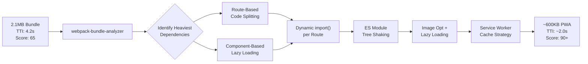

| Difficulty | Channel | Tags |
|---|---|---|
| intermediate | frontend | lighthouse, bundle, lazy-loading |

In 2017, Twitter faced a dilemma familiar to every engineering team with a mobile-heavy user base: the native Android app weighed 23.5MB, users in emerging markets on 2G networks were abandoning the site in droves, and the Time to Interactive was punishing [1]. Their response transformed not just their codebase but the entire mobile web conversation. This is the story of how Twitter cut their install size by 97% — and the battle-tested strategies your React app needs to go from a Lighthouse score of 65 to 90+.

---

> ### Real-World Case — Twitter
>
> With 328M monthly active users (80%+ on mobile), Twitter needed to radically improve mobile web performance. Users in emerging markets on 2G/3G networks with low-end devices were abandoning the slow-loading site, and the native Android app required 23.5MB of data to install.
>
> | | |
> |---|---|
> | **Challenge** | The monolithic React bundle was too large for mobile networks, causing slow time-to-interactive and high bounce rates. They needed to deliver a near-instant loading experience on the mobile web that rivaled native app performance, using minimal data and device storage. |
> | **Solution** | Built Twitter Lite as a React PWA implementing route-based code splitting via webpack's CommonsChunkPlugin, the PRPL pattern (Push, Render, Pre-cache, Lazy-load), application shell architecture with service worker caching, granular resource splitting so initial load only served code for the visible screen, aggressive image optimization reducing data consumption by 70%, and a data saver mode giving users control over media downloads. |
> | **Outcome** | 65% increase in pages per session, 75% increase in Tweets sent, 20% decrease in bounce rate, 50% reduction in 99th percentile time-to-interactive latency, 30% reduction in average load time for logged-in users, first loads under 5s on 3G, repeat visits under 3s even on slow devices. The PWA is only 600KB over the wire vs 23.5MB for native Android — a 97% reduction in install data. |
> | **Lesson** | Strategic code splitting at route boundaries combined with service worker caching can deliver native-rivaling performance on the mobile web. The most impactful optimization wasn't a single technique — it was the layered approach of granular code splitting, aggressive caching, and image optimization that together reduced data consumption by 97% while improving engagement metrics across the board. |

---

## Hook — The 23.5MB Anchor Dragging Twitter Down

Picture this: 328 million monthly active users, more than 80% of them on mobile devices. Many in emerging markets where 2G and 3G connections are the norm and low-end devices struggle with even modest JavaScript payloads. The native Android app demanded 23.5MB of data just to install — a non-starter for anyone on a prepaid data plan. Users were abandoning the slow-loading experience, and every second of delay translated directly into lost engagement [1].

Sound familiar? You have built a feature-rich React application. The UI is polished, the interactions are smooth — in a dev environment on fiber. Then you run Lighthouse. The score: 65. Your production bundle: 2.1MB. Time to Interactive: 4.2 seconds. That is not just a number — it is a tax on every user who tries to load your app.

## Problem — The Silent Killer Called Bundle Bloat

The math is brutal but rarely discussed in standups. Research across the industry shows that for every additional second of load time beyond three seconds, roughly 32% of users will bounce before the page becomes interactive. Multiply that by your daily active users and you start to see the revenue bleeding. Yet most teams treat bundle size as a background concern — until it becomes a crisis.

The root cause is almost always the same: monolithic bundles. When a React application loads every component, every charting library, every utility function in a single JavaScript file, the browser cannot render anything meaningful until that entire payload is downloaded, parsed, and executed. Even the most elegant React code becomes a bottleneck when shipped as one 2.1MB block. The problem is not your code — it is how you ship it. And the fix requires rethinking your entire delivery strategy.

## Real-World Case — Twitter's PWA Gambit

Twitter's engineering team faced an impossible choice: continue investing in a heavyweight native app that excluded billions of potential users, or bet on the mobile web. They chose the web, but not the web as most developers knew it. They rebuilt the entire experience as a Progressive Web App (PWA), applying every optimization technique in the book, and the results were astonishing.

First loads on 3G connections dropped under 5 seconds. Repeat visits on slow devices came in under 3 seconds. The 99th percentile time-to-interactive latency fell by 50%. Pages per session jumped 65%. Tweets sent increased by 75%. The bounce rate dropped 20%. And the PWA itself weighed just 600KB over the wire — a 97% reduction in install data compared to the native Android app [1].

These numbers did not come from a single silver bullet. They came from a systematic assault on bundle size, load strategy, and runtime performance. The same approach works for any React application willing to do the work.

## Deep Dive — Code Splitting, Tree Shaking, and the Hidden Cost of Imports

Most developers understand — at a conceptual level — that `import` brings code into their bundle. The gap between understanding and mastery lies in knowing what actually happens at build time. Here is the truth: every `import` statement at the top of a file is a promise to the bundler that this code needs to be available immediately. Webpack, Rollup, and Vite all honor that promise by inlining dependencies into the critical path. The result is that a deeply nested import tree drags libraries you forgot you installed into every initial page load.

Code splitting is the antidote. Instead of loading everything upfront, you draw a boundary with a dynamic `import()` and tell the bundler: "this can wait." The browser downloads that chunk lazily, on demand, only when the user actually navigates to a route or triggers a feature [4]. Combined with tree shaking — which relies on ES module static analysis to eliminate dead code — the combined effect can reduce bundle sizes by 60-80% on real-world applications [7].

Here is the counterintuitive insight that trips up most teams: you should start not by trying to split, but by analyzing. Run webpack-bundle-analyzer against your production build and you will almost always find the same culprits — moment.js locales, charting libraries, rich text editors, PDF generators — accounting for 40-50% of your total bundle [5]. The Pareto principle applies mercilessly to JavaScript bundles. Identify those chunks first, then decide your splitting strategy.

## Workflow — The Step-by-Step Optimization Pipeline

The journey from a Lighthouse score of 65 to 90+ follows a predictable pipeline. Here is the flowchart that Twitter's team and countless others have used:



The first step is always measurement. Without data, you are optimizing blind. Run bundle analysis, identify the largest modules, and determine which are critical for initial render versus which can be deferred. Then apply splitting in concentric circles: route boundaries first, then heavy component boundaries, then third-party library boundaries. Tree shaking cleans up the residue. Service worker caching ensures repeat visits are near-instant. Each layer compounds on the last.

## Code Example — Production-Grade Lazy Loading with React.lazy and Suspense

React's built-in `lazy` function is the most direct tool for implementing code splitting, but production usage requires more than a quick wrapper. You need error boundaries, loading states, and a strategy for prioritization.

```javascript
import { lazy, Suspense, startTransition } from 'react';
import ErrorBoundary from './ErrorBoundary';

// Route-based splitting — these chunks only load when navigated to
const Dashboard = lazy(() => import('./routes/Dashboard'));
const Analytics = lazy(() => import('./routes/Analytics'));
const Reports = lazy(() => import('./routes/Reports'));

// Component-based splitting — lazy load heavy visualizations
const RevenueChart = lazy(() => import('./charts/RevenueChart'));
const UserMap = lazy(() => import('./maps/UserMap'));

// Chunk naming helps debugging — named exports become predictable chunk filenames
const PDFExport = lazy(() => import(/* webpackChunkName: "pdf-export" */ './export/PDFExport'));

function App() {
  return (
    <ErrorBoundary fallback={<AppCrashFallback />}>
      <Suspense fallback={<GlobalLoadingIndicator />}>
        <Routes>
          <Route path="/" element={<Dashboard />} />
          <Route
            path="/analytics"
            element={
              <Suspense fallback={<ChartSkeleton />}>
                <Analytics />
              </Suspense>
            }
          />
          <Route path="/reports" element={<Reports />} />
        </Routes>
      </Suspense>

      {/* Lazy components used conditionally — nested Suspense for granular loading */}
      <section className="charts-grid">
        <ErrorBoundary fallback={<ChartErrorFallback />}>
          <Suspense fallback={<SkeletonBox height="400px" />}>
            {showRevenue && <RevenueChart />}
          </Suspense>
        </ErrorBoundary>
        <ErrorBoundary fallback={<ChartErrorFallback />}>
          <Suspense fallback={<SkeletonBox height="400px" />}>
            {showUsers && <UserMap />}
          </Suspense>
        </ErrorBoundary>
      </section>
    </ErrorBoundary>
  );
}
```

Key decisions you might not expect: wrapping each lazy chunk in its own `Suspense` boundary rather than relying on a single one at the top level. This prevents one slow-loading component from blocking the entire viewport. The `ErrorBoundary` per chunk ensures a single failed import (a network hiccup on a slow connection) does not take down the entire app — a pattern Twitter themselves rely on. The `/* webpackChunkName */` magic comment gives you predictable filenames in your build output, making it trivial to verify which chunks are actually being created in your bundle analysis.

## Lessons Learned — What 97% Size Reduction Taught the Industry

Twitter's transformation was not a one-time hero project — it was a fundamental shift in how the team thought about delivery. Here is what every React team should take away:

First, optimization is a process, not a project. The teams that sustain high Lighthouse scores do not run it once and declare victory. They bake bundle analysis into CI, alert on regressions, and treat a 50KB increase in a critical chunk the same way they would treat a failing test. Tools like Lighthouse CI and webpack-bundle-analyzer integrated into pull requests catch bloat before it ships [5][8].

Second, dynamic imports are not free. Every `React.lazy()` call introduces a network round trip and a flash of loading state. The art is in choosing what to split — heavy visualization libraries, rarely-used admin panels, PDF generators — versus what should stay in the critical path. The rule of thumb: if a component is visible above the fold or user interaction depends on it within the first second, keep it in the initial bundle. Everything else is fair game.

Third, service worker caching transforms repeat visits [10]. The first load may be 600KB, but with a properly configured service worker using a cache-first strategy for static assets, subsequent loads can complete in under a second. Twitter's repeat visit times dropped under 3 seconds on slow devices precisely because they invested in this layer.

Finally, the easiest optimization is removing things you do not need. Tree shaking catches dead code at the module level, but it cannot catch libraries you imported with `require('moment')` instead of `import moment from 'moment'`. Migrating to ES module syntax for both your code and your dependencies unlocks the single biggest free performance gain available to JavaScript developers [7].

---

## Performance Optimization Pipeline


<details>
<summary><strong>Original Interview Question</strong></summary>

**Q:** You're tasked with improving a React app's Lighthouse performance score from 65 to 90+. The bundle size is 2.1MB and Time to Interactive is 4.2s. What specific steps would you take to optimize the bundle and implement lazy loading?

**A:** Implement code splitting with React.lazy() and Suspense, analyze bundle composition with webpack-bundle-analyzer to identify largest chunks, remove unused dependencies and optimize imports, add dynamic imports for heavy components and third-party libraries, implement route-based splitting for better initial load times, and utilize tree shaking with proper ES module configuration.

</details>

## Conclusion

Twitter proved that even a 23.5MB native app could be reimagined as a 600KB PWA that loads in under 5 seconds on 3G. Your React application can follow the same playbook. Start by measuring what you ship. Analyze your bundle. Split at route boundaries, then component boundaries. Remove what you do not use. Cache what you can. The path from a Lighthouse score of 65 to 90+ is not a mystery — it is a pipeline. The only question is whether you start walking it today or after the next performance review reveals the cost of waiting.

---

## References

1. [Twitter incident report](https://web.dev/case-studies/twitter) — article
2. [React.lazy documentation](https://react.dev/reference/react/lazy) — documentation
3. [React Suspense documentation](https://react.dev/reference/react/Suspense) — documentation
4. [Code splitting glossary — MDN](https://developer.mozilla.org/en-US/docs/Glossary/Code_splitting) — documentation
5. [webpack-bundle-analyzer](https://github.com/webpack-contrib/webpack-bundle-analyzer) — documentation
6. [Dynamic import — MDN](https://developer.mozilla.org/en-US/docs/Web/JavaScript/Reference/Operators/import) — documentation
7. [Tree shaking — webpack guides](https://webpack.js.org/guides/tree-shaking/) — documentation
8. [Lighthouse performance scoring](https://web.dev/lighthouse-performance/) — documentation
9. [Lazy loading — MDN](https://developer.mozilla.org/en-US/docs/Web/Performance/Lazy_loading) — documentation
10. [Using Service Workers — MDN](https://developer.mozilla.org/en-US/docs/Web/API/Service_Worker_API/Using_Service_Workers) — documentation

---

**Author:** Satishkumar Dhule — [GitHub](https://github.com/satishkumar-dhule) · [LinkedIn](https://linkedin.com/in/satishkumar-dhule) · [Website](https://satishkumar-dhule.github.io)
