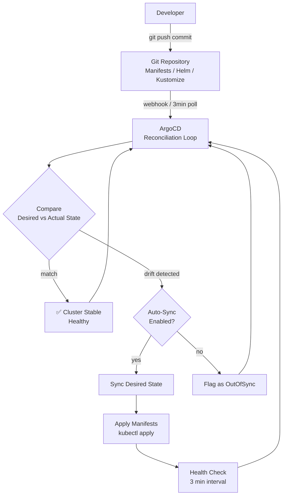

| Difficulty | Channel | Tags |
|---|---|---|
| beginner | devops | argocd, flux, declarative |

Imagine scaling a platform to 4,000+ developers, only to realize your deployments still take three days. That is exactly where Intuit — the Fortune 500 company behind TurboTax, QuickBooks, and Mint — found themselves after moving to the cloud [1]. Their lift-and-shift migration delivered marginal gains, onboarding a new engineer onto QuickBooks Online required three days of manual environment setup, and teams lived in constant fear of configuration drift. The radical shift that followed, powered by GitOps and ArgoCD, compressed deployment cycles from days to minutes and slashed MTTR from 45 minutes to under five.

---

> ### Real-World Case — Intuit
>
> Intuit, a Fortune 500 financial software company (TurboTax, QuickBooks, Mint), had migrated to the public cloud via lift-and-shift but saw only marginal velocity gains. Teams were still taking days or even weeks to deploy new releases, and onboarding a new developer onto QuickBooks Online took three days of manual environment setup. With 4,000+ developers and growing, they needed a radical shift.
>
> | | |
> |---|---|
> | **Challenge** | Managing deployments of hundreds of microservices across multiple Kubernetes clusters with imperative, push-based CI/CD pipelines (Jenkins) that required manual approvals, suffered from configuration drift, and made rollbacks slow and painful. No single source of truth existed for cluster state. |
> | **Solution** | Intuit acquired Applatix (the startup behind Argo) and built ArgoCD — a declarative GitOps CD tool where Git became the single source of truth. They adopted a pull-based model: ArgoCD continuously reconciles the actual cluster state against the desired state declared in Git. Developers declare their infrastructure in YAML/Helm, commit to Git, and ArgoCD automatically syncs. All changes are versioned, auditable, and instantly revertible. They scaled this from 0 to 2,000 services in 18 months across 150+ clusters. |
> | **Outcome** | Deployment cycles decreased from days to minutes. MTTR dropped from 45 minutes to less than 5 minutes. Creating or upgrading a service takes under 10 minutes, including automated CI/CD pipeline setup. QuickBooks Online developer onboarding went from 3 days to under 1 hour. The platform now supports 350+ clusters, 3,000+ services, and 50,000+ namespaces. ArgoCD became a CNCF incubator project used by Tesla, Adobe, Google, and thousands of organizations worldwide. |
> | **Lesson** | The declarative GitOps model (declare intent in Git, let the system reconcile) fundamentally changes deployment velocity and reliability. The plot twist: Intuit had to invent ArgoCD because no existing tool could handle their scale — and it became the industry standard. The pull-based model proved far more resilient than traditional push-based CI/CD for multi-cluster environments. |

---

## Hook — The Cloud Migration That Did Not Deliver

You migrated to the cloud. Congratulations. But be honest — did your deployment velocity actually improve? For most organizations, the answer is a disappointing "marginally."

Intuit experienced this firsthand. After lifting and shifting workloads to the public cloud, they saw barely any improvement in how fast they could ship [1]. Teams were still burning days — sometimes weeks — pushing releases to production. Developer onboarding took three full days of manual environment configuration. The cloud was supposed to fix this, yet the fundamental bottleneck remained: how teams managed and deployed their infrastructure.

This is the dirty secret of cloud migrations. Moving workloads without changing how you manage them is like replacing your car's engine but keeping the horse reins. The tooling matters just as much as the platform.

## Problem — Configuration Drift Is Eating Your Deployments

Here is a scenario that might feel uncomfortably familiar: Someone runs `kubectl scale deployment` on production to handle a traffic spike. Then another engineer runs `kubectl set image` to patch a hotfix. A week later, nobody knows what is actually running in the cluster. The Git repository says one thing, production says another, and the gap between them is filled with undocumented manual changes.

This is configuration drift. It is the number one destroyer of deployment reliability in Kubernetes environments [2]. When your cluster's actual state diverges from your repository's desired state, you lose auditability, repeatability, and the ability to roll back with confidence.

Sound familiar? Every engineer has that one cluster they are afraid to touch because nobody remembers what kubectl commands were run last month. The stakes are higher than embarrassment, though. Drift leads to untestable deployments, environment-specific bugs, and catastrophic rollbacks that fail because the "known good state" was never actually committed to version control.

## Real-World Case — Intuit's GitOps Transformation

By 2018, Intuit operated thousands of microservices across multiple cloud providers with a developer base of over 4,000 engineers. Their cloud migration had happened, but deployment velocity flatlined. Onboarding a single developer onto QuickBooks Online took three excruciating days of manual environment configuration [1].

Intuit bet on GitOps as their escape from this chaos. They adopted ArgoCD — a declarative GitOps CD tool that continuously reconciles the desired state in Git with the live state in Kubernetes clusters. The results were staggering:

• Deployment cycles dropped from days to minutes
• MTTR fell from 45 minutes to under 5 minutes
• Creating or upgrading a service now takes under 10 minutes, including automated CI/CD pipeline setup
• Developer onboarding for QuickBooks Online went from 3 days to under 1 hour
• The platform now supports 350+ clusters, 3,000+ services, and 50,000+ namespaces

ArgoCD later became a CNCF incubator project, adopted by Tesla, Adobe, Google, and thousands of organizations [5]. But the technology was only half the story. The real transformation was cultural: Intuit shifted from "run commands against servers" to "commit changes to Git and let the system converge."

## Deep Dive — Declarative vs Imperative: The Fork in the Road

The difference between declarative and imperative approaches is not academic — it determines whether your infrastructure is a well-documented system or a fragile collection of undocumented state.

**The Imperative Approach (The Old Way)**

This is what most developers learn first. You run `kubectl create deployment`, `kubectl expose`, `kubectl apply -f patch.yaml`, and your cluster changes immediately. It feels fast and direct. But over time, those commands compound into an invisible mess. Nobody commits the result of `kubectl scale` to Git. The imperative approach has no memory, no audit trail, and no single source of truth [3].

**The Declarative Approach (GitOps Way)**

You define everything — deployments, services, config maps, secrets — as YAML manifests, Helm charts, or Kustomize overlays in a Git repository. ArgoCD continuously compares the cluster's actual state against these definitions [2]. When they diverge, ArgoCD corrects the cluster to match Git. When you want to change something, you do not touch kubectl. You open a pull request, get it reviewed, merge it, and ArgoCD applies the change automatically.

**The Real Tradeoffs**

| Aspect | Imperative (kubectl) | Declarative (GitOps) |
|---|---|---|
| Speed of one-off change | Instant | Minutes (PR → review → merge → sync) |
| Audit trail | None | Full Git history |
| Rollback | Manual, error-prone | `git revert` and push |
| Collaboration | Tribal knowledge | Pull requests |
| Configuration drift | Inevitable | Impossible (auto-remediated) |
| Learning curve | Low | Moderate |

The plot twist? Declarative is *faster* over time. A single `kubectl scale` is faster than a Git commit — but debugging an unknown production state at 2am is infinitely slower than reverting a commit. Speed without control is not speed; it is a gamble [6].

## Workflow — The GitOps Reconciliation Loop

ArgoCD operates on a reconciliation loop. It continuously polls or receives webhook notifications from your Git repository, compares the desired state against the cluster's actual state, and converges them.

Here is how the loop works in practice:

1. **A developer pushes a commit** to the Git repository containing updated Kubernetes manifests, Helm charts, or Kustomize overlays.
2. **ArgoCD detects the change** — either through a webhook event (instant) or periodic polling (default 3 minutes).
3. **ArgoCD compares the desired state** (from Git) against the actual state (running in the cluster).
4. **If they match**, the cluster is healthy. Nothing happens.
5. **If they diverge**, ArgoCD checks the auto-sync policy:
   - If auto-sync is enabled, it applies the desired manifests to the cluster.
   - If auto-sync is disabled, it flags the application as "OutOfSync" for manual approval.
6. **Self-healing** watches for manual changes made outside of Git. If someone runs `kubectl delete deployment` directly against the cluster, ArgoCD detects the drift and immediately restores the deployment to match Git's definition.
7. **Health checks** run every 3 minutes by default, ensuring long-term convergence even if someone bypasses Git.

The diagram below visualizes this continuous reconciliation loop.

## Code Example — Deploying a Microservice with ArgoCD

The following example walks through installing ArgoCD, defining an Application resource with auto-sync and self-healing, and verifying the deployment. Every line matters — pay special attention to the sync policy configuration, which is where most teams accidentally disable safety nets.

**Step 1: Install ArgoCD**

```bash
# Create the namespace and install ArgoCD
kubectl create namespace argocd
kubectl apply -n argocd -f https://raw.githubusercontent.com/argoproj/argo-cd/stable/manifests/install.yaml

# Wait for all components to be ready
kubectl wait --for=condition=Ready pods --all -n argocd --timeout=300s
```

**Step 2: Define the Application with Auto-Sync and Self-Healing**

```bash
# This Application CRD tells ArgoCD what to sync and how
cat <<EOF | kubectl apply -f -
apiVersion: argoproj.io/v1alpha1
kind: Application
metadata:
  name: my-microservice
  namespace: argocd
spec:
  project: default
  source:
    repoURL: https://github.com/your-org/microservices.git
    targetRevision: HEAD
    path: services/my-microservice/k8s
  destination:
    server: https://kubernetes.default.svc
    namespace: production
  syncPolicy:
    automated:
      prune: true        # Remove resources no longer in Git
      selfHeal: true     # Revert manual changes to match Git
    syncOptions:
      - CreateNamespace=true  # Auto-create missing namespaces
    retry:
      limit: 5
      backoff:
        duration: 5s
        factor: 2
        maxDuration: 3m
EOF
```

**Step 3: Verify Sync Status**

```bash
# Check the sync status and health
argocd app get my-microservice

# Watch real-time sync events
argocd app wait my-microservice --health
```

The critical insight here is `prune: true` combined with `selfHeal: true`. Many teams enable only one of these, creating an incomplete safety net. `prune` ensures deleted files in Git result in deleted resources in the cluster. `selfHeal` ensures direct kubectl commands get automatically reverted. Without both, you still have drift vectors [4].

## Lessons Learned — What Intuit's Journey Teaches Every Team

**1. Start with a single service, not the entire cluster.** The biggest mistake teams make is trying to ArgoCD-enable all 200 microservices in one sprint. Intuit's approach was incremental — one service at a time — building confidence and patterns before expanding.

**2. Auto-sync is a tool, not a religion.** Not every environment needs auto-sync. Many teams run development clusters with auto-sync off and manual approval gates, while production clusters get the full auto-sync + self-healing treatment [7].

**3. Secrets are the hardest part.** Git repositories should never contain plaintext secrets. Use Sealed Secrets, External Secrets Operator, or SOPS with age/ PGP to encrypt secrets before committing them, and let ArgoCD decrypt them at sync time.

**4. The 3-minute poll interval is negotiable.** Webhook-driven sync is instant. Set up GitHub/GitLab webhooks pointing to ArgoCD's webhook endpoint to bypass the polling delay entirely [8].

**5. Self-healing without alerting is dangerous.** If ArgoCD silently reverts a manual change that was actually necessary (e.g., an emergency scale-up during a traffic spike), you need monitoring to catch the revert and alert you. Always pair self-healing with a dashboard that shows drift events.

**6. Training is not optional.** Intuit invested heavily in educating 4,000+ developers on the GitOps workflow [1]. The tool is the easy part. Teaching engineers to reach for a pull request instead of a terminal command is the real transformation.

---

## GitOps Reconciliation Loop with ArgoCD



<details>
<summary><strong>Original Interview Question</strong></summary>

**Q:** You're setting up GitOps for a microservices deployment. How would you configure ArgoCD to automatically sync changes from your Git repository to Kubernetes, and what's the difference between declarative and imperative approaches in this context?

**A:** I'd configure ArgoCD by setting up a Git repository containing Kubernetes manifests or Helm charts, creating an Application CRD that points to the Git repository, enabling auto-sync with a health check interval of 3 minutes, and implementing self-healing to automatically revert any manual changes. The declarative approach involves defining the desired state in Git through YAML manifests, Helm charts, or Kustomize configurations, where ArgoCD continuously reconciles the actual state with the desired state. In contrast, the imperative approach uses kubectl commands to make direct changes to the cluster, bypassing the Git repository as the single source of truth.

</details>

## Conclusion

Intuit's story is not about ArgoCD. It is about what happens when you stop treating your infrastructure as a collection of terminal commands and start treating it as code — versioned, reviewed, and auditable like any other software artifact. The 3-day onboarding to 1-hour transformation was not a tooling win; it was a cultural shift toward declarative thinking.

Start with one service. Enable self-healing. Pair it with monitoring. And the next time you reach for kubectl to fix something in production, stop. Open a pull request instead. Your future self — and the engineer debugging at 2am — will thank you.

---

## References

1. [Intuit GitOps Case Study - CNCF](https://www.cncf.io/case-studies/intuit/) — article
2. [ArgoCD Documentation - Declarative GitOps CD for Kubernetes](https://argo-cd.readthedocs.io/en/stable/) — documentation
3. [Kubernetes Declarative Management](https://kubernetes.io/docs/tasks/manage-kubernetes-objects/declarative-config/) — documentation
4. [OpenGitOps - Principles of GitOps](https://opengitops.dev/) — documentation
5. [ArgoCD GitHub Repository - CNCF Project](https://github.com/argoproj/argo-cd) — documentation
6. [Infrastructure as Code - Wikipedia](https://en.wikipedia.org/wiki/Infrastructure_as_code) — documentation
7. [Helm Documentation - Package Manager for Kubernetes](https://helm.sh/docs/) — documentation
8. [Kustomize - Kubernetes Native Configuration Management](https://kustomize.io/) — documentation

---

**Author:** Satishkumar Dhule — [GitHub](https://github.com/satishkumar-dhule) · [LinkedIn](https://linkedin.com/in/satishkumar-dhule) · [Website](https://satishkumar-dhule.github.io)
