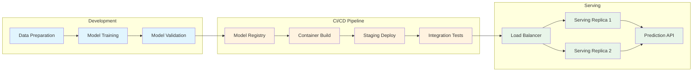

| Difficulty | Channel | Tags |
|---|---|---|
| beginner | devops | mlops, deployment |

Before 2015, Uber had no standard ML platform. Data scientists trained models on local machines using disparate tools, and engineers built one-off custom serving containers for each model. There were no deployment pipelines, no model registry, no shared infrastructure — just bespoke systems that couldn't scale across 15 million daily trips [1]. This is the story of how that chaos became a blueprint for MLOps excellence.

---

> ### Real-World Case — Uber
>
> Before 2015, Uber had no standard ML platform. Data scientists trained models on their local machines using disparate tools (R, scikit-learn, custom algorithms), and engineers built one-off custom serving containers for each model. There was no unified deployment pipeline, no model registry, no standard serving infrastructure — just bespoke systems that couldn't scale across Uber's 15M daily trips.
>
> | | |
> |---|---|
> | **Challenge** | Every ML team solved the same infrastructure problems independently: how to deploy models, how to serve them with low latency, how to manage features, how to A/B test, and how to monitor in production. The lack of separation between deployment (CI/CD, training pipelines, model registry) and serving (runtime inference, feature fetching, request routing) meant each new use case required building both from scratch. |
> | **Solution** | Uber built Michelangelo, an end-to-end ML platform with explicit separation between deployment and serving layers. The deployment layer standardized model training on YARN/Mesos, created a model repository (Cassandra-backed), automated CI/CD for model packaging and rollout, and provided a web UI + API for lifecycle management. The serving layer provided three modes: (1) online prediction service clusters behind load balancers handling RPC requests, (2) offline Spark-based batch prediction, and (3) library embedding. Serving features included a DSL for feature transformations at inference time, a Cassandra-based feature store delivering <5ms lookups, model versioning via UUIDs and tags for A/B testing, and shadow deployment for safe production testing. |
> | **Outcome** | Michelangelo scaled from dozens of models to 700+ active use cases, 20,000+ monthly training jobs, and 15 million predictions/second at peak. Online serving achieved P95 latency under 5ms (without feature store access) and under 10ms (with Cassandra feature lookups). The shared feature store grew to 10,000+ canonical features reused across teams. The platform now powers everything from UberEATS ETD predictions to fraud detection, search ranking, and dynamic pricing. |
> | **Lesson** | The bottleneck in ML systems isn't training better models — it's the infrastructure for deployment and serving. Investing in both layers separately (CI/CD pipelines + model registry for deployment; dedicated prediction clusters + feature store for serving) enables massive scale. The key insight: model deployment is about getting the artifact into production safely (automated retraining, canary rollouts, monitoring), while model serving is about keeping inference fast and reliable at runtime (sub-10ms latencies, feature cache, A/B testing, cold start management). |

---

## Hook — The Day the One-Off Model Broke

Every developer knows the feeling: a model that crushed it in the notebook starts throwing errors the moment it hits production. The latency spikes. The requests timeout. Your pager goes off at 2 AM. This pain is universal because the gap between a Jupyter notebook and a production API is not a straight line — it is a chasm. Many teams discover this the hard way, building bespoke serving solutions that work for exactly one model, then collapse under the weight of the second. The chaos you feel is the same chaos Uber felt before they built Michelangelo.

## Problem — Why Deployment and Serving Are Not the Same Thing

Here is a trap that catches even experienced ML engineers: conflating deployment with serving. Deployment is the *process* — the CI/CD pipelines, infrastructure provisioning, container orchestration, monitoring dashboards, and rollback strategies that get your model into production. Serving is the *runtime* — the live API handling inference requests, managing model versions, batching inputs, and optimizing response times. You can have flawless deployment (perfect Kubernetes manifests, airtight CI/CD) and terrible serving (500ms latency, OOM errors at peak traffic). They are two sides of the same coin, but they demand entirely different skill sets and tools. Understanding this distinction is the first step toward building systems that survive contact with real users.

## Real-World Case — Uber's Michelangelo Platform

Uber's pre-2015 reality was every growing company's nightmare: data scientists trained models using R, scikit-learn, and custom algorithms on their local machines. Engineers then reverse-engineered those models into custom serving containers — each one a snowflake. There was no model registry, no standard serving infrastructure, no shared feature store. When a new model needed to go live, it meant weeks of custom engineering, not hours. The transformation came with Michelangelo, Uber's unified ML platform that changed everything. The results are staggering: from dozens of models to over 700 active use cases, 20,000+ monthly training jobs, and 15 million predictions per second at peak. Online serving achieved P95 latency under 5ms for simple predictions and under 10ms when fetching features from Cassandra. Their shared feature store grew to 10,000+ canonical features reused across teams, powering everything from UberEATS ETD predictions to fraud detection, search ranking, and dynamic pricing [1]. This is what happens when you stop treating each model as a unique snowflake and start building a platform.

## Deep Dive — Deployment vs Serving: The Technology Breakdown

Let us get specific. On the deployment side, you are orchestrating containers with Kubernetes, provisioning infrastructure with Terraform, managing experiments with MLflow, and running CI/CD pipelines through GitHub Actions or Jenkins. You care about rolling updates, canary deployments, and automated rollbacks [2][5]. On the serving side, you are building inference APIs with FastAPI or Flask, optimizing transport with gRPC [6], loading models through TensorFlow Serving or TorchServe [3][8], and routing traffic through NGINX or Envoy load balancers [7]. The trade-offs define your architecture. Real-time inference demands sub-100ms latency — you pay for GPU acceleration and keep model instances warm. Batch inference can tolerate seconds of latency but handles far more requests per dollar. Cold starts are the hidden tax: every millisecond a model takes to load into memory becomes a reliability incident when traffic spikes. Horizontal scaling (adding pod replicas) works for stateless serving, but vertical scaling (GPU memory, CPU allocation) becomes the bottleneck when models are large. A/B testing adds another layer: you need traffic splitting, gradual rollouts, and the ability to pin model versions per user segment. Many developers think they need to optimize everything, but the truth is you need to optimize *for your specific latency and throughput requirements* — which means measuring first, optimizing second.

## Workflow — From Training to Production Inference

Building on the technical breakdown, here is how a mature ML pipeline connects deployment and serving into a cohesive workflow. The diagram below shows the end-to-end journey of a model from development through CI/CD to live serving infrastructure.

## Code Example — Production-Ready Model Serving with FastAPI

Theory is great, but let us see how these concepts translate into code. Below is a production-serving pattern that handles model loading, request batching, health checks, and graceful shutdowns — the serving side of the deployment coin.

## Lessons Learned — Build Platforms, Not Pipelines

Uber's journey from chaos to 15M predictions per second teaches a clear lesson: the goal is not to ship one model fast — it is to ship a hundred models reliably. The difference between a team that struggles and a team that scales comes down to three decisions. First, separate deployment from serving in your architecture and in your team's responsibilities; they require different tools, different monitoring, and different expertise. Second, invest in a shared infrastructure layer — a feature store, model registry, and standard serving template — long before you think you need it. By the time you feel the pain, it is already slowing you down [1][4]. Third, optimize for the right bottleneck: most teams optimize latency when they should optimize cold starts, or optimize throughput when they should optimize deployment frequency. Measure what actually breaks in production — not what looks good in a benchmark. The most important metric is not prediction latency or model accuracy; it is *time from idea to production inference*.

---

## ML Pipeline Architecture — From Development to Production Serving

<strong>Original Interview Question</strong>

**Q:** Explain the key differences between model serving and model deployment in ML systems, including specific technologies, scaling considerations, and real-world implementation patterns?

**A:** Deployment encompasses CI/CD pipelines, infrastructure setup, and monitoring using tools like Kubernetes, MLflow, and SageMaker. Serving focuses on runtime inference APIs with frameworks like TensorFlow Serving, TorchServe, or BentoML, handling request routing, model versioning, and autoscaling. Key trade-offs include latency vs throughput, batch vs real-time inference, and cold start optimization.

## Conclusion

The next time you deploy a model, ask yourself: am I thinking about both deployment *and* serving? Are you building a one-off pipeline or a reusable platform? Uber learned the hard way that bespoke systems don't scale — but a unified platform transforms the impossible into routine. Start by separating your deployment automation from your serving infrastructure, measure cold-start latency before optimizing inference speed, and invest in shared tooling (model registry, feature store, standard serving templates) before you need them. The difference between chaos and confidence is a platform. Build yours before your next 2 AM pager.

---

## References

1. [Meet Michelangelo: Uber's Machine Learning Platform](https://www.uber.com/us/en/blog/michelangelo-machine-learning-platform/) — blog
2. [Kubernetes Pods Overview](https://kubernetes.io/docs/concepts/workloads/pods/) — documentation
3. [TensorFlow Serving Guide](https://www.tensorflow.org/tfx/guide/serving) — documentation
4. [Docker Get Started Guide](https://docs.docker.com/get-started/) — documentation
5. [MLflow Documentation](https://mlflow.org/docs/latest/index.html) — documentation
6. [gRPC Documentation](https://grpc.io/docs/) — documentation
7. [NGINX Load Balancing](https://docs.nginx.com/nginx/admin-guide/load-balancer/) — documentation
8. [TorchServe — Production Serving for PyTorch](https://pytorch.org/serve/) — documentation

---

**Author:** Satishkumar Dhule — [GitHub](https://github.com/satishkumar-dhule) · [LinkedIn](https://linkedin.com/in/satishkumar-dhule) · [Website](https://satishkumar-dhule.github.io)
