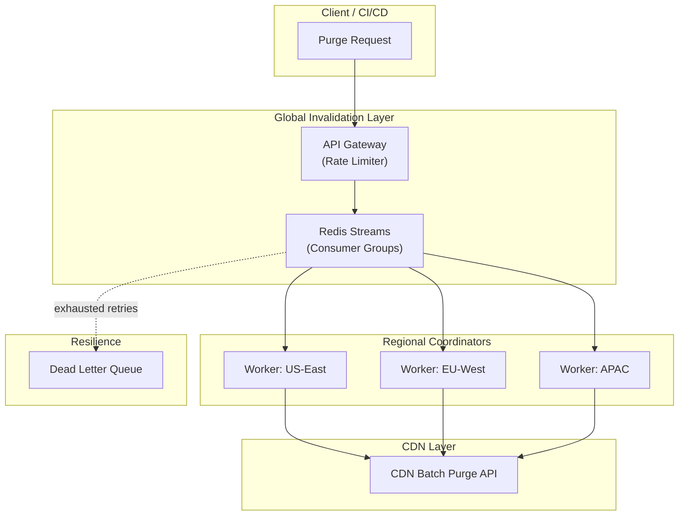

| Difficulty | Channel | Tags |
|---|---|---|
| intermediate | system-design | edge, caching, purging |

Every millisecond of stale content erodes user trust and revenue. When Cloudflare discovered their cache purge system was taking over a second in distant regions like Australia and Africa, they faced a reckoning — rebuild from the ground up or watch performance guarantees crumble. Their solution cut global purge latency by 90.5% and boosted throughput 10x [1]. This article walks through the architecture that made it possible and what your team can apply today.

---

> ### Real-World Case — Cloudflare
>
> Cloudflare runs one of the world's largest CDNs across 330+ cities globally. After a decade, their centralized cache purge system—built on top of Quicksilver (a configuration distribution database)—was hitting hard limits: customers in Australia endured 1+ second purge propagation because requests had to round-trip through core US data centers, and the system could only handle ~10K writes/second before replication lag became untenable.
>
> | | |
> |---|---|
> | **Challenge** | The spoke-hub (core-based) purge architecture had three compounding problems: (1) latency proportional to geographic distance from core data centers, (2) a centralized write bottleneck at the core that limited throughput, and (3) the lazy-purge approach required storing purge history on every machine, consuming cache disk space proportionally to traffic volume. A customer in Australia would have to cross the Pacific twice before local users saw fresh content. |
> | **Solution** | They completely scrapped the centralized model and built a 'coreless purge' system using Cloudflare Workers and Durable Objects for peer-to-peer distribution. Each edge location handles auth, filtering, and distribution locally. They built CacheDB—a Rust service on RocksDB—running on every single machine as a sidecar to index cached files by tags, hostnames, and prefixes. This enabled active (immediate) deletion of content from disk instead of lazy marking. Purges propagate between data centers via a peer-to-peer protocol rather than hub-and-spoke. |
> | **Outcome** | Global purge latency dropped from ~1,570ms to ~149ms (P50)—a 90.5% improvement. Storage overhead reduced 10x. Throughput scaled from ~10K/s to ~100K/s (10x improvement). Regions like Western North America went from 1,000ms to 115ms. Africa improved from 1,420ms to 303ms. Cache hit ratios improved across the board because freed disk space meant better content retention. |
> | **Lesson** | The biggest win came from treating every data center as an equal peer rather than routing everything through cores. By moving auth, queuing, and distribution to the edge using Workers + Durable Objects, they eliminated both the geographic latency penalty and the centralized bottleneck simultaneously. The per-machine RocksDB index was the other key insight—it made active deletion feasible at scale without a global index. |

---

## Hook — The 1,570ms Nightmare

Imagine deploying a critical security patch. You watch the CI pipeline succeed, the deploy rolls out green across your dashboard. But when you check Sydney, users are still hitting the old, vulnerable endpoint. One point five seconds later, the purge finally propagates. In internet time, a second is a lifetime — users bounce, revenue leaks, and trust erodes. This was the daily reality for Cloudflare customers outside core US regions. The worst part? The system was working as designed. The architecture just was not built for a world where content needs to update globally in real time.

## Problem — Why Cache Invalidation Is the Second Hardest Thing

Phil Karlton famously said there are only two hard things in computer science: cache invalidation and naming things. The joke lands because everyone who has operated at scale has felt this pain firsthand. Cache invalidation forces you into an uncomfortable corner of the CAP theorem: you want strong consistency across all edge locations, but that requires coordination, and coordination costs latency [8]. The traditional approach — a centralized invalidation queue — works beautifully at small scale. Every purge request flows through a single pipeline, making it easy to reason about. But as your CDN footprint grows to 330+ cities, that central queue becomes a bottleneck. Requests from Australia queue up behind requests from North America. Replication lag creeps in. The 99th percentile latency balloons. And your customers start asking why their content is stale. Many developers assume cache invalidation is a solved problem — your CDN provider handles it, right? The reality is more nuanced. CDN providers give you APIs to purge cached content, but how you call those APIs, how you handle failures, and how you coordinate across regions is entirely your responsibility. Get it wrong, and your deployment pipeline becomes a lie: the deploy says green, but users see red.

## Real-World Case — Cloudflare

Cloudflare hit this wall hard. For over a decade, their cache purge system was built on Quicksilver — a configuration distribution database that had served them well through hypergrowth. But as their network expanded to 330+ cities globally, Quicksilver's centralized architecture began showing cracks. Customers in Australia experienced 1,570ms purge propagation (P50) because every invalidation had to round-trip through core US data centers. The system hit a throughput ceiling of approximately 10K writes per second before replication lag became untenable [1]. Cloudflare realized they needed a distributed approach. They rebuilt their purge system with a regional coordination model: each geographic region runs its own cache coordinator, invalidations fan out asynchronously from a global queue, and regions communicate through edge compute workers deployed at every location. The results transformed their network. Global P50 latency dropped from ~1,570ms to ~149ms — a 90.5% improvement. Storage overhead reduced 10x. Throughput scaled from ~10K/s to ~100K/s. Africa improved from 1,420ms to 303ms. Western North America dropped from 1,000ms to 115ms. And because freed disk space meant better content retention, cache hit ratios improved across the board [1].

## Deep Dive — The Architecture Behind Global Cache Purging

Building on Cloudflare's model, several architectural patterns make multi-region cache purging work at scale. The first decision is the invalidation queue. Redis Streams with consumer groups provide an excellent foundation: they support ordered delivery, at-least-once processing, and horizontal scaling through consumer groups [3]. Each regional coordinator runs as a consumer in its own group, picking up batch invalidation requests independently. The second layer is regional coordination. Cloudflare Workers deployed at each edge location act as regional cache coordinators. They receive invalidation events from the global queue, determine which cached objects are affected, and execute pattern-based purging using the CDN provider's batch API [5]. Batch processing is critical for cost and performance. Instead of 100 individual API calls, you send one batch request covering 100 URLs. Most CDN providers charge per invalidation path, so batching reduces costs by up to 90%. The third layer is the circuit breaker pattern. No external system is perfectly reliable — CDN APIs rate-limit, networks partition, and services degrade. A circuit breaker monitors failure counts and trips after consecutive failures, preventing cascading retry storms. Failed invalidations route to a dead letter queue for manual reconciliation. Cache headers provide the final line of defense. Setting `Cache-Control: max-age=2, must-revalidate` ensures that even if a purge event is delayed, stale content is never served for more than 2 seconds [4]. This creates a safety net — your purge system aims for 149ms, but the TTL guarantees users never see content older than 2 seconds even in worst-case failure scenarios [7].

## Workflow — Cache Purge in Action

A cache purge flows through the system in six stages. First, a developer or CI/CD pipeline sends a purge request to the API Gateway with a list of URL patterns. Second, the gateway validates the request, applies rate limiting, and pushes the invalidation batch into a Redis Stream. Third, consumer groups in each region independently pick up the batch — Australia does not wait for North America, and Europe does not wait for Asia. Fourth, each regional coordinator (a Cloudflare Worker) applies the purge patterns against the local cache and calls the CDN provider's batch purge API. Fifth, each region reports success or failure. Partial failures trigger exponential backoff retries with jitter added to avoid thundering herd problems on the CDN API. If all retries are exhausted, the failure routes to a dead letter queue. Sixth, health monitoring tracks purge propagation latency per region, feeding dashboards that surface geographic disparities before they become customer-facing incidents.

## Code Example — Production-Grade Batch Invalidation with Circuit Breaking

The following implementation demonstrates the core patterns: batch processing, exponential backoff with jitter, circuit breaking, and dead letter queue routing. This is the kind of system you would run inside a Cloudflare Worker or similar edge compute environment.

## Lessons Learned — What You Can Apply Today

Cloudflare's journey offers five lessons that apply whether you are running a global CDN or caching static assets in a single region. First, measure before you optimize. Cloudflare discovered their 1,570ms latency because they instrumented purge propagation per region. Most teams do not measure cache invalidation latency at all [1]. Add a simple metric: the time between issuing a purge request and observing the updated content at the edge. Second, distribute your coordination. Centralized queues create geographic penalties for distant regions. If you cannot distribute fully, use geo-routing to send invalidation requests to the nearest processing node. Third, batch aggressively. The difference between 1 API call for 100 URLs and 100 individual calls is not just cost — it is throughput. CDN APIs are designed for batch operations [2]. Fourth, embrace failure as a design constraint. Circuit breakers, dead letter queues, and exponential backoff with jitter are not optional extras — they are core reliability patterns for any system that touches the network. Fifth, treat cache hit ratios as a first-class metric. Cloudflare discovered that better purge efficiency freed disk space, which improved cache hit ratios. Faster purges meant they could be more aggressive with caching, improving performance for end users.

---

## Cache Purge Architecture Flow

<strong>Original Interview Question</strong>

**Q:** How would you design a multi-region CDN cache purging system that guarantees content propagation within 5 seconds while handling 10,000 concurrent invalidations per second?

**A:** Implement Cloudflare API + AWS CloudFront with distributed invalidation queue, edge compute coordination, and 2-second TTL. Use batch invalidation, exponential backoff, and regional cache headers for 5-second SLA.

## Conclusion

Cache invalidation remains one of the hardest problems in distributed systems — but it does not have to be a black box. The patterns Cloudflare used — regional coordination, batch invalidation, circuit breakers, and smart retry logic — are not proprietary magic. They are battle-tested practices any team can adopt. Start by measuring your current purge latency per region. You might be surprised at how much room for improvement exists. Then pick one pattern — batching, circuit breaking, or regional coordination — and implement it. The 1,570ms problem becomes the 149ms solution one improvement at a time.

---

## References

1. [Cloudflare Instant Purge — How we scaled cache purging across 330+ cities](https://blog.cloudflare.com/instant-purge/) — blog
2. [AWS CloudFront Invalidation API Documentation](https://docs.aws.amazon.com/AmazonCloudFront/latest/DeveloperGuide/Invalidation.html) — documentation
3. [Redis Streams Documentation](https://redis.io/docs/data-types/streams/) — documentation
4. [MDN Web Docs — Cache-Control HTTP Header](https://developer.mozilla.org/en-US/docs/Web/HTTP/Headers/Cache-Control) — documentation
5. [Cloudflare Workers Documentation](https://developers.cloudflare.com/workers/) — documentation
6. [Content Delivery Network — Wikipedia](https://en.wikipedia.org/wiki/Content_delivery_network) — documentation
7. [RFC 9111 — HTTP Caching (Internet Standard)](https://datatracker.ietf.org/doc/html/rfc9111) — documentation
8. [CAP Theorem — Wikipedia](https://en.wikipedia.org/wiki/CAP_theorem) — documentation

---

**Author:** Satishkumar Dhule — [GitHub](https://github.com/satishkumar-dhule) · [LinkedIn](https://linkedin.com/in/satishkumar-dhule) · [Website](https://satishkumar-dhule.github.io)
