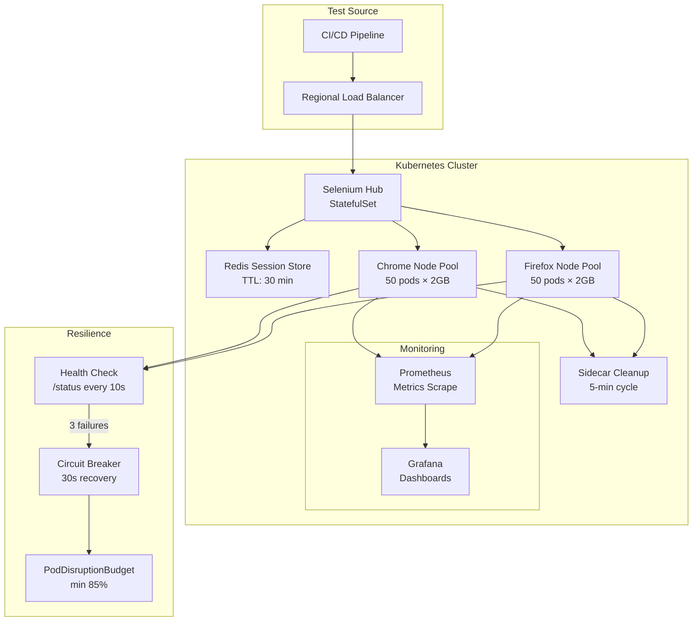

| Difficulty | Channel | Tags |
|---|---|---|
| advanced | system-design | selenium, webdriver, grid |

You are running 200 test cases manually. Your releases ship twice a month, if you are lucky. Meanwhile, your CEO just announced the company is going all-in on digital transformation. This was the reality at Walmart Labs in 2016 [1]. Fast forward to today, and they run 50,000+ automated tests daily across 700+ browser/OS combinations, deploying to production on every frontend build. The secret? A Selenium Grid architecture designed for scale, resilience, and zero memory leaks — patterns any team can adopt.

---

> ### Real-World Case — Walmart
>
> Walmart Labs needed to scale their e-commerce testing from manual, bi-monthly releases to continuous delivery across 700+ browser/OS combinations with thousands of daily automated tests. Their legacy process relied on manual testing and deployments only twice per month, unable to keep up with the pace of digital transformation.
>
> | | |
> |---|---|
> | **Challenge** | Running sequential Selenium tests on a single machine created a bottleneck. They needed to execute 50,000+ tests daily across 700+ browser/OS combos, 172 device emulators, and 300+ real devices — with test suites that had grown from 200 to 500+ cases per build — while maintaining confidence for daily production deployments. |
> | **Solution** | Walmart adopted Selenium Grid with their own open-source QA automation platform running on Sauce Labs' cloud infrastructure. They implemented parallel test execution across thousands of browser sessions, standardized on Selenium/Appium/Espresso/XCUITest frameworks, and integrated continuous testing into CI/CD pipelines. Their platform managed test orchestration, result aggregation, and quality dashboards across 40+ global projects. |
> | **Outcome** | Scaled from 200 test cases in 2016 to 500+ per build; runs 50,000+ automated tests daily (14M+ over 7 years); accelerated from bi-monthly releases to daily deployments on every frontend build; supports 700+ browser/OS combos across 172 emulators and 300+ real devices without managing any infrastructure internally. |
> | **Lesson** | Open-source frameworks like Selenium combined with cloud-based grid infrastructure enable radical acceleration of release cycles. The key insight: investing in parallel test execution infrastructure pays for itself through deployment velocity — the shift from bi-monthly to daily releases was only possible because tests could run in minutes, not hours. |

---

## Hook — When Manual Testing Breaks Down

Imagine the pressure of scaling from 200 manual test cases to over 14 million automated tests in seven years. That is not a typo — 14 million. Walmart Labs did not just upgrade their testing infrastructure; they completely reinvented how they approach quality assurance [1]. The transformation from bi-monthly releases to daily deployments required more than a culture shift. It demanded a test architecture that could handle 10,000 concurrent sessions without buckling under its own weight. Most engineering teams hit this wall eventually. The test suite grows. The CI pipeline slows. Someone suggests "just add more nodes" — and the death spiral begins.

## Problem — Why Test Infrastructure Collapses at Scale

Scaling test infrastructure is deceptively hard. The naive approach — spin up more Selenium nodes, throw hardware at the problem — collapses under its own weight. Here is what happens: memory leaks in long-running browser processes slowly consume available RAM. A single misbehaving node triggers a cascade of failures as sessions time out waiting for resources. Test suites that once took 30 minutes stretch to 3 hours. Your CI/CD pipeline backs up. Developers stop trusting the tests. The entire initiative stalls. The core challenge boils down to three failure modes: memory leaks from orphaned browser processes that never get garbage collected, resource exhaustion when node failures cascade across availability zones, and session abandonment when the hub cannot tell which nodes are healthy. Any one of these can crater a 10,000-session workload. All three together create what engineers call the "testing death spiral" — the system degrades until nobody uses it.

## Real-World Case — Walmart Labs

In 2016, Walmart Labs hit this exact wall. Their e-commerce platform demanded faster releases, but their testing process was fundamentally manual — 200 test cases executed by hand, deployments twice a month at best. The gap between what the business needed and what QA could deliver was widening by the quarter [1]. The solution was not incremental. Walmart migrated to a cloud-based Selenium Grid infrastructure that abstracted away browser management entirely. They eliminated the need to manage any hardware internally while expanding coverage to 700+ browser/OS combinations across 172 emulators and 300+ real devices. The results speak for themselves: from 200 test cases to 500+ per build, 50,000+ automated tests daily, over 14 million tests in seven years. Deployments accelerated from bi-monthly to daily on every frontend build. But here is the part that matters for your architecture: they achieved this without managing a single server internally [1].

## Deep Dive — Anatomy of a Resilient Selenium Grid

Building on Walmart's cloud-native approach, let us examine the architecture that makes 10,000 concurrent sessions possible without memory leaks. At its core, the solution combines four layers: orchestration, session management, monitoring, and resilience. The orchestration layer uses Kubernetes with auto-scaling node pools [2]. Each browser node runs as a pod with strict resource boundaries — 2GB RAM and 1 CPU per node. Horizontal pod autoscaling triggers based on queue depth rather than CPU, because a node waiting for a browser process to start looks idle but is actually saturated. The session management layer uses Redis as a distributed session store with TTL-based expiration [5]. Every session gets a time-to-live of 30 minutes. A background cron job scans for expired keys every 5 minutes and forcefully terminates orphaned browser processes. This is your first line of defense against memory leaks — sessions cannot live beyond their TTL, even if the client disconnects. Prometheus collects per-node memory metrics and triggers alerts at 80% utilization [4]. When a node exceeds 90%, it is cordoned off — no new sessions, just cleanup. The resilience layer implements circuit breaker patterns inspired by Hystrix [6]. Each node exposes a /status endpoint checked every 10 seconds. Three consecutive failures trigger a 30-second isolation window. During that window, no traffic reaches the node. After 30 seconds, the breaker half-opens — one test request. If it succeeds, the node rejoins the pool. If it fails, isolation extends to 60 seconds. This prevents the cascade failure pattern where one dying node drags down the entire cluster.

## Workflow — How a Test Request Survives the Grid

Here is the end-to-end journey of a single test request through this architecture, step by step: **Step 1 — Submission**: Your CI/CD pipeline sends a test request to the regional load balancer, which uses weighted round-robin based on node capacity and response time. **Step 2 — Hub Assignment**: The load balancer forwards the request to the Selenium Hub (a Kubernetes StatefulSet), which checks current queue depth across all node pools. **Step 3 — Session Creation**: The hub allocates a slot in the least-loaded node pool, registers the session in Redis with a 30-minute TTL, and returns the session URL to the client. **Step 4 — Test Execution**: The test runs on the assigned node. Prometheus scrapes memory and CPU metrics every 15 seconds. Grafana dashboards track session duration, queue depth, and memory trends in real time. **Step 5 — Cleanup**: On test completion, the client calls driver.quit(), which triggers Redis key deletion and returns the slot to the pool. If the client disconnects, the TTL expiration and 5-minute cleanup cron job handle orphaned sessions. **Step 6 — Recovery**: If a node fails health checks three times, the circuit breaker isolates it for 30 seconds. PodDisruptionBudgets ensure at least 85% capacity is maintained during rolling updates [2]. Canary deployments with traffic splitting validate new browser versions before full rollout [7].

## Code Example — Wiring Tests to the Grid with Proper Lifecycle Management

The architecture is only as good as the tests connecting to it. Many developers connect to the grid but forget the critical cleanup step — leaving orphaned sessions that slowly consume cluster memory. Here is a production pattern using pytest fixtures that guarantees proper session lifecycle management:

## Lessons Learned — What 14 Million Tests Taught Us

After seven years and 14 million tests, here are the patterns that separate resilient test infrastructure from fragile setups: **Instrument everything before you scale**. Walmart's team did not add monitoring after the fact — Prometheus metrics and Grafana dashboards [8] were prerequisites, not afterthoughts. Without memory trend data, you are flying blind into the 80% utilization wall. **Design for cleanup, not just execution**. The most common failure mode in Selenium Grid is not nodes crashing — it is sessions that never terminate. Redis TTLs [5] and sidecar cleanup containers are not optional; they are the difference between a cluster that runs for months and one that degrades in hours. **Assume nodes will fail**. Circuit breakers [6], PodDisruptionBudgets [2], and canary deployments [7] are not overengineering. When you run 200+ nodes across availability zones, node failures are a statistical certainty, not an edge case. **Let the cloud handle infrastructure**. Walmart's most impactful decision was eliminating server management entirely [1]. The team that used to maintain hardware now builds test suites. **Start small, measure everything**. You do not need 10,000 concurrent sessions on day one. Start with 50 nodes, validate your memory management, prove the circuit breaker works, then scale horizontally.

---

## Selenium Grid Architecture Flow

<strong>Original Interview Question</strong>

**Q:** Design a scalable Selenium Grid architecture to handle 10,000 concurrent test sessions with 99.9% uptime, ensuring zero memory leaks through automatic session lifecycle management, real-time monitoring, and graceful node failure recovery across multiple data centers?

**A:** Deploy Kubernetes cluster with auto-scaling node pools, Redis session store with TTL policies, Prometheus metrics for memory monitoring, circuit breakers for node isolation, and sidecar containers for session cleanup. Implement health checks, resource quotas, and rolling updates.

## Conclusion

Walmart's journey from 200 manual test cases to 14 million automated tests is not a story about technology — it is a story about architecture designed for failure. The circuit breakers, TTL-based session expiration, and Kubernetes orchestration patterns that keep their grid running at 10,000 concurrent sessions are the same patterns every team can use. Start small: instrument your current grid, add Redis-backed session management, and implement health checks before you need them. The test infrastructure that survives at scale is the one that expects failure at every layer and plans for cleanup before execution. That is the lesson from 14 million tests — and the blueprint for your next million.

---

## References

1. [Walmart embraces test automation and open source to increase coverage and deploy more often](https://saucelabs.com/resources/case-studies/walmart-embraces-test-automation-and-open-source-to-increase-coverage-and-deploy-more-often) — article
2. [Kubernetes Architecture Documentation](https://kubernetes.io/docs/concepts/architecture/) — documentation
3. [Selenium Grid Documentation](https://www.selenium.dev/documentation/grid/) — documentation
4. [Prometheus Overview — Monitoring System & Time Series Database](https://prometheus.io/docs/introduction/overview/) — documentation
5. [Redis — Time-to-Live (TTL)](https://redis.io/docs/latest/develop/use/ttl/) — documentation
6. [Circuit Breaker Design Pattern — Wikipedia](https://en.wikipedia.org/wiki/Circuit_breaker_design_pattern) — article
7. [CanaryRelease — Martin Fowler](https://martinfowler.com/bliki/CanaryRelease.html) — article
8. [Grafana Dashboards Documentation](https://grafana.com/docs/grafana/latest/dashboards/) — documentation

---

**Author:** Satishkumar Dhule — [GitHub](https://github.com/satishkumar-dhule) · [LinkedIn](https://linkedin.com/in/satishkumar-dhule) · [Website](https://satishkumar-dhule.github.io)
