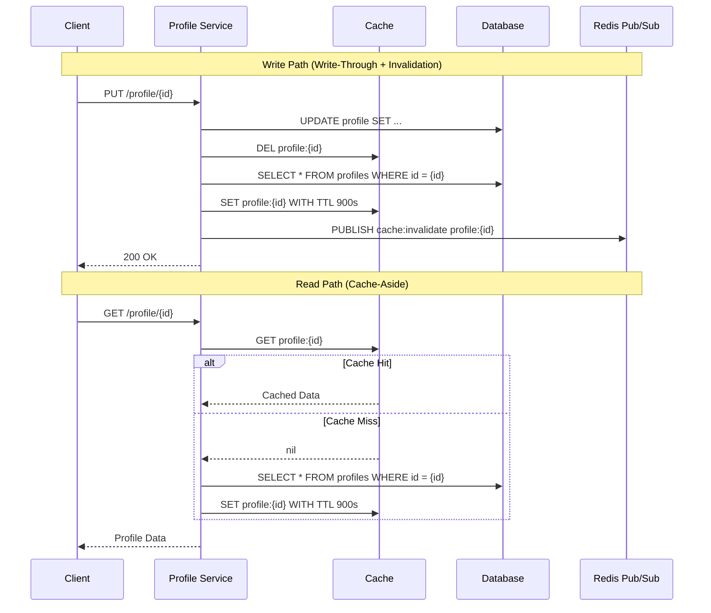

| Difficulty | Channel | Tags |
|---|---|---|
| beginner | backend | redis, memcached, cache-invalidation |

By 2015, Pinterest had grown to over 30 billion Pins, and their caching infrastructure was about to reveal a painful design flaw [1]. When users started using bulk editing tools to move, copy, and delete Pins across boards, a read-write race condition in their Memcached layer began silently corrupting data. This is the story of how one of the internet's most popular platforms learned the hard way that cache invalidation isn't just a theory problem — it's a production crisis waiting to happen.

---

> ### Real-World Case — Pinterest
>
> By 2015, Pinterest had grown to 30+ billion Pins and users needed bulk editing tools to move/copy/delete Pins across boards. Their user and board caches lived in Memcached, and during bulk operations, concurrent cache updates caused data loss from a classic read-write race condition.
>
> | | |
> |---|---|
> | **Challenge** | Memcached only supports flat string key-value pairs, so updating a cached list required a non-atomic read-check-write cycle: fetch the list, remove a pin_id, write it back. Two concurrent bulk operations would both read the same stale list, modify it, and overwrite each other — the last writer always won, dropping the first writer's changes. |
> | **Solution** | Pinterest temporarily deferred cache updates to after bulk operations completed. They then redesigned their Memcached client to support atomic multi-item operations. Crucially, they acknowledged that Redis (used for their other caches) avoids this entirely through native atomic data structure operations like SREM and LPOP that don't require read-modify-write cycles. |
> | **Outcome** | Bulk editing tools could safely handle concurrent operations without cache-induced data loss. The case explicitly validated Pinterest's architecture decision to use Redis for complex cache patterns and retain Memcached only for simple legacy string-based caching. |
> | **Lesson** | Memcached's simplicity becomes a liability for anything beyond flat key-value lookups — any read-then-write pattern introduces race conditions. Redis's native data structures eliminate entire classes of cache invalidation bugs by making updates atomic at the cache layer itself. |

---

## Hook — Everyone Told You Caching Was Easy. They Were Wrong.

You have probably heard the joke: "There are only two hard things in computer science: cache invalidation and naming things." It is funny because it is painfully true. Here is the thing though — most developers do not realize how deep the cache invalidation rabbit hole goes until their production system starts serving stale data to millions of users. You might think a simple TTL solves everything. Maybe you throw Redis in front of your database and call it a day. But what happens when a user updates their profile and ten different cache nodes all hold ten different versions of the same data? What happens when your bulk editing tool runs concurrent writes and your cache silently eats half the updates? That is not a hypothetical. That is exactly what happened at Pinterest [1].

## Problem — The Silent Data Corruption Nobody Warned You About

Cache invalidation is the mechanism that ensures your cached data stays fresh after the source of truth changes. Without it, users see stale profiles, incorrect balances, or — in Pinterest's case — Pins that mysteriously vanish after a bulk move operation. The core challenge is a classic read-write race condition. Thread A reads a cached profile, Thread B updates it in the database and invalidates the cache, but Thread A writes back its stale version before it realizes the data changed. Suddenly, your cache is serving data that no longer exists in the database. This problem compounds across distributed systems. With multiple application servers each maintaining their own cache state, coordinating invalidation becomes a distributed systems problem unto itself. The stakes are higher than you might think: stale caches can cause data loss, billing errors, and user-facing inconsistencies that erode trust in your platform [2].

## Real-World Case — Pinterest's 30 Billion Pin Wake-Up Call

By 2015, Pinterest's infrastructure was handling over 30 billion Pins across countless user boards [1]. When users requested bulk editing tools — the ability to move, copy, or delete hundreds of Pins at once — the engineering team faced a nasty surprise. Their user and board caches lived in Memcached, and Memcached has no built-in mechanism for distributed cache coordination. During bulk operations, concurrent cache updates triggered a classic read-write race condition: one server would read a cached value, another would update the database and invalidate the cache, and the first server would unknowingly write stale data back. The result was data loss during what should have been simple bulk operations. Pinterest's incident became a landmark case study in cache architecture. The team ultimately validated a dual-strategy approach: they migrated complex cache patterns to Redis (which offers pub/sub for distributed invalidation) while retaining Memcached only for simple, legacy string-based caching where the race condition could not occur [1]. This incident proves a critical point: your caching strategy is not a one-size-fits-all decision.

## Deep Dive — Redis vs Memcached: The Real Trade-Offs

This is where the plot thickens. Many developers assume Redis and Memcached are interchangeable. They are not — and choosing the wrong one for your cache invalidation pattern can cause the exact race conditions Pinterest faced.

Memcached is beautifully simple. It is an in-memory key-value store with O(1) operations and minimal overhead. For simple string-based caching with short TTLs, it is blazing fast and easy to scale horizontally [3]. But Memcached has no concept of distributed coordination. There is no pub/sub, no replication, no way to tell every node "this key just changed." Each Memcached node is an island. When you need coordinated invalidation across a cluster, you are on your own.

Redis, on the other hand, comes with pub/sub channels that allow you to broadcast invalidation events to all subscribers [4]. When one service updates a profile, it can publish a "cache:invalidate:user:123" message that every other service instance receives and acts upon. Redis also offers persistence, which means a restart does not wipe your entire cache (unlike Memcached), and advanced data structures that enable more sophisticated caching patterns.

Here is the trade-off in plain terms:

| Dimension | Redis | Memcached |
|-----------|-------|-----------|
| Distributed invalidation | Built-in via pub/sub | Manual coordination |
| Memory overhead | Higher (richer data structures) | Lower (simple key-value only) |
| Persistence | Optional (RDB/AOF) | None — pure cache |
| Horizontal scaling | Cluster mode with smart partitioning | Simpler, more mature sharding |
| Best for | Complex invalidation, counters, leaderboards | Simple key-value, high-throughput reads |

The counterintuitive insight? Sometimes Memcached is the better choice. If your data is immutable, has a short TTL, and does not require coordinated invalidation, Memcached's simplicity gives you better performance and less operational complexity [5]. The key is matching your cache technology to your invalidation requirements, not the other way around.

## Workflow — The Write-Through Invalidation Dance

Building on the trade-offs above, let us walk through a cache invalidation workflow that prevents the exact race condition Pinterest encountered. The sequence diagram below shows the two critical paths: writes (write-through with invalidation) and reads (cache-aside).

The write path follows four steps: (1) update the database first — the source of truth must always win, (2) delete the cache key rather than updating it in place, (3) re-populate the cache with fresh data from the database, and (4) publish an invalidation event via Redis pub/sub so every other node knows to drop their stale copy [6]. The delete-then-repopulate order is critical: if you repopulate before deleting, a concurrent read could grab the old data and write it back during the brief window.

The read path uses the cache-aside pattern: check the cache first, return if found, otherwise query the database and populate the cache with a TTL. Every cached value has an expiration — typically 5 to 30 minutes for user profiles — ensuring that even if an invalidation event is missed, fresh data will eventually surface [7].

## Code Example — Implementing Write-Through Cache Invalidation

Here is how you implement the write-through invalidation pattern in Python with Redis, using the exact approach that prevents Pinterest's race condition.

## Lessons Learned — What Pinterest's Experience Teaches Us

Pinterest's 2015 incident [1] distilled into four lessons that every backend developer should internalize:

First, never update a cache in place. Always delete the key and let the next read repopulate it. This eliminates the race condition where two concurrent writers overwrite each other's changes.

Second, choose your cache technology based on your invalidation requirements, not your read throughput. Redis pub/sub is indispensable when you need coordinated invalidation across a distributed system. Memcached wins when your data is simple and your TTL is short enough that eventual consistency is acceptable [5].

Third, TTLs are your safety net, not your primary invalidation strategy. A 15-minute TTL means users could see stale data for 15 minutes after an update. Set TTLs based on your freshness requirements and use explicit invalidation for time-sensitive data.

Fourth, monitor your cache hit rates and invalidation frequency. A sudden drop in hit rate could mean your invalidation logic is too aggressive. A spike in stale data reports usually means it is not aggressive enough [8].

You might think you can avoid cache invalidation entirely by using shorter TTLs or skipping caching for frequently updated data. That works — until your database buckles under read traffic. The real skill is knowing when to cache, what technology to use, and how to invalidate safely.

---

## Cache Invalidation Sequence Diagram

<strong>Original Interview Question</strong>

**Q:** You're building a user profile service that caches frequently accessed profiles. How would you implement cache invalidation when a user updates their profile, and what trade-offs would you consider between Redis and Memcached?

**A:** Implement write-through caching with TTL-based expiration. On profile update, invalidate the cache by deleting the key and writing new data to both the database and cache. Redis offers pub/sub for automatic distributed invalidation, while Memcached requires manual coordination across nodes.

## Conclusion

Cache invalidation is not a theoretical problem you can punt to "just set a shorter TTL." It is a distributed systems challenge that, if ignored, will corrupt data, confuse users, and wake you up at 3am. Pinterest learned this when 30 billion Pins collided with a naive caching strategy. The fix was not abandoning caching — it was choosing the right tool for each invalidation pattern. Start tomorrow by auditing your caching layer. Where are you updating cache keys in place? Where are you missing distributed invalidation? Where could a shorter TTL eliminate the need for complex coordination? Your users deserve a cache that tells the truth.

---

## References

1. [Pinterest incident report — How We Built New Bulk Editing Tools](https://medium.com/pinterest-engineering/how-we-built-new-bulk-editing-tools-a1384a852daa) — blog
2. [Cache invalidation — Wikipedia](https://en.wikipedia.org/wiki/Cache_invalidation) — documentation
3. [Memcached — Wikipedia](https://en.wikipedia.org/wiki/Memcached) — documentation
4. [Redis — Wikipedia](https://en.wikipedia.org/wiki/Redis) — documentation
5. [Cache (computing) — Wikipedia](https://en.wikipedia.org/wiki/Cache_(computing)) — documentation
6. [Redis — GitHub Repository](https://github.com/redis/redis) — documentation
7. [Memcached — GitHub Repository](https://github.com/memcached/memcached) — documentation
8. [RFC 9111 — HTTP Caching](https://datatracker.ietf.org/doc/html/rfc9111) — documentation

---

**Author:** Satishkumar Dhule — [GitHub](https://github.com/satishkumar-dhule) · [LinkedIn](https://linkedin.com/in/satishkumar-dhule) · [Website](https://satishkumar-dhule.github.io)
