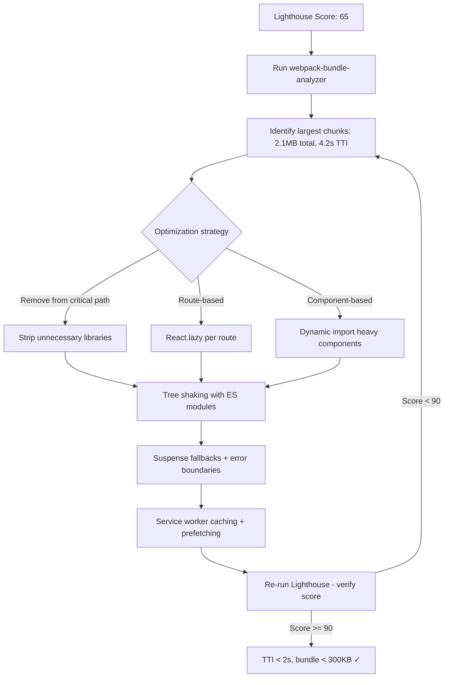

| Difficulty | Channel | Tags |
|---|---|---|
| intermediate | frontend | lighthouse, bundle, lazy-loading |

Netflix's logged-out homepage — the very first impression for potential subscribers — was loading 300kB of JavaScript for what was essentially a simple sign-in form. On a simulated 3G connection, that meant a brutal 7-second wait before anyone could even see a login button [1]. The engineers slashed that bundle by 200kB and halved their Time to Interactive. Here is the approach you can use to take your own React app from a Lighthouse score of 65 to 90+.

---

> ### Real-World Case — Netflix
>
> Netflix's logged-out homepage (where users sign up or sign in) was loading 300kB of JavaScript including React, Lodash, and other client-side libraries. Lighthouse on simulated 3G showed a 7-second load time for what was essentially a simple page with minimal interactivity — a disastrous first impression for potential subscribers.
>
> | | |
> |---|---|
> | **Challenge** | Reduce Time-to-Interactive on the logged-out homepage to improve conversion rates, especially for mobile users in emerging markets signing up on slow connections. The page was server-rendered with React, but the full React + hydration payload was being shipped client-side for trivial interactions (tab switching, language picker, cookie banner). |
> | **Solution** | Engineers audited the page by disabling JavaScript to isolate what truly needed client-side code. They rewrote all client-side interactions in vanilla JS, removing React, Lodash, and other libraries from the browser bundle (while keeping React server-side for rendering). For the subsequent sign-up SPA flow, they used browser prefetch API and XHR preloading to proactively fetch React bundles, achieving a 95% cache-hit rate for the second page load. |
> | **Outcome** | JavaScript bundle size reduced by 200kB (from 300kB to ~100kB). Time-to-Interactive decreased by 50% on the logged-out homepage. Prefetching reduced TTI by an additional 30% for subsequent navigations into the sign-up flow. Chrome User Experience Report showed fast First Input Delay for 97% of desktop users. |
> | **Lesson** | The best JavaScript is no JavaScript — for simple pages, vanilla JS dramatically outperforms heavy frameworks. Server-side rendering with React + client-side prefetching of React bundles provides the best of both worlds: a lightning-fast initial paint and rich interactivity when users navigate deeper into the app. Framework decisions should be data-driven, not dogmatic. |

---

## Hook — The hidden cost of slow JavaScript

Every millisecond costs you users. Amazon found that every 100ms of latency cost them 1% in sales. Google discovered a 0.5-second delay dropped search traffic by 20%. Your Lighthouse score is not a vanity metric — it is a revenue driver. When your React app ships a 2.1MB bundle with a 4.2-second Time to Interactive, you are not just failing an audit. You are bleeding conversions at every step of the funnel. The gap between a score of 65 and 90+ is the difference between a user who bounces and one who converts.

## Problem — How your bundle silently grows to 2.1MB

JavaScript bundles do not bloat overnight. It happens one innocent `npm install` at a time. You add a charting library for that one analytics page. A date picker component because the design called for it. An animation framework for a landing page hero. Each import is justified in isolation. Collectively, they turn a lightweight CRUD app into a 2.1MB monolith. The real problem is that imports are global — when you import `moment` or `lodash` in your feature component, the entire library lands in the initial bundle, even if the user never navigates to that page. Developers add imports for convenience, not necessity. The result is entropy: left unchecked, every codebase trends toward bloat [10].

## Real-World Case — Netflix's 7-second homepage

Here is how bad it can get. Netflix's logged-out homepage — the page that runs A/B tests and captures sign-ups — was serving 300kB of JavaScript. For a page that showed a hero image, a sign-in form, and a few links. The culprit? Entire client-side frameworks (React, Lodash, and others) bundled into the critical path for what was fundamentally a static landing page. On slow networks, users waited 7 seconds before the page became interactive [1]. The fix was brutal and effective: Netflix removed React from the logged-out page entirely, replaced it with vanilla JavaScript for the interactive elements, and deferred everything non-critical. The result: 100kB bundle (a 66% reduction), Time to Interactive cut in half, and prefetching slashed subsequent navigation TTI by an additional 30%. Chrome User Experience Report showed fast First Input Delay for 97% of desktop users after the changes.

## Deep Dive — The anatomy of a performant React app

Netflix's approach reveals a deeper truth: performance optimization is a hierarchy of interventions, and you should start at the top. The first question is not "how do I lazy-load this component?" but "does this component need to exist in this page at all?" If you can remove a library from the critical path entirely, that is infinitely better than code-splitting it.

Once you have stripped the critical path to its essentials, the next tool is code splitting. React.lazy() combined with Suspense lets you defer loading components until they are actually rendered [2][3]. There are two strategies here. Route-based splitting loads JavaScript per page — users only download the code for the route they visit. Component-based splitting targets heavy components (charts, editors, maps) that only appear after some user interaction.

Tree shaking is the silent workhorse of bundle optimization. When configured correctly, Webpack or Vite can eliminate dead code — any export that nothing imports gets dropped from the final bundle [5]. The catch is that it only works with ES module syntax. CommonJS `require()` calls cannot be tree-shaken. If a library ships as CommonJS, every byte of it ends up in your bundle, whether you use it or not.

Bundle analysis is the compass that guides all these efforts. Tools like webpack-bundle-analyzer produce a visual treemap of your bundle, making it immediately obvious which dependencies are taking up space [4]. Many developers discover that a single misconfigured import — importing an entire library instead of a single function — adds hundreds of kilobytes.

Finally, the PRPL pattern (Push, Render, Pre-cache, Lazy-load) provides an architectural framework for performance-conscious applications [6]. Combined with service worker caching, it ensures that repeat visits feel instant [7].

## Workflow — The performance optimization pipeline

Moving from a score of 65 to 90+ follows a repeatable pipeline. The diagram below maps the journey from initial analysis through implementation to verification.

Your first pass should be measurement: run Lighthouse, capture the bundle treemap, identify the heaviest modules. Next, categorize each heavy dependency: can it be removed entirely? Can it be deferred to a separate route? Can it be dynamically imported on interaction? Only after exhausting those options should you consider optimization tactics like tree shaking or deduplication. Each change gets measured again — did the Lighthouse score improve? Did TTI decrease? If not, revert and try another approach.

This cycle of measure-identify-implement-verify is what separates systematic optimization from random guessing. Teams that skip the measurement step often make changes that look good in theory but produce zero real-world impact.

## Code Example — Lazy loading in production

Here is how the theory translates to code. The pattern below shows route-based code splitting with React.lazy and Suspense, combined with error boundaries for resilience.

## Lessons Learned — What actually moves the needle

After working through this pipeline, a few truths become clear. First, the highest impact change is always removing things — not optimizing them. Netflix removed React entirely from their critical path. You might not need to go that far, but question every import.

Second, measure before you optimize. Without bundle analysis, you are guessing. webpack-bundle-analyzer [4] and Lighthouse [9] should be part of every PR, not just a quarterly cleanup task. Set a performance budget [10] and enforce it in CI — if a PR adds 50kB to the bundle, it should fail the build.

Third, tree shaking is not magic. It requires discipline: use ES module imports, avoid default imports from large libraries, and audit your dependencies regularly. A library that ships CommonJS cannot be tree-shaken.

Finally, performance is a feature. It deserves the same rigor as any other feature — tests, CI checks, and code reviews. Every import should pass the same bar as every function call: is this necessary, and is it in the right place?

Start tomorrow: run webpack-bundle-analyzer on your current bundle. The results will surprise you. Then pick the single largest chunk, remove or defer it, and measure the improvement. Repeat until your Lighthouse score hits 90+.

---

## Performance Optimization Pipeline

<strong>Original Interview Question</strong>

**Q:** You're tasked with improving a React app's Lighthouse performance score from 65 to 90+. The bundle size is 2.1MB and Time to Interactive is 4.2s. What specific steps would you take to optimize the bundle and implement lazy loading?

**A:** Implement code splitting with React.lazy() and Suspense, analyze bundle composition with webpack-bundle-analyzer to identify largest chunks, remove unused dependencies and optimize imports, add dynamic imports for heavy components and third-party libraries, implement route-based splitting for better initial load times, and utilize tree shaking with proper ES module configuration.

## Conclusion

Netflix proved that a 7-second load time is not inevitable — it is a decision. Every import, every dependency, every bundled library is a choice you make about what your users wait for. The path from 65 to 90+ is not about knowing the right tools. It is about developing the discipline to question every byte you ship. Start with bundle analysis, remove what you do not need, defer what you can, and measure every change. Your users will notice the difference — even if they never see the Lighthouse score.

---

## References

1. [Netflix incident report](https://medium.com/dev-channel/a-netflix-web-performance-case-study-c0bcde26a9d9) — article
2. [React.lazy documentation](https://react.dev/reference/react/lazy) — documentation
3. [React Suspense documentation](https://react.dev/reference/react/Suspense) — documentation
4. [webpack-bundle-analyzer](https://github.com/webpack-contrib/webpack-bundle-analyzer) — documentation
5. [Tree Shaking guide](https://webpack.js.org/guides/tree-shaking/) — documentation
6. [PRPL pattern](https://web.dev/patterns/prpl/) — documentation
7. [Service Worker API](https://developer.mozilla.org/en-US/docs/Web/API/Service_Worker_API) — documentation
8. [Dynamic import()](https://developer.mozilla.org/en-US/docs/Web/JavaScript/Reference/Operators/import) — documentation
9. [Lighthouse Performance](https://developer.chrome.com/docs/lighthouse/performance/) — documentation
10. [Performance Budgets](https://web.dev/articles/performance-budgets-101) — documentation

---

**Author:** Satishkumar Dhule — [GitHub](https://github.com/satishkumar-dhule) · [LinkedIn](https://linkedin.com/in/satishkumar-dhule) · [Website](https://satishkumar-dhule.github.io)
