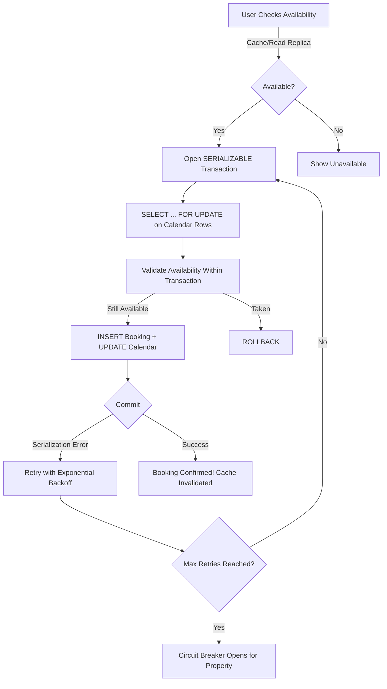

| Difficulty | Channel | Tags |
|---|---|---|
| intermediate | database | acid, isolation-levels, mvcc |

In 2017, Airbnb faced a payments nightmare. Network retries, double-clicks, and service timeouts were charging guests twice for the same booking [1]. With millions of daily transactions across their SOA-based platform, each duplicate charge burned customer trust and triggered expensive refunds. Their fix? A transaction design pattern that any developer building reservation systems needs to understand.

---

> ### Real-World Case — Airbnb
>
> As Airbnb scaled globally, their payments system faced a critical problem: network retries, user double-clicks, and service timeouts were causing guests to be charged twice for the same booking. With millions of transactions flowing through their SOA-based payments platform, this undermined trust and required expensive refunds.
>
> | | |
> |---|---|
> | **Challenge** | Double charges occurred when a payment request succeeded on the server but the response was lost due to network failure, prompting the client to retry. At Airbnb's scale, even a tiny duplicate rate meant thousands of overcharged guests. They needed a generic, ultra-low-latency solution that prevented duplicate charges/payouts across all payments services without requiring every developer to become a distributed systems expert. |
> | **Solution** | Airbnb built Orpheus, a generic idempotency library. Each request carries a unique idempotency key stored in the primary database for strong consistency. The library splits API calls into three phases (Pre-RPC, RPC, Post-RPC) using Java lambdas to compose multiple database commits into a single atomic transaction. Errors are classified as retryable or non-retryable, and clients implement exponential backoff with jitter for safe retries. The key insight: idempotency data lives in the master DB (not replicas) to eliminate race conditions from replication lag. |
> | **Outcome** | Eliminated duplicate payment processing across all payments microservices. Achieved eventual consistency that guarantees guests are charged at most once and hosts receive at most one payout — even under network failures, timeouts, and concurrent user actions. The generic framework decoupled correctness logic from business code, enabling rapid product iteration. |
> | **Lesson** | In distributed financial systems, you cannot rely on 'exactly once' delivery — instead, design for 'effectively once' by making operations idempotent. The most elegant solution separates transaction composition (atomic DB commits) from network communication, and stores idempotency state in the source of truth, not in caches or replicas. |

---

## Hook — The $35 Million Problem Hiding in Your Database

You deploy on a Friday night. Everything looks clean. Then the alerts start firing: duplicate charges, overbooked properties, angry customers. Your CEO is tweeting apologies at 2am. Sound familiar? What many developers discover too late is that the database — that supposedly reliable workhorse — has a dark secret. It was never designed to handle the chaos of concurrent users all acting at once. Every SELECT you run without thinking, every UPDATE you assume is safe, hides a landmine. The question is: will you find out the hard way?

## Problem — The Race Condition That Costs You Millions

Booking systems look deceptively simple on the surface. A user selects dates, checks availability, and confirms. What could go wrong? Everything — when two users, three browser tabs, and a retry-happy mobile app all try to book the last available night simultaneously. This is the classic write-skew anomaly [2]. Each transaction reads the same available slot, each one decides "it is free," and each one inserts a booking. Suddenly one property is double-booked and your customer service team is scrambling. The core tension is brutal: you need strong consistency to prevent conflicts, but you also need high availability so users can actually book. Solving one often breaks the other.

## Real-World Case — Airbnb's Battle With Double Payments

Airbnb's payments system processed millions of transactions across a service-oriented architecture [1]. Everything was fine — until it was not. Network retries, users frantically double-clicking the "Book" button, and services timing out at the worst possible moment created a steady stream of duplicate charges. Each overcharge eroded trust and required manual refunds that drained operations. Airbnb's engineering team needed a generic framework that made payment processing idempotent — meaning charging a guest twice produced the same result as charging them once. They built an eventual consistency model guaranteeing exactly-once processing: guests pay at most once, hosts receive at most one payout, even when networks fail, services crash, or users mash that button like their life depends on it [1]. The key insight? They decoupled correctness logic from business code, so product teams could iterate fast without worrying about financial integrity.

## Deep Dive — SERIALIZABLE Isolation and the MVCC Trade-off

Here is where the database magic happens. PostgreSQL offers four isolation levels, and most developers default to READ COMMITTED [3]. It is fast, it is familiar, and it is wrong for booking systems. The gold standard is SERIALIZABLE isolation, which guarantees that concurrent transactions execute as if they ran one after another. But — and here is the plot twist — SERIALIZABLE comes with a serious cost. PostgreSQL implements it through Serializable Snapshot Isolation (SSI), which tracks read-write conflicts across all transactions. When conflicts are detected, transactions get aborted with serialization errors [4]. Many developers try SERIALIZABLE, see a wall of aborted transactions, and give up. The trick is combining it with optimistic concurrency control: you let transactions run, detect conflicts at commit time, and retry with exponential backoff. This approach maintains throughput while preventing the nightmare of double-bookings. Under the hood, PostgreSQL uses MVCC (Multi-Version Concurrency Control) to give each transaction a consistent snapshot of the data [5]. Read replicas can serve availability checks without blocking writes — a critical performance strategy for high-traffic properties.

## Workflow — From Click to Confirmation: The Atomic Booking Flow

When a user clicks "Book Now," the real work begins. The diagram below traces every step a transaction takes — from the initial availability check through to the final commit — and shows exactly where locks, retries, and circuit breakers come into play.

## Workflow — The Atomic Booking Pipeline

Step one happens before any transaction: the user checks availability, served from a read replica or cache. Fast, non-blocking, and cheap. When they hit "Book," the real transaction begins. The application opens a SERIALIZABLE transaction and immediately runs SELECT FOR UPDATE on the specific calendar rows for those dates [6]. This is the hammer that prevents phantom reads — no other transaction can modify those rows until this one completes. Step two: the application validates that the dates are still available within the same transaction. This is critical — availability can change between the initial cache read and the transactional check. If the dates are taken, the transaction rolls back and the user gets a polite apology. Step three: INSERT the booking record and UPDATE the availability calendar atomically. The database guarantees both happen or neither does. Step four: commit. If a serialization error fires — and it will, especially on popular properties — the retry loop kicks in with exponential backoff. After three retries, the circuit breaker opens for that property, preventing further attempts and alerting operations [7]. This workflow transforms a chaotic race condition into a predictable, safe operation.

## Code Example — Production-Grade Booking Transaction in Python

Below is a real implementation pattern you can adapt. It wraps the critical booking path in a SERIALIZABLE transaction with retry logic, row-level locking, and a circuit breaker for hot properties.

## Lessons Learned — What Airbnb's Battle Teaches Every Developer

First: never trust your cache. Airbnb's incident shows that stale reads at any layer can corrupt business logic. Always re-check availability within the transaction, not before it [1]. Second: make peace with retries. Serialization errors are not bugs — they are the system working as designed. Exponential backoff turns contention into graceful degradation. Third: decouple your correctness layer. Airbnb's key innovation was building a generic idempotency framework that product teams could reuse without understanding the internals [1]. You can do the same with a simple version column on your tables. Every UPDATE increments the version. Every UPDATE includes WHERE version = old_version. If the row changed under you, zero rows update, and you know to retry [8]. Fourth: monitor everything. Lock contention, retry rates, and circuit breaker state are three metrics that tell you exactly how healthy your booking system is. Finally, remember that the best database design in the world cannot save you from a bad user experience. If your retry window is five seconds and a user has already clicked "Book" six times, you need idempotency keys — not just database tricks.

---

## Atomic Booking Transaction Flow

<strong>Original Interview Question</strong>

**Q:** You're building a booking system for Airbnb where multiple users can reserve the same property simultaneously. How would you design the transaction handling to prevent double bookings while maintaining high availability?

**A:** Use SERIALIZABLE isolation with optimistic concurrency control. Implement row-level locks on property availability tables, use MVCC snapshot reads for checking availability, and apply application-level validation to ensure atomic booking operations.

## Conclusion

The next time you build a booking system — or any system where two users should not get the same last item — remember that the database is not magic. It is a tool with sharp edges. SERIALIZABLE isolation, SELECT FOR UPDATE, and optimistic retries are your shields against the chaos of concurrency. But the real lesson from Airbnb's story is deeper: design for failure. Your network will drop packets. Your users will double-click. Your caches will go stale. Build idempotency into your core logic and your system will survive what would sink a naive implementation. Start small: add a version column to one table today. Write one retry function. You will sleep better knowing your transactions are bulletproof.

---

## References

1. [Avoiding Double Payments in a Distributed Payments System](https://medium.com/airbnb-engineering/avoiding-double-payments-in-a-distributed-payments-system-2981f6b070bb) — blog
2. [Write Skew and Serializable Isolation](https://www.postgresql.org/docs/current/transaction-iso.html) — documentation
3. [PostgreSQL Transaction Isolation Levels](https://www.postgresql.org/docs/current/transaction-iso.html) — documentation
4. [Serializable Snapshot Isolation (SSI)](https://wiki.postgresql.org/wiki/SSI) — documentation
5. [Multi-Version Concurrency Control (MVCC)](https://en.wikipedia.org/wiki/Multiversion_concurrency_control) — article
6. [PostgreSQL SELECT FOR UPDATE](https://www.postgresql.org/docs/current/sql-select.html#SQL-FOR-UPDATE-SHARE) — documentation
7. [Circuit Breaker Pattern](https://docs.microsoft.com/en-us/azure/architecture/patterns/circuit-breaker) — documentation
8. [Optimistic Locking in Distributed Systems](https://www.digitalocean.com/community/tutorials/optimistic-locking-in-distributed-systems) — article

---

**Author:** Satishkumar Dhule — [GitHub](https://github.com/satishkumar-dhule) · [LinkedIn](https://linkedin.com/in/satishkumar-dhule) · [Website](https://satishkumar-dhule.github.io)
