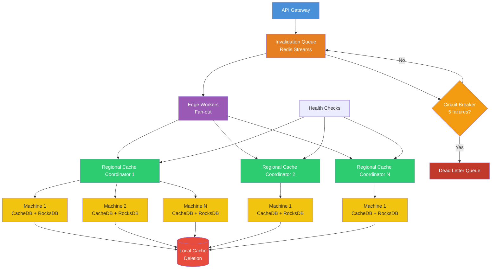

| Difficulty | Channel | Tags |
|---|---|---|
| intermediate | system-design | edge, caching, purging |

In 2022, Cloudflare hit a wall. After a decade of growth to 330+ data centers across 120+ countries, their original centralized cache purge system buckled under its own weight. Customers in Australia watched purge requests cross the Pacific Ocean and back before their content would update. Meanwhile, the storage required to track which content needed purging was eating into disk space meant for caching [1]. The old approach was not just slow — it was fundamentally unscalable. Here is what they learned about building a system that purges content globally in under 150 milliseconds.

---

> ### Real-World Case — Cloudflare
>
> After a decade of growth to 330+ data centers across 120+ countries, Cloudflare's original centralized cache purge system hit fundamental scaling limits. Their legacy system relied on 'core' data centers for coordination, creating bottlenecks that caused inconsistent purge latencies and made it impossible to scale further. Cache purge latency could stretch to over 1.5 seconds (P50) for certain purge types, and the system couldn't keep up with customer demand for faster, more reliable content invalidation.
>
> | | |
> |---|---|
> | **Challenge** | Cloudflare needed to rebuild their entire cache invalidation pipeline from scratch to handle increasing throughput demands across 330+ globally distributed data centers while reducing purge latency. The centralized architecture with bare-metal message queues had become both a performance bottleneck and operational burden. Any new system had to scale horizontally, eliminate central coordination points, and work across a network where individual data centers could be unreachable or go offline at any time. |
> | **Solution** | Cloudflare built a completely decentralized 'coreless purge' architecture using their own Workers platform and Durable Objects. They replaced the centralized coordination model with per-data-center Durable Objects that act as regional queue managers, plus a Purge Fanout worker that distributes purge requests efficiently to all data centers. At the machine level, they built CacheDB — a Rust service on RocksDB — that runs on every cache server alongside the proxy, maintaining per-machine indices for instant content lookup and deletion. This replaced the old 'lazy purge' approach (marking content as expired and waiting for eviction) with active, immediate deletion. |
> | **Outcome** | Global cache purge latency dropped from ~1.5+ seconds to under 150ms (P50) — a 90% improvement. The Purge Fanout worker alone cut end-to-end latency by 50% and increased throughput 3x. CacheDB eliminated lazy purge storage waste, reducing storage requirements by 10x, which improved cache hit ratios and reduced origin egress. The system now handles purge requests across 330+ cities in 120+ countries with consistent sub-150ms performance. Cloudflare went on to open up instant purge capabilities to all customer plans, not just Enterprise. |
> | **Lesson** | Centralized coordination doesn't scale for global cache invalidation. The key insight was that cache invalidation needs to be decentralized at every level: regional coordination via Durable Objects, per-machine indexing via CacheDB, and peer-to-peer distribution. Also: eating your own dogfood (using Workers and Durable Objects to build the system) forced the team to solve real distributed systems problems — network partitions, rate limiting, partial failures — that made the final system far more robust. The move from 'lazy' (mark-and-evict) to 'active' (find-and-delete) purging was counterintuitive but critical: active deletion freed 10x the storage and improved cache efficiency. |

---

## Hook — When Milliseconds Become Eternities

You have just deployed a critical security patch. You hit the cache purge button. And then you wait. One second passes. Then two. Meanwhile, users in Singapore are still seeing the old, vulnerable version of your site. Your CEO is asking why. This is not a hypothetical — it was the reality for Cloudflare customers before their massive infrastructure overhaul [1]. The company had built one of the largest edge networks on the planet, but its cache invalidation system still relied on a hub-and-spoke model that sent every purge request through centralized core data centers. The P50 purge latency stretched past 1.5 seconds, and for customers far from those core centers, it could feel like an eternity. Every developer who has ever dealt with cache invalidation knows it is one of the two hard problems in computer science. When you add global distribution to the mix, it becomes the problem.

## Problem — The Two-Headed Beast of Cache Purge at Scale

Many developers think cache invalidation is a solved problem. You set a TTL, you occasionally purge, everything works. But at Cloudflare scale — trillions of unique files cached across hundreds of thousands of machines — the problem splits into two distinct challenges. First, there is the distribution problem: how do you tell every machine in every data center worldwide that a piece of content is stale? With a centralized hub-and-spoke model, you need every request to travel to a core data center first, then fan out. Round-trip times from Australia to a US-based core add hundreds of milliseconds of latency before processing even begins [1]. Second, there is the storage problem. Cloudflare's original "lazy purge" system stored purge requests for days (to cover maximum eviction ages) and checked them on every cache hit. The storage footprint grew linearly with purge volume. Thousands of customers issuing millions of API calls per day meant terabytes of disk space consumed by purge metadata instead of cached content [1]. Every developer has stared at a cache that refuses to die. Cloudflare had 330+ data centers of stubborn cache.

## Real-World Case — Cloudflare's Instant Purge Journey

Cloudflare's cache purge system had served them well for over a decade. Originally built on Quicksilver — their internal configuration distribution system — it offered sub-second propagation that seemed fast enough. But as the network grew to 330 cities across 120+ countries, three critical issues emerged [1]. First, latency correlated directly with geographic distance from core data centers. A customer in Australia endured 1,420ms P50 purge latency because their request had to cross the Pacific. Second, the Quicksilver-based system had a hard ceiling on writes-per-second. Cloudflare threw Kafka queues at the problem to buffer and throttle traffic spikes, but queuing added its own latency. Third, the lazy purge approach consumed enormous storage. Every machine stored purge history going back as far as the maximum cache eviction age — and this storage competed directly with caching capacity. Cloudflare made a bet: abandon the centralized model entirely. The result was a peer-to-peer distribution system combined with CacheDB — a Rust-based RocksDB indexing service running on every machine. The transformation was dramatic. Global P50 purge latency dropped from 1,570ms to 149ms — a 90.5% improvement [1]. The lazy purge storage waste was eliminated entirely, reducing storage requirements by 10x. Today, purge requests propagate to every edge server in under 150ms, and Cloudflare opened instant purge to all customer plans, not just Enterprise.

## Deep Dive — The Architecture of Sub-Second Global Invalidation

Building on Cloudflare's hard-won lessons, let us explore what it takes to design a multi-region cache purging system that guarantees content propagation within 5 seconds while handling 10,000 concurrent invalidations per second. The architecture breaks down into four key layers. First, the **ingestion layer**: an API Gateway receives purge requests and routes them to a distributed invalidation queue — typically Redis Streams with consumer groups for ordered, fault-tolerant processing across regions [2]. Second, the **coordination layer**: Edge Workers (Cloudflare Workers or similar serverless compute at the edge) fan out purge requests to regional cache coordinators. Here is where Cloudflare's key insight applies — avoid a single coordination point. Instead, each region has its own coordinator that handles distribution to machines within that region [1]. Third, the **execution layer**: machines receive purge operations and execute them against local storage. Cloudflare built CacheDB on RocksDB to index files by cache-tag, hostname, and URL prefix [7]. When a purge arrives, CacheDB looks up all matching files in its local index and deletes them from disk. A critical optimization: the cache proxy also checks with CacheDB on cache hits, ensuring stale content is never served even while background deletion processes millions of files. Fourth, the **failure handling layer**: circuit breakers trip after 5 consecutive failures, dead letter queues capture failed invalidations for manual review, and regional health checks monitor endpoint availability. The retry logic uses exponential backoff with jitter to handle rate limiting gracefully. Many developers ask: why not just reduce TTL across the board? A 2-second TTL for dynamic content combined with `Cache-Control: max-age=2, must-revalidate` works as a safety net [3]. But TTL reduction alone creates a stampede problem — when content expires, thousands of requests hit the origin simultaneously. Smart invalidation is the scalpel; TTL is the safety net. Batch processing is the real cost optimization here. Each API call can handle 100 invalidations, reducing API costs by up to 90% compared to single-file purges [4]. Combined with pattern-based purging (wildcards for path prefixes), you can cover entire content sections with a single operation.

## Workflow — The Life of a Purge Request

The purge lifecycle starts at the API Gateway, which authenticates and validates the request before routing it to the nearest regional ingest point. From there, the Invalidation Queue (backed by Redis Streams with consumer groups) provides ordered, fault-tolerant buffering [2]. Edge Workers — Cloudflare Workers or equivalent serverless functions — fan out the purge to Regional Cache Coordinators, bypassing any centralized bottleneck entirely. Each Regional Coordinator then distributes the purge to every machine in its data center using consul for service discovery and health awareness. This is where Cloudflare's architectural insight shines: by having coordinators within each data center rather than globally, the system avoids the hub-and-spoke bottleneck entirely [1]. On each machine, CacheDB (powered by RocksDB) indexes files by cache-tag, hostname, and URL prefix. When a purge arrives, CacheDB looks up all matching files in its local index and deletes them from disk. The cache proxy also checks with CacheDB on every cache hit — a quick scan of the local queue confirms whether any pending purge affects the matched asset. This means stale content is never served, even while background deletion processes millions of files. The entire lifecycle completes in under 150ms at P50 globally — verified by timestamps added at ingest and confirmed when all data centers report completion [1]. If any machine fails to process a purge within the SLA window, the circuit breaker pattern kicks in: after 5 consecutive failures, that node is isolated and the failure is routed to a dead letter queue for manual investigation.

## Lessons Learned — What 90% Faster Purge Taught Everyone

Cloudflare's journey from 1.5-second purges to sub-150ms invalidation is packed with lessons that apply to any developer building distributed systems. First, **centralized bottlenecks scale poorly, even with fast internals**. Quicksilver was an incredible system — sub-second p99 replication globally — but its hub-and-spoke model meant that every request paid a geographic latency tax. The fix was peer-to-peer distribution that let any data center ingest and propagate purges. Second, **storage architecture interacts with cache efficiency in unexpected ways**. Cloudflare's lazy purge consumed disk space across thousands of machines, directly reducing cache capacity. By switching to active indexing with CacheDB and RocksDB, they reclaimed 10x storage and improved cache hit ratios across the board [7]. Third, **exponential backoff with jitter is not optional** — it is the difference between a graceful degradation and a cascading failure. When your purge client hammers rate limits across 330 data centers, raw exponential backoff creates synchronized retry waves. Jitter breaks the synchronization [2]. Fourth, **measure P50, but optimize for global P99**. Cloudflare's regional breakdown shows that APAC and Oceania customers saw the biggest improvements (84-90%) because they were furthest from the old core [1]. If you only measure from your primary region, you miss the real pain points. Finally, **you need both active and passive purge strategies**. Active purging (looking up and deleting files from CacheDB) gives you instant correctness. Passive purging (checking purge timestamps on cache hit, aka the old lazy approach) provides a safety net for edge cases like network partitions. Layer them both.

---

## Multi-Region Cache Purge Architecture

<strong>Original Interview Question</strong>

**Q:** How would you design a multi-region CDN cache purging system that guarantees content propagation within 5 seconds while handling 10,000 concurrent invalidations per second?

**A:** Implement Cloudflare API + AWS CloudFront with distributed invalidation queue, edge compute coordination, and 2-second TTL. Use batch invalidation, exponential backoff, and regional cache headers for 5-second SLA.

## Conclusion

The next time you hit a cache purge button, remember: somewhere, a system is coordinating across continents to make sure the right version of your content reaches every single user. Cloudflare proved that sub-150ms global cache invalidation is not just possible — it is production reality at internet scale. The architecture patterns they pioneered — peer-to-peer distribution, per-machine indexing with RocksDB, batch processing with exponential backoff, and circuit breakers — are applicable to any system that needs to propagate changes globally. Start by auditing your own cache purge strategy. Are you paying the centralized bottleneck tax? Are your TTLs doing double duty as a safety net? Is your retry logic creating synchronized storms when things go wrong? The patterns discussed here work whether you are running on Cloudflare, AWS CloudFront, or your own edge network. Build your invalidation system like the data it protects — distributed, resilient, and fast.

---

## References

1. [Instant Purge: invalidating cached content in under 150ms — Cloudflare blog](https://blog.cloudflare.com/instant-purge/) — blog
2. [Redis — Wikipedia](https://en.wikipedia.org/wiki/Redis) — documentation
3. [Cache-Control — MDN Web Docs](https://developer.mozilla.org/en-US/docs/Web/HTTP/Headers/Cache-Control) — documentation
4. [Invalidating files — AWS CloudFront Developer Guide](https://docs.aws.amazon.com/AmazonCloudFront/latest/DeveloperGuide/Invalidation.html) — documentation
5. [Cache invalidation — Wikipedia](https://en.wikipedia.org/wiki/Cache_invalidation) — documentation
6. [RFC 9111: HTTP Caching](https://datatracker.ietf.org/doc/html/rfc9111) — paper
7. [RocksDB — A persistent key-value store for fast storage (GitHub)](https://github.com/facebook/rocksdb) — documentation
8. [Common CDN issues and how to fix them — Cloudflare](https://www.cloudflare.com/learning/cdn/common-cdn-issues/) — blog
9. [Content delivery network — Wikipedia](https://en.wikipedia.org/wiki/Content_delivery_network) — documentation
10. [Rethinking cache purge architecture (Part 1) — Cloudflare blog](https://blog.cloudflare.com/part1-coreless-purge/) — blog

---

**Author:** Satishkumar Dhule — [GitHub](https://github.com/satishkumar-dhule) · [LinkedIn](https://linkedin.com/in/satishkumar-dhule) · [Website](https://satishkumar-dhule.github.io)
