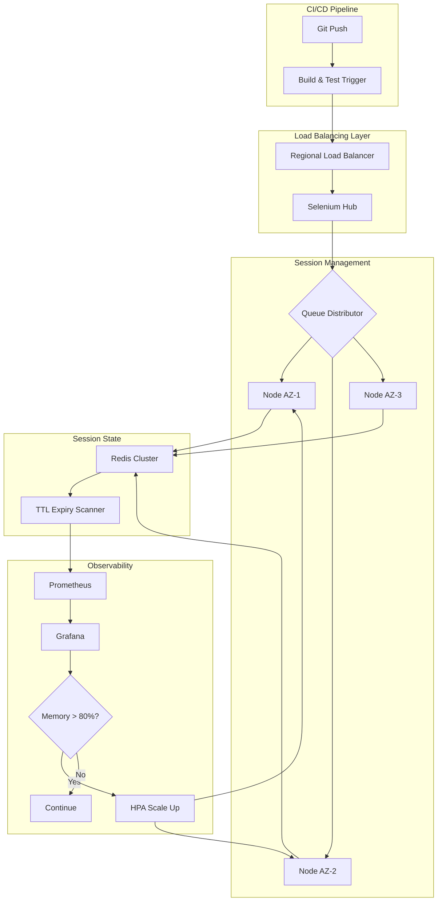
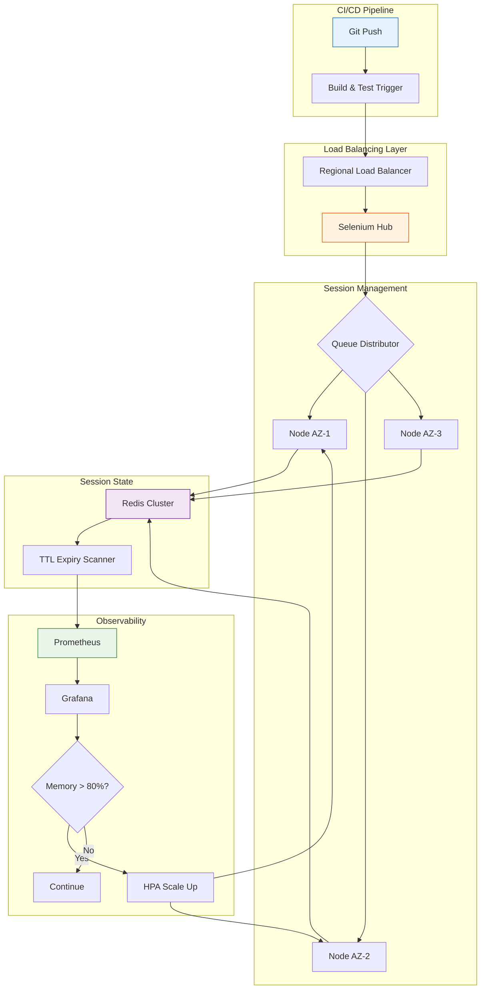

| Difficulty | Channel | Tags |
|---|---|---|
| advanced | system-design | selenium, webdriver, grid |

By 2014, Expedia Group ran roughly 9,000 UI tests spread across 350+ Jenkins jobs, executing directly on build executors with no Selenium Grid in sight [1]. Those tests took hours—sometimes a full day. Developers pushed code, then went to lunch, then came back, then waited some more. The team set an audacious goal: make the total suite runtime equal the single slowest test. One thousand tests needed to finish in under five minutes. Sound crazy? They did it. This is the story of how they rewrote the rules of distributed test execution, and how you can apply the same architecture to your own infrastructure.

---

> ### Real-World Case — Expedia Group
>
> By 2014, Expedia ran ~9,000 UI tests across 350+ Jenkins jobs directly on executors (no Selenium Grid). Tests took hours, blocking CI/CD velocity. The team set an audacious goal: make the total suite runtime equal to the single longest test — meaning 1000 tests must finish in under 5 minutes.
>
> | | |
> |---|---|
> | **Challenge** | Static test infrastructure couldn't scale. Adding more tests meant exponentially longer wait times. Jenkins executors were saturated, teams were 'choking as a company,' and developers waited hours for feedback. Managing infrastructure per-team was cost-prohibitive, and commercial cross-browser vendors would cost $2.41M/year for equivalent parallelism. |
> | **Solution** | They built SeleniumGridScaler (open source), an auto-scaling Selenium Grid on AWS EC2 that spun up/down browser nodes on demand via the EC2 API — running 15 sessions per c5.xlarge instance. After 5 years and 100+ hubs, they migrated to DA-Kube on Kubernetes (EKS + Docker + Helm + Traefik), enabling per-branch isolated grids, K8s auto-scaling, rolling updates, and 50-node Chrome deployments via a single helm command. |
> | **Outcome** | 1000 tests in 5 minutes (down from hours). 150,000+ tests daily across 100+ hubs. Cost dropped from $2.41M/year (commercial vendor) to $80K/year — a 97% savings. Kubernetes migration eliminated 2-4 minute EC2 spin-up latency and enabled instant horizontal scaling. Presented at Selenium Conference 2015 and Selenium Camp. |
> | **Lesson** | Building your own auto-scaling grid infrastructure can be 30x cheaper than commercial vendors while providing more control and faster feedback loops. The evolution from EC2 to Kubernetes shows that container-native design is critical for eliminating spin-up latency and achieving true elastic scaling. |

---

## Hook — The Crisis That Forced a Rethink

It was 2014 when Expedia Group hit a wall. Nine thousand UI tests. Hundreds of Jenkins jobs. No Selenium Grid. Tests queued up like planes circling a busy airport, each one waiting for a slot that might not open for hours. The cost? Developer productivity evaporated. Deployments stalled. Every engineer on the team felt the pain of waiting—then waiting some more—for feedback that should have taken minutes [1]. The team asked a dangerous question: what if you could run every single test in the same time it takes to run the longest one? This was not incremental improvement. This was a complete rethink of how distributed automation works. And it started with a simple truth: centralizing test execution on a few machines is a bottleneck. The moment you decouple test orchestration from test execution, everything changes.

## Problem — What Makes Selenium Grid Scaling So Painful

Every team that adopts Selenium eventually hits the same wall. You start with a few tests running locally. They pass. You add more. They still pass. Then your test suite hits a few hundred, then a few thousand, and suddenly the wheels fall off. Tests that passed individually start failing in parallel. Browser instances leak memory. Nodes crash under load. Sessions hang indefinitely, consuming resources until an operator manually kills them. The deeper problem is architectural: Selenium was designed as a remote-control protocol for browsers, not a distributed computing platform. It does not natively handle resource contention, session lifecycle management, or graceful failure recovery [2]. You need to build all of that yourself. Teams often reach for commercial solutions, paying exorbitant per-session licensing fees. But as Expedia discovered, the commercial path can cost millions per year [1]. The alternative — building your own distributed grid on Kubernetes — requires understanding six core concepts: horizontal auto-scaling, session lifecycle management, memory-aware scheduling, circuit breaker isolation, health check polling, and graceful node draining. Miss any one, and your grid becomes fragile.

## Real-World Case — Expedia Group's Distributed Automation Journey

Expedia Group's journey from chaos to control reveals every hard lesson in distributed test execution [1]. Their initial approach was raw: Jenkins executors ran tests directly on the build machine. No isolation, no dedicated browser infrastructure, no session orchestration. As the test suite grew from hundreds to thousands, execution time ballooned. The team set an impossible-seeming target: 1,000 tests in 5 minutes. Their solution combined three key innovations. First, they built SeleniumGridScaler, an open-source auto-scaling framework that provisioned browser nodes on demand using AWS EC2 spot instances. Second, they introduced a distributed architecture where test orchestration (what to run) was separated from test execution (where to run it). Third, they parallelized aggressively—breaking tests into shards that could run concurrently across hundreds of nodes. The results were staggering. Test execution dropped from hours to minutes. Daily test throughput hit 150,000+ across 100+ hubs. And the cost savings? From $2.41 million per year on a commercial vendor down to $80,000 — a 97% reduction [1]. Later, they migrated to Kubernetes, eliminating the 2-4 minute EC2 spin-up latency that had annoyed developers every time a new node was needed. The Kubernetes migration also enabled instant horizontal scaling, pod-level resource limits, and declarative node management via Helm charts.

## Deep Dive — The Six Pillars of Selenium Grid Architecture at Scale

A common misconception is that Selenium Grid scaling is primarily a networking problem. In reality, memory management is the dominant concern. Each browser process consumes significant RAM, and the real challenge is ensuring processes terminate cleanly. Many developers discover that their grid's memory usage steadily climbs over hours or days—a telltale sign of leaked WebDriver sessions. The solution combines prevention (GC tuning, weekly rolling restarts) with active cleanup (Redis key expiry scans every 5 minutes, init containers that remove stale Docker volumes). This dual approach is what keeps a grid running at scale without operator intervention.

## Workflow — From Test Submission to Result: The Complete Flow

The architecture follows a clear path from code commit to test result. The Mermaid diagram below maps this journey. The flow begins with a developer commit that triggers the CI/CD pipeline. Tests are submitted to a regional load balancer, which routes to the nearest Selenium Hub. The hub's queue manager distributes sessions across node pools spanning multiple availability zones. Each node runs its browser session within a container, reporting session metadata to the Redis session store. A TTL cleanup daemon periodically scans Redis for expired keys and triggers graceful session termination. Prometheus scrapes metrics from every component, and Grafana visualizes memory trends, session duration distributions, and queue depths. When memory exceeds 80%, HPA triggers a scale-out event, adding nodes to the pool. When usage drops, HPA scales back down, and PDBs ensure the minimum node count stays above 85% of desired capacity.

Every component in the flow is designed for failure. If the Redis cluster becomes unreachable, sessions continue running but cleanup pauses—a controlled degradation rather than a total outage. If a node fails its health check, the circuit breaker isolates it before the failure can cascade. If an entire availability zone goes dark, the load balancer routes around it. This defense-in-depth approach is what makes 99.9% uptime achievable.

## Code Example — Python Session Lifecycle Manager for Selenium Grid

The following Python script implements the session lifecycle management and health check logic that runs as a sidecar in the Selenium Grid architecture. It connects to Redis to track active sessions, enforces TTL-based expiration, and implements a circuit breaker pattern for node health monitoring.

## Lessons Learned — What Every Team Should Know Before Building a Grid at Scale

After studying Expedia's journey and analyzing production Selenium Grids at scale, seven lessons stand out. First, start with the economics. Compute the total cost of your current approach—including developer wait time, commercial licensing, and infrastructure. Expedia saved $2.33 million per year by switching to an open-source, Kubernetes-native architecture [1]. Second, invest in session lifecycle automation before you need it. A single leaked WebDriver session consuming 500 MB of RAM might go unnoticed. One hundred leaked sessions consuming 50 GB will crash your grid. The Redis TTL approach with background scanning is not optional—it is essential. Third, use Pod Disruption Budgets from day one. Without PDBs, a rolling update of your node pools can temporarily reduce capacity below what your test queue requires, causing cascading timeouts [8]. Fourth, monitor memory trends, not just instantaneous usage. Set alerts at 80% of pod memory with trending windows of at least five minutes. Fifth, circuit breakers should be aggressive. Three consecutive health check failures on a 10-second interval means a node is out for only 30 seconds before it can retry [6]. That is a short enough window that your test queue handles the reduced capacity without failing. Sixth, canary deployments for new browser versions will save you from zero-day failures. Route 5% of traffic to the new version, monitor for 10 minutes, then gradually increase. Finally, remember that Selenium Grid at scale is not a testing problem—it is a distributed systems problem. The same patterns that power resilient microservices (circuit breakers, bulkheads, health checks, graceful shutdown) apply directly to browser node management.

---

## Selenium Grid Architecture Flow

<strong>Original Interview Question</strong>

**Q:** Design a scalable Selenium Grid architecture to handle 10,000 concurrent test sessions with 99.9% uptime, ensuring zero memory leaks through automatic session lifecycle management, real-time monitoring, and graceful node failure recovery across multiple data centers?

**A:** Deploy Kubernetes cluster with auto-scaling node pools, Redis session store with TTL policies, Prometheus metrics for memory monitoring, circuit breakers for node isolation, and sidecar containers for session cleanup. Implement health checks, resource quotas, and rolling updates.

## Conclusion

Expedia Group proved that running 1,000 UI tests in 5 minutes is not a fantasy — it is the outcome of a well-architected distributed system. The same principles that power resilient cloud infrastructure — circuit breakers, health checks, auto-scaling, TTL-based cleanup, and graceful degradation — apply directly to Selenium Grid. The next time your test suite takes hours, remember: the bottleneck is not the tests. It is the architecture around them. Start with session lifecycle management, add circuit breakers before you think you need them, and always, always monitor memory trends before they monitor you.

---

## References

1. [Expedia Group — Distributed Automation: How to run 1000 UI Automation Tests in 5mins](https://medium.com/expedia-group-tech/distributed-automation-how-to-run-1000-ui-automation-tests-in-5mins-cf9a84ca32d1) — blog
2. [Kubernetes Architecture Overview](https://kubernetes.io/docs/concepts/architecture/) — documentation
3. [Selenium Grid Documentation](https://www.selenium.dev/documentation/grid/) — documentation
4. [Redis EXPIRE Command Documentation](https://redis.io/docs/latest/commands/expire/) — documentation
5. [Prometheus — Overview](https://prometheus.io/docs/introduction/overview/) — documentation
6. [Martin Fowler — Circuit Breaker Pattern](https://martinfowler.com/bliki/CircuitBreaker.html) — blog
7. [Kubernetes — Horizontal Pod Autoscaling](https://kubernetes.io/docs/tasks/run-application/horizontal-pod-autoscale/) — documentation
8. [Kubernetes — Pod Disruption Budgets](https://kubernetes.io/docs/concepts/workloads/pods/disruptions/) — documentation

---

**Author:** Satishkumar Dhule — [GitHub](https://github.com/satishkumar-dhule) · [LinkedIn](https://linkedin.com/in/satishkumar-dhule) · [Website](https://satishkumar-dhule.github.io)
