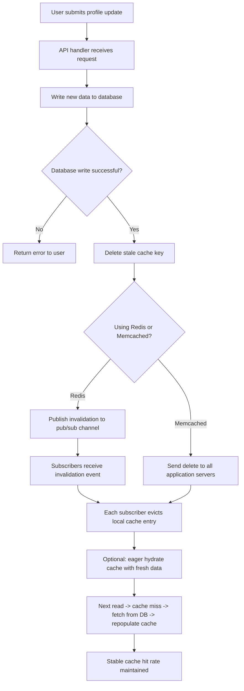

| Difficulty | Channel | Tags |
|---|---|---|
| beginner | backend | redis, memcached, cache-invalidation |

When Salesforce needed to migrate Marketing Cloud's caching layer from Memcached to Redis Cluster, the stakes were brutal: 1.5 million cache events per second across 50+ applications, zero downtime allowed, and an existing system that lacked replication and authentication [1]. The migration succeeded — P50 latency stayed at ~1ms, P99 at ~20ms — but the real lesson emerged in the middle of the fire: Redis's single-threaded shard model introduced hot-key bottlenecks that never existed with Memcached's multi-threaded architecture. The fix required building a custom probabilistic detection system using Count-Min Sketch. This is the story of why cache invalidation is harder than it looks, and what every developer needs to know before choosing between Redis and Memcached.

---

> ### Real-World Case — Salesforce
>
> Salesforce Marketing Cloud needed to migrate its core caching layer from Memcached to Redis Cluster while handling 1.5 million cache events per second across 50+ applications. The existing Memcached system lacked replication and authentication, making it difficult to meet uptime and security requirements.
>
> | | |
> |---|---|
> | **Challenge** | Migrating cache infrastructure at this scale is notoriously risky. Memcached's lack of native replication meant a node failure required rebuilding the entire cache, causing latency spikes. Redis offered replication and auth, but its single-threaded per-shard model introduced hot-key pressure that didn't exist with Memcached. The migration had to be zero-downtime with no application code changes — if anything went wrong, 50+ services would break simultaneously. |
> | **Solution** | Salesforce built a Dynamic Cache Router with percentage-based routing and double-write warmup. They progressively shifted traffic from Memcached to Redis without redeployments. To handle Redis's hot-key vulnerability, they built a Count-Min Sketch probabilistic detection system that flagged keys exceeding access thresholds. They also created a TTL compatibility layer to normalize differences between Memcached and Redis TTL semantics (second vs millisecond precision, zero/negative TTL handling). |
> | **Outcome** | Successfully migrated 1.5M cache events/sec across 50+ services with zero downtime. Sustained P50 latency of ~1ms and P99 latency of ~20ms throughout the transition. Stable cache hit rates were maintained. The plot twist: Redis's single-threaded shard model introduced hot-key bottlenecks that required building a custom probabilistic detection system (Count-Min Sketch) — a problem that never existed with Memcached's multi-threaded architecture. |
> | **Lesson** | When migrating between cache technologies, the differences in fundamental architecture (single-threaded vs multi-threaded, TTL semantics, replication model) are more impactful than the obvious feature differences. Redis's richer feature set comes with trade-offs: its single-threaded shard model makes it vulnerable to hot-key contention that Memcached inherently avoids. Always test with production-faithful traffic patterns — synthetic benchmarks miss real-world access distribution and TTL edge cases. |

---

## Hook — The 3am Question That Keeps Engineers Up

You have just deployed an update to your user profile service. Traffic is steady, logs look clean. Then the pager goes off — stale profile data is serving to users, and somebody's CEO just saw an old email address on their dashboard. Sound familiar? Cache invalidation has a well-earned reputation as one of the two hard things in computer science (along with naming things and off-by-one errors). The core problem is deceptively simple: once you cache data, that data can become stale. When a user updates their profile, every cached copy of that profile across every server needs to either reflect the new data or disappear. Miss even one copy, and you serve misinformation. At Salesforce's scale — 1.5 million events per second — even a 0.001% invalidation failure means 15 requests per second serving stale data. That is not a bug; it is a crisis [1].

## Problem — Why Cache Invalidation Makes Smart Developers Cry

Here is the thing about caching: it is a trade-off masquerading as a performance win. You trade absolute data freshness for speed. Most of the time, that trade-off is worth it — profile data changes infrequently, users tolerate a few seconds of staleness. But the moment you need to guarantee freshness, the abstraction cracks. Consider what happens during a profile update. The user submits new data. Your API handler receives it. You write to the primary database. Now what? Do you update the cache in place? Delete the cache key and let the next read refresh it? Broadcast an invalidation message to every server in your fleet? Each approach has a failure mode. Update-in-place risks race conditions (two concurrent updates can leave the cache in a corrupted state). Delete-and-refresh can cause a thundering herd (every read request for that key suddenly misses cache and hits the database simultaneously). Broadcast invalidation requires distributed consensus — a hard problem in any system [2]. The choice between Redis and Memcached makes these trade-offs even sharper. Many developers assume they are interchangeable, but their architectural differences fundamentally change how you approach invalidation [3].

## Real-World Case — Salesforce Marketing Cloud's Cache Migration War Story

Salesforce Marketing Cloud ran on Memcached for years. The system was simple, fast, and reasonably stable. But it had a hidden debt: no replication, no built-in authentication, and no persistence [1]. Every cache miss meant hitting the database. Every node failure meant reconstructing the cache from scratch. When uptime requirements tightened and security audits demanded encrypted traffic, the team knew they had to migrate. The target was Redis Cluster. But here is where the story gets interesting. During the migration, Salesforce engineers discovered that Redis's single-threaded shard model created a problem they had never seen with Memcached: hot-key bottlenecks. A single popular user profile — say, a celebrity who just joined the platform — could saturate an entire Redis shard because Redis processes commands sequentially per shard. Memcached, with its multi-threaded architecture, would distribute that load across CPU cores. The Salesforce team built a custom probabilistic detection system using Count-Min Sketch to identify hot keys before they caused latency spikes [1]. The migration succeeded — 1.5M events/sec across 50+ services with zero downtime — but the takeaway was clear: your caching strategy must account for the fundamental architecture of your cache layer, not just its API surface.

## Deep Dive — Redis vs Memcached: The Architecture That Changes Everything

Let's dig into the fundamental differences because they directly impact your invalidation strategy. Memcached is a simple key-value store designed for one job: cache data in memory as fast as possible. It uses a multi-threaded architecture with multiple CPU cores handling requests concurrently. No persistence. No replication (in its standard form). No pub/sub. Just raw speed [3]. Redis, by contrast, is a data structure server that happens to be great at caching. It is single-threaded per shard (event loop model), supports persistence (RDB snapshots, AOF logs), offers pub/sub messaging, and includes advanced data structures like sorted sets, hyperloglogs, and bitmaps [4]. How does this affect cache invalidation? For Memcached, you have one invalidation tool: delete the key. Each server independently manages its own cache. If you have 50 application servers, you need to send a delete command to all 50. No built-in mechanism propagates that invalidation automatically. Redis, on the other hand, provides pub/sub channels. You can publish an invalidation event, and every subscriber — across any number of application instances — receives it and evicts the stale key [5]. This is a game-changer for distributed invalidation. However — and this is the plot twist — Redis's single-threaded model means that if your invalidation rate is high enough, the pub/sub processing itself can become a bottleneck. Salesforce's Count-Min Sketch approach addressed a related problem: detecting which keys were hot enough to need special handling before they caused shard saturation [1].

## Workflow — The Write-Through Cache Invalidation Dance

Building on these architectural differences, let's walk through the recommended pattern: write-through caching with TTL-based expiration. Here is the step-by-step flow for a profile update operation: First, the user submits profile changes to your API. Your service writes the new data to the primary database. After the database write succeeds, you delete the stale cache key. Then — and this is critical — you optionally write the fresh data directly to the cache (eager hydration). Finally, you publish an invalidation event so other services can evict their copies. The Mermaid diagram below visualizes this entire flow, including the decision points where Redis and Memcached diverge.

## Code Example — Building a Resilient Cache Invalidation Layer in Python

Now let's turn theory into practice. Here is a Python implementation of a write-through cache invalidation layer that handles the edge cases Salesforce encountered:

## Lessons Learned — What the Cache War Stories Taught Us

After walking through the Salesforce migration, the Redis vs Memcached trade-offs, and a concrete implementation, three lessons stand out. First: understand your cache's threading model before you need it. Redis's single-threaded per-shard architecture means hot keys are not just a throughput problem — they are a correctness problem. A hot key consuming 100% of a shard's CPU delays every other operation on that shard, including invalidation messages [1]. Second: design your invalidation strategy for the worst case, not the average case. The average latency for a cache operation might be 1ms, but what happens when 10,000 users update their profiles simultaneously after a marketing campaign? Without rate limiting, backpressure, or a circuit breaker on your cache invalidation path, you can cascade-fail your entire profile service [6]. Third: measure cache hit rates obsessively. Salesforce maintained stable hit rates throughout their migration because they monitored them relentlessly [1]. A sudden drop in hit rate is often the first sign of an invalidation bug — stale keys being evicted too aggressively, or new keys not being written on update. Your monitoring dashboard should have cache hit rate as a first-class citizen, right next to latency and error rate [7].

---

## Write-Through Cache Invalidation Workflow

<strong>Original Interview Question</strong>

**Q:** You're building a user profile service that caches frequently accessed profiles. How would you implement cache invalidation when a user updates their profile, and what trade-offs would you consider between Redis and Memcached?

**A:** Implement write-through caching with TTL-based expiration. On profile update, invalidate the cache by deleting the key and writing new data to both the database and cache. Redis offers pub/sub for automatic distributed invalidation, while Memcached requires manual coordination across nodes.

## Conclusion

The next time you reach for a cache layer, remember Salesforce's journey: the right invalidation strategy depends as much on your cache's architecture as on your application's requirements. Redis gives you pub/sub, persistence, and rich data structures — but its single-threaded shard model means hot keys can derail your entire cluster. Memcached is simpler, faster for pure caching, and distributes load across cores naturally — but you manage invalidation yourself across every node. Start with write-through caching and TTL-based expiration. Add distributed invalidation via pub/sub when you outgrow a single node. Monitor your hit rates like they are production metrics (because they are). And if you ever need to handle 1.5 million events per second across 50 services, build a Count-Min Sketch detector before the hot keys find you.

---

## References

1. [Migration at Scale: Moving Marketing Cloud Caching from Memcached to Redis at 1.5M RPS Without Downtime](https://engineering.salesforce.com/migration-at-scale-moving-marketing-cloud-caching-from-memcached-to-redis-at-1-5m-rps-without-downtime/) — blog
2. [Cache (computing) — Wikipedia](https://en.wikipedia.org/wiki/Cache_(computing)) — documentation
3. [Memcached — A Distributed Memory Object Caching System](https://memcached.org/) — documentation
4. [Redis Documentation — Introduction to Redis](https://redis.io/docs/latest/) — documentation
5. [Redis Pub/Sub — Redis Documentation](https://redis.io/docs/latest/develop/interact/pubsub/) — documentation
6. [Caching Strategies and Best Practices — AWS documentation](https://docs.aws.amazon.com/whitepapers/latest/database-caching-strategies/caching-strategies-and-best-practices.html) — documentation
7. [Count–min sketch — Wikipedia](https://en.wikipedia.org/wiki/Count%E2%80%93min_sketch) — documentation
8. [Write-through vs Write-back Caching — DigitalOcean](https://www.digitalocean.com/community/tutorials/write-through-vs-write-back-caching) — documentation

---

**Author:** Satishkumar Dhule — [GitHub](https://github.com/satishkumar-dhule) · [LinkedIn](https://linkedin.com/in/satishkumar-dhule) · [Website](https://satishkumar-dhule.github.io)
