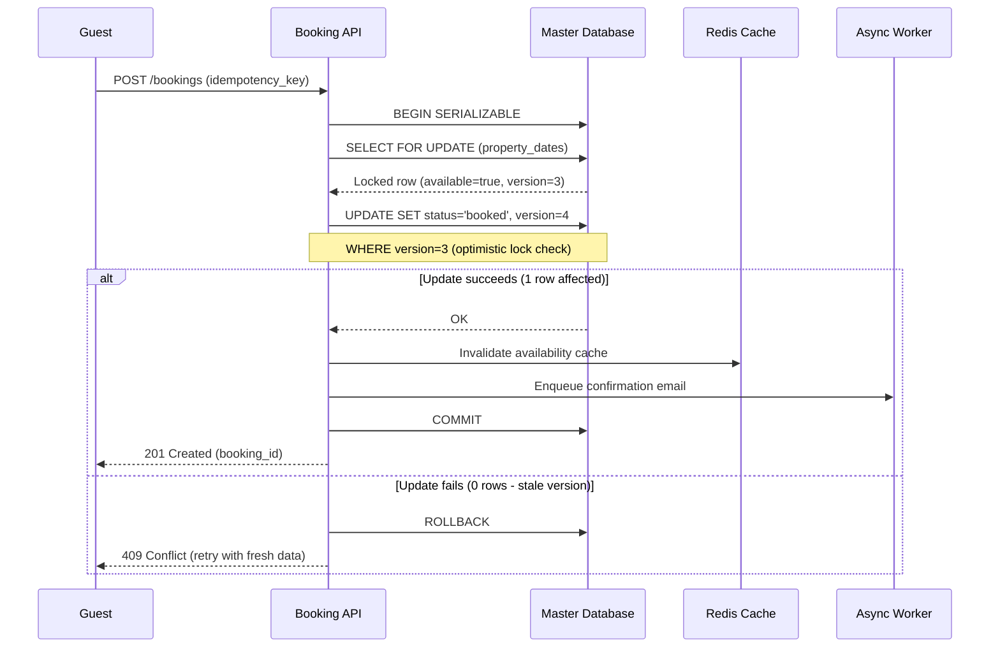

| Difficulty | Channel | Tags |
|---|---|---|
| intermediate | database | acid, isolation-levels, mvcc |

Airbnb's engineering team was midway through migrating from a monolithic Rails app to a Service Oriented Architecture when they discovered a terrifying bug: guests were getting charged twice. Network retries, replica lag, and users clicking 'Book' multiple times were creating duplicate payments across their distributed microservices [1]. The fix they built — a generic idempotency framework called Orpheus — is a masterclass in database transaction design that every backend engineer should study. Here is what they learned, and what you need to know to prevent the same disaster in your own booking systems.

---

> ### Real-World Case — Airbnb
>
> As Airbnb migrated from a monolithic Rails app to a Service Oriented Architecture (SOA), their payments system faced a critical problem: users clicking 'Book' twice, network retries, and replica database lag were causing double payments across their distributed microservices.
>
> | | |
> |---|---|
> | **Challenge** | Distributed transactions across payments microservices made it difficult to maintain data integrity. A user clicking 'Book' twice, an aggressive retry policy, or just a few seconds of MySQL replica lag could result in the same payment being processed multiple times — causing significant financial impact to Airbnb's community. |
> | **Solution** | Airbnb built 'Orpheus', a general-purpose idempotency framework. Every API request carries a unique idempotency key. The framework acquires a database row-level lock on that key (a lease), wraps all Pre-RPC and Post-RPC work in atomic Java lambda transactions, and categorizes errors as retryable (5XX) or non-retryable (4XX). Crucially, idempotency data is always read/written from the sharded master database — never replicas — because just seconds of replica lag could cause duplicate payments. Keys are sharded by high-cardinality idempotency keys for scale. |
> | **Outcome** | Eventual consistency with correctness across Airbnb's payments microservice architecture. The framework ensures that no matter how many times a client retries a booking request, only one payment succeeds. The lease mechanism with expiration prevents deadlocks, and the master-database reads eliminate the replica-lag double-payment window entirely. |
> | **Lesson** | Idempotency is not optional in distributed booking systems. The 'check-then-insert' race window isn't just about concurrent users — it's also about retries, network hiccups, and replica lag. Always write idempotency data to the master database (never replicas), use row-level locks with TTLs to prevent double-processing, and explicitly categorize which errors are safe to retry. |

---

## Hook — The $2,000 Accidental Double Charge

It started with a single support ticket. A guest in Tokyo had booked a cabin in the mountains, checked their credit card statement, and saw two charges instead of one. Then another ticket came in. Then ten more. Airbnb's payments team realized their SOA migration had introduced a subtle but devastating problem: when users clicked 'Book' twice, network timeouts triggered retries, and read replicas served stale availability data, the system happily processed multiple payments for the same reservation [1]. The core challenge? In a distributed system, how do you guarantee that exactly one transaction succeeds when clients, networks, and databases all behave unreliably? This is not just an Airbnb problem — any system handling bookings, reservations, or payments faces the same existential threat.

## Problem — Why Booking Systems Are Prone to Disaster

Booking systems are a perfect storm for concurrency bugs. Multiple users view the same inventory, read stale cached availability, and race to reserve the same finite resource — a hotel room, a concert seat, a rental car. Traditional application-level checks like 'SELECT count(*) WHERE available = true' fail under load because they operate on isolated database snapshots. Transaction A sees an available slot, Transaction B sees the same slot, and both proceed to book it. The result: oversold inventory, angry customers, and costly compensation. The stakes go beyond refunds — double bookings erode trust, trigger chargebacks, and can violate regulatory compliance in payments [2]. What makes this problem deceptively hard is that naive solutions actually make things worse.

## Real-World Case — Airbnb's Orpheus Framework

Airbnb's engineering team, led by Jon Chew and Ninad Khisti, built a solution called Orpheus — a generic idempotency library that became the backbone of their payments infrastructure [1]. The name is fitting: in Greek mythology, Orpheus could charm all living things with his music. Airbnb's Orpheus would charm chaotic distributed requests into orderly, idempotent transactions. The framework categorizes every exception as retryable or non-retryable. It assigns each request a unique idempotency key, reads from the master database (not replicas) to avoid stale data, and uses a lease mechanism with automatic expiration to prevent deadlocks. Since launch, Airbnb has achieved five nines of consistency for payments while doubling annual payment volume [1]. The key insight? They avoided building a dedicated idempotency service — instead, they shipped a lightweight library that services import directly, keeping latency at microsecond levels.

## Deep Dive — SERIALIZABLE, MVCC, and Optimistic Locking Demystified

Building on Airbnb's lesson, let us look at the three pillars that prevent double bookings. First, SERIALIZABLE isolation: this is the strictest isolation level in the SQL standard. It guarantees that concurrent transactions produce the same result as if they ran one after another [5]. Many developers avoid SERIALIZABLE because they fear performance degradation, and in older database systems, that fear was justified. Modern databases like PostgreSQL use Serializable Snapshot Isolation (SSI), which detects serialization conflicts and aborts one of the conflicting transactions — requiring the application to retry. Second, Multi-Version Concurrency Control (MVCC): instead of locking rows for reads, MVCC gives each transaction a snapshot of the database at a point in time [3]. This means read operations never block writes and writes never block reads. However — and this is the plot twist — MVCC snapshots are precisely what cause the double-booking problem. Transaction A reads 'available=true' from its snapshot, Transaction B reads the same from its own snapshot, and both proceed to book. This is why snapshot isolation alone is insufficient for booking systems. Third, optimistic locking: add a version column to your inventory table. When updating a row, increment the version and include 'WHERE version = :old_version' in your UPDATE statement [4]. If another transaction updated the row first, zero rows match, and you know a conflict occurred. The beauty of this approach is that no locks are held during normal operation — only during the actual commit.

## Workflow — The Anatomy of a Safe Booking Transaction

Here is how a production-grade booking transaction works, combining the patterns above into a reliable workflow. The Mermaid diagram below visualizes the complete flow.

## Code Example — Implementing Double-Booking Prevention in PostgreSQL

The following PostgreSQL transaction implements a booking flow using SERIALIZABLE isolation, row-level locking, and optimistic version control. This is the pattern Airbnb uses under the hood for their inventory management.

## Lessons Learned — Patterns That Scale and Pitfalls to Avoid

After studying Airbnb's incident and implementing these patterns across real systems, several hard-won lessons emerge. First, never trust read replicas for booking decisions — always read availability from the master database or use synchronous replication [1]. Airbnb learned this the hard way when replica lag caused duplicate payments. Second, idempotency is not optional — every mutation endpoint should accept and enforce an idempotency key. Stripe popularized this pattern, and Airbnb's Orpheus proved it works at scale [7]. Third, use SERIALIZABLE isolation for the critical write path but measure your abort rate — if it exceeds 1%, switch to REPEATABLE READ with explicit SELECT FOR UPDATE locks to reduce wasted work. Fourth, keep your transaction windows as short as humanly possible. Every millisecond a lock is held is a millisecond another user is waiting. Move expensive operations (email notifications, analytics updates) to asynchronous jobs outside the transaction. Fifth, implement circuit breakers for hot properties — if a listing receives more than 10 booking attempts per second, temporarily queue requests to prevent lock storms [8]. The most common mistake developers make is treating database transactions as an afterthought. 'We will add locking later' is a promise that always breaks in production.

---

## Booking Transaction Flow with Idempotency and Optimistic Locking

<strong>Original Interview Question</strong>

**Q:** You're building a booking system for Airbnb where multiple users can reserve the same property simultaneously. How would you design the transaction handling to prevent double bookings while maintaining high availability?

**A:** Use SERIALIZABLE isolation with optimistic concurrency control. Implement row-level locks on property availability tables, use MVCC snapshot reads for checking availability, and apply application-level validation to ensure atomic booking operations.

## Conclusion

Airbnb's near-disaster with double payments is a reminder that distributed systems do not forgive naive transaction design. The solution — combining SERIALIZABLE isolation, SELECT FOR UPDATE row locking, optimistic version control, and idempotency keys — forms a defense-in-depth strategy that has kept Airbnb's payments consistent through billions of dollars in bookings. The next time you build a booking system, start with these patterns from day one. Your future self (and your customers' bank accounts) will thank you.

---

## References

1. [Avoiding Double Payments in a Distributed Payments System — Airbnb Engineering](https://medium.com/airbnb-engineering/avoiding-double-payments-in-a-distributed-payments-system-2981f6b070bb) — blog
2. [Isolation (Database Systems) — Wikipedia](https://en.wikipedia.org/wiki/Isolation_(database_systems)) — documentation
3. [Multiversion Concurrency Control — Wikipedia](https://en.wikipedia.org/wiki/Multiversion_concurrency_control) — documentation
4. [PostgreSQL Explicit Locking — Documentation](https://www.postgresql.org/docs/current/explicit-locking.html) — documentation
5. [PostgreSQL Transaction Isolation — Documentation](https://www.postgresql.org/docs/current/transaction-iso.html) — documentation
6. [Eventual Consistency — Wikipedia](https://en.wikipedia.org/wiki/Eventual_consistency) — documentation
7. [Two-Phase Commit Protocol — Wikipedia](https://en.wikipedia.org/wiki/Two-phase_commit_protocol) — documentation
8. [Serializable Snapshot Isolation — PostgreSQL Documentation](https://www.postgresql.org/docs/current/transaction-iso.html#XACT-SERIALIZABLE) — documentation

---

**Author:** Satishkumar Dhule — [GitHub](https://github.com/satishkumar-dhule) · [LinkedIn](https://linkedin.com/in/satishkumar-dhule) · [Website](https://satishkumar-dhule.github.io)
