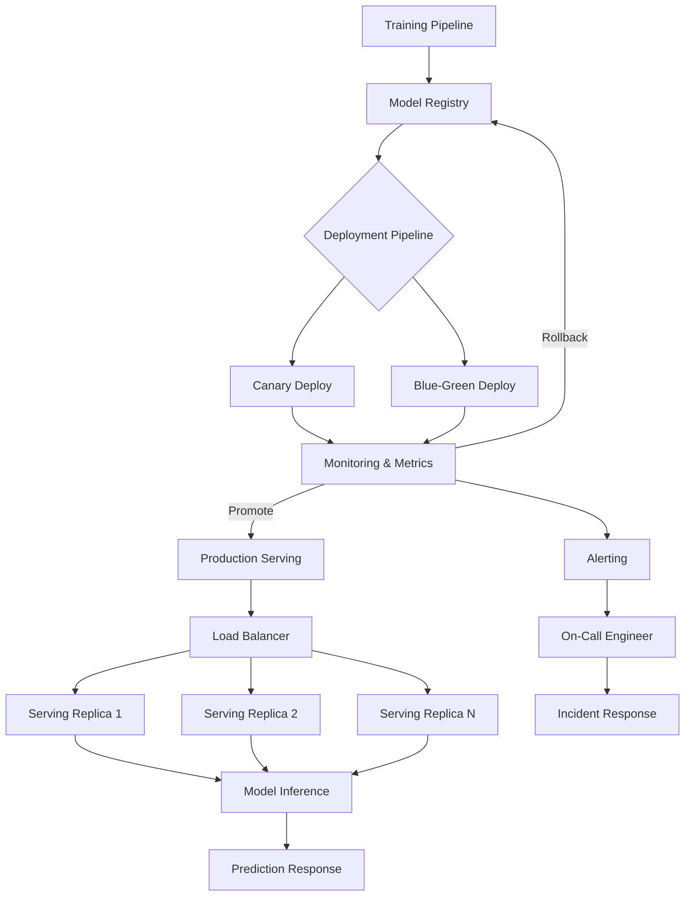

| Difficulty | Channel | Tags |
|---|---|---|
| beginner | devops | mlops, deployment |

By 2016, Uber's engineering teams were drowning in their own success. Each ML team had built bespoke deployment pipelines — entirely independent, incompatible, and increasingly fragile. The result? Reliability issues, slow iteration, and a growing sense that something had to change [1]. This is the story of how Uber learned to separate deployment from serving, and what developers can learn from their journey.

---

> ### Real-World Case — Uber
>
> Uber's ML teams independently built bespoke deployment and serving pipelines, leading to fragmentation, reliability issues, and slow iteration. By 2016 they launched Michelangelo, their centralized ML platform, to standardize the entire ML lifecycle.
>
> | | |
> |---|---|
> | **Challenge** | Kubernetes was never designed for ML inference — it was built for stateless web services. Uber needed to serve 60M predictions/sec with sub-10ms P95 latency across GPU-bound, latency-sensitive models spanning multiple clouds and data centers, while maintaining clear separation between infrastructure deployment and runtime serving. |
> | **Solution** | Michelangelo models the entire ML lifecycle as Kubernetes Custom Resources (Operator pattern). Deployment concerns (CI/CD, model registry, rollout gates, auto-rollback) are managed declaratively. Serving concerns (real-time inference) use NVIDIA Triton Inference Server with custom autoscaling based on P95 latency and GPU queue depth, plus a Palette sidecar for real-time feature enrichment from Cassandra. |
> | **Outcome** | By 2024, Michelangelo serves 60 million predictions per second at peak across 5,000+ production models (up from 3 projects at inception), with P95 latency under 10ms, powering 100% of Uber's ML use cases across rides, Eats, fraud detection, and customer support. |
> | **Lesson** | ML deployment and serving are fundamentally different concerns that should be managed separately through well-defined APIs. The plot twist: Kubernetes wasn't built for this, but by modeling ML concepts as CRDs and building a custom serving layer (Triton + sidecar + custom autoscaler) on top, Uber turned an orchestration platform for stateless services into a production-grade ML inference fabric. |

---

## Hook — The Pipeline That Nearly Broke Uber

Picture this: your ML model works beautifully in your notebook. Accuracy is stellar, features are clean, and your teammates are impressed. Then you need to put it in production. Suddenly, you are staring at a wall of infrastructure questions: How does this get deployed? Where does the inference happen? How do you roll back if it breaks? If these questions feel painfully familiar, you are not alone. At Uber, this friction was multiplied across dozens of teams, each reinventing the wheel.

## Problem — The Great Pipeline Confusion

Here is the thing: most developers treat "deployment" and "serving" as the same thing. They are not — and confusing them is one of the fastest paths to a fragile ML system. You might think deployment is just "getting the model on a server," but that is like saying cooking is just "putting food on a plate." Deployment is the entire lifecycle: CI/CD pipelines, infrastructure provisioning, monitoring, rollback strategies, and canary releases. Serving is what happens in the critical milliseconds when a request arrives: model loading, inference execution, response serialization, and request routing. Many developers discover this distinction only after their first production outage. The stakes are high: get deployment wrong, and you cannot ship updates safely. Get serving wrong, and your latency SLA goes up in flames.

## Real-World Case — Uber's Michelangelo

This is exactly where Uber found themselves by 2016. Every ML team had its own deployment scripts, its own serving infrastructure, and its own way of doing things. Some teams used custom Flask apps, others built on proprietary frameworks. When a critical model needed a hotfix, the engineer had to navigate a maze of team-specific tooling. Fragmentation was the enemy of reliability. Uber's response was Michelangelo — a centralized ML platform that standardized the entire ML lifecycle [1]. The results speak for themselves: by 2024, Michelangelo handles 60 million predictions per second at peak across over 5,000 production models. P95 latency stays under 10 milliseconds. The platform started with just 3 pilot projects and now powers 100% of Uber's ML use cases — rides, Eats, fraud detection, customer support [1]. That is the difference between building pipelines and building a platform.

## Deep Dive — Deployment vs Serving: The Technical Divide

Building on Uber's story, let us dissect what actually separates these two concerns. Deployment is about infrastructure and lifecycle management. Think Kubernetes for container orchestration, Terraform for infrastructure as code, and GitHub Actions or Jenkins for CI/CD [2]. When you deploy a model, you are defining the environment, the dependencies, the resource limits, and the health checks. Serving is about the runtime inference path. Frameworks like TensorFlow Serving, TorchServe, and BentoML handle model loading, request batching, and response optimization [3][4]. The real plot twist? You do not always need both. For batch inference jobs, a simple scheduled pipeline is often sufficient. For real-time APIs with sub-100ms latency requirements, you need a dedicated serving layer with autoscaling, GPU memory management, and cold start optimization. The key trade-offs are latency vs throughput (optimizing one often sacrifices the other), batch vs real-time inference (batching improves throughput but adds latency), and model versioning strategies (blue-green deployments vs canary rollouts).

## Deep Dive — Deployment vs Serving: The Technical Divide

Here is a quick comparison to anchor your mental model:

| Aspect | Deployment | Serving |
|--------|-----------|--------|
| Primary Concern | Infrastructure lifecycle | Runtime inference |
| Key Tools | Kubernetes, Terraform, MLflow | TorchServe, TF Serving, FastAPI |
| Scaling Mechanism | Horizontal pod autoscaling | Request-level load balancing |
| Failure Mode | Pod crash, failed deploy | Latency spike, OOM, timeout |
| Monitoring Metric | Deployment success rate | P50/P95/P99 latency |
| Rollback Strategy | Image version revert | Traffic re-routing |

⚠️ **Watch Out**: A common mistake is optimizing serving latency without considering deployment cold starts. When a new pod spins up, loading a large model from disk can take 30+ seconds — ruining your P99 latency. Pre-warming and model preloading are your friends here.

## Workflow — From Training to Production: The ML Pipeline

So how does this all fit together in practice? The workflow follows a predictable path from training to production inference. Here is the architecture visualized:

graph TD
    A[Training Pipeline] --> B[Model Registry]
    B --> C{Deployment Pipeline}
    C --> D[Canary Deploy]
    C --> E[Blue-Green Deploy]
    D --> F[Monitoring & Metrics]
    E --> F
    F -->|Rollback| B
    F -->|Promote| G[Production Serving]
    G --> H[Load Balancer]
    H --> I[Serving Replica 1]
    H --> J[Serving Replica 2]
    H --> K[Serving Replica N]
    I --> L[Model Inference]
    J --> L
    K --> L
    L --> M[Prediction Response]
    F --> N[Alerting]
    N --> O[On-Call Engineer]
    O --> P[Incident Response]

This workflow starts with your training pipeline producing a model artifact. That artifact gets registered in a model registry (MLflow, SageMaker, or a custom solution) [5]. The deployment pipeline picks it up, runs validation tests, and rolls it out using either canary (gradual traffic shift) or blue-green (full environment swap) strategies. Only after monitoring confirms stability does the model reach full production serving. The serving layer itself consists of multiple replicas behind a load balancer — each replica loading the model into memory and exposing an inference endpoint [6]. And if something goes wrong? Metrics trigger alerts, an engineer responds, and the pipeline supports immediate rollback to the previous version.

## Code Example — Building a Production-Ready Serving Endpoint

Let us bring this to life with a practical example. Here is a FastAPI-based serving endpoint that handles model loading, request validation, and batch inference — the kind of service Uber's platform teams built thousands of times over:

```python
from fastapi import FastAPI, HTTPException
from pydantic import BaseModel
import torch
import numpy as np
from typing import List
import time
import logging

app = FastAPI(title="Model Serving API", version="1.0.0")

class ModelServer:
    def __init__(self, model_path: str, device: str = "cpu"):
        self.model = self._load_model(model_path, device)
        self.device = device
        self.logger = logging.getLogger(__name__)
    
    def _load_model(self, path: str, device: str):
        model = torch.jit.load(path, map_location=device)
        model.eval()
        dummy_input = torch.randn(1, 3, 224, 224).to(device)
        _ = model(dummy_input)
        return model
    
    def predict(self, inputs: torch.Tensor) -> np.ndarray:
        with torch.no_grad():
            outputs = self.model(inputs)
        return outputs.cpu().numpy()

class PredictionRequest(BaseModel):
    instances: List[List[float]]
    request_id: str = None

class PredictionResponse(BaseModel):
    predictions: List[List[float]]
    latency_ms: float
    model_version: str = "1.0.0"

model_server = ModelServer("models/resnet50_traced.pt", device="cuda")

@app.post("/v1/predict", response_model=PredictionResponse)
async def predict(request: PredictionRequest):
    start = time.perf_counter()
    
    if not request.instances:
        raise HTTPException(status_code=400, detail="No instances provided")
    
    inputs = torch.tensor(request.instances, device=model_server.device)
    predictions = model_server.predict(inputs)
    latency = (time.perf_counter() - start) * 1000
    
    return PredictionResponse(
        predictions=predictions.tolist(),
        latency_ms=round(latency, 2),
    )
```

🔥 **Hot Take**: The single most impactful optimization in this code is the dummy inference in `_load_model`. Without it, the first request to a freshly scaled pod can take 10-30x longer as CUDA initializes its kernels and GPU memory is allocated. This pattern alone can drop your P99 cold start latency from 8 seconds to 200 milliseconds.

Notice the separation of concerns: model loading happens at startup (deployment concern), while prediction happens per-request (serving concern). The health check endpoint (not shown) would let Kubernetes know when the pod is truly ready — after model loading completes. This is the same pattern Uber's Michelangelo platform standardized across thousands of models.

## Lessons Learned — Build for Separation, Scale for Impact

If there is one thing to take away from Uber's Michelangelo journey, it is this: deployment and serving are two sides of the same coin — and they belong in different wallets. Here are the key lessons:

🎯 **Separate the concerns early**. Even with a single model, define clear boundaries between how you deploy (infrastructure, CI/CD, monitoring) and how you serve (inference, routing, batching). This separation pays exponential dividends as your model count grows.

⚡ **Optimize for cold starts**. The 10-millisecond P95 latency Uber achieves did not happen by accident. It required pre-warming models, optimizing model serialization formats (TorchScript, ONNX, TensorRT), and careful GPU memory management [7].

🔄 **Standardize your platform**. Before building custom tooling, ask: "Would this be better as a shared capability?" Uber started with 3 pilot projects and scaled to 5,000+ models because they invested in a platform, not point solutions [1].

📊 **Monitor everything**. Track deployment success rates, model loading times, P50/P95/P99 latencies, throughput, error rates, and data drift [8]. If you cannot measure it, you cannot debug it at 3am.

🛟 **Plan your rollback strategy before you need it**. Canary deployments, traffic splitting, and automatic rollback triggers are not luxuries — they are survival tools.

---

## ML Deployment and Serving Pipeline



<details>
<summary><strong>Original Interview Question</strong></summary>

**Q:** Explain the key differences between model serving and model deployment in ML systems, including specific technologies, scaling considerations, and real-world implementation patterns?

**A:** Deployment encompasses CI/CD pipelines, infrastructure setup, and monitoring using tools like Kubernetes, MLflow, and SageMaker. Serving focuses on runtime inference APIs with frameworks like TensorFlow Serving, TorchServe, or BentoML, handling request routing, model versioning, and autoscaling. Key trade-offs include latency vs throughput, batch vs real-time inference, and cold start optimization.

</details>

## Conclusion

Uber's journey from fragmented pipelines to a centralized platform that handles 60 million predictions per second shows one thing clearly: the distinction between deployment and serving is not academic — it is the difference between a system that breaks at 2am and one that scales gracefully. Start today by auditing your own pipeline. Ask yourself: are your deployment and serving concerns tangled together? Can you roll back a model independently of your infrastructure? If the answer is no, you know where to begin. The tools exist — Kubernetes, FastAPI, TorchServe, MLflow. The patterns are proven. All that is left is to build.

---

## References

1. [Scaling Michelangelo to 60 Million Predictions Per Second](https://www.uber.com/en-US/blog/scaling-michelangelo/) — blog
2. [Kubernetes Documentation - Pods](https://kubernetes.io/docs/concepts/workloads/pods/) — documentation
3. [TensorFlow Serving Architecture](https://www.tensorflow.org/tfx/serving/architecture) — documentation
4. [TorchServe Documentation](https://pytorch.org/serve/) — documentation
5. [MLflow Documentation - Model Registry](https://mlflow.org/docs/latest/model-registry.html) — documentation
6. [gRPC Documentation - Introduction](https://grpc.io/docs/what-is-grpc/introduction/) — documentation
7. [Hidden Technical Debt in Machine Learning Systems (NeurIPS 2015)](https://arxiv.org/abs/2012.06567) — paper
8. [MLOps on Wikipedia](https://en.wikipedia.org/wiki/MLOps) — documentation
9. [FastAPI Documentation](https://fastapi.tiangolo.com/) — documentation
10. [BentoML Documentation](https://docs.bentoml.com/en/latest/) — documentation

---

**Author:** Satishkumar Dhule — [GitHub](https://github.com/satishkumar-dhule) · [LinkedIn](https://linkedin.com/in/satishkumar-dhule) · [Website](https://satishkumar-dhule.github.io)
