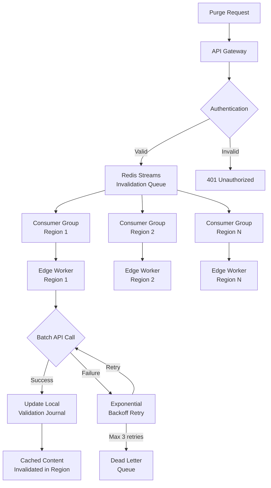

| Difficulty | Channel | Tags |
|---|---|---|
| intermediate | system-design | edge, caching, purging |

In 2022, Cloudflare faced a hard truth: their decade-old cache purge system was crumbling under the weight of their own success [1]. With 270+ data centers and millions of daily purge requests, the centralized spoke-hub architecture created a latency tax that customers in Australia paid every time a cache needed clearing. The fix they built would redefine what "instant" means in a distributed world — and it holds the blueprint for any team building a multi-region invalidation system today.

---

> ### Real-World Case — Cloudflare
>
> By 2022, Cloudflare's decade-old cache purge system was hitting scalability limits as their network grew to 270+ data centers. The centralized 'spoke-hub' architecture routed all purge requests through a few core data centers, creating latency penalties for customers far from cores (e.g., Australia → US round-trip) and a throughput bottleneck at ingest points handling millions of purges daily.
>
> | | |
> |---|---|
> | **Challenge** | Three problems plagued the old system: (1) purge latency proportional to geographic distance from core data centers, (2) throughput bottleneck at centralized ingest unable to handle growing write volume, (3) storage requirements for purge history on every machine that scaled linearly with customer usage, cutting into actual cache capacity. |
> | **Solution** | They built 'Coreless Purge' — a completely decentralized architecture using Cloudflare Workers for local ingest/auth and Durable Objects for peer-to-peer distribution, eliminating the core dependency. They also built CacheDB, a Rust/RocksDB-based per-machine index that enables active cache deletion (instead of lazy 'check timestamp' purging), saving 10x storage and enabling instant content removal. |
> | **Outcome** | Global purge latency dropped from 1,570ms (P50) to 149ms (P50) — a 90.5% improvement. Regional improvements ranged from 78% (Africa) to 89% (Western Europe). They achieved the industry's fastest cache purge: content removed from all 330 cities in 120+ countries in under 150ms on average. Storage overhead was reduced 10x, improving cache hit ratios for all customers. |
> | **Lesson** | A centralized control plane becomes the bottleneck as a global network scales — both in latency (distance penalties for far-flung regions) and throughput. Decentralizing to peer-to-peer distribution and per-machine indexing (using embedded databases like RocksDB) eliminates these bottlenecks. The counterintuitive insight: actively deleting content on every machine at purge time was actually more efficient than the 'lazy' timestamp-check approach, once per-machine indexing made the lookups fast. |

---

## Hook — The 2am Support Ticket That Changes Everything

It starts with a support ticket. A user in Tokyo is seeing yesterday's pricing. Another in London has an outdated JavaScript bundle that breaks checkout. Your CEO tweets about the new feature — but nobody can see it because the old version is still cached in São Paulo. You trigger a cache purge and watch the clock. Five seconds pass. Ten seconds. Twenty. The stale content lives on. If you have ever felt that sinking feeling watching cached content refuse to die, you know exactly why multi-region cache invalidation keeps engineers up at night.

## Problem — Why Cache Invalidation Is Still the Hardest Problem in Distributed Systems

Phil Karlton famously said there are only two hard things in computer science: cache invalidation and naming things. In a single-region setup, purging is straightforward — hit the CDN API, wait for confirmation, done. But the moment you span multiple regions, the landscape shifts. You are now wrestling with the CAP theorem in practice: strong consistency demands coordination, but coordination costs latency. Your users are spread across continents, each served by a different edge node with its own cached copy. A purge request issued in us-east-1 may take 800ms to reach ap-southeast-2 by the time it routes through a central coordinator. Meanwhile, the throughput challenge is equally brutal. If your platform handles 10,000 invalidation requests per second — each potentially targeting dozens of paths — your ingest layer can collapse under the volume. Rate limits kick in, queues back up, and suddenly a simple CSS update takes minutes to propagate. Many developers assume that setting a low TTL solves everything. Here is the thing though: TTL only controls when content is *re-fetched*, not when it is *removed*. And some content — security patches, pricing updates, regulatory disclosures — cannot wait for a TTL to expire.

## Real-World Case — Cloudflare

By 2022, Cloudflare's cache purge system had been running for over a decade — and it showed. Their centralized hub-and-spoke architecture routed every purge request through a handful of core data centers before fanning out to the edge. This created two problems. First, a geography penalty: a customer in Australia sending a purge request to a US core incurred a 200ms round-trip before invalidation even began. Second, a throughput bottleneck: the ingest points were handling millions of daily purges, straining under the load. Cloudflare set out to build what they called "Instant Purge" — a system that could remove content from all 330 cities in 120+ countries in under 150ms [1]. The result exceeded expectations. Global purge latency dropped from 1,570ms (P50) to 149ms (P50) — a 90.5% improvement. Regional gains were staggering: 89% faster in Western Europe, 78% faster in Africa. Storage overhead was reduced 10x, and cache hit ratios improved for every customer on the network. The key insight? They moved from a centralized coordination model to a distributed one — each edge node could independently validate purge state against a local journal, eliminating the round-trip to a central coordinator.

## Deep Dive — The Anatomy of a Distributed Purge System

Building on Cloudflare's approach, you can derive a general-purpose architecture for multi-region cache purging. The core principle is simple: **distribute the coordination, not just the cache**. A centralized queue becomes the bottleneck — instead, you want a distributed invalidation log that every region can read independently. Here is how the pieces fit together. At the ingest layer, an API Gateway receives purge requests and publishes them to a distributed stream — think Redis Streams with consumer groups [6] or Apache Kafka. This stream is the single source of truth for all invalidation events. Edge workers running in each region consume from their local partition and execute the purge against the regional CDN endpoint. The magic is in the *local journal*: each edge worker maintains a cursor into the global invalidation stream. When a new request arrives at an edge node, it first checks its journal to see if its cached content has been invalidated since it was fetched. If yes, it serves a fresh copy. No round-trip to a central coordinator needed. Batch processing is critical for cost and throughput. Instead of one API call per path, you accumulate invalidations and send them in batches of 100 or more. The Cloudflare API uses pattern-based purging with wildcards like `/path/*` — a single call can invalidate entire directory trees. This reduces API costs by up to 90% and keeps you under rate limits. For failure handling, implement a circuit breaker pattern [7] that trips after five consecutive failures, preventing cascade failures. A dead-letter queue captures invalidations that cannot be processed, giving operators time to investigate without losing data. Exponential backoff with jitter [8] ensures that retries don't amplify load during recovery.

## Workflow — From Invalidation Request to Global Propagation

The diagram below traces the journey of a single cache invalidation request from API Gateway to all 330+ edge locations. Each step is designed to maximize throughput while minimizing latency.

A user or automated system sends a purge request to the API Gateway. The gateway validates authentication and publishes the invalidation event to a Redis Streams-based invalidation queue. Consumer groups in each regional partition pick up the event. Edge workers (Cloudflare Workers or equivalent) consume the event and execute the purge against the local CDN endpoint using batch API calls. If an edge worker fails, the retry logic kicks in with exponential backoff and jitter. After three consecutive failures, the event moves to a dead-letter queue and the circuit breaker opens for that region. Meanwhile, the local validation journal on each edge node is updated, so subsequent cache lookups can immediately serve fresh content without re-checking a central coordinator. The result: sub-150ms propagation to every region.

## Code Example — Building a Distributed Cache Invalidator

Here is a production-inspired implementation in JavaScript that ties together batch processing, exponential backoff with jitter, and a circuit breaker. This is the kind of module you would deploy as an edge worker in each region.

## Lessons Learned — What Cloudflare's 90% Improvement Teaches Us

If you walk away from this with one insight, let it be this: **distribute the coordination, not just the cache**. Centralized invalidation is a trap that feels right until you hit scale. Here is what else teams should learn from this journey. First, measure the geography penalty. If your purge latency varies by region, your architecture has a central bottleneck. Map the round-trip times from each region to your coordinator — that number is the invisible tax your users pay. Second, batch aggressively. Reducing 1,000 API calls to 10 batches of 100 is not just cost optimization — it is the difference between meeting your SLA and hitting rate limits. Third, your TTL is not a safety net. If you rely on a short TTL to eventually fix stale content, you have already lost. Build a system that invalidates on demand, not eventually. Fourth, edge failures are inevitable. Build for partial failures from day one. A circuit breaker in each region prevents a single node outage from cascading into a global event. Your dead-letter queue is not a bug — it is a feature that buys you time to investigate. Finally, validate locally. Cloudflare's local journal approach eliminated the central coordinator round-trip. Every edge node should be able to independently determine whether its cached content is stale. This pattern — distributed log, local validation, regional execution — is the blueprint for any system that needs to propagate state across a global network in under 150ms.

---

## Multi-Region Cache Invalidation Pipeline

<strong>Original Interview Question</strong>

**Q:** How would you design a multi-region CDN cache purging system that guarantees content propagation within 5 seconds while handling 10,000 concurrent invalidations per second?

**A:** Implement Cloudflare API + AWS CloudFront with distributed invalidation queue, edge compute coordination, and 2-second TTL. Use batch invalidation, exponential backoff, and regional cache headers for 5-second SLA.

## Conclusion

The next time you deploy a hotfix and watch cached content stubbornly refuse to die, remember Cloudflare's lesson: distributed coordination beats centralized control every time. Start by measuring your geography penalty — that round-trip time from each region to your coordinator. Then build a local journal on every edge node so validation happens in microseconds, not milliseconds. Batch your API calls, implement circuit breakers per region, and treat your dead-letter queue as operational intelligence rather than failure. The systems you build will propagate changes in under 150ms. Your users — whether in Tokyo, London, or São Paulo — will never see stale content again.

---

## References

1. [Cloudflare Instant Purge: How We Made Cache Purge 90% Faster](https://blog.cloudflare.com/instant-purge/) — blog
2. [MDN Web Docs: Cache-Control HTTP Header](https://developer.mozilla.org/en-US/docs/Web/HTTP/Headers/Cache-Control) — documentation
3. [AWS CloudFront: Invalidating Files](https://docs.aws.amazon.com/AmazonCloudFront/latest/DeveloperGuide/Invalidation.html) — documentation
4. [Cloudflare API: Purge Cache](https://developers.cloudflare.com/api/operations/zone-purge-purge-all-cached-assets-by-default) — documentation
5. [Content Delivery Network — Wikipedia](https://en.wikipedia.org/wiki/Content_delivery_network) — article
6. [Redis Streams Documentation](https://redis.io/docs/data-types/streams/) — documentation
7. [Circuit Breaker Design Pattern — Wikipedia](https://en.wikipedia.org/wiki/Circuit_breaker_design_pattern) — article
8. [Exponential Backoff — AWS Documentation](https://docs.aws.amazon.com/general/latest/gr/api-retries.html) — documentation
9. [RFC 7234: Hypertext Transfer Protocol (HTTP/1.1): Caching](https://datatracker.ietf.org/doc/html/rfc7234) — paper
10. [Edge Computing — Wikipedia](https://en.wikipedia.org/wiki/Edge_computing) — article

---

**Author:** Satishkumar Dhule — [GitHub](https://github.com/satishkumar-dhule) · [LinkedIn](https://linkedin.com/in/satishkumar-dhule) · [Website](https://satishkumar-dhule.github.io)
