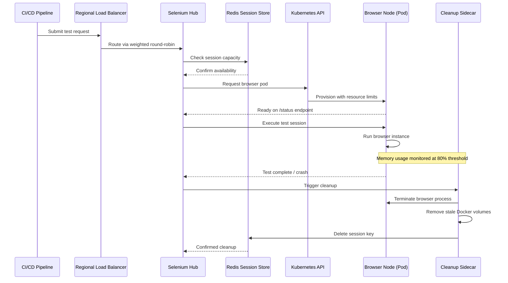

| Difficulty | Channel | Tags |
|---|---|---|
| advanced | system-design | selenium, webdriver, grid |

What if you could run 150,000+ UI tests every day — across 90+ hubs — for just $80,000 a year? That is exactly what Expedia Group achieved after their legacy Selenium infrastructure hit a wall [1]. Here is how they (and you) can build a grid that scales to 10,000 concurrent sessions without the memory leaks, without the 30x vendor markup, and without waking up to failing nodes at 2am.

---

> ### Real-World Case — Expedia Group
>
> Expedia Group's UI automation infrastructure was straining at 140k+ tests per day across 100+ Selenium hubs. Their EC2-based SeleniumGridScaler solution had fundamental limitations: nodes took 2-4 minutes to provision, couldn't support per-branch pre-merge testing, suffered from overlapping IP addresses across AWS accounts, and forced wasteful CPU/memory allocation at the instance level.
>
> | | |
> |---|---|
> | **Challenge** | As Expedia moved to microservices, teams needed to run UI automation against every Git branch before merging PRs — requiring rapid, on-demand grid creation and teardown. The old EC2 approach couldn't keep up with the velocity, and scaling up via third-party cross-browser vendors would cost an estimated $2.41M annually for 1000 parallel connections. |
> | **Solution** | They built DA-Kube, a Kubernetes (EKS) based Selenium Grid using Docker, Helm charts for deployment, and Traefik as a smart ingress router. Each team's branch gets its own isolated grid with a unique domain name (e.g., da-4eb769b.hub.test.expedia.com). Helm enables instant scaling via a single command, pod-level CPU/memory fine-tuning eliminates resource waste, and warm worker node pools ensure fast pod creation. C5.xlarge instances run 15 browser sessions per node for cost efficiency. |
> | **Outcome** | Reduced infrastructure cost to ~$80,000 per year — a 30x savings versus the $2.41M equivalent third-party vendor cost. Fleet of 90+ hubs running 150,000+ tests daily across CI/CD pipelines. 4,500+ EC2 nodes created, used, and terminated on-demand every day. Achieved the goal of running all UI automation tests within the execution time of the slowest single test case. |
> | **Lesson** | The biggest surprise was that Kubernetes enabled cost savings beyond what EC2 alone could achieve — you can fine-tune CPU/memory at the pod level rather than the instance level, eliminating the 'one size fits all' over-provisioning problem. Combined with aggressive lifecycle management (shut down everything when idle), the internal solution dramatically outperformed vendor alternatives on both speed and cost. |

---

## Hook — The Day 4,500 EC2 Nodes Wasn't Enough

Expedia Group's test automation team was running 140,000+ UI tests daily across 100+ Selenium hubs [1]. Their homegrown EC2-based SeleniumGridScaler worked — until it did not. Nodes took 2–4 minutes to provision. Per-branch pre-merge testing was impossible. Overlapping IP addresses across AWS accounts caused chaos. And because they allocated resources at the instance level, they were burning money on idle CPU and memory. The breaking point? They needed to run all UI automation within the execution time of the *slowest single test case*. Sound familiar? Many engineering teams hit this wall when their test infrastructure grows faster than their architecture can handle.

## Problem — Why Traditional Selenium Grids Break at Scale

Here is the dirty secret about scaling Selenium Grid: the hub-and-node pattern was never designed for cloud-native elasticity. The classic architecture works beautifully for 50 nodes. At 500 nodes, things get interesting. At 2,000+? You start seeing memory leaks that compound over days, session orphanage when nodes crash mid-test, and load balancers that blindly route to dying nodes. The core tension is simple — browser instances are heavyweight processes (each consuming 500MB–1GB of RAM), and Selenium was born in an era when you spun up a few VMs and called it a day. Modern CI/CD pipelines demand *ephemeral, on-demand, branch-isolated* test infrastructure [2]. The old model of long-running VMs with static browser installations cannot keep up. Moreover, the cost of third-party grid providers ($2.41M/year in Expedia's case [1]) makes in-house scalability not just a technical choice but a financial imperative.

## Real-World Case — Expedia Group's $2.4M Wake-Up Call

Facing 140,000+ daily test executions across 100+ Selenium hubs, Expedia Group's infrastructure team made a bet on Kubernetes [1]. They migrated from EC2-based orchestration to a Kubernetes-native Selenium Grid using Docker, Helm, and Traefik for load balancing. The results were staggering: infrastructure costs dropped to ~$80,000 per year — a **30x savings** versus the equivalent third-party vendor pricing. Their fleet grew to 90+ hubs running 150,000+ tests daily across CI/CD pipelines, with 4,500+ EC2 nodes created, used, and terminated on-demand every single day. Most importantly, they achieved the golden goal: all UI automation tests now complete within the execution time of the slowest single test case [1]. For context, most engineering teams would consider this 'impossible' because they assume test execution is bound by total test count, not parallelism. Expedia proved otherwise by making every node ephemeral, every session disposable, and every resource fungible.

## Deep Dive — The Architecture That Makes 10,000 Concurrent Sessions Possible

Building on Expedia's approach, let's break down how a modern Selenium Grid architecture handles 10,000 concurrent sessions with 99.9% uptime. The foundation is Kubernetes with auto-scaling node pools. You need a **Redis cluster** for session state — and here is why TTL-based expiration is non-negotiable: if a test crashes (and it will), a Redis key with a 30-minute TTL ensures the session self-destructs instead of leaking memory [3]. For resource allocation, budget **2GB RAM and 1 CPU per browser node**. With 10,000 concurrent sessions at 50 sessions per node, you need 200 nodes minimum. That is 400GB baseline memory, plus a 30% buffer = 520GB cluster memory. The latency target? P99 session initiation under 2 seconds using regional load balancing [4]. This is where **circuit breakers** enter the picture. When a node starts failing health checks (HTTP /status endpoint every 10 seconds), the circuit breaker pattern — borrowed from Netflix's Hystrix [5] — isolates that node for 30-second recovery windows. Three consecutive failures and the node is removed from the pool entirely. Split-brain during network partitions? Leader election via Kubernetes leases. Resource exhaustion? Pod Disruption Budgets enforce minimum 85% capacity [6]. Every detail matters at this scale.

## Workflow — From Test Submission to Execution

The execution flow follows a carefully orchestrated pipeline. Below is a Mermaid sequence diagram that maps the complete journey of a single test session through the grid. It starts with your CI/CD pipeline submitting a test to the regional load balancer, which routes it to the least-loaded hub based on weighted round-robin. The hub checks the Redis session store for capacity, then launches a browser pod on an available node. Once the test completes (or crashes), a sidecar container handles cleanup — terminating the browser process, removing stale Docker volumes, and deleting the Redis session key. The entire lifecycle: request → route → provision → execute → cleanup. Every step has redundancy, health checks, and failover.

## Code Example — Kubernetes Deployment for Selenium Grid Nodes

Here is a production-grade Kubernetes Deployment configuration for a Selenium Grid node that implements the patterns described above — resource limits, liveness probes, and graceful shutdown.

## Lessons Learned — What Teams Get Wrong About Selenium Grid at Scale

After watching teams (including Expedia [1]) navigate this journey, a few patterns emerge. **First, memory leaks are a feature of long-running browser processes** — accept this and design for ephemerality. Weekly rolling restarts at minimum, with memory alerts at 80% utilization. Redis key expiration scans every 5 minutes catch orphaned sessions before they accumulate [3]. **Second, instance-level resource allocation is a trap.** If you allocate RAM per VM, you pay for idle. Kubernetes pod-level limits mean your browser node spins up exactly when needed and dies when done — you only pay for what you use. **Third, load balancing algorithms matter more than you think.** Weighted round-robin based on *both* capacity and response time dramatically outperforms simple round-robin at scale [4]. **Finally, canary deployments are not optional.** With zero-day failures from new browser versions, traffic splitting for new node versions prevents entire fleet crashes [6]. Teams that skip these lessons typically discover them during a weekend incident. Do not be that team.

---

## Test Session Lifecycle through the Grid

<strong>Original Interview Question</strong>

**Q:** Design a scalable Selenium Grid architecture to handle 10,000 concurrent test sessions with 99.9% uptime, ensuring zero memory leaks through automatic session lifecycle management, real-time monitoring, and graceful node failure recovery across multiple data centers?

**A:** Deploy Kubernetes cluster with auto-scaling node pools, Redis session store with TTL policies, Prometheus metrics for memory monitoring, circuit breakers for node isolation, and sidecar containers for session cleanup. Implement health checks, resource quotas, and rolling updates.

## Conclusion

Expedia Group proved that 150,000 daily tests across 90+ hubs is achievable for ~$80,000/year — a 30x savings over vendor alternatives [1]. The architecture that makes this possible is not magic: it is Kubernetes auto-scaling, Redis TTL-based session management, circuit breaker patterns for node isolation, and the willingness to treat every browser node as ephemeral. The next time your test pipeline slows to a crawl, ask yourself: are you managing nodes, or are you managing architecture? Because the difference between 500 tests and 10,000 concurrent sessions is not just a bigger cluster — it is a fundamentally different way of thinking about infrastructure.

---

## References

1. [Expedia Group — Da Kube: Selenium Grid Using Kubernetes, Docker, Helm, and Traefik](https://medium.com/expedia-group-tech/da-kube-selenium-grid-using-kubernetes-docker-helm-and-traefik-856b802d1d08) — blog
2. [Selenium Grid Documentation — Architecture and Configuration](https://www.selenium.dev/documentation/grid/) — documentation
3. [Redis Documentation — Key Expiration and TTL](https://redis.io/docs/latest/develop/use/keyspace/) — documentation
4. [Kubernetes — Horizontal Pod Autoscaling](https://kubernetes.io/docs/tasks/run-application/horizontal-pod-autoscale/) — documentation
5. [Netflix Hystrix — Circuit Breaker Pattern](https://github.com/Netflix/Hystrix/wiki) — documentation
6. [Kubernetes — Pod Disruption Budgets](https://kubernetes.io/docs/tasks/run-application/configure-pdb/) — documentation
7. [Wikipedia — Circuit Breaker Design Pattern](https://en.wikipedia.org/wiki/Circuit_breaker_design_pattern) — article
8. [Prometheus — Monitoring Overview and Best Practices](https://prometheus.io/docs/introduction/overview/) — documentation

---

**Author:** Satishkumar Dhule — [GitHub](https://github.com/satishkumar-dhule) · [LinkedIn](https://linkedin.com/in/satishkumar-dhule) · [Website](https://satishkumar-dhule.github.io)
